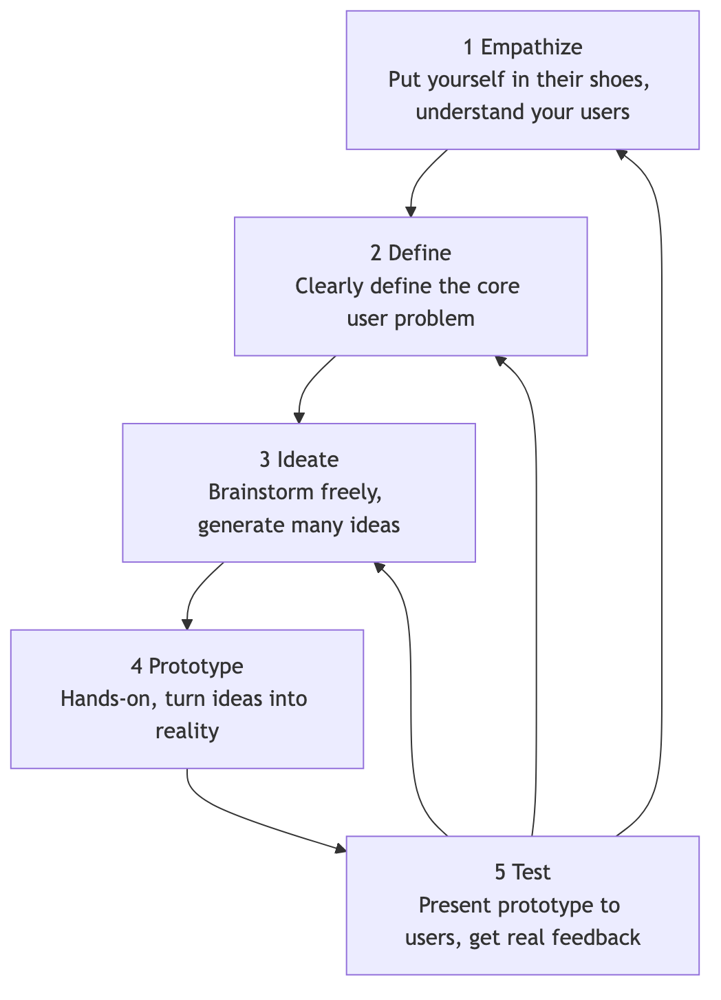

# Design Thinking

How can we create innovative products and services that are truly meaningful and deeply solve user problems? Often, the reason we fail is not because our technology is not advanced enough, but because from the very beginning, we fall in love with our "solutions" without ever truly understanding the user's "problem." **Design Thinking** is a **human-centered** and **systematic innovation methodology** designed to solve complex problems. It is not exclusive to designers but is a mindset and workflow that teams in any field can learn and apply.

At its core, Design Thinking shifts the focus of innovation from "technical feasibility" or "business interests" to "**human needs**." It advocates that before thinking about solutions, we must first deeply and empathetically understand our users through **Empathy**, gaining insight into their unmet needs and desires. Then, through a process of **alternating divergence and convergence**, **hands-on practice**, and **rapid iteration**, we explore, build, and test innovative solutions. It is a complete path from "understanding people" to "serving people."

## The Five Stages of Design Thinking

Stanford University's d.school classically summarizes the Design Thinking process into five non-linear, iterative stages.



<!--
```mermaid
graph TD
    subgraph The Five Stages of Design Thinking (d.school Model)
        A(<b>1 Empathize</b><br/><i>Put yourself in their shoes, understand your users</i>) --> B(<b>2 Define</b><br/><i>Clearly define the core user problem</i>);
        B --> C(<b>3 Ideate</b><br/><i>Brainstorm freely, generate many ideas</i>);
        C --> D(<b>4 Prototype</b><br/><i>Hands-on, turn ideas into reality</i>);
        D --> E(<b>5 Test</b><br/><i>Present prototype to users, get real feedback</i>);
        E --> A;
        E --> B;
        E --> C;
    end
```
-->
*   **This is an iterative, not linear, process**: Feedback gained during the testing phase might lead you back to any previous stage to deepen empathy, redefine the problem, or generate new ideas.

1.  **Empathize**
    *   **Goal**: Immerse yourself in the user's world to understand what they see, hear, think, and feel. You need to temporarily set aside your own assumptions and biases, and observe and listen with a beginner's mind.
    *   **Common Tools**: User interviews, field studies, participant observation, empathy maps.

2.  **Define**
    *   **Goal**: Synthesize and refine all scattered, qualitative insights collected during the empathize stage, ultimately forming a clear, inspiring, and actionable **Point of View (POV) statement**.
    *   **A good problem statement typically follows the format**: "[User] needs [user's need] because [surprising insight]."

3.  **Ideate**
    *   **Goal**: Conduct a "breadth-first," divergent idea generation session for the defined core problem. At this stage, **quantity is far more important than quality**.
    *   **Common Tools**: Brainstorming, reverse brainstorming, mind mapping, analogical thinking, etc.

4.  **Prototype**
    *   **Goal**: Quickly transform abstract ideas generated in the ideation stage into tangible, low-cost **physical models**. The purpose of a prototype is not perfection, but to **materialize ideas for rapid testing and learning**.
    *   **A prototype can be anything**: An app interface drawn with paper and pen, a product model built with LEGO bricks, a role-play simulating a service process, or a simple storyboard.

5.  **Test**
    *   **Goal**: Present your low-fidelity prototype to real users for interaction and experience, and carefully observing their reactions and collecting their feedback. The core principle of testing is to "**show with the intent to learn, not to show what's already done**."
    *   Through testing, you can validate whether your solution is feasible, discover areas for improvement, and even gain new, deeper insights into users and problems, driving the next iteration.

## Application Cases

**Case 1: IDEO Redesigning the Gatorade Sports Drink Bottle**

*   **Empathize**: The IDEO design team didn't immediately start designing the bottle. Instead, they trained with many athletes (from professional football players to amateurs). They observed that when exhausted and sweaty, athletes found it difficult to twist open traditional round bottle caps with slippery hands.
*   **Define**: The core problem was: "Exhausted athletes need a way to open and drink with one hand, quickly and effortlessly, because every second of hydration is crucial during intense exercise."
*   **Ideate and Prototype**: The team created dozens of different shapes and materials for bottle caps and bodies.
*   **Test**: They brought these prototypes back to the training field and had athletes test them in real exercise scenarios.
*   **Final Product**: This led to the iconic "Gatorade Edge" bottle with black anti-slip stripes and a one-way valve cap. This design was a huge success because it perfectly solved the user pain point discovered in a real-world scenario.

**Case 2: Airbnb's Early Transformation Story**

*   **Problem**: In its early days, Airbnb's business growth in New York stagnated. They found that although there were listings on the website, bookings were extremely low.
*   **Empathize**: The founders personally flew to New York and visited their hosts door-to-door. They found that the quality of photos taken by hosts with their phones was generally very poor—dim lighting, arbitrary angles, completely failing to showcase the appeal of the rooms.
*   **Define**: "Potential travelers need high-quality, attractive photos to build trust in unfamiliar listings, because they cannot see the rooms in person before booking."
*   **Prototype and Test (A Bold Experiment)**: The founders rented a professional camera and personally visited all New York hosts to take a set of high-quality photos of their listings for free. This was a completely unscalable "prototype" but quickly validated the hypothesis.
*   **Result**: Within a week, bookings for listings with professional photos doubled. This empathy-driven insight and rapid experimentation became a key turning point in Airbnb's history.

**Case 3: Designing a Better MRI Experience for Children**

*   **Problem**: GE Healthcare designers found that many children cried uncontrollably during MRI scans due to fear of the large, noisy machine, making the examination impossible or even requiring sedation.
*   **Empathize**: Designers spent a lot of time in hospitals observing children and their parents, feeling their anxiety and fear.
*   **Redefine the Problem**: The problem was not "how to design a more beautiful MRI machine," but "how can we transform a terrifying medical examination into a fun adventure?"
*   **Solution**: They redesigned the entire MRI examination room into a "pirate ship" or "spaceship" theme. Children were told they were entering a spaceship for a space adventure, and the loud noise during the check was the sound of the spaceship entering hyper-speed mode. This design, named "Adventure Series," greatly reduced children's fear and significantly reduced the use of sedatives.

## Advantages and Challenges of Design Thinking

**Core Advantages**

*   **Reduces Innovation Risk**: By deeply understanding users and conducting rapid, low-cost testing early in the project, it greatly reduces the risk of developing products that no one wants.
*   **Generates Breakthrough Innovation**: By focusing on deep user needs rather than existing solutions, it is more likely to generate disruptive, groundbreaking ideas.
*   **Enhances Team Collaboration and Creativity**: Its collaborative, hands-on nature breaks down departmental barriers, stimulating the team's collective intelligence and creative confidence.

**Potential Challenges**

*   **Difficulty in Solving "Non-Existent" Problems**: Design Thinking is excellent at improving existing experiences, but its applicability might be limited for groundbreaking technological breakthroughs that users themselves are completely unaware of (e.g., the first iPhone).
*   **Requires Cultural Support**: It requires organizations to tolerate ambiguity, embrace experimentation and failure, which contradicts the culture of many traditional enterprises.
*   **Not a Linear Process**: For teams accustomed to clear, linear processes, the "chaotic," iterative nature of Design Thinking might feel uncomfortable.

## Extensions and Connections

*   **Lean Startup**: Design Thinking and Lean Startup are highly complementary in philosophy. The "prototype-test" cycle of Design Thinking is similar to the "build-measure-learn" cycle of Lean Startup. Typically, Design Thinking can be used to ensure you are "**doing the thing right**," while Lean Startup ensures you are "**doing the right thing**."
*   **Agile Development**: Design Thinking is an excellent partner for the front-end of Agile development—"What should we develop?" User stories generated and validated through Design Thinking can directly enter the Agile team's development backlog.

---
*Reference: The roots of Design Thinking can be traced back to the Scandinavian participatory design movement in the 1960s. Modern Design Thinking methodologies are primarily promoted and popularized by David Kelley and Tim Brown, founders of IDEO, and Stanford University's d.school. Tim Brown's book "Change by Design" is an essential classic in this field.*