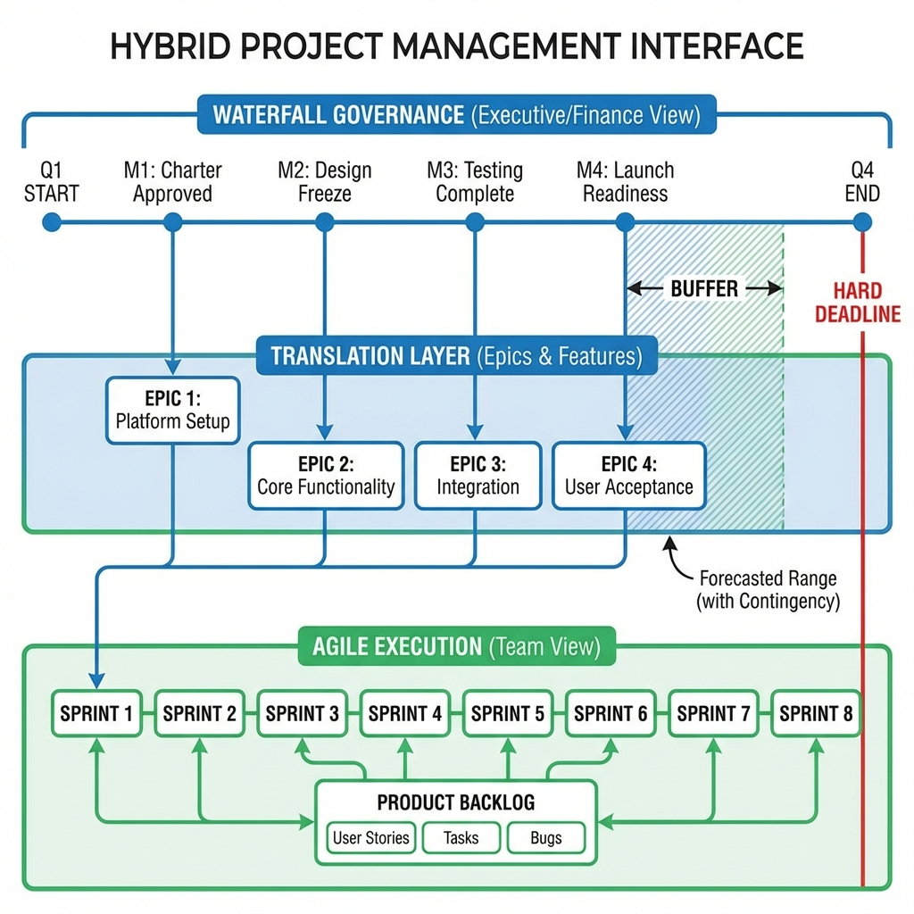

# Hybrid Project Management Playbook

> **Role**: Project Manager / Scrum Master
> **Time Required**: Ongoing (Weekly Sync)
> **Participants**: Product Owner, Project Manager, Tech Lead
> **Difficulty**: Advanced

## 🎯 Objective
To successfully manage the "Interface" between Agile delivery teams (Scrum/Kanban) and Waterfall governance layers (Finance/Executive), ensuring compliance without sacrificing agility.

## 📋 Prerequisites
*   [ ] Master Project Schedule (Gantt) defined
*   [ ] Team Backlog (Jira/Azure DevOps) prioritized
*   [ ] Logical mapping between "Epics" and "Milestones"

## 📝 The Script (Execution Guide)

### 1. The Interface Sync (Weekly)
**Facilitator Script**:
> "We are here to map our verified velocity against the firm milestones. Let's identify where the 'Red lines' of the Gantt chart are conflicting with our current Sprint reality."

### 2. The Core Activity: Mapping Backlog to Gantt

#### Activity A: Translation Layer
*   **Instruction**: Map every **Agile Epic** to a **WBS (Work Breakdown Structure)** element.
    *   *Agile*: "User Registration Feature" (Epic)
    *   *Waterfall*: "Phase 2.1: Identity Module Complete" (Milestone)
*   **Rule**: Never map individual User Stories to the Gantt chart. Only map Epics or Features.

#### Activity B: The Buffer Management
*   **Instruction**: Explicitly visualize the "buffer" between the fixed date and the forecasted delivery range.
*   **Facilitator Tip**: If the forecasted range (based on velocity) exceeds the milestone date, trigger a "Trade-off Conversation" immediately. Do not wait.

### 3. Closing
**Facilitator Script**:
> "We have flagged 2 risks where the scope is creeping beyond the timeline. I will update the risk register for the steering committee. Team, keep focusing on the sprint goal."

## 🛠️ Tools & Templates
*   **Jira Advanced Roadmaps**: Use "Fix Version" to map to Gantt milestones.
*   **MS Project**: Utilize "Summary Tasks" to represent Agile Epics.

## ⚠️ Common Pitfalls
*   **Pitfall 1**: Micro-managing the team with Gantt dates.
    *   **Solution**: Only expose the "Milestone" date to the team as a constraint, don't dictate the daily schedule.
*   **Pitfall 2**: "Water-Scrum-Fall" (Agile dev, defined reqs, manual testing).
    *   **Solution**: Invest heavily in DevOps to automating testing, allowing the "Scrum" part to actually finish "Done" increment.

## 🧠 First Principles
Hybrid is not a compromise; it's a **Risk Management Strategy**.

*   **Waterfall** manages **Financial Risk** (Cost/Schedule).
*   **Agile** manages **Technical/Market Risk** (Feasibility/Fit).
*   The "Hybrid" model is simply the protocol for exchanging information between these two risk domains.
