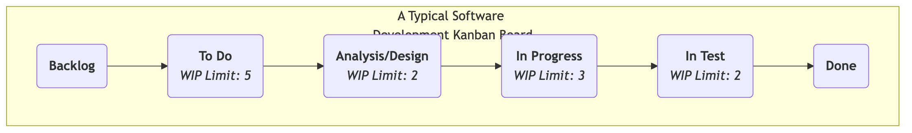
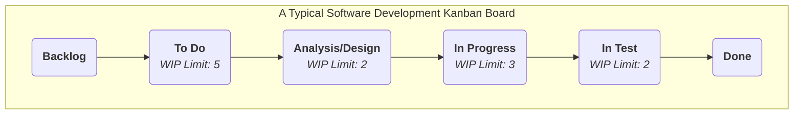

# Kanban

When pursuing efficient, smooth workflows, we often encounter problems such as: work tasks piling up, unclear understanding of what everyone is busy with, unknown bottlenecks, and inability to accurately predict completion times. **Kanban**, a term derived from the Japanese word for "signal board," is a powerful, intuitive **visual workflow management method** designed to solve these problems. It is not a rigid framework like Scrum that prescribes roles and events, but a more flexible Agile practice and mindset focused on **optimizing the efficiency of value flow**.

The core of the Kanban method is to make previously invisible workflows and tasks clear and completely transparent through a **Kanban Board**. Then, by **limiting Work in Progress (WIP)** and establishing a clear **Pull System**, it systematically identifies and eliminates bottlenecks in the process, allowing value to flow faster, smoother, and more predictably from "to-do" to "done." It aims to create a stable, sustainable work rhythm, preventing teams from falling into chaos and inefficiency due to task overload.

## The Six Core Practices of the Kanban Method

Kanban's success relies on the continuous application of the following six core practices.

1.  **Visualize the Workflow**: This is the starting point of Kanban. You need to work with your team to map out all steps of work from start to finish (e.g., "To Do," "Designing," "Developing," "Testing," "Done") on a whiteboard or electronic Kanban board, and represent each work item (e.g., a user story, a bug) as a card on the board.

2.  **Limit Work in Progress (WIP)**: This is the soul of Kanban. For each or some steps in the process, set a clear **upper limit** on the number of tasks allowed to be in progress simultaneously. For example, specify that the "Developing" column can have a maximum of 3 cards. When this column is full, no one can "pull" new work from the previous step until a current work item is completed and moved out. Limiting WIP fundamentally **prevents task accumulation, exposes process bottlenecks, and creates a focused work environment**.

3.  **Manage Flow**: The goal of Kanban is to maximize the speed and smoothness of value flow. You need to continuously monitor the flow of work items on the board, identify where they get stuck the longest (i.e., bottlenecks), and then concentrate the team's efforts on resolving these bottlenecks to make the entire system flow smoothly.

4.  **Make Process Policies Explicit**: Make the team's work rules clear and transparent. For example, clearly define what constitutes "Done" (Definition of Done)? What are the WIP limits for each swimlane? How is task priority determined? Clear rules are the foundation for the team to work autonomously and coordinately.

5.  **Implement Feedback Loops**: Kanban encourages establishing feedback loops at various rhythms. For example, daily team stand-ups (for synchronizing daily work), regular Kanban review meetings (for reviewing and optimizing processes), and customer delivery review meetings.

6.  **Improve Collaboratively, Evolve Experimentally**: Kanban is a method that encourages "starting from where you are now and evolving continuously." It does not require you to make disruptive organizational changes. The team should continuously and collaboratively make small, experimental improvements to its workflow based on data and shared understanding.

### Kanban Board Structure Example

<!--

<!--

<!--

-->

*   **Workflow**: A card (representing a task) moves from left to right, passing through each stage. A team member can only "pull" a new card from the left column when there is space in the right column (i.e., the WIP limit for that column is not reached).

## How to Implement the Kanban Method

1.  **Step One: Visualize Your Current Workflow**
    Don't try to design a "perfect" process. Start with how you and your team **currently** work. Draw your actual work steps on a whiteboard and put all ongoing work items on it as cards. The goal of this step is to make the current state transparent.

2.  **Step Two: Set Initial WIP Limits**
    Work with your team to set an initial WIP limit for key steps in the process (usually those prone to bottlenecks, such as "In Progress," "In Test"). A good starting point can be "half the number of team members" or "slightly less than the current number of work items in progress." WIP limits are not static and can be adjusted later based on actual conditions.

3.  **Step Three: Start "Pulling" Work**
    Establish a simple rule: when a team member finishes their current work, they should look at the "rightmost" column on the board and offer help where needed. If there's nothing to do, they can then "pull" a new, highest-priority task from the "leftmost" column that allows pulling.

4.  **Step Four: Establish Daily Stand-ups and Review Meetings**
    *   Hold a short daily stand-up meeting in front of the Kanban board. The focus of the meeting is not what everyone did, but the **flow of cards**: "Which cards moved yesterday?" "Which cards are stuck? How can we help them flow?"
    *   Hold regular (e.g., bi-weekly) review meetings to review data on the Kanban board (e.g., "average lead time") and discuss how to improve your processes and WIP limits.

## Application Cases

**Case 1: IT Operations Team**

*   **Problem**: The operations team is overwhelmed daily by various urgent requests from different channels, leading to chaotic work and delayed responses.
*   **Kanban Application**: They set up a simple Kanban board with swimlanes like "To Do," "In Progress," "Waiting for External Feedback," and "Resolved." By limiting WIP in the "In Progress" lane to the number of team members, they ensured the team could focus on quickly resolving current issues instead of starting many tasks simultaneously. Kanban also made all requests transparent, allowing managers to understand the team's actual workload.

**Case 2: Personal Task Management (Personal Kanban)**

*   **Problem**: An individual is working on multiple projects simultaneously, feeling overwhelmed and stretched thin.
*   **Kanban Application**: They can use Trello or a simple notebook to create a personal Kanban board with lists like "This Week's Goals," "Today's To-Do," "Doing (WIP Limit: 1)," and "Done." By strictly adhering to a WIP limit of 1 for "Doing," they force themselves to focus on one most important task at a time, greatly improving focus and quality of completion.

**Case 3: Content Creation Team (e.g., a Magazine Publisher)**

*   **Process**: "Idea Bank" -> "Writing" -> "Editing" -> "Design/Layout" -> "Published."
*   **Kanban Application**: By setting WIP limits for each stage, they can ensure that editors do not continue to commission articles when there is a large backlog of manuscripts. It can make the entire content production process smoother and clearly expose bottlenecks (e.g., if the "Editing" column is always piled up with manuscripts, it indicates insufficient editing resources).

## Advantages and Challenges of the Kanban Method

**Core Advantages**

*   **Flexibility and Adaptability**: It does not require disruptive changes to existing processes and roles; you can "start from where you are now" and evolve gradually.
*   **Improved Efficiency and Predictability**: By managing flow and limiting WIP, it significantly shortens lead times and makes delivery times more predictable.
*   **Reduced Team Pressure**: WIP limits prevent teams from experiencing immense pressure due to multitasking and over-commitment, creating a sustainable work rhythm.
*   **Exposes Systemic Problems**: Can very intuitively and undeniably expose bottlenecks and impediments in the process.

**Potential Challenges**

*   **Easy to Become "Formalistic"**: If the team only implements "visualization" without strictly enforcing "limiting WIP" and "managing flow," Kanban becomes just a pretty "task board" and cannot exert its true power.
*   **Requires Team Self-Discipline**: The pull system and WIP limits require a high degree of self-discipline and collaborative spirit from team members.
*   **Misunderstanding of "No Time-Box"**: Although Kanban itself does not have fixed sprints like Scrum, this does not mean there is no planning and rhythm. Kanban teams also need to prioritize, forecast delivery times, and conduct regular reviews.

## Extensions and Connections

*   **Scrum**: Kanban and Scrum are the two most mainstream methods in the Agile world. Scrum is based on a "time-box" iteration rhythm, while Kanban is based on a "continuous flow" pull rhythm. Both have their advantages and disadvantages and are suitable for different scenarios. **Scrumban** is a hybrid method that combines the advantages of both.
*   **Lean Thinking**: The Kanban method is the most core and direct application of Lean thinking in knowledge work. It perfectly embodies core Lean principles such as "visualization," "pull system," "eliminating waste," and "continuous improvement."
*   **Theory of Constraints (TOC)**: By exposing bottlenecks, the Kanban method aligns highly with TOC's idea of "identifying and optimizing constraints."

---
*Reference: The application of the Kanban method in software development was first practiced and summarized by David J. Anderson in his work at Microsoft and Corbis. His book "Kanban: Successful Evolutionary Change for Your Technology Business" is a foundational work for this method. The ideas of Kanban are deeply rooted in the Toyota Production System (TPS) and Lean Manufacturing.*