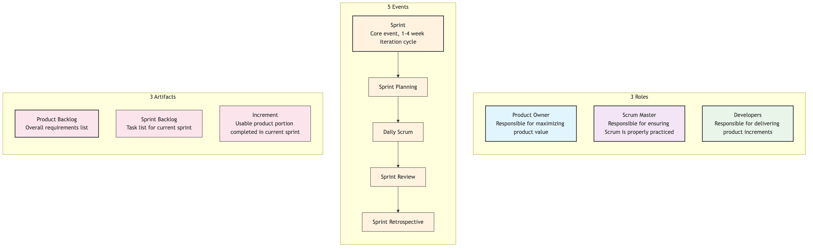

# Scrum

In the vast world of Agile development, if Agile is a set of "values" guiding us to embrace change, then **Scrum** is the most popular and widely applied **lightweight framework** that puts these values into practice. Scrum is not a detailed process or method, but a **"rulebook" for the game** designed to help teams collaborate efficiently and continuously deliver value when developing complex products. It provides a simple, clear, yet powerful iterative work rhythm for teams by defining a series of clear **roles, events, and artifacts**.

The name Scrum comes from the "scrum" action in rugby, emphasizing that the entire team works together as a cohesive unit, pushing towards a common goal. It acknowledges that when facing complex problems, we cannot have all the answers from the beginning. Therefore, the core of Scrum is to break down a large, uncertain problem into a series of small, manageable experiments through short, fixed-time iterations (i.e., "**Sprints**"). At the end of each sprint, the team delivers a usable product increment and reflects and adjusts, thereby learning from experience and moving forward amidst change.

## The Three Pillars of the Scrum Framework

The entire Scrum framework is built upon three empirical pillars:

1.  **Transparency**: All important aspects affecting the outcome must be visible to all people responsible for the outcome (including customers). This means that work progress, impediments, backlogs, etc., must be open and transparent.
2.  **Inspection**: Scrum artifacts and the progress towards a goal must be frequently and diligently inspected to detect undesirable variances or problems in a timely manner.
3.  **Adaptation**: When an inspection determines that the current work deviates from acceptable limits and the resulting product will be unacceptable, the process or the material being processed must be adjusted as soon as possible.

## The 3-5-3 Structure of Scrum

Scrum's "rules of the game" can be concisely summarized as a "3-5-3" structure: 3 roles, 5 events, 3 artifacts.



<!--
```mermaid
graph TD
    subgraph Scrum Framework (3-5-3)
        subgraph 3 Roles
            A(<b>Product Owner</b><br/><i>Responsible for maximizing product value</i>)
            B(<b>Scrum Master</b><br/><i>Responsible for ensuring Scrum is properly practiced</i>)
            C(<b>Developers</b><br/><i>Responsible for delivering product increments</i>)
        end

        subgraph 5 Events
            D(<b>Sprint</b><br/><i>Core event, 1-4 week iteration cycle</i>) --> E(<b>Sprint Planning</b>);
            E --> F(<b>Daily Scrum</b>);
            F --> G(<b>Sprint Review</b>);
            G --> H(<b>Sprint Retrospective</b>);
        end

        subgraph 3 Artifacts
            I(<b>Product Backlog</b><br/><i>Overall requirements list</i>)
            J(<b>Sprint Backlog</b><br/><i>Task list for current sprint</i>)
            K(<b>Increment</b><br/><i>Usable product portion completed in current sprint</i>)
        end
    end
```
-->

### 3 Roles

*   **Product Owner**: The sole person responsible for the "value" of the product. Their main job is to manage and optimize the **Product Backlog**, ensuring the Development Team always works on items that create the highest value for customers and the business. They decide "what to do."
*   **Scrum Master**: The "servant leader" and "coach" of the Scrum framework. They do not manage the team but serve the team, responsible for removing impediments, facilitating events, and ensuring Scrum rules and values are correctly understood and followed by the team.
*   **Developers**: A cross-functional, self-organizing professional team who collectively are responsible for transforming items from the backlog into a high-quality, deliverable product increment within each sprint. They decide "how to do it."

### 5 Events

*   **Sprint**: The heart of Scrum, a fixed-length time-box (typically 1-4 weeks). Within a sprint, the team focuses on achieving a valuable "Sprint Goal."
*   **Sprint Planning**: Held at the beginning of each sprint. The Product Owner explains the highest priority items from the Product Backlog to the Development Team. The team collectively selects and commits to the work they can complete within the sprint and creates a preliminary execution plan, forming the **Sprint Backlog**.
*   **Daily Scrum**: A daily synchronization meeting not exceeding 15 minutes. Each member of the Development Team takes turns answering three questions: "What did I do yesterday?" "What will I do today?" "What impediments did I encounter?" Its purpose is to quickly synchronize progress and identify impediments, not to report to management.
*   **Sprint Review**: Held at the end of the sprint. The Development Team **demonstrates** the completed, working **Increment** to the Product Owner, customers, and other stakeholders, and gathers feedback. This is an informal meeting about the "product."
*   **Sprint Retrospective**: Held after the Sprint Review and before the next sprint begins. The Scrum Team (PO, SM, Devs) collectively **reflects** on what went well and what could be improved regarding **people, relationships, processes, and tools** in the just-completed sprint, and creates a concrete improvement plan for the next sprint.

### 3 Artifacts

*   **Product Backlog**: A dynamic, prioritized, comprehensive **list** of all known product requirements, features, fixes, and improvements. It is solely managed by the Product Owner.
*   **Sprint Backlog**: The list of tasks the Development Team commits to completing in the current sprint, and the plan to achieve the "Sprint Goal." It is solely owned and managed by the Development Team.
*   **Increment**: The sum of all completed Product Backlog items at the end of each sprint. It must be **usable and conform to the "Definition of Done."** It is a direct manifestation of the team's work results.

## Application Cases

**Case 1: Developing an Online Food Ordering App**

*   **Product Backlog**: Contains hundreds of user stories like "user registration," "browse menu," "online payment," "order tracking," etc.
*   **Sprint 1 (2 weeks)**:
    *   **Sprint Goal**: "Users can successfully register and log in."
    *   **Sprint Backlog**: The team selected 5 user stories related to registration and login.
    *   **Daily Scrum**: The team synchronized progress daily and found that "unstable SMS verification code interface" was an impediment. The Scrum Master immediately coordinated to resolve it.
    *   **Sprint Review**: The team demonstrated a working, complete registration and login process.
    *   **Sprint Retrospective**: The team reflected that their task estimations were too optimistic and decided to adopt a more conservative estimation method in the next sprint.

**Case 2: A Marketing Team Planning a Product Launch Event**

*   Scrum is not only applicable to software development.
*   **Product Owner**: Marketing Director.
*   **Product Backlog**: Contains all work items such as "determine launch event theme," "design main visuals," "invite media and KOLs," "write press releases," "venue booking," etc.
*   **Sprint 1 (1 week)**:
    *   **Sprint Goal**: "Finalize the core theme and initial main visual design for the launch event."
    *   The team quickly produced results through a one-week sprint and demonstrated them to senior management at the review meeting, receiving timely feedback and avoiding investing too many design resources in the wrong direction.

**Case 3: A Student Group Completing a Semester Project**

*   **Product Owner**: One student acts as PO, responsible for communicating with the professor and clarifying project requirements.
*   **Product Backlog**: The entire project is broken down into parts such as "literature review," "data collection," "data analysis," "report writing," "PPT creation."
*   **Sprints**: They divided the remaining 8 weeks of the semester into 4 two-week sprints. Each sprint had a clear goal, for example, the goal of the first sprint was to "complete the literature review and research design." This approach effectively avoided last-minute cramming at the end of the semester.

## Advantages and Challenges of Scrum

**Core Advantages**

*   **Increased Productivity and Speed**: Through short-cycle iterations and focus, teams can deliver value faster.
*   **Enhanced Flexibility and Adaptability**: Can calmly respond to changing requirements and adjust direction in a timely manner based on feedback.
*   **Improved Transparency and Communication**: Clear roles, events, and artifacts greatly facilitate communication and information synchronization within and outside the team.
*   **Empowers Teams, Boosts Morale**: Self-organizing development teams have higher autonomy and a sense of ownership.

**Potential Challenges**

*   **"Easy to Understand, Difficult to Master"**: Scrum rules are simple, but truly understanding the underlying Agile spirit and successfully practicing it within a specific organizational culture is very difficult.
*   **Extremely High Demands on Product Owner**: The Product Owner needs to deeply understand the business, market, and customers, and possess excellent communication and decision-making skills.
*   **Potential for "Scope Creep"**: If the Product Owner does not manage the backlog and stakeholder expectations well, it can lead to frequent changes in sprint goals.
*   **Requires Team Maturity**: Self-organizing teams require members to have a high sense of responsibility, collaborative spirit, and cross-functional skills.

## Extensions and Connections

*   **Agile Development**: Scrum is a specific, mainstream **framework** for realizing Agile values and principles.
*   **Kanban**: Another popular Agile method. Unlike Scrum's rhythm based on "time-box (sprints)," Kanban focuses more on "continuous flow." In practice, many teams combine the two; for example, using Kanban within a Scrum sprint to visualize and manage the flow of tasks, which is called "Scrumban."
*   **Extreme Programming (XP)**: Scrum provides the "management framework," while XP provides a set of excellent "engineering practices." Integrating XP practices (such as Test-Driven Development, Pair Programming) into the Scrum framework can greatly improve the technical quality of product increments.

---
*Reference: The Scrum framework was first jointly proposed by Jeff Sutherland and Ken Schwaber in the early 1990s. Their collaborative work, "The Scrum Guide," is the sole official definition of the Scrum framework and is regularly updated to reflect the evolution of practice.*