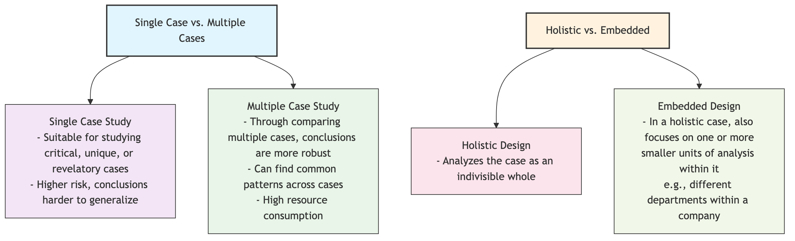

# Case Study

When exploring complex social phenomena, sometimes what we need is not broad statistical regularities, but an incisive, in-depth analysis of a specific "story." **Case Study** is precisely such a qualitative research method that focuses on "particularity." It aims to deeply understand the case itself and gain insights into broader phenomena by conducting in-depth, comprehensive, and multi-faceted investigations of **single or a few** specific, bounded instances (i.e., "cases").

A "case" can be a person (e.g., a gifted child), an organization (e.g., a company on the verge of bankruptcy), an event (e.g., a successful crisis public relations campaign), a decision-making process, or a community. The charm of case study lies in its "getting to the bottom" spirit; it is not satisfied with superficial variable relationships but attempts to reveal the complex processes and mechanisms of "how" and "why" in a real, dynamic context. When you want to answer questions like "Why did this startup succeed while others failed?" or "How was a new policy specifically implemented and impacted a certain community?" these questions, case study provides an unparalleled magnifying glass.

## Core Characteristics of Case Study

*   **Particularistic**:
    The core of the research is to understand the uniqueness and complexity of a specific case.
*   **Descriptive & Exploratory**:
    It aims to provide a rich and detailed "thick description" of the case and explore in the real context, how various factors interact.
*   **Multiple Sources of Evidence**:
    This is key to the credibility of case studies. Researchers comprehensively use multiple sources of evidence, such as in-depth interviews, document analysis, archival records, direct observation, artifacts, etc., for "triangulation" to construct a comprehensive and credible picture.
*   **Context-dependent**:
    Case study firmly believes that it is impossible to truly understand a case without understanding the real context in which it occurs.

### Case Study Design Types

According to research purpose and the number of cases, case study can be divided into different types:



<!--
```mermaid
graph TD
    subgraph Case Study Design Types (Robert K. Yin)
        A(Single Case vs. Multiple Cases) --> A1(<b>Single Case Study</b><br/>- Suitable for studying critical, unique, or revelatory cases<br/>- Higher risk, conclusions harder to generalize);
        A1 --> A2(<b>Multiple Case Study</b><br/>- Through comparing multiple cases, conclusions are more robust<br/>- Can find common patterns across cases<br/>- High resource consumption);

        B(Holistic vs. Embedded) --> B1(<b>Holistic Design</b><br/>- Analyzes the case as an indivisible whole);
        B1 --> B2(<b>Embedded Design</b><br/>- In a holistic case, also focuses on one or more<br/>smaller units of analysis within it<br/>(e.g., different departments within a company));
    end
```
-->

## How to Conduct a Case Study

Robert K. Yin, a renowned case study scholar, proposed a rigorous linear but iterative research process:

1.  **Planning: Definition and Design**
    *   **Define Research Questions**: Pose exploratory research questions starting with "how" or "why."
    *   **Select Cases**: Use purposeful sampling to select one or more most informative cases based on the research question. Selection criteria must be clear and justified.
    *   **Develop Theoretical Framework**: Before starting the research, build a preliminary theoretical framework or propositions based on existing literature to guide data collection.
    *   **Design Data Collection Plan**: Clearly define what types of evidence you need to collect from which sources.

2.  **Preparation: Design Research Protocol**
    Develop a detailed **Case Study Protocol**, including research background, research questions, data collection procedures, interview outlines, and the basic framework for reporting. This protocol is an important tool to ensure the research process is systematic and reliable.

3.  **Collection: Gathering Multiple Sources of Evidence**
    Enter the "field" and systematically collect data from different sources. For example, to study an organization's innovation culture, you might need:
    *   **Interviews**: Conduct in-depth interviews with the company's CEO, middle managers, and frontline employees.
    *   **Documents**: Analyze the company's internal reports, meeting minutes, product design documents.
    *   **Observation**: Participate in daily company meetings and workflows, observing employee interactions.

4.  **Analysis: Finding Patterns and Explanations**
    Organize and analyze all collected evidence. The core strategy is **pattern matching**, which compares the patterns of empirical evidence you collected with the patterns predicted in your initial theoretical framework. The analysis process is usually iterative; you need to move back and forth between data and theory, continuously refining and deepening your understanding.

5.  **Dissemination: Writing the Case Report**
    Write your research findings into a clear, persuasive case study report. The report needs to vividly present the case's story, while clearly demonstrating your analytical logic and theoretical contributions. A good case report can make readers feel as if they are there and gain profound insights.

## Application Cases

**Case 1: Harvard Business School Teaching Cases**

*   **Scenario**: Harvard Business School is renowned for its case method teaching.
*   **Application**: Business school researchers delve into a real company (e.g., Starbucks, Apple), and through interviewing executives, analyzing company financial reports and market data, write teaching cases ranging from a dozen to dozens of pages. Cases usually focus on a real management dilemma or strategic decision point faced by the company. In class, students learn and apply business theories and develop problem-solving skills by analyzing and discussing this specific case.

**Case 2: Clinical Case Reports in Medicine**

*   **Scenario**: A doctor encounters a patient with extremely rare symptoms and a difficult diagnosis.
*   **Application**: After successful diagnosis and treatment, the doctor compiles the patient's complete diagnostic and treatment process—from initial symptoms, various test results, diagnostic reasoning, to the final treatment plan and outcome—into a detailed **clinical case report** and publishes it in a medical journal. This single case study provides extremely valuable reference and learning for other doctors worldwide when encountering similar rare diseases in the future.

**Case 3: Case Study of Policy Implementation Effectiveness**

*   **Scenario**: A country implemented a new education reform policy and wanted to evaluate its actual effectiveness at the grassroots level.
*   **Application**: Researchers did not conduct a nationwide large-scale questionnaire survey but selected three representative schools located in urban, town, and rural areas as subjects for a **multiple case study**. In each school, they spent several months interviewing principals, teachers, students, and parents, observing changes in classroom teaching, and analyzing school archives. Ultimately, the research report vividly revealed how the same policy was interpreted and implemented differently in different contexts, leading to distinctly different, and even unexpected, results.

## Advantages and Challenges of Case Study

**Core Advantages**

*   **Depth and Authenticity**: Can provide an in-depth, contextualized, and holistic understanding of complex phenomena.
*   **Fertile Ground for Theory Building**: Particularly suitable for exploring areas where existing theories are insufficient and for generating new theoretical hypotheses.
*   **Answers "How" and "Why"**: Can reveal the dynamic processes and causal mechanisms behind phenomena.

**Potential Challenges**

*   **Generalizability of Conclusions**: This is the most common criticism of case studies. Due to the extremely small sample size, its research conclusions are difficult to directly generalize to other cases or broader populations. Case study pursues **analytical generalization** (i.e., generalizing empirical findings to theory), not **statistical generalization**.
*   **Researcher Bias**: Researchers may unconsciously introduce personal biases in case selection, data collection, and analysis interpretation.
*   **High Rigor Requirements**: To produce a high-quality case study, researchers need clear logic, rigorous protocols, and the ability to handle complex evidence; otherwise, it can easily become a "storytelling session" lacking analytical depth.

## Extensions and Connections

*   **Qualitative Research**: Case study is a core methodology in qualitative research.
*   **Ethnography**: When a case itself is a community or organization, and the researcher employs long-term immersive observation, case study highly overlaps with ethnography.
*   **Grounded Theory**: Can serve as a powerful analytical strategy in case studies for analyzing data and building theories from the bottom up.

---
*Source Reference: Robert K. Yin's "Case Study Research: Design and Methods" is the most authoritative and widely cited classic work in this field, it provides systematic operational guidelines for conducting rigorous case studies. Robert E. Stake's "The Art of Case Study Research" offers a different perspective from a qualitative, interpretive angle.*