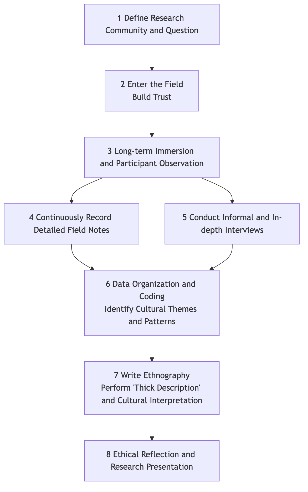

# Ethnography

To truly understand a culture, relying solely on questionnaires or interviews is far from enough; you must personally "jump into that river and swim." **Ethnography** is precisely such an in-depth qualitative research method that requires researchers to immerse themselves and empathize. Originating from cultural anthropology, its core lies in gaining a **holistic** understanding of a specific community's culture, social structure, and behavioral patterns by conducting **participant observation** within their daily lives over a relatively long period.

Ethnographic researchers pursue a "thick description," not only recording what people "do" but also striving to reveal what these behaviors "mean" within specific cultural contexts. It is not about "studying" a group of people from the outside, but rather attempting to understand their worldview from within. When you want to explore an internal rules of a subculture, the implicit culture of an organization, or the real life of a community, ethnography offers unparalleled depth and authenticity.

## Core Concepts and Characteristics of Ethnography

*   **Immersion and Participation**: Researchers are no longer distant observers but act as "learners" or "apprentices," living and working in real, natural environments for extended periods, and participating in the community's daily activities.

*   **Holistic View**: Ethnography attempts to view culture as a complex, interconnected whole. It focuses on how language, customs, beliefs, interpersonal relationships, the material environment, and all other aspects intertwine to shape people's lives.

*   **Emic Perspective**: The ultimate goal of the research is to understand and interpret the world from an "insider's" perspective, rather than imposing external theoretical frameworks upon it.

*   **Field Notes**: This is the primary form of data in ethnography. Researchers need to continuously, meticulously, and reflectively record everything they observe—from specific event descriptions to personal feelings and theoretical reflections.

### Ethnographic Research Process



<!--
```mermaid
graph TD
    A[1 Define Research Community and Question] --> B(2 Enter the Field<br/>Build Trust);
    B --> C{3 Long-term Immersion and Participant Observation};
    C --> D(4 Continuously Record Detailed Field Notes);
    C --> E(5 Conduct Informal and In-depth Interviews);
    D & E --> F(6 Data Organization and Coding<br/>Identify Cultural Themes and Patterns);
    F --> G(7 Write Ethnography<br/>Perform "Thick Description" and Cultural Interpretation);
    G --> H(8 Ethical Reflection and Research Presentation);
```
-->

## How to Conduct an Ethnographic Study

1.  **Define the Research Setting and Question**
    Choose a specific community or cultural setting you wish to understand in depth, and formulate a preliminary, open-ended research question. For example, "How is the 'overtime culture' of a large internet company formed and maintained?"

2.  **Enter the Field and Build Trust**
    This is a crucial and challenging step. Researchers need to find ways to enter the community (i.e., "gatekeepers"), and spend a significant amount of time building rapport and trust with community members. Your honesty, respect, and patience are key to success.

3.  **Conduct Participant Observation**
    Once permission is granted, begin your immersive experience. Participate in as many community activities as possible while maintaining keen observation skills. Observe how people interact, how they speak, how they use tools, and the "unspoken" rules.

4.  **Record Field Notes**
    Every day, set aside dedicated time to write detailed field notes. Notes should include:
    *   **Objective Descriptions**: Specific times, locations, people, events, conversations.
    *   **Subjective Feelings**: Your personal emotions, confusions, and feelings.
    *   **Analytical Reflections**: Preliminary analysis and theoretical associations of observed phenomena.

5.  **Continuous Analysis and Interpretation**
    The analysis process in ethnography is conducted concurrently with data collection. You need to constantly review your notes, look for recurring patterns, themes, keywords, and contradictions, and gradually form a deeper understanding of the culture.

6.  **Write the Ethnographic Report**
    The final output is a narrative, richly detailed ethnographic report. It typically presents your findings and cultural interpretations to the reader in a storytelling manner, making them feel as if they have personally experienced a fieldwork.

## Application Cases

**Case 1: William Foote Whyte's "Street Corner Society"**

*   **Scenario**: This is one of the most classic ethnographic studies in sociology. To understand the internal social structure of an Italian-American slum, sociologist Whyte moved into the community.
*   **Application**: He lived there for three and a half years, mingling with local youth (especially gang members) and participating in their daily activities. He revealed through long-term participant observation that behind this seemingly chaotic community, there existed a complex, informal system of social hierarchy, obligations, and reciprocity. This study completely changed people's stereotypes of "disorganization" in slums.

**Case 2: Intel's Business Ethnography**

*   **Scenario**: In the early 21st century, chip giant Intel hoped to find new growth points for its future products.
*   **Application**: The company hired a group of anthropologists to conduct ethnographic research on the daily lives of different families worldwide. Researchers entered ordinary people's homes, observing how they used tech products, entertained themselves, and communicated. Through these studies, they discovered that the "home" was becoming a new computing center, and people had a huge potential demand for in-home connectivity, entertainment, and health management. These insights directly drove Intel's strategic layout in smart homes, digital health, and other fields.

**Case 3: Organizational Culture Study in a Hospital**

*   **Scenario**: A researcher wanted to understand how the highly tense collaborative relationship between doctors and nurses in an operating room is established and maintained.
*   **Application**: She conducted six months of participant observation in an operating room at a hospital. She wore scrubs, observed hundreds of surgeries, and conducted informal interviews with medical staff in the lounge. She found that in this high-pressure environment, a unique, concise, and efficient "jargon" and non-verbal understanding, along with a strict hierarchy, were key cultural mechanisms ensuring surgical success.

## Advantages and Challenges of Ethnography

**Core Advantages**

*   **Unparalleled Depth**: Can provide an in-depth, contextualized, and nuanced understanding of culture.
*   **Reveals "Tacit Knowledge"**: Can uncover underlying rules and assumptions that even community members themselves take for granted and cannot articulate clearly.
*   **High Ecological Validity**: Research is conducted in completely real, natural environments, and conclusions are very close to reality.

**Potential Challenges**

*   **Extremely Time-Consuming and Labor-Intensive**: Requires researchers to invest months or even years of time.
*   **Researcher Subjectivity**: The researcher's personal background, biases, and interpretive abilities have a decisive impact on the research results.
*   **Difficulty of Entry and Ethical Issues**: Entering some closed communities is very difficult, and the research process involves many ethical dilemmas (e.g., privacy, informed consent, researcher role conflict).
*   **Difficult to Generalize**: Research conclusions usually apply only to the specific community studied and are difficult to directly generalize to other groups.

## Extensions and Connections

*   **Qualitative Research**: Ethnography is one of the most representative qualitative research methods, emphasizing immersive experience.
*   **Participatory Design**: In the design field, ethnographic insights are often used as a basis for inviting users to participate in the design process.
*   **Grounded Theory**: The large amount of field notes collected through ethnography is excellent ground for systematically generating new theories using the grounded theory method.

---
*Source Reference: The founders of ethnography are cultural anthropologists Bronisław Malinowski and Franz Boas. Clifford Geertz's "The Interpretation of Cultures," especially its discussion of "thick description," is a classic must-read for understanding modern ethnographic thought.*