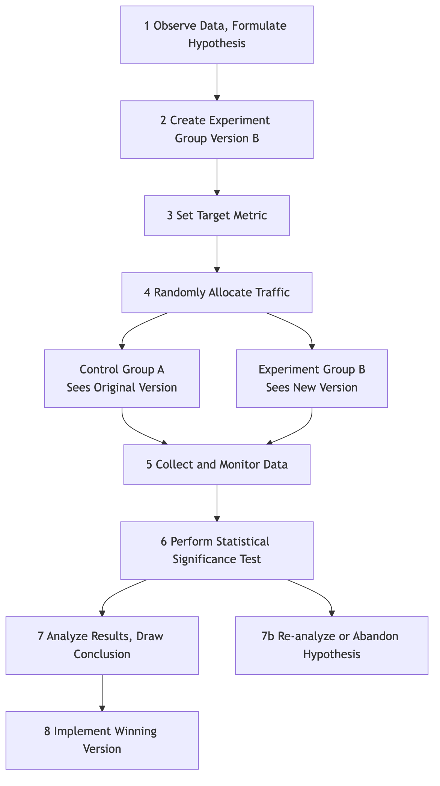
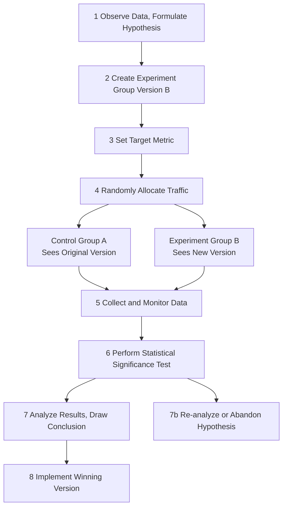

# A/B Testing

In product design and marketing, we often face seemingly subjective choices: Is a red button more appealing, or a green one? Does "Buy Now" copy convert better, or "Add to Cart"? Instead of relying on intuition or endless debates in meeting rooms, it's better to let real users tell us the answer with their data. **A/B Testing**, also known as **Split Testing**, is a rigorous, powerful, and data-driven **online controlled experiment method**. Its core is to **randomly** divide user traffic into two or more groups and show them different versions of the same page (Version A and Version B) to compare and determine which version performs better in achieving specific goals (such as click-through rate, conversion rate).

A/B testing's essence is to apply the logic of scientific experiments to product and marketing decisions. It introduces the key element of "**randomness**" to eliminate all other potential confounding factors (such as user source, access time, etc.), thereby ensuring that the observed differences in effects can be attributed with high confidence to the single change we made. It transforms subjective assumptions like "I guess this design is better" into objective conclusions like "data shows Version B has a 15% higher conversion rate than Version A, and it's statistically significant," making it an indispensable core tool for modern data-driven growth culture.

## Core Components of A/B Testing

A standard A/B test consists of the following key parts:

*   **Hypothesis**: Before starting the test, you need a clear, testable hypothesis. For example, "I believe that changing the registration button from blue to orange (change) can increase the registration conversion rate of new users (expected result) because orange is more prominent on the page (reason)."
*   **Control Group (Version A)**: The original version currently live online, with no changes made. It serves as the baseline for all comparisons.
*   **Variation Group (Version B)**: The new version where you have applied a single change, hoping it will lead to better results.
*   **Single Variable Principle**: A standard A/B test should only test one variable. If you simultaneously changed both button color and copy, then even if Version B wins, you cannot determine which change was decisive.
*   **Random Traffic Allocation**: User traffic must be randomly and evenly distributed to Version A and Version B. This is the scientific prerequisite for ensuring unbiased and credible test results.
*   **Target Metric**: You need a clear, quantifiable metric to measure the success of the test. This metric must be directly related to your hypothesis, such as "click-through rate," "conversion rate," "average time on page," etc.

### A/B Testing Workflow

<!--

-->

## How to Conduct an A/B Test

1.  **Step 1: Research and Hypothesis**
    Based on data analysis (e.g., user behavior heatmaps), user feedback, or heuristic evaluation, find areas in the current product or process that may have problems, and propose a specific, testable improvement hypothesis.

2.  **Step 2: Create Variations**
    Based on your hypothesis, design and develop the experiment group (Version B). Ensure that the only difference between Version B and Version A is the variable you want to test.

3.  **Step 3: Determine Objectives and Sample Size**
    *   Clearly define the core metric you will use to measure success.
    *   Before starting the test, you need to use a **sample size calculator** to estimate how many users need to participate in the test for your results to have sufficient **statistical power**. Too small a sample size may prevent you from detecting a truly existing difference.

4.  **Step 4: Implement the Test**
    Use professional A/B testing tools (e.g., Google Optimize, Optimizely, etc.) to configure your test. Set the traffic allocation ratio (usually 50/50) and launch the test.

5.  **Step 5: Monitor and Analyze Results**
    Let the test run long enough until it reaches the preset sample size or statistical significance level. Then, analyze the test results. You need to pay attention to two core statistical concepts:
    *   **Conversion Rate Difference**: The percentage improvement of Version B relative to Version A.
    *   **Statistical Significance**: Usually represented by the **P-value**. The P-value represents the "probability that the observed difference is due to random chance alone." Typically, when the P-value is less than 0.05 (i.e., 95% confidence level), we consider the result statistically significant and trustworthy.

6.  **Step 6: Draw Conclusions and Act**
    *   If Version B significantly wins, then congratulations, your hypothesis is validated. The next step is to fully deploy Version B to all users.
    *   If Version A wins, or there is no significant difference between the two, that is also a valuable learning experience. This indicates that your initial hypothesis was incorrect, and you need to re-analyze and propose new hypotheses for the next round of testing.

## Application Cases

**Case 1: Obama Campaign Team's Fundraising Page Optimization**

*   **Scenario**: In the 2008 US presidential election, Obama's campaign team hoped to optimize the donation page of their official website to improve registration and donation conversion rates.
*   **A/B Testing Application**: They conducted extensive A/B tests (strictly speaking, multivariate tests) on the page's hero image and button copy. In one famous test, they found that changing the hero image from a single photo of Obama to a family photo of Obama, and changing the button copy from "Sign Up" to "Learn More," ultimately increased the page's registration conversion rate by an astonishing **40.6%**. This test brought tens of millions of dollars in additional donations to the campaign team.

**Case 2: Booking.com's Culture of Continuous Testing**

*   **Scenario**: Booking.com, the world's largest online hotel booking platform, is renowned for its extreme A/B testing culture.
*   **Application**: Reportedly, at any given time, Booking.com's website runs thousands of A/B tests simultaneously. From the sorting method of search results, to the size of hotel images, to "Only X rooms left!" these tiny pieces of copy, every change must undergo rigorous A/B testing. It is this extreme pursuit of data-driven decision-making that enables them to continuously and incrementally optimize the user experience, and ultimately build a strong competitive barrier.

**Case 3: A News Website's Paywall Test**

*   **Scenario**: A news website wanted to experiment with a paid subscription model, but was unsure which paywall strategy would be most beneficial for user payment conversion and retention.
*   **A/B Testing Application**:
    *   **A Version (Metered)**: Allows all users to read 5 articles for free each month, then prompts for payment after exceeding.
    *   **B Version (Freemium)**: Some articles are free, but "premium content" such as in-depth reports and exclusive commentaries require a paid subscription to read.
    *   Through long-term testing for several months, they can compare the payment conversion rates, user churn rates, and total subscription revenue of the two models, thereby choosing the most suitable business model for themselves.

## Advantages and Challenges of A/B Testing

**Core Advantages**

*   **Objective and Data-Driven**: Uses real user behavior data to replace subjective guesses and debates, providing the strongest evidence for decision-making.
*   **Low-Risk Innovation**: Allows you to test the effect of a change with a small portion of traffic before rolling it out fully, greatly reducing the risk of negative impacts from wrong decisions.
*   **Engine for Continuous Optimization**: Provides a scientific, rigorous cyclical framework for continuous, iterative optimization of products and marketing.

**Potential Challenges**

*   **Requires Sufficient Traffic**: For websites or Apps with low traffic, it may take a very long time, or even be impossible, to achieve statistical significance.
*   **Single Variable Limitation**: Sometimes, a combination of multiple changes may produce unexpected synergistic effects, which cannot be discovered in standard A/B tests (requires more complex multivariate testing).
*   **"Local Optimum" Trap**: Continuously performing small A/B tests on existing pages may lead you into the "local optimum" trap, overlooking larger opportunities for disruptive, revolutionary redesigns.
*   **Ignores Long-Term Impact**: A/B tests typically measure short-term effects (e.g., click-through rate). Certain changes may improve metrics in the short term, but may harm user trust or brand image in the long run.

## Extensions and Connections

*   **Multivariate Testing (MVT)**: An extension of A/B testing. When you want to test **multiple** combinations of **multiple** elements on a page simultaneously (e.g., testing 3 types of headlines, 2 types of images, and 2 types of button colors), you can use MVT. It can tell you which combination of elements works best, and the relative contribution of each element to the final result.
*   **Usability Testing**: A qualitative research method. It cannot tell you "which version is better," but it can tell you "**why**" users encountered difficulties with a certain version. Typically, usability testing can be conducted before A/B testing to gain inspiration on "what to test."

---
*Source Reference: The concept of A/B testing is rooted in classic statistical experimental design. In the internet field, it was first widely applied by tech giants like Google and Amazon in website and product optimization, and gradually became a core skill in digital marketing and growth hacking.*