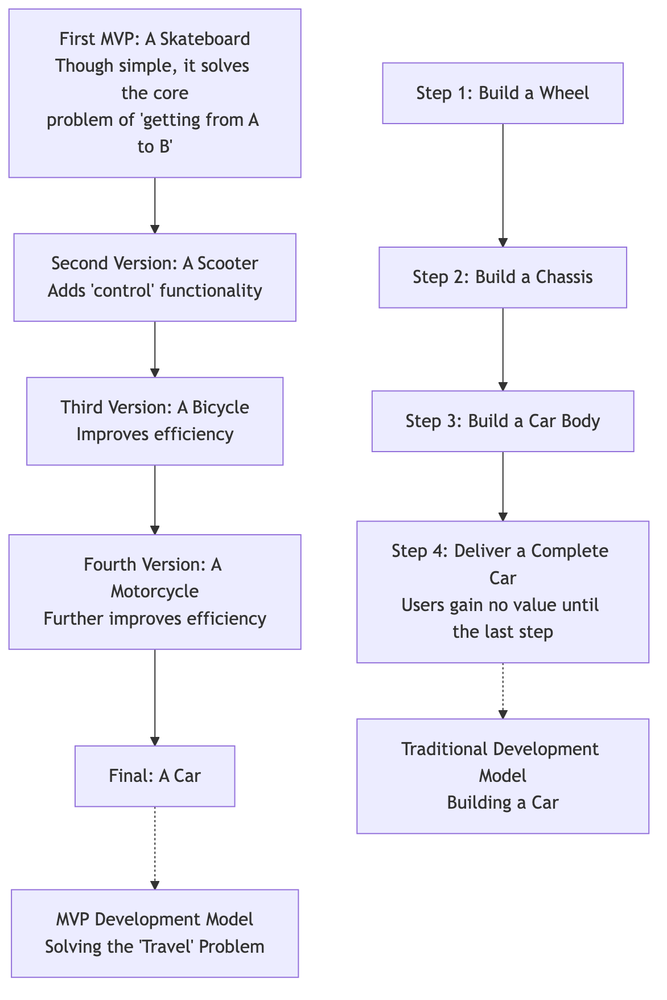

# MVP (Minimum Viable Product)

In the uncertain world of startups, many passionate teams spend months or even years, pouring all their resources into building a "ultimate product" that is powerful and perfectly designed in their minds. However, when the product is finally launched, it often faces a harsh reality: the market doesn't need it at all. **MVP (Minimum Viable Product)** is a core concept proposed in the Lean Startup methodology to avoid this kind of massive waste from "building in a vacuum."

MVP is not a synonym for "shoddy" or "unfinished." Its definition is: **the version of a product with the fewest features that allows you to launch it to the market and validate its core value proposition with the lowest cost and and in the shortest time**. The fundamental purpose of MVP is not the "product itself," but a **learning process**. It is a tool for scientific experimentation, designed to quickly throw your core assumptions about "user problems" and "solutions" into the real market, and at minimal cost, gain the most valuable insights into "**Is this direction right?**"

## Core Idea of MVP

*   **Minimum**: It only includes features that are **essential** for validating the core hypothesis. Any superfluous, nice-to-have features should be ruthlessly cut. It pursues "doing less," not "doing more."
*   **Viable**: Although minimalist in features, it must be **usable and solve a core user problem**. It must provide enough value for the first "**Early Adopters**" to be willing to try it.
*   **Product**: It is a real product (or looks like a real product) that users can interact with, and generate real behavior and feedback.

The essence of MVP is that it transforms the traditional long linear process of "**Build -> Release -> Learn**" into a fast, agile feedback loop of "**Build-Measure-Learn**."

### Comparison of MVP and Traditional Product Development Thinking

Imagine your goal is to build a car.



<!--
```mermaid
graph TD
    subgraph Two Different Product Development Paths
        direction LR
        subgraph Traditional Development Model (Building a Car)
            A(Step 1: Build a Wheel) --> B(Step 2: Build a Chassis) --> C(Step 3: Build a Car Body) --> D(<b>Step 4: Deliver a Complete Car</b><br/><i>Users gain no value until the last step</i>);
        end

        subgraph MVP Development Model (Solving the "Travel" Problem)
            E(<b>First MVP: A Skateboard</b><br/><i>Though simple, it solves the core<br/>problem of "getting from A to B"</i>) --> F(<b>Second Version: A Scooter</b><br/><i>Adds "control" functionality</i>);
            F --> G(<b>Third Version: A Bicycle</b><br/><i>Improves efficiency</i>) --> H(<b>Fourth Version: A Motorcycle</b><br/><i>Further improves efficiency</i>) --> I(<b>Final: A Car</b>);
            note over E,I: At each stage, users get a usable product that solves a problem,<br/>and the team continuously learns and iterates from user feedback.
        end
    end
```
-->

## How to Define and Build Your MVP

1.  **Step 1: Start with Core Problems and Users**
    Don't ask, "What features can we build?" Instead, ask, "**What high-frequency, pain-point core problem are we solving for whom?**" Clearly define your target users (early adopters) and their core pain points.

2.  **Step 2: Map the User Journey and Identify the Core Path**
    Outline the key steps users need to take to solve this problem. Then, identify the **essential** features required for users to complete this most core and valuable path.

3.  **Step 3: Ruthlessly Prioritize Features**
    List all conceived features. Then, use a prioritization matrix (such as the "Importance-Urgency" matrix) or other methods, to ruthlessly prioritize them. Ask yourself: "**If we remove this feature, can users still experience the core value of the product?**" If the answer is "yes," then decisively put it on the "future versions" list.

4.  **Step 4: Choose the Right MVP Type**
    An MVP doesn't necessarily have to be software that requires coding. Depending on your product type and the hypothesis you need to validate, you can choose different "fidelity" MVPs:
    *   **Landing Page MVP**: Create a simple introductory page that clearly articulates your value proposition and includes a "Sign Up Now" or "Learn More" button to test market interest in the idea.
    *   **"Wizard of Oz" MVP**: From the front end, users believe they are interacting with a fully automated system, but in reality, all the work in the background is done **manually** by the founders. This allows for validating the core process and user needs of a complex service at extremely low cost.
    *   **"Concierge" MVP**: Similar to "Wizard of Oz," but you don't even "pretend" to be a system. You directly provide one-on-one, manual service to your first users like a personal concierge, and in this process, deeply learn their needs and behavior patterns.
    *   **Single-Feature MVP**: Develop only the most core and critical feature of the product and perfect it.

5.  **Step 5: Launch, Measure, and Learn**
    Get your MVP into the hands of your first early adopters as quickly as possible. Then, through qualitative and quantitative methods, closely monitor their behavior and feedback. You need to answer the core questions: "**Has our core hypothesis been validated?**" "**Are users willing to pay for this solution?**" "**What should we do next (continue to optimize, pivot, or abandon)?**"

## Classic Application Cases

**Case 1: Zappos (Largest Online Shoe Retailer in the US)**

*   **Core Hypothesis**: "Are people really willing to buy shoes online without trying them on?"
*   **MVP**: Founder Nick Swinm did not initially build a massive warehouse and logistics system. He went to local shoe stores, took photos of the shoes there, and then uploaded these photos to a simple website. When a user placed an order, he would **personally go to that shoe store to buy the shoes**, and then mail them to the user. This "Wizard of Oz" MVP, with almost zero inventory cost, successfully validated its core business hypothesis.

**Case 2: Dropbox (Cloud Storage Service)**

*   **Core Hypothesis**: "A solution that seamlessly syncs files in the background, is highly appealing to users."
*   **MVP**: Developing a truly usable, cross-platform sync product, was technically very complex and time-consuming at the time. So, founder Drew Houston created a 3-minute **product demo video**. In this video, he vividly demonstrated how Dropbox would work, and what pain points it could solve for users. He posted this video in tech enthusiast communities, with a simple landing page for email registration. Overnight, tens of thousands of registrations powerfully demonstrated the huge market demand for this solution.

**Case 3: Buffer (Social Media Management Tool)**

*   **Core Hypothesis**: "Are people willing to pay for a tool that helps them schedule social media content?"
*   **MVP**: Founder Joel Gascoigne created an extremely simple **two-page landing page**. The first page explained what Buffer was and how it worked, and placed a "Plans & Pricing" button. When users clicked this button, they would be redirected to the second page, which read: "Hey! You caught us, we're not quite ready yet. Please enter your email, and we'll notify you as soon as we launch." By analyzing the number of users who clicked the "Pricing" button, he validated that people were not only interested in the idea, but also had the willingness to pay.

## Advantages and Challenges of MVP

**Core Advantages**

*   **Maximize Learning Value**: With minimal cost, gain the most valuable insights about the market and users, greatly reducing startup risk.
*   **Accelerate Learning Cycle**: Significantly shortens the time from "idea" to "getting market feedback."
*   **Focus on Core Value**: Forces the team to focus on solving the most core problems for users, avoiding wasting resources on unnecessary features.
*   **Build User Relationships Earlier**: Can connect with early adopters sooner, and develop them into co-creation partners for the product.

**Potential Challenges**

*   **Misunderstanding of "Minimum"**: Teams can easily disagree on the definition of "minimum." MVP does not equal shoddy; it must be "viable," and deliver core value.
*   **Negative User Feedback**: Ordinary users outside of early adopters may give bad reviews due to the MVP's overly simple features, which may have a certain negative impact on the brand.
*   **Temptation of Perfectionism**: Founders and engineers often have an urge to polish the product to perfection. Resisting the temptation of "just one more feature" is one of the biggest challenges in building an MVP.

## Extensions and Connections

*   **The Lean Startup**: MVP is a core practical component of the "**Build-Measure-Learn**" feedback loop in the Lean Startup methodology.
*   **Design Thinking**: The concept of "**Prototype**" in Design Thinking is highly related to MVP. Typically, before developing an MVP, lower-fidelity prototypes are created for internal and user testing.
*   **Agile Development**: Agile's iterative development model provides perfect engineering practice support for continuously and incrementally building and iterating MVPs.

---
*Source Reference: The concept of MVP was first proposed by Frank Robinson, and developed by Steve Blank in his "Customer Development" model. Finally, Eric Ries popularized it in his global bestseller "The Lean Startup," making it a standard term in the modern tech startup world.*