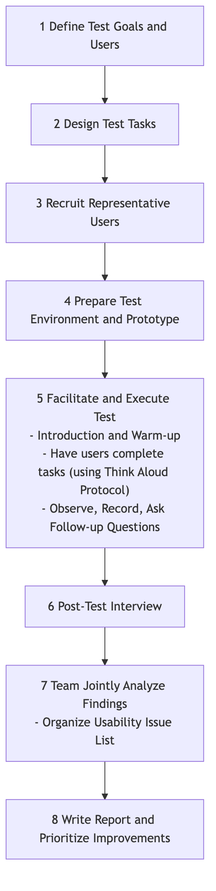

# Usability Testing

We meticulously design a product interface that we believe is perfect, but when real users encounter it for the first time, they might completely fail to find that seemingly obvious button. **Usability Testing** is a core, user-centered **qualitative evaluation method** whose fundamental purpose is to discover usability issues in design and gather in-depth insights into user behavior and subjective feelings by **observing real users attempting to complete typical tasks using a product (or prototype)**.

The essence of usability testing is not to "test users," but to "**let users test our design**." It's not about how smart users are, but about how intuitive, easy-to-use, and efficient our design is. It doesn't answer the question "How many users clicked this button?" but rather "**Why** didn't users click this button? What difficulties did they encounter? How did they feel at the time?" It is a mirror that clearly reflects design flaws and an essential path to creating a smooth and pleasant user experience.

## Core Elements of Usability Testing

A standard usability test typically includes the following key components:

*   **Facilitator**: A trained facilitator responsible for guiding the testing process, presenting tasks to users, observing user behavior, and asking follow-up questions.
*   **Representative Users**: Recruit 5-8 real users who can represent your core target user group. Research shows that 5 users can usually uncover 85% of core usability issues.
*   **Test Tasks**: A series of specific, representative tasks that users would genuinely perform when using the product. Tasks should be open-ended, telling users "what to do" rather than "how to do it." For example, "Please find and book an Italian restaurant in Shanghai for next weekend, with an average cost of around 300 yuan per person."
*   **Test Object (Product/Prototype)**: Can be a live product or a high-fidelity or low-fidelity interactive prototype.
*   **Observation & Recording**: During the user's task completion, the facilitator and other observers need to carefully observe the user's every move, facial expressions, and verbalizations, and typically record them via screen recording and audio recording.
*   **Think Aloud Protocol**: This is the most commonly used and powerful technique in usability testing. The facilitator encourages users to **verbalize all their thoughts, confusions, and feelings** as they perform the tasks. This opens a window into the user's inner world.

### Usability Testing Process



<!--
```mermaid
graph TD
    subgraph Usability Testing Process
        A(1 Define Test Goals and Users) --> B(2 Design Test Tasks);
        B --> C(3 Recruit Representative Users);
        C --> D(4 Prepare Test Environment and Prototype);
        D --> E(5 Facilitate and Execute Test<br/>- Introduction and Warm-up<br/>- Have users complete tasks (using Think Aloud Protocol)<br/>- Observe, Record, Ask Follow-up Questions);
        E --> F(6 Post-Test Interview);
        F --> G(7 Team Jointly Analyze Findings<br/>- Organize Usability Issue List);
        G --> H(8 Write Report and Prioritize Improvements);
    end
```
-->

## How to Conduct a Usability Test

1.  **Step One: Plan the Test**
    *   **Clarify Objectives**: What do you most want to learn from this test? Is it to validate a new design process, or to find problems in an existing product?
    *   **Define Users**: Who are your core test users? What are their characteristics?
    *   **Write Task Scripts**: Design 4-6 core, realistic test tasks.

2.  **Step Two: Recruit Users**
    Based on your defined user persona, recruit 5-8 qualified participants through various channels (e.g., user databases, social media, professional recruitment agencies). It is usually necessary to offer some compensation as a thank you.

3.  **Step Three: Prepare and Rehearse**
    Prepare everything needed for the test: a stable prototype, screen recording software, a quiet testing room (or remote conferencing software), and task scripts. Before the official start, it is highly recommended to conduct an internal **pilot test** to ensure the entire process runs smoothly.

4.  **Step Four: Facilitate the Test**
    *   **Welcome and Introduction**: Make users feel relaxed and emphasize, "We are testing the product, not you. There's no right or wrong, and any feedback you provide is helpful to us."
    *   **Guide Tasks**: Present tasks to users one by one and encourage them to use the "Think Aloud Protocol."
    *   **Maintain Neutrality**: While the user is operating, the facilitator must remain neutral and **absolutely not offer any help or guidance**. When a user asks, "Should I click here?" you should ask back, "Where do you think you should click?"
    *   **Observe and Probe**: Carefully observe the user's behavior and non-verbal cues. When a user completes a task or gets stuck, you can probe, for example, "I noticed you hesitated here just now. Can you tell me what you were thinking at that moment?"

5.  **Step Five: Analyze and Report**
    After the test, organize all observers (product managers, designers, engineers, etc.) to quickly review and synthesize findings. Record all observed usability issues in the format of "When the user tried to [do something], they encountered [what problem], which led to [what consequence]." Finally, prioritize these issues by severity and propose specific modification suggestions.

## Application Cases

**Case 1: Optimizing E-commerce Website Checkout Process**

*   **Task**: "Please add this T-shirt (size L, red) to your shopping cart and complete the purchase process until you see the payment successful page."
*   **Finding**: During the test, 3 out of 5 users got stuck at the address filling step because they didn't notice the inconspicuous small button for auto-filling the postal code. Some users also complained that the website forced registration, which they found annoying.
*   **Improvement**: The design team enlarged the postal code auto-fill button and added an option to "checkout as guest."

**Case 2: Testing a New Project Management Software Prototype**

*   **Task**: "Please create a new project for your team called 'Q3 Marketing Plan,' invite two colleagues, and then assign a 'design poster' task to designer Xiao Wang."
*   **Finding**: Users generally reported that the entry points for "create project" and "invite members" functions were too hidden and difficult to find. Also, when assigning tasks, it was not convenient to set deadlines.
*   **Improvement**: In subsequent design iterations, the team placed the entry points for these two core functions directly in prominent positions on the main interface and added a calendar control to the task assignment interface.

**Case 3: Evaluating the Usability of a Physical Product (e.g., a New Coffee Machine)**

*   **Task**: "Please use this coffee machine to make yourself a latte."
*   **Finding**: When using it for the first time, users generally didn't know to which mark on the water tank they should add water. Also, when installing the milk frother, several users installed it in the wrong direction, causing milk to splash out.
*   **Improvement**: The manufacturer added clearer "max/min" water level indicators on the water tank and redesigned the milk frother's interface to be "fool-proof," allowing it to be correctly installed in only one direction.

## Advantages and Challenges of Usability Testing

**Core Advantages**

*   **Intuitive, Empathetic Insights**: Nothing is more effective at generating empathy and motivation for change within a team (especially engineers) than witnessing a real user struggle and feel confused with your product firsthand.
*   **Efficient Problem Discovery**: Extremely high return on investment; a small number of users can uncover most core usability issues.
*   **Early Problem Detection**: Can be tested when the product is still a low-cost paper prototype, thus avoiding expensive rework later at minimal cost.

**Potential Challenges**

*   **Qualitative, Not Quantitative**: It cannot tell you "how many" users encountered this problem, or "which design is better." Its conclusions are not statistically significant.
*   **"Artificial Environment" Effect**: In a lab or observed environment, user behavior might differ slightly from completely natural conditions.
*   **High Demands on Facilitator**: An excellent facilitator needs good communication skills, a neutral attitude, and keen observation skills to conduct a high-quality test.

## Extensions and Connections

*   **A/B Testing**: Usability testing and A/B testing are a golden pair. Usability testing answers the "**why**" question, helping you generate improvement **hypotheses**; while A/B testing answers the "**which is better**" question, using **quantitative** data to verify the effectiveness of these hypotheses.
*   **Heuristic Evaluation**: A method where usability experts evaluate an interface based on a set of recognized design principles ("heuristics"). It is faster and less costly than usability testing, but its drawback is the lack of direct feedback from real users.
*   **User Persona** and **User Journey Map**: A clear user persona is a prerequisite for recruiting "representative users." And the pain points discovered in usability testing are key materials for enriching and validating user journey maps.

---
*Reference: Jakob Nielsen, known as the "king of usability," is a pioneer in usability testing. His book "Usability Engineering" is a foundational work in the field. Another master, Steve Krug, popularized the core ideas of usability testing in a more relaxed and practical way in his book "Don't Make Me Think."*