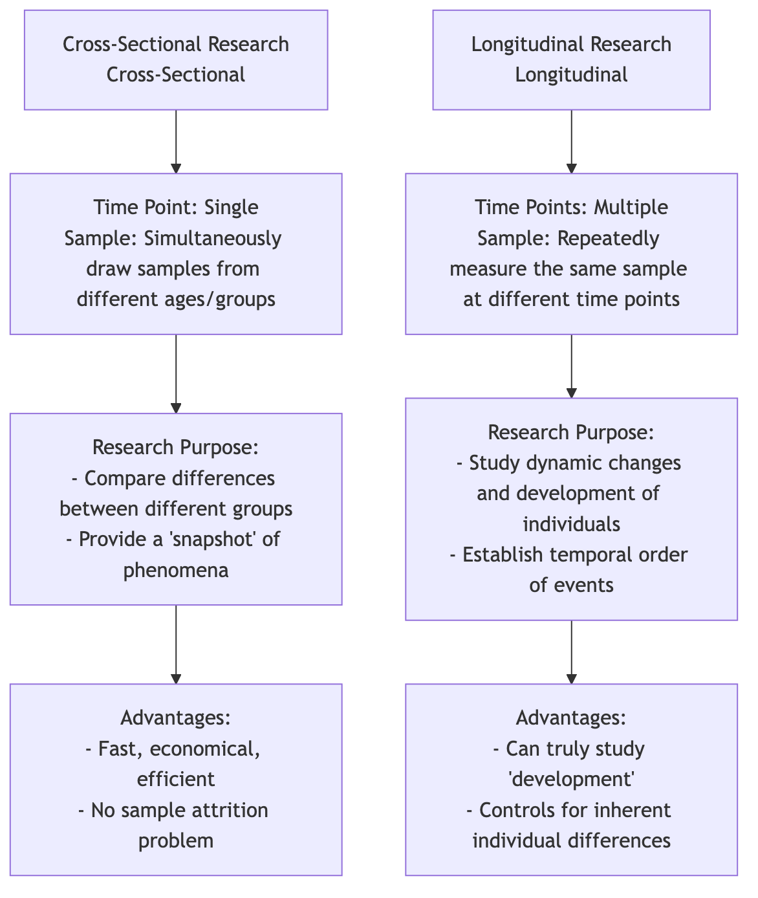

# Cross-Sectional Research

In a fast-paced world, we often need to quickly and efficiently obtain a "snapshot" of a group's current status. **Cross-Sectional Research** is a research design created for this purpose. Its core lies in observing and measuring samples from **different groups** (usually different age groups) simultaneously at **a specific point in time**. It aims to describe and compare the characteristics, opinions, or behaviors of these different groups at the same moment, thereby providing us with a panoramic view of a cross-section of society.

If longitudinal research is a "documentary" tracking the growth of a protagonist, then cross-sectional research is a "family photo" gathering three generations of people. Through this photo, we can clearly see the differences in appearance, clothing, and demeanor of people of different ages. When you want to quickly understand questions like "How do consumers of different age groups differ in their acceptance of new tech products?" or "What is the level of happiness among different income classes in society today?", cross-sectional research provides an extremely efficient solution.

## Core Logic of Cross-Sectional Research

The essence of cross-sectional research is **comparison**. It infers patterns of change (usually with age) by capturing the state of different groups at the same point in time. Its basic logic and characteristics are as follows:

*   **Single Time Point**: All data collection is completed within a relatively concentrated, short period.
*   **Multi-Group Comparison**: The core of the research is to compare the differences in a certain variable (e.g., "social media usage duration") among different groups (e.g., 10-19 age group, 20-29 age group, 30-39 age group).
*   **Descriptive and Correlational**: It is essentially a descriptive study, aiming to portray the characteristics of various groups. At the same time, it can also be used for correlational analysis, exploring the relationships between different variables at a specific point in time (e.g., the relationship between income and happiness).
*   **No Intervention**: Researchers only observe and measure, without imposing any intervention or manipulation on the study subjects.

### Cross-Sectional Research vs. Longitudinal Research



<!--
```mermaid
graph TD
    subgraph Time Dimension of Research Design
        A(<b>Cross-Sectional Research</b><br/>Cross-Sectional) --> A1(<b>Time Point: </b> Single<br/><b>Sample: </b> Simultaneously draw samples from different ages/groups);
        A1 --> A2(<b>Research Purpose:</b><br/>- Compare differences between different groups<br/>- Provide a "snapshot" of phenomena);
        A2 --> A3(<b>Advantages:</b><br/>- Fast, economical, efficient<br/>- No sample attrition problem);

        B(<b>Longitudinal Research</b><br/>Longitudinal) --> B1(<b>Time Points: </b> Multiple<br/><b>Sample: </b> Repeatedly measure the <b>same sample</b> at different time points);
        B1 --> B2(<b>Research Purpose:</b><br/>- Study dynamic changes and development of individuals<br/>- Establish temporal order of events);
        B2 --> B3(<b>Advantages:</b><br/>- Can truly study "development"<br/>- Controls for inherent individual differences);
    end
```
-->

## Confounding of "Age Effect" and "Cohort Effect"

This is the most fundamental and critical limitation when understanding cross-sectional research. When we find differences between different age groups in a cross-sectional study, it is difficult to determine whether these differences are caused by **age growth itself** (age effect) or by the fact that these people of different ages grew up in **different historical eras** (cohort effect).

**A classic example**: A cross-sectional study found that the computer proficiency of 60-year-olds was significantly lower than that of 20-year-olds. We cannot hastily conclude that "as people get older, their ability to learn computers declines" (age effect). This is because the two groups grew up in completely different eras: 20-year-olds are "digital natives" who grew up with computers, while 60-year-olds were exposed to computers only in adulthood. This difference caused by different backgrounds is the "cohort effect." The design of cross-sectional research itself cannot clearly separate these two effects.

## How to Conduct a Cross-Sectional Study

1.  **Define Research Questions and Groups**
    Clearly define what groups you want to compare and what variables you want to measure. For example, study "Are there differences in environmental awareness scores among adults with different educational levels (high school, bachelor's, master's)?"

2.  **Determine Sample and Sampling**
    Define clear sampling frames for each group (high school, bachelor's, master's) and use appropriate sampling methods (e.g., stratified sampling or quota sampling) to ensure that the sample for each group is representative.

3.  **Develop Measurement Tools**
    Design a tool that can accurately measure the variables you are interested in, most commonly a survey questionnaire. Ensure the questionnaire is fair and applicable to all groups.

4.  **Data Collection**
    Complete data collection for all samples within a predetermined, relatively concentrated time frame.

5.  **Data Analysis**
    Use statistical techniques to compare differences in target variables among different groups. Common statistical methods include ANOVA, t-tests, or chi-square tests. For example, use ANOVA to compare whether there are significant differences in the average environmental awareness scores of the three educational groups.

## Application Cases

**Case 1: Political Science Voting Behavior Research**

*   **Scenario**: Before a major election, a polling organization wants to understand the voting tendencies of voters in different age groups.
*   **Application**: The organization randomly sampled 1000 voters by phone a week before the election and asked for their age and preferred candidate. Analysis showed that voters aged 18-29 were more inclined to support Candidate A, while voters over 65 were more inclined to support Candidate B. This study provided an immediate "snapshot" for election analysis.

**Case 2: Market Segmentation Research**

*   **Scenario**: An automobile company plans to launch a new SUV and wants to determine its core target market.
*   **Application**: They conducted a large-scale cross-sectional survey, collecting data on car purchase preferences of consumers of different ages, incomes, and family sizes. The analysis results showed that families aged "30-40, with two children, and middle-to-high income" had the strongest demand for seven-seater SUVs. This finding helped the company accurately target its customers and formulate corresponding marketing strategies.

**Case 3: Ability Research in Developmental Psychology**

*   **Scenario**: A psychologist wants to study how children's logical reasoning ability develops with age.
*   **Application**: He simultaneously recruited 100 5-year-olds, 100 8-year-olds, and 100 11-year-olds, and had them complete the same logical reasoning tasks. He found that as the age group increased, the average score for completing the tasks also significantly improved. This initially depicted the development curve of logical reasoning ability. However, he still needs to be aware that this difference might also partly stem from the different educational content received by children of different ages (cohort effect).

## Advantages and Limitations of Cross-Sectional Research

**Core Advantages**

*   **Efficient and Economical**: Compared to longitudinal studies that take years, cross-sectional studies can be completed in a short time, making them highly cost-effective.
*   **Easy to Implement**: The data collection process is relatively simple, and there is no problem of sample attrition.
*   **Provides Immediate Snapshot**: Can quickly provide an overview of the current situation for policy-making, market decisions, etc.

**Potential Limitations**

*   **Cannot Study Individual Changes**: It cannot tell us anything about how individuals change over time.
*   **Weak Causal Inference Ability**: Cannot establish the temporal order of events, thus cannot be used to infer causality.
*   **Confounding of Cohort Effects**: Its most fundamental flaw is the inability to distinguish between age effects and cohort effects, which may lead to misinterpretations of developmental trends.

## Extensions and Connections

*   **Longitudinal Research**: Is the best method to overcome the limitations of cross-sectional research. Many research projects first conduct an exploratory cross-sectional study, and if interesting differences are found, then design a longitudinal study to delve deeper into the development process.
*   **Sequential Design**: A more complex mixed design that combines the characteristics of cross-sectional and longitudinal research, attempting to separate age effects and cohort effects by tracking multiple age cohorts at different time points.

---
*Reference: Cross-sectional research is one of the most commonly used and fundamental designs in social surveys and epidemiology. Its methodology is detailed in major research methods textbooks. For classic discussions on "cohort effects," refer to the research of scholar K. Warner Schaie in the field of intellectual development.*