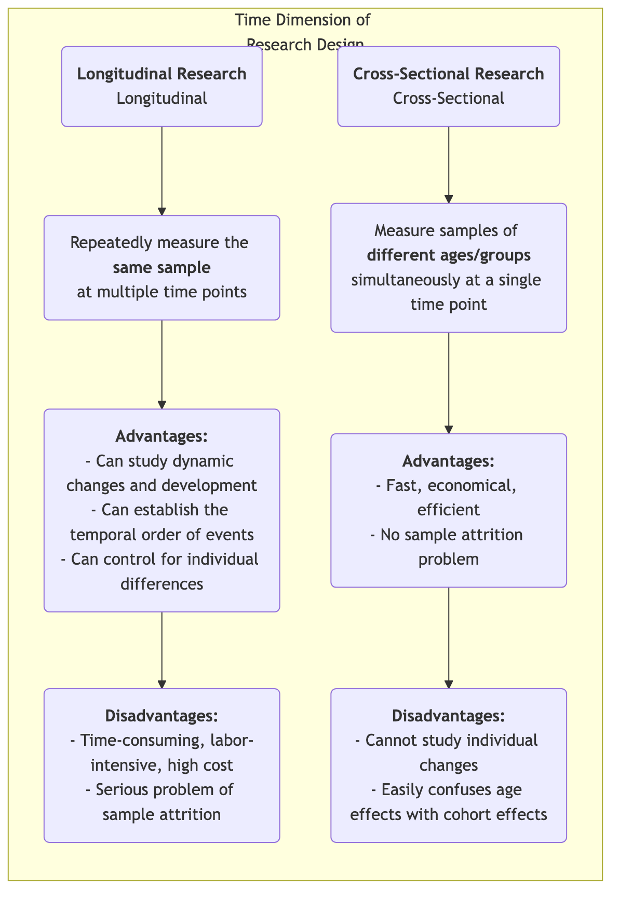
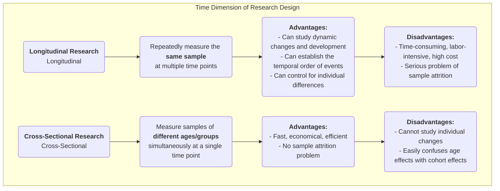

# Longitudinal Research

When exploring the long tapestry of human development, social change, and disease evolution, we need a research method capable of capturing the crucial dimension of "time." **Longitudinal Research** is precisely such a "camera," repeatedly and continuously observing and measuring the **same sample** over an extended period. Its core objective is to reveal how phenomena **change, develop, and evolve** over time, and to investigate the long-term impact of early events on later outcomes.

Unlike cross-sectional studies, which offer only a "snapshot" at a single point in time, longitudinal research provides us with a "documentary." It allows us to observe the trajectory of individual growth, the process of conceptual shifts, and the entire course of a disease from its inception to full development. This enables us to more clearly establish the temporal sequence of events when exploring causal relationships. When you want to answer dynamic questions about processes and development, such as "How do childhood reading habits affect adult income levels?" or "What sustained impact has a policy reform had over the next decade?", longitudinal research becomes an indispensable and powerful tool.

## Core Characteristics and Types of Longitudinal Research

The commonality among all longitudinal studies is their tracking of "time," but they can be primarily divided into three types based on the nature of what is being tracked:

*   **Cohort Study**: This is the most common type. Researchers select a specific group of people (a "cohort") who share a common characteristic or experience (e.g., "all infants born in 2000" or "employees who joined a certain company in 2010") and continuously track this cohort over several decades.
*   **Panel Study**: Similar to a cohort study, but it tracks the exact same **individual** sample. Each survey visits the same group of people, allowing researchers to precisely analyze the trajectory of change for each individual.
*   **Trend Study**: This type of research focuses on changes in the characteristics of a "population" over time, but the individual samples drawn for each survey are different. For example, to study changes in public attitudes towards environmental issues, a research institution might randomly select a new batch of samples nationwide every five years for a survey.

### Comparison of Longitudinal and Cross-Sectional Research

<!--

<!--

-->
-->

## How to Conduct a Longitudinal Study

1.  **Establish Long-Term Research Objectives**
    Clearly define what changes or developments you want to track and what potential influencing factors you are interested in. Longitudinal research is a long-term investment and must be supported by clear, significant research objectives.

2.  **Define and Select Your Cohort or Panel Sample**
    Precisely define your study population and use appropriate sampling methods to select the initial sample. The quality and representativeness of the initial sample are crucial.

3.  **Conduct Baseline Survey**
    At the beginning of the study, conduct the first comprehensive data collection (baseline survey) to measure the initial state of all variables of interest.

4.  **Design and Execute Subsequent Follow-up Surveys**
    Determine the time intervals for subsequent follow-up surveys (e.g., annually, every five years) and design consistent measurement tools. Maintaining contact with the sample and reducing attrition rates are among the biggest challenges over a long research period.

5.  **Data Management and Analysis**
    Longitudinal data structures are complex and require professional databases for management. For analysis, researchers use advanced statistical models (such as growth curve models, survival analysis) to analyze the trajectories of variable changes over time and their influencing factors.

## Classic Application Cases

**Case 1: The Harvard Study of Adult Development**

*   **Scenario**: One of the longest longitudinal studies in history, it began in 1938 and tracked 724 men for nearly 80 years.
*   **Application**: Researchers regularly collected data on their work, family, health, and other aspects through questionnaires, interviews, medical records, etc. The most famous conclusion of this study is that good, warm interpersonal relationships are the most important factor in predicting long-term happiness and health, even more so than wealth, fame, and genes. This conclusion could only be drawn through lifelong tracking.

**Case 2: UK Millennium Cohort Study**

*   **Scenario**: A national birth cohort study tracking approximately 19,000 British children born between 2000 and 2002.
*   **Application**: The study conducted comprehensive data collection at multiple ages (e.g., 9 months, 3, 5, 7, 11, 14, 17 years), covering all aspects from health, cognition, and behavior to family environment. This study provided massive and extremely valuable evidence for the government to formulate child and family policies, for example, it revealed the long-term negative impact of poverty on early childhood development.

**Case 3: Cohort Analysis of Product User Churn**

*   **Scenario**: A SaaS (Software as a Service) company wants to understand new user retention.
*   **Application**: They adopted the **cohort analysis** method. They treated "new users registered each month" as a cohort (e.g., "January cohort," "February cohort"). Then, they tracked the retention rate of each cohort in the first month, second month, third month... after registration. By comparing the retention curves of different cohorts, they could evaluate whether their product improvements and marketing activities had a positive impact on the long-term retention of new users.

## Advantages and Challenges of Longitudinal Research

**Core Advantages**

*   **Ability to Study Dynamic Processes**: It is the most effective method for studying "development" and "change" itself.
*   **Establish Temporal Order**: Can clearly determine the temporal sequence of events, which is an important prerequisite for inferring causality (but still needs to be wary of confounding variables).
*   **Control for Individual Differences**: Since the same individuals are tracked, individual inherent differences that do not change over time (e.g., IQ, personality) can be excluded from interfering with the results.

**Potential Challenges**

*   **High Cost**: Requires long-term financial support, a stable research team, and huge management costs.
*   **Time-Consuming**: The output cycle of research results is very long, potentially taking years or even decades.
*   **Sample Attrition**: This is the biggest "natural enemy" of longitudinal research. Over time, some participants may drop out of the study due to relocation, loss of contact, death, or loss of interest, which can lead to bias in the final sample.
*   **Impact of Repeated Measurements**: Repeatedly undergoing the same tests or questionnaires may affect participants' behavior or responses, known as the "practice effect."

## Extensions and Connections

*   **Cross-Sectional Research**: Often serves as a low-cost, quick alternative to longitudinal research. However, it is important to be aware of its inability to distinguish between age effects and cohort effects.
*   **Survival Analysis**: A statistical method commonly used in longitudinal research, specifically for analyzing the duration until an event (e.g., recovery, churn, death) occurs and its influencing factors.

---
*Reference: The design concept of longitudinal research has a long history in epidemiology and social sciences. Glen H. Elder Jr.'s Life Course Theory provides an important theoretical framework for modern longitudinal research.*