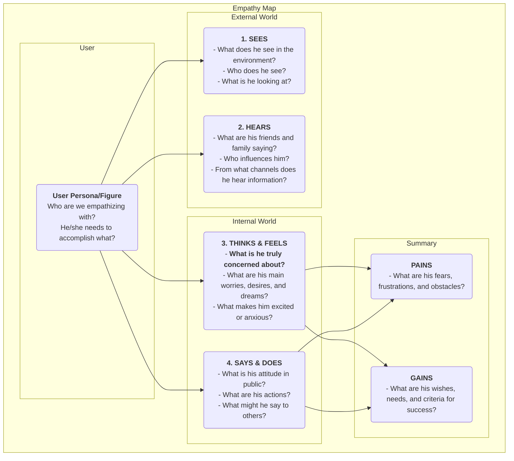

# Empathy Map

In product design and user research, "empathy" is a core quality frequently mentioned but extremely difficult to truly achieve. How can we genuinely "walk in the user's shoes" and experience their world firsthand? The **Empathy Map** is a simple, intuitive, yet extremely powerful **collaborative empathy tool** designed for this very purpose. It aims to help teams move beyond the surface of user behavior and delve into their deeper world of **senses, thoughts, and emotions**, thereby forming a more comprehensive and multi-dimensional understanding of the user.

The core of the Empathy Map lies in systematically organizing all scattered, qualitative observations and interview data about users into a visual framework. This framework is typically divided into four main quadrants: **Sees, Hears, Thinks & Feels, and Says & Does**. By collaboratively filling out this map, team members are forced to adopt the user's perspective, jointly building a shared understanding of the user's inner world and external environment. It is a mirror that clearly reflects the user's true situation and a catalyst for cultivating collective team empathy.

## Components of an Empathy Map

A classic Empathy Map is user-centric and unfolds around four core quadrants of external and internal experience.

<!--

<!--

-->

*   **Sees**: Describes what the user sees with their eyes in their environment. For example, what are the people around them doing? What market information do they encounter daily?
*   **Hears**: Describes the information the user hears from the external world. What are their friends, family, and colleagues saying? Which opinion leaders or media channels influence them?
*   **Thinks & Feels**: This is the core of the map, attempting to explore the user's inner world. What is truly important to them (even if they never say it aloud)? What worries, anxieties, hopes, and dreams do they have?
*   **Says & Does**: Describes the user's words and actions in public. What did they tell us in an interview? What are their actual behaviors when using the product? Here, special attention needs to be paid to potential contradictions between "says" and "thinks."
*   **Pains** and **Gains**: After analyzing the above four quadrants, summarize the user's inner struggles and desires. Pains represent the obstacles and negative emotions they face, while Gains represent the goals and wishes they truly want to achieve.

## How to Use an Empathy Map

An Empathy Map is best used in a team workshop format.

1.  **Step 1: Define Scope and Goals**
    *   **Choose Your User**: Clearly define which specific user persona or figure this Empathy Map is for. It's best to give them a name and basic background.
    *   **Clarify Goals**: Define the goals you hope to achieve through this exercise. Is it to better understand existing users, or to explore potential users for a new product?

2.  **Step 2: Gather Research Materials**
    An Empathy Map must be based on real research, not fiction. Prepare all relevant user research materials, such as: user interview recordings and transcripts, usability test videos, open-ended responses from surveys, user photos, etc.

3.  **Step 3: Collaboratively Fill the Map**
    *   Draw a large Empathy Map template on a whiteboard, or use an online collaboration tool.
    *   Team members collaboratively write down findings from research materials on sticky notes, one by one, and place them in the corresponding quadrants of the map. For example, when listening to an interview recording, one member might write "User says he works overtime every week (Says)," while another member might write "I feel he sounds tired and has lost passion for work (Feels)."
    *   Encourage team members to read the content of the sticky notes aloud and explain why they placed them in that quadrant.

4.  **Step 4: Dig Deeper and Synthesize**
    When all information is on the board, guide the team in a deeper discussion.
    *   "What contradictions do we see? For example, users' words and actions are inconsistent?"
    *   "Behind all these details, what is he truly concerned about but hasn't expressed?"
    *   "What unexpected things did we learn?"
    *   Finally, collectively summarize the user's most core **Pains** and **Gains**.

5.  **Step 5: Share and Apply**
    Organize and share the completed Empathy Map, and use it as important input for subsequent design and decision-making.

## Application Cases

**Case 1: Designing a Smartphone for the Elderly**

*   **User**: Grandpa Wang, 70 years old, just received a smartphone from his children.
*   **Sees**: The icons on the phone screen are small and numerous, hard to see; young people are all using mobile payments and chatting.
*   **Hears**: Children say, "It's very simple, you'll learn it quickly"; old friends say, "That thing is too complicated, I can't learn it."
*   **Thinks & Feels**: Feels very **frustrated**, afraid of being left behind by technology; yet **eager** to learn how to video chat with his grandchildren on the phone.
*   **Says & Does**: Says, "I don't need this," but secretly tries to unlock the screen repeatedly.
*   **Pains**: Fear of making mistakes and causing losses; feeling abandoned by technology.
*   **Gains**: Hopes to maintain closer contact with family; hopes to independently complete some daily tasks (e.g., checking bus routes).
*   **Design Inspiration**: The core design principle for this phone should not be "powerful features," but "no frustration." Need to provide "extra-large font mode," "family remote assistance" and other functions.

**Case 2: Designing a Job Search App for University Students**

*   **User**: Li Xue, 22 years old, a graduating university student.
*   **Sees**: Job search websites are cluttered with information, hard to distinguish true from false; classmates around her have received multiple offers.
*   **Hears**: Seniors say, "The first job is very important"; parents say, "Finding a stable job is most important."
*   **Thinks & Feels**: Feels very **confused and anxious** about the future; unsure what kind of job suits her; **afraid** of performing poorly in interviews.
*   **Says & Does**: Sent out hundreds of resumes; repeatedly revised her resume.
*   **Pains**: Lack of job search direction; information asymmetry; lack of confidence.
*   **Gains**: Hopes to find a job she is truly interested in and has good prospects; hopes to receive professional guidance and advice.
*   **Design Inspiration**: The app's core function should not just be a job listing, but should add "career personality test," "industry mentor online consultation," "interview simulation practice" and other modules.

**Case 3: Designing a Writing Tool for Content Creators**

*   **User**: Zhang Wei, a part-time blogger.
*   **Sees**: Other bloggers are updating high-quality articles daily; his own article views are stagnant.
*   **Hears**: Readers comment, "Well written, looking forward to updates"; friends say, "It's hard to make money as a blogger."
*   **Thinks & Feels**: Feels very painful when **inspiration dries up**; **craves** reader recognition and resonance; **struggles** between pursuing ideals and real income.
*   **Says & Does**: Spends a lot of time on material collection and content layout; often writes late into the night.
*   **Pains**: Writing process interrupted, low efficiency; lack of motivation for continuous creation.
*   **Gains**: Hopes to have a tool that can help organize thoughts and spark inspiration; hopes to build deeper connections with readers.
*   **Design Inspiration**: In addition to basic editing functions, the writing tool should also provide "inspiration card collection," "mind map mode," "reader interaction data analysis" and other special features.

## Advantages and Challenges of Empathy Map

**Core Advantages**

*   **Quick and Efficient**: An effective method for quickly building team empathy (usually within 60 minutes).
*   **Promotes Team Collaboration**: Its collaborative nature can break down departmental silos, leading to a unified, in-depth understanding of the user across the entire team.
*   **Uncovers Hidden Needs**: By focusing on the user's inner world, it helps discover potential needs and pain points that users themselves may not have clearly articulated.

**Potential Challenges**

*   **Not a Substitute for User Personas**: An Empathy Map usually focuses on a user's state in a specific scenario, while a user persona describes a more complete, lasting character model. An Empathy Map is excellent input for creating user personas but cannot fully replace them.
*   **Requires Real Data Support**: Like all user research tools, without real research data, an Empathy Map can become a "fictional story session" based on team members' subjective assumptions.

## Extensions and Connections

*   **User Persona**: The Empathy Map is a **key prerequisite step** for building a flesh-and-blood, emotionally rich user persona. Through the analysis of the Empathy Map, it can provide extremely vivid material for the "Pains," "Goals," and other modules of a user persona.
*   **User Journey Map**: At each stage of the journey map, a mini Empathy Map can be used to deeply analyze the user's thoughts, feelings, and actions at that stage, thereby more accurately identifying pain points at each step.

---
*Source Reference: The Empathy Map was originally proposed by Dave Gray, founder of XPLANE (now part of Deloitte), and has been widely applied in Design Thinking and Agile development practices. It is a fundamental and core empathy tool in user-centered design processes.*