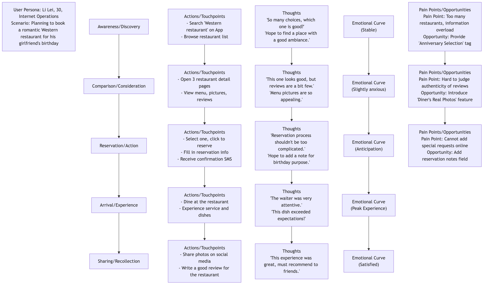
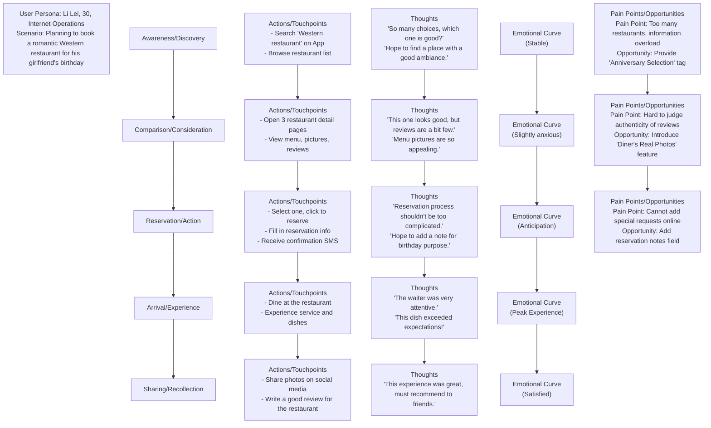

# User Journey Map

When we design a product or service, it's easy to get caught up in isolated thinking about individual features or interfaces, overlooking the complete, end-to-end experience of users interacting with us. The **User Journey Map** is a powerful visualization tool born to break this "tunnel vision." It systematically depicts, in a storytelling manner, the **complete process** of a specific **User Persona** interacting with your product, service, or brand to achieve a **specific goal**. It not only records the user's **behavioral steps** at each stage but, more importantly, profoundly reveals the user's **thoughts, feelings, and pain points** throughout the entire process.

The core value of a user journey map lies in forcing us to examine and experience the services we provide from the **user's perspective**. It transforms an originally fragmented, invisible experience into a clear, intuitive, and empathetic visual map. Through this map, the team can easily identify highs and lows in the experience, find key obstacles leading to user churn, and discover innovative opportunities to enhance user satisfaction and loyalty. It is a bridge connecting the product to the user's true emotional world.

## Core Components of a User Journey Map

A standard user journey map typically resembles a horizontal swimlane diagram and includes the following core components:

1.  **User Persona**: Who is the protagonist of this journey map? At the beginning of the map, it must clearly define which core user persona this map is about. Different users may have vastly different journeys.
2.  **Scenario & Goals**: What specific scenario is this user in? What goal does he/she hope to achieve through this journey? For example, "A busy office worker (Persona) hopes to book a weekend dinner at a romantic Western restaurant for his girlfriend's birthday (Goal) on the subway ride home from work (Scenario)."
3.  **Journey Phases / Stages**: Break down the entire end-to-end journey into several main, logically continuous stages. For example, for an e-commerce shopping journey, stages might include: **Awareness -> Consideration -> Purchase -> Waiting -> Receipt -> Usage/After-sales**.
4.  **Actions / Touchpoints**: What exactly does the user do at each stage? Through which channels or touchpoints (e.g., social media, App, customer service phone, physical store) do they interact with you?
5.  **Thoughts**: What is on the user's mind while doing these things? What questions, expectations, or internal monologues do they have?
6.  **Feelings / Emotions**: This is the soul of the journey map. Use an emotional curve to depict the user's emotional fluctuations at each stage – are they feeling pleased, confused, anxious, or frustrated? This helps us quickly pinpoint "pain points" and "delight points" in the experience.
7.  **Pain Points & Opportunities**: Based on the above analysis, clearly identify the key obstacles causing negative user emotions (pain points) at each stage, and brainstorm corresponding improvement opportunities based on these.

### User Journey Map Template

<!--

-->

## How to Create a User Journey Map

1.  **Step One: Define Objectives and Scope**
    First, clarify why we are creating this journey map. What problem do we hope to solve? Then, determine the **user persona** and **specific scenario** that this map will depict.

2.  **Step Two: Collect User Data**
    The journey map must be based on real user research, not the team's imagination. Data sources can include: user interviews, usability tests, surveys, customer support records, website analytics data, social media comments, etc.

3.  **Step Three: Organize a Workshop, Co-create the Journey Map**
    Gather a cross-functional team (including product, design, R&D, marketing, customer service, etc.), and bring all collected user insights (which can be in the form of sticky notes) to the meeting room. Together, the team will collaboratively sort out and define each stage of the journey, as well as the user's behaviors, thoughts, and feelings at each stage, in a storytelling manner.

4.  **Step Four: Draw the Emotional Curve, Identify Key Moments**
    Jointly draw the user's emotional curve, identifying the **Moments of Truth** that determine the success or failure of the user experience, especially the lowest points of emotion (pain points) and the highest peaks (delight points).

5.  **Step Five: Discover Opportunities and Determine Action Plan**
    For each identified key pain point, brainstorm and propose specific, feasible improvement opportunities. Finally, prioritize these opportunities and translate them into concrete product backlog items or action plans.

## Application Cases

**Case 1: Improving Airport Passenger Experience**

*   **Scenario**: An airport management company hopes to enhance overall passenger satisfaction.
*   **Application**: They mapped the user journey of "first-time international travelers departing from this airport." Through analysis, they found that the biggest pain points occurred during the "security check" and "finding the boarding gate" stages, where passengers generally felt anxious and confused. Based on this, the airport added clearer directional signs, introduced smart security lanes to reduce queuing time, and added real-time navigation for boarding gate locations in the App, significantly improving the passenger experience.

**Case 2: Optimizing Online Course Completion Rates**

*   **Scenario**: An online education platform found that many users purchased courses but abandoned learning midway.
*   **Application**: By mapping the journey of "an in-service student learning a programming course," they found that students' emotions would hit rock bottom around the third week of the course, as the course difficulty increased at this point, and students were prone to disrupting their study rhythm due to busy work. To address this pain point, the platform designed intervention measures such as "homeroom teacher supervision service," "study groups," and "pushing encouraging badges in the third week," which significantly improved the course completion rate.

**Case 3: Improving a Bank's Account Opening Process**

*   **Scenario**: A traditional bank hopes to optimize its online new user account opening process.
*   **Application**: The journey map showed that users felt very impatient and distrustful during the "uploading identity proof" and "reading lengthy user agreements" steps, leading to a large number of user drop-offs. To this end, the bank simplified the agreement content and developed a convenient function to directly read ID card information via NFC, which greatly improved the smoothness and conversion rate of the entire account opening process.

## Advantages and Challenges of User Journey Maps

**Core Advantages**

*   **Establish a Global Perspective**: Helps the team break down departmental silos and functional isolation, examining the user experience from a holistic, coherent perspective.
*   **Powerful Empathy Tool**: Allows team members, especially engineers and managers, to intuitively feel the user's true emotions and pain points.
*   **Effectively Identify Problems and Opportunities**: Clearly exposes breakpoints and obstacles in existing processes and provides a clear focus for innovation.
*   **Promote Team Collaboration and Consensus**: The process of co-creating a journey map is itself an excellent team activity that allows all stakeholders to align user understanding and reach consensus.

**Potential Challenges**

*   **Representativeness Issues**: A single journey map usually represents only one user persona and one scenario, requiring multiple maps to cover a wider range of user groups.
*   **Based on Real Research**: If there is a lack of real, in-depth user research as a foundation, the journey map may become a wishful "fantasy map."
*   **Requires Continuous Updates**: As products and services iterate, user journeys also change, and journey maps need to be treated as "living documents" and updated regularly.

## Extensions and Connections

*   **User Persona**: Is the **prerequisite** for creating a user journey map. Without a clear user persona, the journey map loses its protagonist.
*   **Service Blueprint**: Can be seen as the "backstage view" of the user journey map. While the journey map depicts the user's front-stage experience, the service blueprint extends further downward, detailing how backend personnel, systems, and processes operate and interact to support these front-stage experiences.
*   **Empathy Map**: This is a tool more focused on deeply exploring the inner world of a single user, often used for material collection and empathy exercises in the early stages of creating user personas and journey maps.

---
*Reference: The user journey map, as a core tool in the field of User Experience (UX) design, its concepts and practices are constantly evolving. Jesse James Garrett, co-founder of Adaptive Path, laid the theoretical foundation in his book "The Elements of User Experience." Authoritative organizations such as Nielsen Norman Group (NN/g) have extensive practical guides and articles on how to create and use user journey maps.*