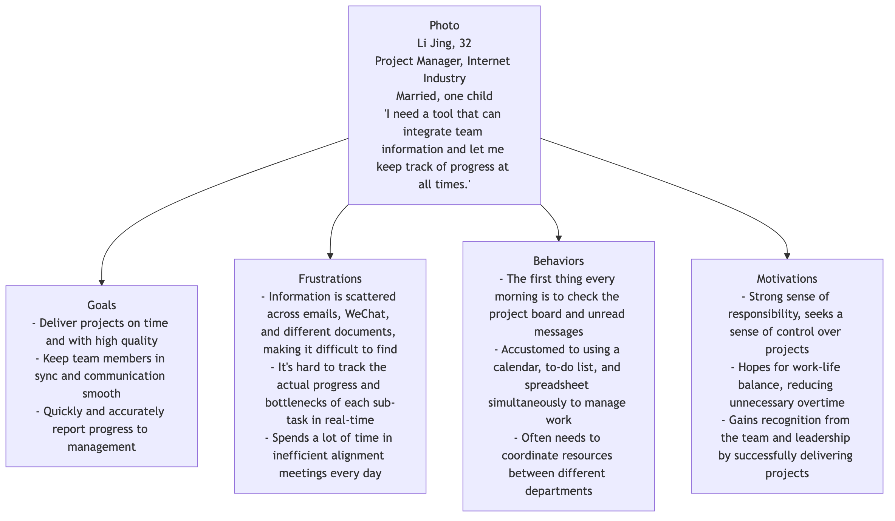

# User Persona

In any user-centered design process, a recurring core challenge is: who exactly are we designing for? If team members have a vague, one-sided, or even contradictory understanding of the target users, product decisions can easily go astray. The **User Persona** is a powerful tool to solve this problem. It is not a simple user description, but a credible, fictional character model representing a specific user group, meticulously constructed based on real user research data.

The fundamental purpose of a user persona is to transform abstract, cold user data into a "specific person" with a name, a face, a story, and emotions. This allows the design team to truly "walk in the user's world" and make more insightful design decisions based on empathy.

## Components of a User Persona

A detailed and empathetic user persona typically includes the following key parts, which together paint a multi-dimensional character.

*   **Basic Information & Photo**: Give the persona a real name, a believable photo, and basic demographic information such as age, occupation, and location. This greatly enhances the persona's sense of reality and relatability.
*   **Quote**: Use a sentence that this fictional character might say to highly summarize their core needs or attitude. For example, "I need a tool that can integrate team information and let me keep track of progress at all times."
*   **Goals**: This is the core of the persona. It describes the primary goals the user group most wants to achieve when using the product or service. Goals should be about the user themselves, not about product features.
*   **Frustrations/Pain Points**: Describes the main obstacles, confusion, and frustrations the user currently faces in achieving their goals. The core value of a product often lies in its ability to effectively solve these pain points.
*   **Behaviors**: Depicts the user's daily behavior patterns, especially in scenarios related to the product. How do they work? What tools do they rely on? What are their information acquisition channels? This helps to understand the product's application context.
*   **Motivations**: Explores the deep psychological factors that drive user behavior. It could be the pursuit of efficiency, the desire for security, the need for social recognition, or the aspiration for personal growth.

### User Persona Template

Below is a typical user persona structure, which can be adjusted according to the specific project.



<!--
```mermaid
graph TD
    subgraph Persona: Li Jing (Project Manager)
        direction LR
        subgraph Basic Info
            A["<b>Photo</b><br/>"]
            B["<b>Li Jing, 32</b><br/>Project Manager, Internet Industry<br/>Married, one child<br/><i>“I need a tool that can integrate team information and let me keep track of progress at all times.”</i>"]
        end
        subgraph Core Characteristics
            C["<b>Goals</b><br/>- Deliver projects on time and with high quality<br/>- Keep team members in sync and communication smooth<br/>- Quickly and accurately report progress to management"]
            D["<b>Frustrations</b><br/>- Information is scattered across emails, WeChat, and different documents, making it difficult to find<br/>- It's hard to track the actual progress and bottlenecks of each sub-task in real-time<br/>- Spends a lot of time in inefficient alignment meetings every day"]
            E["<b>Behaviors</b><br/>- The first thing every morning is to check the project board and unread messages<br/>- Accustomed to using a calendar, to-do list, and spreadsheet simultaneously to manage work<br/>- Often needs to coordinate resources between different departments"]
            F["<b>Motivations</b><br/>- Strong sense of responsibility, seeks a sense of control over projects<br/>- Hopes for work-life balance, reducing unnecessary overtime<br/>- Gains recognition from the team and leadership by successfully delivering projects"]
        end
    end
```
-->

## How to Create Effective User Personas

Creating user personas is a research process that moves from divergence to convergence, and is by no means a product of guesswork.

1.  **Conduct User Research**
    This is the foundation of the entire process. You need to collect first-hand information about real users through qualitative methods (such as in-depth interviews, field studies) and quantitative methods (such as surveys, product backend data analysis).

2.  **Identify Key Behavioral Variables**
    In the collected data, look for key behavioral variables that can distinguish different user groups. For example, for an e-commerce website, a user's "shopping frequency," "price sensitivity," and "brand loyalty" are all possible variables.

3.  **Cluster and Determine the Number of Personas**
    Based on key variables, cluster users with similar behaviors and goals into different user groups. Typically, it is appropriate for a product to select 3-5 core user groups to create corresponding user personas. Too many personas will cause the team to lose focus.

4.  **Write the Persona Story**
    Create a representative fictional character for each user group. Give them a name, a photo, and a vivid story, filling the various modules of the persona template with research data and insights to make it come alive.

5.  **Promote and Apply within the Team**
    The value of user personas lies in their use. Print out the final personas, post them in the team's workspace, and frequently refer to them in product meetings, design reviews, and feature discussions ("How would Li Jing use this feature??"). Make them a common language and a touchstone for decision-making.

## User Personas in Practice

**Case 1: A Language Learning App**

*   **Persona**: "Commuter Learner" Sun Yu, 28, marketing specialist. He wants to use fragmented time on the subway during his daily commute to learn English.
*   **Pain Points**: The subway environment is noisy with an unstable network signal, making it difficult to engage in learning that requires high concentration or speaking/listening practice.
*   **Design Decision**: Based on this persona, the app should prioritize developing features like "offline course download," "5-minute bite-sized knowledge points," and "a learning mode focused on reading and vocabulary."

**Case 2: A Family Recipe App**

*   **Persona**: "New Mom" Chen Jie, 30. She needs to prepare healthy, nutritious, and simple dinners for her family (especially with a young child).
*   **Pain Points**: Busy with work, she doesn't have much time to study complex recipes, and is very concerned about food safety and nutritional balance.
*   **Design Decision**: The app's homepage should highlight sections like "30-Minute Quick Meals," "Kids' Nutritional Meals," and "Seasonal Vegetables," and clearly mark preparation time, cooking difficulty, and nutritional information in the recipes.

**Case 3: A Financial Management Software**

*   **Persona**: "Frugal Planner" Uncle Wang, 55, about to retire. He wants to clearly understand his financial situation and make stable plans for his retirement life.
*   **Pain Points**: Feels confused and distrustful of complex financial jargon and high-risk investments, and finds many financial apps too complicated to operate.
*   **Design Decision**: The software's interface design should be extremely simple and clear, using easy-to-understand language, and highlighting features like "Asset Overview," "Monthly Fixed Income/Expenses," and "Low-Risk Investment Recommendations."

## Value and Challenges of User Personas

**Core Value**


*   **Build Empathy**: It is the best tool for pulling designers and engineers out of their own perspective and into the user's context.
*   **Unify Decision-Making Language**: Provides an objective, user-centered arbitration standard for the team when facing disagreements.
*   **Focus on Core Needs**: Helps the team identify truly important features and prioritize them among a myriad of complex requirements.

**Potential Challenges**


*   **Research Cost**: Creating high-quality user personas requires investment in real user research, which takes time and budget.
*   **Risk of "Stereotyping"**: If research is insufficient or understanding is one-sided, it may lead to the creation of incorrect, stereotyped personas, thus misleading the product direction.
*   **Timeliness**: Users and the market are constantly changing, and user personas also need to be regularly reviewed and updated, otherwise they become "living fossils."

## Extensions and Connections

User personas are a core part of the UX design toolkit and are often closely integrated with other methods:
*   **User Journey Map**: After determining "who" (the user persona), the user journey map details the entire process of this person interacting with the product to achieve their goal.
*   **Empathy Map**: This is a tool that focuses more on deeply exploring the user's sensory and emotional experiences, often used for material collection and empathy exercises in the early stages of creating user personas.

---
*Reference: Alan Cooper first introduced the User Persona as a formal design method in the software development field in his pioneering book "About Face: The Essentials of Interaction Design."*