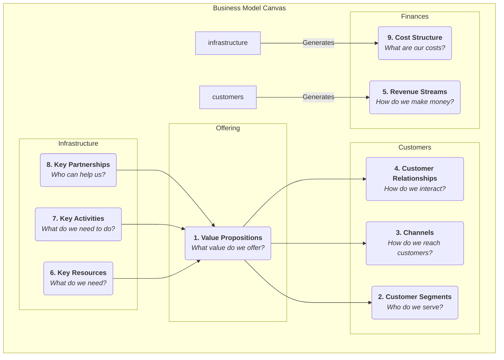

# Business Model Canvas

A business idea, no matter how exciting, if it cannot be transformed into a viable, sustainably profitable system, will remain a castle in the air. The **Business Model Canvas** is a revolutionary strategic management and entrepreneurial tool proposed by Alexander Osterwalder and Yves Pigneur. It provides a concise, intuitive "common language" that allows teams to clearly describe, design, evaluate, and iterate all core elements of a business model on a single chart.

The charm of the Business Model Canvas lies in its ability to deconstruct a complex, dynamic business system into nine interconnected, logically clear building blocks. These nine building blocks cover four main areas of business: **customers, product/service, infrastructure, and financial viability**. By systematically presenting these building blocks on a single canvas, entrepreneurs and managers can get a bird's-eye view of the entire business model, identify its key drivers, potential risks, and innovation opportunities, thereby facilitating deeper strategic dialogue and more agile decision-making.

## The Nine Building Blocks of the Canvas

The core of the Business Model Canvas is a template with nine boxes, each representing a key aspect of the business model.

<!--

<!--

-->
-->

1.  **Value Propositions**: This is the core of the canvas. It describes the value you create for specific customer segments, what pain points you solve for them, or what needs you satisfy. It should be unique and distinctive.
2.  **Customer Segments**: For whom are you creating value? Who are your most important customers? Here, one or more target customer groups can be defined.
3.  **Channels**: Through which touchpoints do you communicate with your customers and deliver your value proposition? This includes channels for awareness, evaluation, purchase, delivery, and after-sales service.
4.  **Customer Relationships**: What type of relationship do you want to establish and maintain with each customer segment? Is it automated, personalized, or community-based?
5.  **Revenue Streams**: How do you generate revenue from customers after successfully delivering value? Is it through one-time sales, subscription fees, leasing fees, or advertising fees?
6.  **Key Resources**: The most important assets you must possess to deliver your value proposition, reach customers, and maintain relationships. These can be physical assets, intellectual property, human, or financial resources.
7.  **Key Activities**: The most important activities you must perform for your business model to operate effectively. For example, for a software company, it's "software development"; for a consulting firm, it's "problem-solving."
8.  **Key Partnerships**: The network of suppliers and partners you need to collaborate with to optimize your business model, reduce risks, or acquire resources.
9.  **Cost Structure**: All costs incurred to operate a business model, including fixed and variable costs.

## How to Use the Business Model Canvas

1.  **Print a Large Canvas**
    Print the canvas on a large poster, and prepare plenty of sticky notes and markers. The physical nature of the canvas is crucial for team collaboration and discussion.

2.  **From Right to Left, Customers First, Then Infrastructure**
    A recommended filling order is to start from the right side of the canvas (customer side), then move to the value proposition in the middle, and finally to the infrastructure side. That is: **Customer Segments -> Value Propositions -> Channels -> Customer Relationships -> Revenue Streams**. This ensures your business model is always customer-centric.

3.  **Brainstorm with Sticky Notes**
    For each building block, team members write their ideas on sticky notes and place them in the corresponding box. The advantage of using sticky notes is that ideas can be easily moved, modified, and replaced.

4.  **Connect and Tell a Story**
    When the canvas is filled, try to tell your business model "story." Start with your target customers (CS), describe how you serve them through your value proposition (VP) and channels (CH), and ultimately generate revenue (R). Then, explain what resources (KR), activities (KA), and partners (KP) you need to achieve all this, and what costs (C) they will incur. Check if the logic of the story is smooth and if the various modules match.

5.  **Evaluate and Iterate**
    Evaluate the business model on the canvas. What are its strengths? What are its weaknesses and risks? Then, by moving or replacing sticky notes, explore different possibilities and design a better business model.

## Application Cases

**Case 1: Nespresso Capsule Coffee Machine**

*   **Customer Segments**: Home and office users who seek quality and convenience.
*   **Value Proposition**: Easily and quickly make a cafe-quality espresso at home.
*   **Channels**: Direct sales through official website, high-end department store counters, and its own boutiques.
*   **Customer Relationships**: Establish the Nespresso Club, providing member services and exclusive experiences.
*   **Revenue Streams**: Adopts the "razor and blade" model. The coffee machine (razor) itself has low profit, mainly earning revenue by continuously selling high-profit, patent-protected coffee capsules (blades).
*   **Key Resources**: Strong brand, patented technology (capsule system), production facilities.
*   **Key Activities**: Marketing, supply chain management, product R&D.
*   **Key Partnerships**: Coffee machine manufacturers, coffee farmers.
*   **Cost Structure**: High marketing and brand building costs, production costs.

**Case 2: Airbnb**

*   **Customer Segments**: Two-sided platform, with **hosts** who have spare rooms on one side, and **travelers** seeking unique, localized accommodation experiences on the other.
*   **Value Proposition**: Provides hosts with an easy way to earn money; offers travelers cheaper, more local accommodation options than hotels.
*   **Channels**: Website and mobile app.
*   **Customer Relationships**: Builds a trust-based community, maintaining relationships through review systems and user support.
*   **Revenue Streams**: Charges a percentage commission from both hosts and guests.
*   **Key Resources**: The platform itself, a vast network of users and listings, brand.
*   **Key Activities**: Platform development and maintenance, community operations, marketing.
*   **Key Partnerships**: Photographers (for listing photos), payment platforms, insurance companies.
*   **Cost Structure**: Platform maintenance costs, marketing costs, customer service costs.

**Case 3: Free Mobile Games (e.g., Honor of Kings)**

*   **Customer Segments**: Broad base of gamers (free users) and a small number of **paying players** willing to pay for value-added services.
*   **Value Proposition**: Provides a high-quality, free competitive entertainment experience.
*   **Channels**: App stores (App Store, Google Play).
*   **Customer Relationships**: Maintains community activity through in-game social systems, events, and esports tournaments.
*   **Revenue Streams**: Primarily generates revenue by selling virtual items that do not affect game balance (e.g., hero skins, decorations) to paying players (freemium model).
*   **Key Resources**: Game IP, development team, large user base.
*   **Key Activities**: Game development and updates, community operations, esports event organization.
*   **Key Partnerships**: App store channels, esports clubs, live streaming platforms.
*   **Cost Structure**: High R&D and server costs, marketing expenses.

## Value and Limitations of the Business Model Canvas

**Core Value**

*   **Intuitive and Holistic**: Visualizes complex business logic, helping teams gain a holistic view.
*   **Promotes Communication and Consensus**: Provides a common language, greatly facilitating strategic dialogue within the team.
*   **Agile and Iterative**: Very suitable for exploring and iterating new business models, especially in the uncertain early stages.

**Potential Limitations**

*   **Ignores Competition**: The canvas itself does not have a dedicated module for analyzing the competitive environment.
*   **Static Snapshot**: It depicts the structure of the business model but does not fully show its dynamic evolution.
*   **Needs to Be Combined with Other Tools**: To make more robust decisions, it usually needs to be combined with other tools like the Value Proposition Canvas and SWOT analysis.

## Extensions and Connections

*   **Lean Canvas**: A variation of the Business Model Canvas, more suitable for early-stage startup projects with high uncertainty. It replaces "Key Partnerships," "Key Activities," "Key Resources," and "Customer Relationships" with modules that focus more on problems and solutions.
*   **Value Proposition Canvas**: Can be seen as an amplification and deepening of the "Value Propositions" and "Customer Segments" modules in the Business Model Canvas, helping you refine the product-market fit more precisely.
*   **Blue Ocean Strategy**: After conceiving a new value curve using the Four Actions Framework of Blue Ocean Strategy, the Business Model Canvas can be used to systematically design the business model that supports this new strategy.

---
*Reference: Alexander Osterwalter and Yves Pigneur's book "Business Model Generation" is the authoritative guide to this tool, containing numerous case studies and detailed usage instructions.*