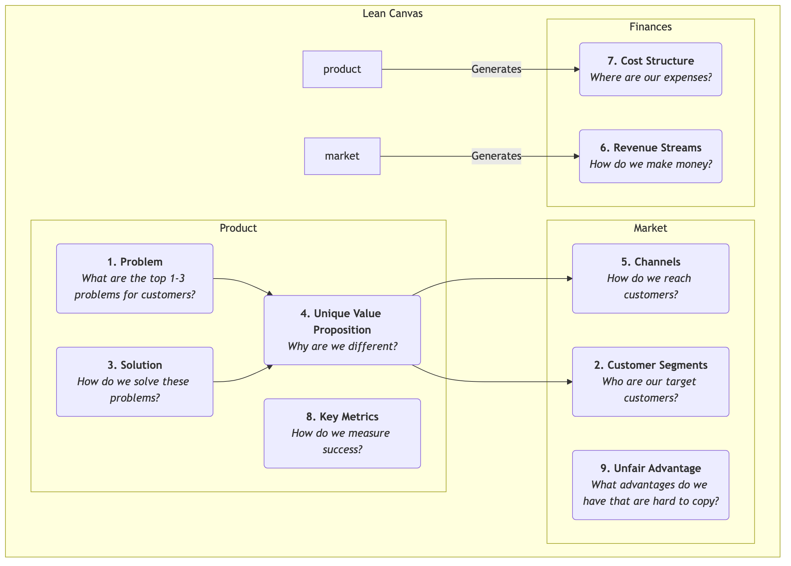
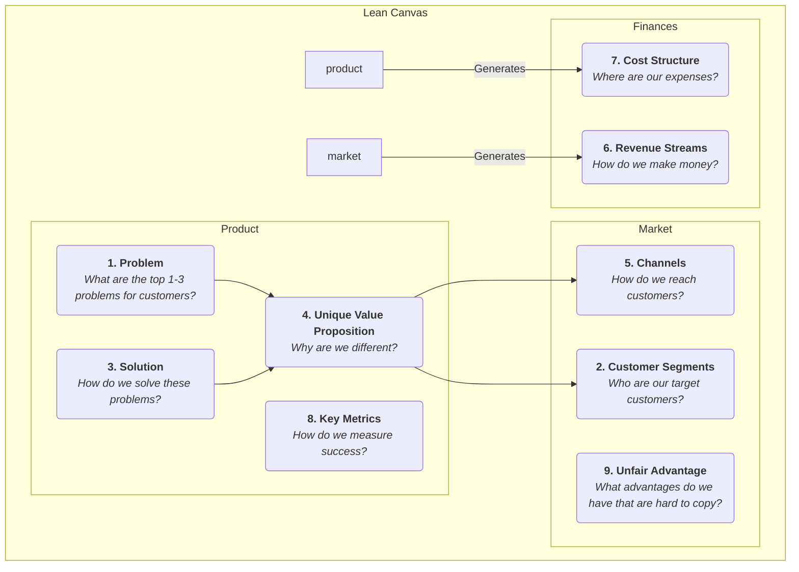

# Lean Canvas

In the early stages of a startup, the biggest risk is often not "can we build the product?" but "will anyone actually want the product we build?" Traditional business plans and business model canvases are excellent tools for mature companies, but for startups operating in high uncertainty, they can be overly complex and not sufficiently focused on the most critical risks. **Lean Canvas** was created to solve this problem; it is a brilliant adaptation of the Business Model Canvas, tailored specifically for **early-stage entrepreneurs**.

Lean Canvas, proposed by Ash Maurya in his book *Running Lean*, inherits the simplicity and intuitiveness of the Business Model Canvas but shifts the focus from a "complete description of the business model" to **"systematically identifying and validating the highest-risk startup hypotheses."** It centers around **Problem-Solution** and adds attention to key metrics and competitive advantages, more deeply embodying the "build-measure-learn" cycle of Lean Startup. It is a risk-oriented battle map guiding entrepreneurs through the fog.

## The Nine Blocks of Lean Canvas

Lean Canvas retains the nine blocks of the Business Model Canvas but replaces four of them to make it more actionable and risk-oriented.

<!--

<!--

-->
-->

**Differences from Business Model Canvas:**

*   **Problem** replaces "Key Partners": This is the most important change. It forces entrepreneurs to first clearly define the top 1-3 problems their target customers urgently need to solve.
*   **Solution** replaces "Key Activities": After defining the problem, you then propose your solution (usually the core features of the product) specifically for it.
*   **Key Metrics** replaces "Key Resources": For a startup, the most important thing is not what resources it possesses, but how to measure the health and growth of the business. Key metrics are the baton that drives all actions.
*   **Unfair Advantage** replaces "Customer Relationships": This is also known as "unfair advantage" or "moat," referring to core competencies that cannot be easily copied or bought by competitors. This is crucial for the long-term survival of the business model.

## How to Use Lean Canvas

The process of using Lean Canvas is a continuous cycle of validation and iteration.

1.  **Draw Your "Plan A" Canvas**
    Before talking to any customers, quickly fill out a Lean Canvas with all your initial ideas and hypotheses for the startup project. This usually takes only 15-20 minutes. This is your "Plan A," a collection of all your hypotheses to be validated.

2.  **Identify the Highest-Risk Hypotheses**
    Review your first version of the canvas and identify the parts with the highest risk and uncertainty. Typically, for a new project, the highest-risk hypotheses in order are:
    *   **Problem-Customer Hypothesis**: Does this problem truly exist? Are these people really your target customers?
    *   **Problem-Solution Hypothesis**: Can your solution truly solve their problem?
    *   **Pricing-Value Proposition Hypothesis**: Are customers willing to pay for your solution?

3.  **Systematically Validate Hypotheses**
    Design and execute a series of "minimum viable experiments" (usually **problem interviews** and **solution interviews**) to systematically validate your high-risk hypotheses. For example:
    *   **Conduct Problem Interviews**: Go out and talk to your target customers, but don't talk about your product. Your sole purpose is to deeply understand their problems, existing behaviors, and pain points to validate the "Problem" and "Customer Segments" blocks on the canvas.
    *   **Conduct Solution Interviews**: After validating that the problem indeed exists, show your solution (which can be a prototype, a demo) to customers to validate your "Solution" and "Value Proposition," and test their willingness to pay ("Revenue Streams").

4.  **Iterate Your Canvas**
    Continuously update and iterate your Lean Canvas based on the insights gained from interviews and experiments. Some hypotheses are validated, others are disproven. The canvas is like an experimental notebook, recording the complete evolutionary path of your startup project from its initial conception to finding "product-market fit."

## Application Cases

**Case 1: Dropbox (Cloud Storage Service) Early Canvas**

*   **Problem**: Syncing files across multiple devices is cumbersome; sending large files via USB drives or email is painful; forgetting to back up leads to data loss.
*   **Customer Segments**: Tech enthusiasts with multiple computers, freelancers.
*   **Unique Value Proposition**: "Put your files in a 'magic pocket', accessible anywhere, never lost."
*   **Solution**: A desktop application that runs seamlessly in the background, automatically syncing the contents of a designated folder.
*   **Key Metrics**: Number of user registrations, **file upload success rate**, number of active users.
*   **Unfair Advantage**: Network effect – the more people use it, the easier it is to share and collaborate.
*   **Validation**: Founder Drew Houston created a simple product demo video and posted it in a tech enthusiast community. Overnight, the waiting list surged from 5,000 to 75,000 people, strongly validating the "problem-solution" fit.

**Case 2: A Planned "Healthy Meal Delivery" Service**

*   **Problem**: Office workers find it hard to eat healthy, balanced lunches; preparing meals themselves is too time-consuming; takeout is generally greasy.
*   **Customer Segments**: Health-conscious young professionals with fitness habits.
*   **Unique Value Proposition**: "Nutritionist-designed, freshly prepared fitness meals, delivered on time to your office."
*   **Solution**: Offer weekly lunch meal plans, with menus updated weekly, and calorie and nutritional information provided.
*   **Key Metrics**: **Weekly repurchase rate**, customer lifetime value.
*   **Unfair Advantage**: Exclusive partnerships with high-quality ingredient suppliers, professional nutritionist team.
*   **Validation**: The founder could initially avoid developing an app and instead accept orders through a WeChat group or survey platform, manually delivering lunches to the first 20 users to validate the entire process and user needs.

**Case 3: Airbnb's Early Canvas**

*   **Problem**: During popular conferences, city hotels are expensive and fully booked.
*   **Customer Segments**: Designers attending design conferences with limited budgets.
*   **Solution**: Provide a platform for local residents (hosts) to rent out their spare air mattresses to these designers.
*   **Unique Value Proposition**: Get accommodation at a lower price and have the opportunity to interact with locals.
*   **Validation**: The founders themselves put three air mattresses in their home and successfully rented them out to designers attending the conference, personally validating the feasibility of the entire business model.

## Value and Limitations of Lean Canvas

**Core Value**

*   **Risk Focus**: Forces entrepreneurs to confront the highest-risk hypotheses from the outset.
*   **Speed and Iteration**: Very suitable for quickly sketching, discussing, and iterating business models, perfectly fitting the Lean Startup rhythm.
*   **Problem-Centric**: Ensures that the starting point of the venture is to solve a real, valuable customer problem.

**Potential Limitations**

*   **Insufficient Attention to External Environment**: Like the Business Model Canvas, it does not inherently include analysis of competition and the macro-environment.
*   **Not Applicable to All Businesses**: It is most suitable for high-uncertainty startups. For mature companies with validated business models, the Business Model Canvas might be a more comprehensive tool.

## Extensions and Connections

*   **Business Model Canvas**: Lean Canvas is an important variation and development of the Business Model Canvas in the context of Lean Startup.
*   **Customer Development**: A methodology proposed by Steve Blank, emphasizing "getting out of the building" to validate hypotheses, which serves as a guiding principle for Lean Canvas at the action level.
*   **Value Proposition Canvas**: Can serve as a deepening tool for the "Problem," "Solution," and "Unique Value Proposition" blocks in Lean Canvas, helping entrepreneurs refine the product-market fit more precisely.

---
*Reference: Ash Maurya's "Running Lean" is the most authoritative source for Lean Canvas, detailing how to use and iterate the Lean Canvas step-by-step in conjunction with customer development. This method is deeply influenced by Eric Ries's "The Lean Startup" and Steve Blank's Customer Development model.*