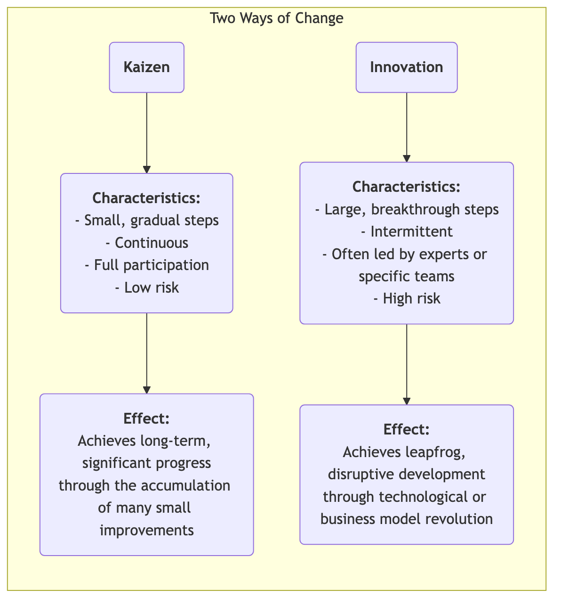
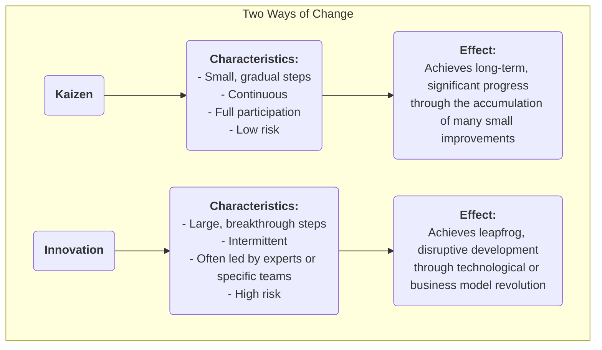

# Kaizen

In many organizations, "improvement" is often seen as a major "project" requiring significant investment, led by experts, and driven top-down. However, there is a management philosophy that believes true, powerful, and lasting progress comes from the seemingly insignificant **small and continuous improvements** made every day by every employee. This is the essence of **Kaizen**. Kaizen is a Japanese word meaning "change for the better," and it is both a cultural philosophy pursuing perfection and a practical method that encourages full participation and bottom-up continuous improvement.

The core idea of Kaizen is **not to seek revolutionary breakthroughs overnight, but to pursue endless gradual optimization**. It believes that frontline employees are the experts who best understand the actual situation in their positions, and they possess infinite wisdom and creativity. By establishing a culture that encourages problem-solving, rewards small innovations, and tolerates failure, organizations can harness the power of everyone, forming an unstoppable, continuously upward momentum. It is not a complex management tool, but a simple, unpretentious, yet profoundly effective way of working and thinking.

## Core Principles of Kaizen

*   **Continual**: Kaizen is not a one-time activity, but an unending, cumulative process.
*   **Everybody**: From the CEO to the frontline cleaner, everyone in the organization is encouraged and expected to participate in improvement activities.
*   **Low Cost, High Wisdom**: Kaizen does not rely on huge capital investment but emphasizes using employees' wisdom and creativity to solve problems and eliminate waste at low cost.
*   **Process-Focus**: The focus of Kaizen is to optimize work processes, not to blame individuals.
*   **Visual Management**: Emphasizes making problems, standards, and processes "visual" so that abnormalities are clear at a glance.
*   **"Go to the Gemba"**: Managers must go to the actual workplace (Gemba) to observe real situations and talk to employees, rather than imagining things from the office.

### Kaizen vs. Innovation

<!--

<!--

-->
-->
*   **Relationship**: Kaizen and innovation are not mutually exclusive; rather, they are two capabilities that an excellent organization must possess simultaneously. Kaizen is responsible for continuously optimizing and consolidating existing systems, while innovation is responsible for creating entirely new systems.

## How to Practice Kaizen in an Organization

The key to practicing Kaizen is to create a culture and mechanism that encourages continuous improvement.

1.  **Establish a Kaizen Suggestion System**
    Set up a simple, convenient channel (e.g., suggestion box, online form) so that any employee can submit problems or improvement suggestions at any time. It is important to respond to and track every suggestion, and to provide timely, public recognition for excellent suggestions that are adopted (rewards don't have to be material; public praise, a certificate, etc., are often more effective spiritual incentives).

2.  **Conduct "Kaizen Weeks" or "Kaizen Blitzes"**
    Regularly organize cross-functional teams to focus on a specific process or work area for a concentrated period (usually 3-5 days), using lean and quality tools (e.g., value stream mapping, 5S) to conduct a rapid, high-intensity improvement storm, and immediately implement solutions.

3.  **Promote the PDCA Cycle as a Thinking Tool**
    Make the **PDCA (Plan-Do-Check-Act) cycle** the standard thinking framework for all employees to solve problems. Encourage employees to follow this scientific cycle:
    *   **P**lan: Identify the problem, analyze the cause, and develop a small improvement plan.
    *   **D**o: Attempt to execute the plan.
    *   **C**heck: Verify whether the results of the experiment met expectations.
    *   **A**ct: If successful, standardize it as a new process; if unsuccessful, learn from it and start a new PDCA cycle.

4.  **Shift in Manager's Role**
    In a Kaizen culture, the manager's role shifts from "commander" and "supervisor" to "**coach**" and "**supporter**." Their main tasks are: inspiring and encouraging employees to identify problems, providing resources and support for employees' improvement activities, and helping them remove obstacles.

## Application Cases

**Case 1: Toyota's "One-Centimeter Improvement"**

*   **Scenario**: On Toyota's production line, Kaizen is part of its DNA.
*   **Application**: A production line worker noticed that every time he picked up a screw from the parts bin, his wrist had to make a small but unnatural twisting motion. He suggested tilting the parts bin by 15 degrees. This seemingly insignificant improvement saved him a few seconds each day and reduced the risk of wrist injury. When this "one-centimeter improvement" was extended to thousands of workstations across the company, the accumulated time savings and improved safety were astonishing.

**Case 2: A Hospital Nurses' Station**

*   **Problem**: Nurses complained about spending a lot of time each day searching for commonly used medical supplies (e.g., gauze, tape).
*   **Kaizen Application**: The head nurse organized a small Kaizen activity. Team members used the **5S methodology** to thoroughly **Sort** (discard unnecessary items), **Set in Order** (place frequently used items in easily accessible locations and label them clearly), **Shine**, **Standardize**, and **Sustain** the nurses' station cabinets. This activity took only one afternoon but significantly reduced the nurses' search time, allowing them to dedicate more energy to direct patient care.

**Case 3: Application in Personal Life**

*   **Problem**: A person always forgets to take their keys when leaving the house.
*   **Kaizen Application**: Instead of blaming himself for "poor memory," he thought about how to **improve the process**. He decided to place all items he needed to take the next day (keys, wallet, work ID) on the shoe cabinet by the door the night before. This small habit change is a typical personal Kaizen, solving the problem fundamentally by optimizing the process.

## Advantages and Challenges of Kaizen

**Core Advantages**

*   **Low cost, low risk**: Most improvements come from the wisdom of frontline employees, requiring almost no additional investment, and the cost of trial and error is extremely low.
*   **Enhances employee engagement and belonging**: When employees' suggestions are heard and adopted, they feel respected and transform from "passive executors" to "active thinkers."
*   **Promotes teamwork**: Many Kaizen activities require cross-functional and cross-departmental collaboration, helping to break down departmental silos.
*   **Forms strong cultural inertia**: Once a culture of continuous improvement is established, the organization gains a powerful internal drive for self-evolution and continuous development.

**Potential Challenges**

*   **Slow to show results, not easily noticeable**: Compared to radical "innovation," the effects of Kaizen are gradual and cumulative, and may not be obvious in the short term, requiring managers to have sufficient patience and a long-term vision.
*   **Requires genuine full participation**: If it remains just a slogan, or only a few people participate, Kaizen activities cannot be sustained.
*   **May fall into "local optimum"**: Over-focusing on small improvements to existing processes can sometimes overlook larger opportunities for disruptive, revolutionary innovation.

## Extensions and Connections

*   **Lean Operations**: Kaizen is one of the core pillars of lean thinking and the fundamental way to achieve the principle of "pursuing perfection."
*   **Total Quality Management (TQM)**: Kaizen is the most direct and vivid embodiment of the "continuous improvement" principle in TQM.
*   **PDCA Cycle**: It is the most commonly used and fundamental scientific thinking and action framework when practicing Kaizen.

---
*Source Reference: Kaizen, as a management philosophy, is deeply rooted in Japanese culture and management practices, especially popularized in the Toyota Production System (TPS). Masaaki Imai's book "Kaizen: The Key to Japan's Competitive Success" first systematically introduced this concept to the Western world, with profound influence.*