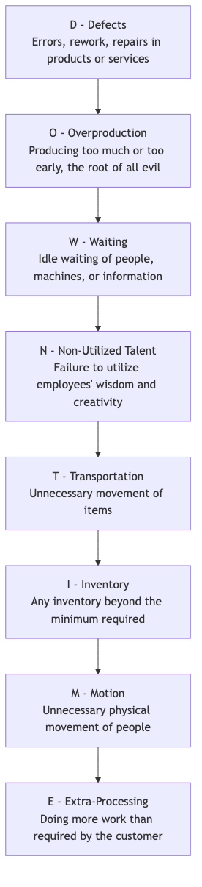
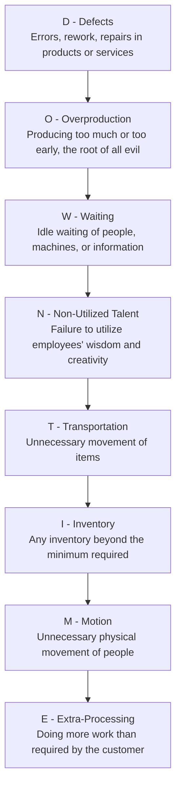

# Lean Operations

Imagine a smooth, unimpeded river flowing effortlessly, delivering the source of value directly to the customer with minimal consumption and maximum speed. This is the ideal state that **Lean Operations** strives for. Lean Operations, often referred to as **Lean Production** or **Lean Thinking**, is both a powerful methodology for operational management and a profound organizational culture and management philosophy. Its core objective is to maximize customer value and achieve high-quality, low-cost, and high-speed operational efficiency by **systematically identifying and eliminating all non-value-adding activities (i.e., "waste," Muda) in operational processes**.

Lean thinking originated from the "Toyota Production System (TPS)" of Toyota Motor Corporation, which completely revolutionized traditional large-scale, push-based production models. Lean Operations posits that any activity that consumes resources but does not add value for which the end customer is willing to pay is waste. By continuously examining the value stream and eliminating waste, organizations can create higher-quality products and services with fewer resources and in less time, thereby gaining a fundamental advantage in fierce market competition.

## Five Core Principles of Lean Thinking

The practice of lean thinking revolves around five closely connected and cyclical core principles.

1.  **Specify Value**: The starting point of all activities must be to precisely define value from the perspective of the **end customer**. It's not what we think is valuable, but what the customer thinks is valuable.
2.  **Map the Value Stream**: For each product or service, draw its **complete end-to-end process map** from concept to delivery to the customer (i.e., the "value stream"). In this process, clearly identify which steps truly add value, which are non-value-adding but currently unavoidable, and which are pure waste that must be eliminated.
3.  **Create Flow**: Break down departmental silos and isolated batch production models, and reorganize processes so that products or services can "flow" through the value stream as smoothly, uninterrupted, and without waiting as possible.
4.  **Establish Pull**: In contrast to traditional "push-based" production (i.e., producing according to plan regardless of downstream needs), lean pursues a **"pull-based" system**. That is, upstream processes only begin production or provide services when the customer (or downstream process) sends a clear demand signal. This fundamentally eliminates overproduction and unnecessary inventory.
5.  **Seek Perfection**: Lean is an endless process of continuous improvement. By constantly repeating the above four steps, organizations can continuously discover and eliminate deeper levels of waste, infinitely approaching an ideal state of "zero waste."

## The Eight Wastes of Lean (DOWNTIME)

Lean thinking systematically categorizes waste in processes into eight types, commonly remembered by the acronym **DOWNTIME**.

<!--

-->

## How to Implement Lean Operations

Lean transformation is a deep cultural and operational change that relies on a series of powerful tools and methods.

1.  **Value Stream Mapping (VSM)**: This is the starting point for implementing lean. By mapping the current state value stream, identify cycle times, value-added times, and waste at each stage. Then, design an ideal future state value stream map as the goal for improvement.

2.  **5S Methodology**: Used to create a clean, organized, and efficient work environment. It includes five steps: Seiri (Sort), Seiton (Set in Order), Seiso (Shine), Seiketsu (Standardize), and Shitsuke (Sustain).

3.  **Kanban**: A powerful visual management tool used to implement "pull-based" production. Demand signals are transmitted through Kanban cards, thereby precisely controlling the amount of work-in-progress and preventing overproduction.

4.  **Kaizen**: Meaning "continuous improvement." Organizations need to establish a culture that encourages all employees to reflect on their work processes daily and propose small but continuous improvement suggestions.

5.  **Root Cause Analysis**: When problems occur, use tools like **5 Whys** or **Fishbone Diagram** to delve into the root cause of the problem, ensuring that the problem is permanently resolved, not just treating surface symptoms.

## Application Cases

**Case 1: Toyota's "One-Centimeter Improvement"**

*   **Scenario**: On Toyota's production line, Kaizen is part of its DNA.
*   **Application**: A production line worker noticed that every time he picked up a screw from the parts bin, his wrist had to make a small but unnatural twisting motion. He suggested tilting the parts bin by 15 degrees. This seemingly insignificant improvement saved him a few seconds each day and reduced the risk of wrist injury. When this "one-centimeter improvement" was extended to thousands of workstations across the company, the accumulated time savings and improved safety were astonishing.

**Case 2: A Hospital Nurses' Station**

*   **Problem**: Nurses complained about spending a lot of time each day searching for commonly used medical supplies (e.g., gauze, tape).
*   **Lean Application**: The head nurse organized a small Kaizen activity. Team members used the **5S methodology** to thoroughly **Sort** (discard unnecessary items), **Set in Order** (place frequently used items in easily accessible locations and label them clearly), **Shine**, **Standardize**, and **Sustain** the nurses' station cabinets. This activity took only one afternoon but significantly reduced the nurses' search time, allowing them to dedicate more energy to direct patient care.

**Case 3: Agile and Kanban Methods in Software Development**

*   **Scenario**: Traditional waterfall software development models have long cycles, and much waste.
*   **Lean Application**: Agile development and Kanban methods are largely the application of lean thinking in knowledge work.
    *   **Eliminating Waste**: Through small batches and high-frequency iterations, the inventory of "work-in-progress" (unfinished code) is reduced. Through continuous integration, waiting and defect waste are reduced.
    *   **Pull System**: Development teams "pull" tasks from the "backlog" list for development based on priorities on the Kanban board, rather than project managers "pushing" tasks.
    *   **Continuous Improvement**: Regular "retrospective meetings" are institutionalized "Kaizen" activities.

## Advantages and Challenges of Lean Operations

**Core Advantages**

*   **Significant efficiency improvement and cost reduction**: By eliminating waste, production efficiency is directly improved, and operating costs are reduced.
*   **Higher quality and customer satisfaction**: Focusing on value and processes ensures the inherent quality of products and services.
*   **Stronger flexibility and responsiveness**: Small-batch, pull-based production models allow organizations to respond more quickly to changes in customer demand.
*   **Empowers employees and boosts morale**: Respects and relies on the wisdom and creativity of frontline employees to drive continuous improvement.

**Potential Challenges**

*   **High demands on the supply chain**: Just-in-Time (JIT) requires suppliers to deliver goods extremely punctually and with high quality, placing very high demands on supply chain stability.
*   **Not suitable for all environments**: In industries with extremely unstable and volatile demand, implementing a purely pull-based system can be very difficult.
*   **Resistance to cultural change**: Lean transformation requires a profound shift in mindset, which may be resisted by employees and managers accustomed to traditional work methods.

## Extensions and Connections

*   **Six Sigma**: Lean focuses on **speed and efficiency (eliminating waste)**, while Six Sigma focuses on **quality and consistency (reducing variation)**. In practice, the two are often combined into **Lean Six Sigma**, forming a more comprehensive operational improvement methodology that can both eliminate waste and reduce variation.
*   **Total Quality Management (TQM)**: Highly consistent with lean in terms of customer focus, full participation, continuous improvement, and other philosophical aspects. Lean provides a unique perspective and toolset more focused on "eliminating waste."
*   **Theory of Constraints (TOC)**: Focuses on identifying and managing "bottlenecks" in a system to improve the output of the entire system. Can be combined with lean methods to guide the focus of improvement activities.

---
*Source Reference: The roots of lean thinking are in the Toyota Production System (TPS) of Toyota Motor Corporation, with Taiichi Ohno as a key figure. James P. Womack and Daniel T. Jones's book "Lean Thinking" first systematically distilled Toyota's practices into five principles that Western managers could understand, greatly promoting the spread of lean worldwide.*