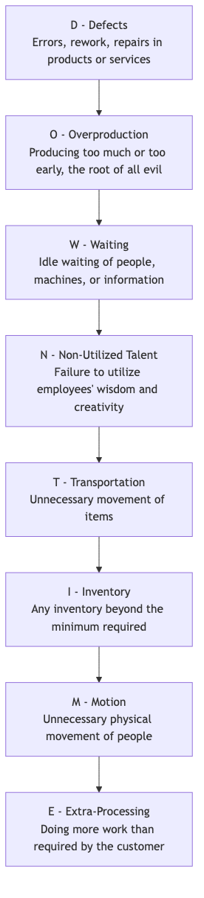

# Lean Operations

Imagine a smooth, unimpeded river flowing effortlessly, delivering the source of value directly to the customer with minimal consumption and maximum speed. This is the ideal state that **Lean Operations** strives for. Lean Operations, often referred to as **Lean Production** or **Lean Thinking**, is both a powerful methodology for operational management and a profound organizational culture and management philosophy. Its core objective is to maximize customer value and achieve high-quality, low-cost, and high-speed operational efficiency by **systematically identifying and eliminating all non-value-adding activities (i.e., "waste," Muda) in operational processes**.

Lean thinking originated from the "Toyota Production System (TPS)" of Toyota Motor Corporation, which completely revolutionized traditional large-scale, push-based production models. Lean Operations posits that any activity that consumes resources but does not add value for which the end customer is willing to pay is waste. By continuously examining the value stream and eliminating waste, organizations can create higher-quality products and services with fewer resources and in less time, thereby gaining a fundamental advantage in fierce market competition.

!!! abstract "Key takeaways"

    - **Five principles**: define value, map the value stream, create flow, establish pull, pursue perfection.
    - **Eight wastes (DOWNTIME)**: Defects, Overproduction, Waiting, Non-utilized talent, Transportation, Inventory, Motion, Extra-processing.
    - **Most lead time is waiting**: improving flow usually matters more than working faster.
    - **Core tools**: value stream mapping, 5S, kanban, standard work, [kaizen](Kaizen-Tutorial-en.md).
    - **Lean works in offices, hospitals and software**, not just factories.

## Five Core Principles of Lean Thinking

The practice of lean thinking revolves around five closely connected and cyclical core principles.

1.  **Specify Value**: The starting point of all activities must be to precisely define value from the perspective of the **end customer**. It's not what we think is valuable, but what the customer thinks is valuable.
2.  **Map the Value Stream**: For each product or service, draw its **complete end-to-end process map** from concept to delivery to the customer (i.e., the "value stream"). In this process, clearly identify which steps truly add value, which are non-value-adding but currently unavoidable, and which are pure waste that must be eliminated.
3.  **Create Flow**: Break down departmental silos and isolated batch production models, and reorganize processes so that products or services can "flow" through the value stream as smoothly, uninterrupted, and without waiting as possible.
4.  **Establish Pull**: In contrast to traditional "push-based" production (i.e., producing according to plan regardless of downstream needs), lean pursues a **"pull-based" system**. That is, upstream processes only begin production or provide services when the customer (or downstream process) sends a clear demand signal. This fundamentally eliminates overproduction and unnecessary inventory.
5.  **Seek Perfection**: Lean is an endless process of continuous improvement. By constantly repeating the above four steps, organizations can continuously discover and eliminate deeper levels of waste, infinitely approaching an ideal state of "zero waste."

## The Eight Wastes of Lean (DOWNTIME)

Lean thinking systematically categorizes waste in processes into eight types, commonly remembered by the acronym **DOWNTIME**.

<!-- mermaid 源文件：Lean-Operations-Tutorial-en-mermaid-src-1.mmd -->

## How to Implement Lean Operations

Lean transformation is a deep cultural and operational change that relies on a series of powerful tools and methods.

1.  **Value Stream Mapping (VSM)**: This is the starting point for implementing lean. By mapping the current state value stream, identify cycle times, value-added times, and waste at each stage. Then, design an ideal future state value stream map as the goal for improvement.

2.  **5S Methodology**: Used to create a clean, organized, and efficient work environment. It includes five steps: Seiri (Sort), Seiton (Set in Order), Seiso (Shine), Seiketsu (Standardize), and Shitsuke (Sustain).

3.  **Kanban**: A powerful visual management tool used to implement "pull-based" production. Demand signals are transmitted through Kanban cards, thereby precisely controlling the amount of work-in-progress and preventing overproduction.

4.  **Kaizen**: Meaning "continuous improvement." Organizations need to establish a culture that encourages all employees to reflect on their work processes daily and propose small but continuous improvement suggestions.

5.  **Root Cause Analysis**: When problems occur, use tools like **5 Whys** or **Fishbone Diagram** to delve into the root cause of the problem, ensuring that the problem is permanently resolved, not just treating surface symptoms.

## Application Cases

**Case 1: Value Stream Mapping in an Insurance Claims Process**

*   **Problem**: Simple home-insurance claims took an average of 21 days to settle, and customers complained about the wait.
*   **Lean Application**: A cross-functional team drew a **value stream map** of the process from claim receipt to payment. They found that the actual work on a claim took about 3 hours in total; the rest was waiting: in queues between departments, for a weekly approval meeting, and for documents requested one at a time.
*   **Changes**: Requesting all documents in one checklist up front, giving adjusters authority to approve claims under a set amount, and replacing the weekly approval meeting with a daily one.
*   **Result**: Average settlement time fell from 21 to 6 days with the same staff, because waiting, not work, had been the main constraint.

**Case 2: 5S and Pull Replenishment in a Warehouse**

*   **Problem**: Pickers in an e-commerce warehouse walked long distances and often found shelves empty, while overflow stock piled up in aisles.
*   **Lean Application**: The team applied **5S** (Sort, Set in order, Shine, Standardize, Sustain) to the picking area and moved the fastest-moving items closest to the packing stations. Replenishment switched from a fixed daily schedule to a **kanban pull signal**: when a bin reached a marked minimum, a card triggered refill from reserve stock.
*   **Result**: Walking distance per order dropped markedly, stock-outs at pick locations became rare, and aisle clutter disappeared, improving both productivity and safety.

**Case 3: Agile and Kanban Methods in Software Development**

*   **Scenario**: Traditional waterfall software development models have long cycles, and much waste.
*   **Lean Application**: Agile development and Kanban methods are largely the application of lean thinking in knowledge work.
    *   **Eliminating Waste**: Through small batches and high-frequency iterations, the inventory of "work-in-progress" (unfinished code) is reduced. Through continuous integration, waiting and defect waste are reduced.
    *   **Pull System**: Development teams "pull" tasks from the "backlog" list for development based on priorities on the Kanban board, rather than project managers "pushing" tasks.
    *   **Continuous Improvement**: Regular "retrospective meetings" are institutionalized "Kaizen" activities.

## Advantages and Challenges of Lean Operations

**Core Advantages**

*   **Significant efficiency improvement and cost reduction**: By eliminating waste, production efficiency is directly improved, and operating costs are reduced.
*   **Higher quality and customer satisfaction**: Focusing on value and processes ensures the inherent quality of products and services.
*   **Stronger flexibility and responsiveness**: Small-batch, pull-based production models allow organizations to respond more quickly to changes in customer demand.
*   **Empowers employees and boosts morale**: Respects and relies on the wisdom and creativity of frontline employees to drive continuous improvement.

**Potential Challenges**

*   **High demands on the supply chain**: Just-in-Time (JIT) requires suppliers to deliver goods extremely punctually and with high quality, placing very high demands on supply chain stability.
*   **Not suitable for all environments**: In industries with extremely unstable and volatile demand, implementing a purely pull-based system can be very difficult.
*   **Resistance to cultural change**: Lean transformation requires a profound shift in mindset, which may be resisted by employees and managers accustomed to traditional work methods.

## Core Lean Tools

| Tool | Purpose |
| --- | --- |
| **Value stream mapping (VSM)** | Visualize the whole flow of material and information; separate value-adding time from waiting |
| **5S** | Organize the workplace: Sort, Set in order, Shine, Standardize, Sustain |
| **[Kanban](../../Product & User/product_development/Kanban-Tutorial-en.md) / pull systems** | Produce or replenish only what is needed, when it is needed |
| **Standard work** | Document the current best way so improvements stick |
| **Takt time** | Match the pace of work to customer demand |
| **Poka-yoke (mistake-proofing)** | Design processes so errors can't happen or are caught immediately |
| **SMED** | Reduce changeover times so small batches become economical |

## Waste Walk Checklist

| Waste | What to look for | Seen? |
| --- | --- | --- |
| Defects | Rework, corrections, complaints | |
| Overproduction | Work done before it's needed, reports nobody reads | |
| Waiting | Idle people or items, approvals, queues | |
| Non-utilized talent | Ideas not asked for, skills not used | |
| Transportation | Moving materials or information unnecessarily | |
| Inventory | Piles of materials, backlogs, unread emails | |
| Motion | Walking, searching, reaching | |
| Extra-processing | Steps the customer doesn't value, duplicate data entry | |

## Common Mistakes

1.  **Using lean only to cut costs.** Lean is about customer value and flow; cutting heads without improving processes destroys trust and capability.
2.  **Copying tools without the thinking.** 5S posters and kanban boards without problem-solving culture produce little.
3.  **Improving one step in isolation.** Speeding up one department can just move the bottleneck. Look at the whole value stream.
4.  **No standard work.** Without a defined current method, there's nothing stable to improve from.
5.  **Leaders absent from the gemba.** Lean needs leaders who go and see ([Gemba Walk](../../Problem Solving & Decision Making/problem_solving/Gemba-Walk-Tutorial-en.md)).

## Frequently Asked Questions

??? question "What are the eight wastes of lean?"

    Defects, Overproduction, Waiting, Non-utilized talent, Transportation, Inventory, Motion and Extra-processing, often remembered as DOWNTIME. The first seven come from the Toyota Production System; "non-utilized talent" was added later.

??? question "What is the difference between lean and Six Sigma?"

    Lean focuses on eliminating waste and improving flow; [Six Sigma](Six-Sigma-Tutorial-en.md) focuses on reducing variation and defects with statistical methods. Lean Six Sigma combines both.

??? question "Where does lean come from?"

    From the Toyota Production System developed by Taiichi Ohno and others. The term "lean" was popularized by Womack, Jones and Roos in *The Machine That Changed the World* (1990).

??? question "Can lean be applied to services and offices?"

    Yes. Claims processing, hospitals, software development and public services all use lean to reduce waiting, rework and handoffs.

## Extensions and Connections

*   **[Six Sigma](Six-Sigma-Tutorial-en.md)**: Lean focuses on **speed and efficiency (eliminating waste)**, while Six Sigma focuses on **quality and consistency (reducing variation)**. In practice, the two are often combined into **Lean Six Sigma**, forming a more comprehensive operational improvement methodology that can both eliminate waste and reduce variation.
*   **[Total Quality Management (TQM)](Total-Quality-Management-Tutorial-en.md)**: Highly consistent with lean in terms of customer focus, full participation, continuous improvement, and other philosophical aspects. Lean provides a unique perspective and toolset more focused on "eliminating waste."
*   **Theory of Constraints (TOC)**: Focuses on identifying and managing "bottlenecks" in a system to improve the output of the entire system. Can be combined with lean methods to guide the focus of improvement activities.

---
*Source Reference: The roots of lean thinking are in the Toyota Production System (TPS) of Toyota Motor Corporation, with Taiichi Ohno as a key figure. James P. Womack and Daniel T. Jones's book "Lean Thinking" first systematically distilled Toyota's practices into five principles that Western managers could understand, greatly promoting the spread of lean worldwide.*