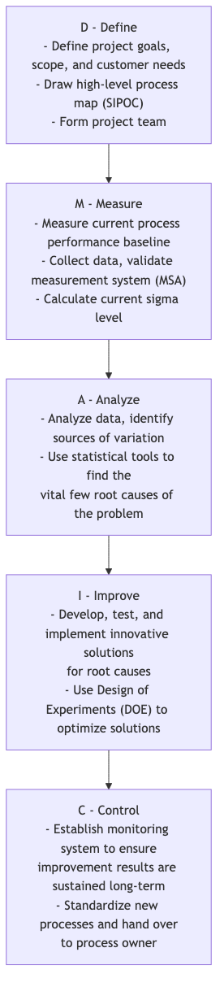
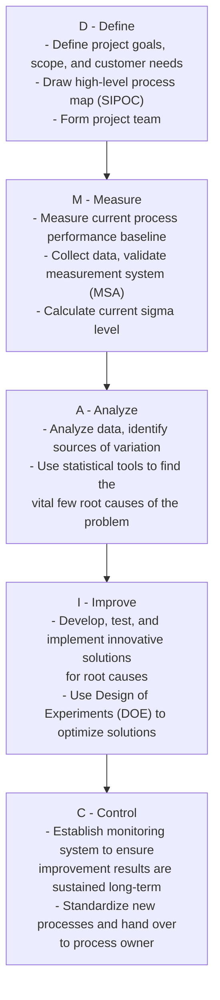

# Six Sigma

On the path to achieving ultimate quality and operational efficiency, how can businesses reduce defects and variations in processes to a near-perfect level? **Six Sigma (6σ)** is a disciplined, data-driven, customer-centric **quality improvement methodology and management philosophy** designed for this very goal. Its core objective is to systematically identify and eliminate the root causes of process variation, thereby reducing the defect rate of products or services to an exceptional level of **only 3.4 defects per million opportunities**.

"Sigma (σ)" is a statistical measure of data dispersion, representing the standard deviation. A higher sigma level for a process means it is more stable and consistent, with less fluctuation from the average, and fewer defects. The name "Six Sigma" itself represents an extreme pursuit of perfect quality. It is not just a collection of statistical tools, but a systematic way of thinking that solves complex problems and achieves breakthrough performance improvements through the structured project path of **DMAIC** (Define-Measure-Analyze-Improve-Control).

## Core Principles of Six Sigma

*   **Customer Focus**: The beginning and end of all improvements must be the customer's needs and Critical to Quality (CTQ) requirements.
*   **Data-Driven Decisions**: All decisions and conclusions must be based on the collection of objective data and rigorous statistical analysis, rather than intuition or experience.
*   **Process Improvement**: It is firmly believed that any defect or problem is caused by a flawed process. Therefore, the focus of improvement is on the process, not on blaming individuals.
*   **Reducing Variation**: Six Sigma believes that process fluctuations and inconsistencies are the number one enemy of quality. Its core task is to understand and eliminate the root causes of variation.
*   **Breakthrough Improvement**: It aims to achieve significant, quantifiable financial returns and performance improvements, not just incremental minor improvements.

## DMAIC: Six Sigma Project Roadmap

Six Sigma improvement projects strictly follow a five-phase roadmap called **DMAIC**. Each phase has clear objectives and key tools to be used.

<!--

-->

## How to Implement a Six Sigma Project

1.  **Define (Define) Phase**: Clearly state the business problem you want to solve and its impact on the company, define the project scope, goals, and timeline, and identify all relevant stakeholders.

2.  **Measure (Measure) Phase**: Quantify the severity of the problem with data. You need to determine which key metrics to measure, design a data collection plan, and ensure your measurement system is accurate and reliable. The output of this phase is credible baseline data on current process performance.

3.  **Analyze (Analyze) Phase**: This is the core of DMAIC. You need to use various statistical analysis tools (such as Pareto charts, fishbone diagrams, hypothesis testing, regression analysis, etc.) to meticulously extract from the collected data the **root causes** of the problem, validated by data.

4.  **Improve (Improve) Phase**: Once the root causes are found, you need to brainstorm targeted solutions, and develop and test potential solutions. **Design of Experiments (Design of Experiments, DOE)** is a powerful tool commonly used in this phase, helping you find the optimal parameter combination for process optimization.

5.  **Control (Control) Phase**: After implementing the solution and achieving the expected improvements, the most important thing is how to sustain the results. You need to establish a process control system (such as **Statistical Process Control charts, SPC Chart**), develop new standard operating procedures, and train relevant personnel to prevent the problem from recurring.

## Six Sigma Belt Role System

The successful implementation of Six Sigma relies on a clear system of roles and responsibilities, which is analogous to martial arts ranks using different colored "belts."

*   **Champions**: Typically senior managers who are responsible for identifying and approving Six Sigma projects, and providing resources and support for the projects.
*   **Master Black Belts**: Internal Six Sigma experts and coaches, responsible for training and mentoring Black Belts and Green Belts, and promoting the Six Sigma culture within the organization.
*   **Black Belts**: Usually full-time Six Sigma project managers, responsible for leading complex, cross-functional improvement projects.
*   **Green Belts**: Participate in or lead smaller improvement projects while performing their regular duties. They are the main force for the popularization and application of Six Sigma in the organization.

## Application Cases

**Case 1: General Electric (GE)**

*   **Scenario**: Under the leadership of Jack Welch, GE was one of the first and most successful companies globally to elevate Six Sigma from a quality tool to a core business strategy.
*   **Application**: GE applied Six Sigma to every business area, from aircraft engine manufacturing to financial services. For example, in one case, its healthcare division, through a DMAIC project, analyzed the inspection process of CT scanners and successfully reduced the average inspection time per patient by 30%, greatly improving equipment utilization and patient satisfaction. It is reported that Six Sigma saved GE billions of dollars in its initial years.

**Case 2: Optimizing Credit Card Application Process at a Bank**

*   **Problem**: The average time from customer submitting a credit card application to receiving the card was too long, leading to low customer satisfaction.
*   **DMAIC Application**:
    *   **D**: Defined the project goal as "reducing the application cycle from an average of 15 days to 7 days within 6 months."
    *   **M**: Measured the time spent on each stage (e.g., "data entry," "credit review," "card production," "mailing") for hundreds of applications over the past three months.
    *   **A**: Data analysis revealed that the "credit review" stage took the longest and had the most variability, being the main bottleneck in the process.
    *   **I**: The team redesigned the credit review process, introduced an automated preliminary review system, and empowered review personnel.
    *   **C**: Established a new process monitoring dashboard and updated operating manuals. Ultimately, the average cycle was successfully reduced to 6.5 days.

**Case 3: Reducing Product Defect Rate at a Manufacturing Plant**

*   **Problem**: The defect rate of parts produced on a certain production line, where dimensions exceeded standards, was as high as 5%.
*   **DMAIC Application**: The project team through fishbone diagrams and hypothesis testing, analyzed all potential causes (man, machine, material, method, environment) that could lead to dimensional deviations. Finally, through Design of Experiments (DOE), it was found that the interaction between the machine's "cooling temperature" and "cutting speed" parameters was the most critical root cause of dimensional variation. By setting a new, optimized set of parameter combinations, the team successfully reduced the defect rate to below 0.1%.

## Advantages and Challenges of Six Sigma

**Core Advantages**

*   **Results-oriented, significant financial returns**: Each project is linked to clear, quantifiable financial goals.
*   **Disciplined, clear logic**: The DMAIC framework provides a very structured, repeatable roadmap for solving complex problems.
*   **Data-driven, strong objectivity**: Emphasizes speaking with data, reducing subjectivity and arbitrariness in decision-making.
*   **Develops problem-solving skills**: Cultivates a group of professionals (Black Belts, Green Belts) within the organization who understand business, data, and can use scientific tools to solve problems.

**Potential Challenges**

*   **May stifle innovation**: Overemphasis on controlling and optimizing existing processes can sometimes conflict with disruptive innovation that requires exploration and trial-and-error.
*   **Risk of bureaucracy**: If implemented improperly, it can become a bureaucratic process filled with complex statistical tools and reports, "doing projects" for the sake of "doing projects."
*   **Requires significant investment**: Successful Six Sigma implementation requires significant upfront investment from the company in training, project resources, and personnel.

## Extensions and Connections

*   **Lean Manufacturing**: The core of Six Sigma is **reducing variation and improving quality**; the core of Lean is **eliminating waste and improving speed**. The two have different focuses but are highly complementary. In practice, they are often combined to form the more powerful **Lean Six Sigma**, aiming to achieve high quality, high efficiency, and low cost simultaneously.
*   **Total Quality Management (TQM)**: TQM provides a macro management philosophy that is customer-centric and involves full participation, while Six Sigma provides more specific, project-based, and data-driven micro-operational methods for achieving TQM goals.

---
*Source Reference: Six Sigma was first proposed by Motorola engineer Bill Smith in the 1980s and became famous for its successful implementation in companies like General Electric (GE) and AlliedSignal. Mikel Harry and Richard Schroeder's book "Six Sigma: The Breakthrough Management Strategy Revolutionizing the World's Top Corporations" is a classic text in this field.*