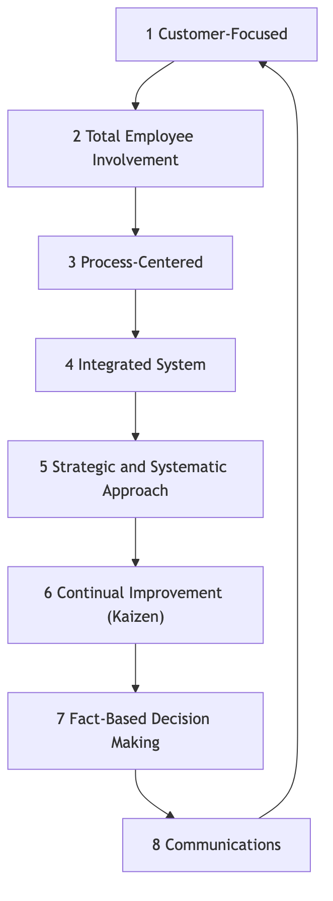
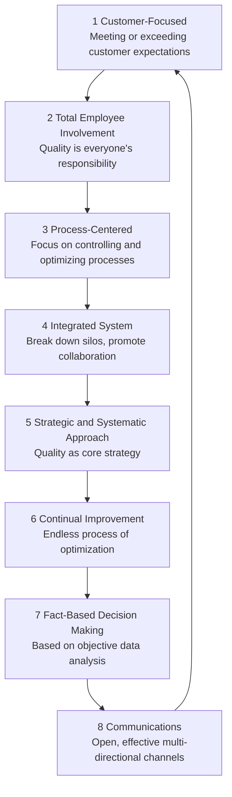

# Total Quality Management

In traditional production models, "quality" was often seen as a separate inspection step at the end of the production line, handled by a specialized quality control department. However, this "after-the-fact remedy" approach is costly and inefficient. **Total Quality Management (TQM)** proposes a revolutionary and distinctly different management philosophy. It advocates that **quality is everyone's responsibility, must permeate every corner and every link of organizational operations, and its ultimate criterion is customer satisfaction**.

TQM is not a specific method or tool, but a management philosophy and organizational culture centered on **quality, total employee involvement, and continuous improvement**. It aims to continuously improve the quality of products, services, and processes by establishing a systematic, preventive quality assurance system, thereby gaining a sustainable competitive advantage in fierce market competition. It emphasizes that high quality not only does not increase costs, but actually significantly **reduces total costs** and improves profitability by reducing waste, rework, and customer complaints.

## Core Principles of TQM

Total Quality Management is built upon a series of interconnected core principles that collectively form the cultural foundation of TQM.

<!--

-->

1.  **Customer-Focused**: The beginning and end of TQM are the customers. The survival and development of an organization ultimately depend on its ability to meet or even exceed customer expectations. Therefore, every aspect, from product design to after-sales service, must be guided by customer needs and satisfaction.

2.  **Total Employee Involvement**: Quality is not the exclusive domain of one department, but the responsibility of everyone from the CEO to the frontline employee. TQM emphasizes empowering, training, and motivating all employees to actively participate in quality improvement activities.

3.  **Process-Centered**: TQM believes that the quality of the final product or service is determined by the process that produces it. Therefore, the focus of management should shift from "inspecting results" to "controlling and optimizing processes."

4.  **Integrated System**: The organization is viewed as a complex system composed of various horizontal and vertical processes. TQM seeks to break down departmental silos and promote cross-functional collaboration, ensuring that all parts of the organization work together harmoniously towards common quality goals.

5.  **Strategic and Systematic Approach**: Quality must be considered one of the organization's core strategies. The organization needs to develop a clear, long-term quality vision and systematically integrate it into all plans and decisions.

6.  **Continual Improvement**: TQM does not aim for "one-time compliance" but an endless, spiraling process of improvement. It encourages organizations to constantly seek opportunities for small but continuous optimization of products, services, and processes (i.e., "Kaizen").

7.  **Fact-Based Decision Making**: All decisions and improvements must be based on the collection and analysis of objective data, not on intuition or experience. This needs the organization to establish effective data measurement and analysis systems.

8.  **Communications**: Within the organization, open, effective, and multi-directional communication channels must be established to ensure that strategies, goals, processes, and feedback are timely transmitted and understood.

## How to Implement TQM

Implementing TQM is a long-term, cultural change process, which can usually follow the logic of the PDCA cycle.

1.  **Phase 1: Plan - Laying the Foundation**
    *   **Top Management Commitment**: Obtaining unwavering support and commitment from top management is the primary prerequisite for TQM success.
    *   **Establish Quality Committee**: Form a cross-functional leadership team responsible for planning and guiding the entire TQM implementation.
    *   **Develop Quality Vision and Strategy**: Clearly define the organization's quality policy and long-term goals.
    *   **Total Employee Training**: Provide training on basic TQM concepts and tools to all employees.

2.  **Phase 2: Do - Comprehensive Deployment**
    *   **Identify Customer Needs**: Systematically collect and analyze customer needs and expectations.
    *   **Process Analysis and Standardization**: Map and analyze core business processes, identify bottlenecks and waste, and establish standardized operating procedures.
    *   **Form Quality Improvement Teams**: Encourage employees (especially cross-departmental ones) to spontaneously form "Quality Circles" and other groups to improve specific problems.
    *   **Empower Employees**: Grant frontline employees the authority and responsibility to stop the production line or process when quality problems are found.

3.  **Phase 3: Check - Measurement and Evaluation**
    *   **Data Collection and Analysis**: Use statistical process control (SPC), Pareto charts, fishbone diagrams, etc., quality tools to continuously monitor and measure processes and results.
    *   **Performance Evaluation**: Regularly evaluate the progress and effectiveness of TQM implementation and compare it with predefined goals.

4.  **Phase 4: Act - Improvement and Institutionalization**
    *   **Root Cause Analysis**: Conduct in-depth root cause analysis for identified quality problems.
    *   **Implement Improvement Measures**: Take corrective and preventive actions based on the analysis results.
    *   **Share and Standardize**: Share successful improvement experiences and standardize them into new processes, incorporating them into the organizational knowledge base.
    *   **Continuous Cycle**: After completing one improvement cycle, immediately start the next PDCA cycle.

## Application Cases

**Case 1: Toyota Motor Corporation**

*   **Scenario**: The Toyota Production System (TPS) is considered the most successful and thorough practical example of TQM.
*   **Application**:
    *   **Total Employee Involvement**: The "Andon system" allows any production line worker to pull a cord and stop the entire production line when a quality problem is found, which reflects a high degree of trust and empowerment for frontline employees.
    *   **Continuous Improvement**: Toyota's "Kaizen" culture encourages all employees to propose small but continuous improvement suggestions for their work processes every day.
    *   **Process-Oriented**: Core principles such as "Just-in-Time (JIT)" and "Jidoka" aim to eliminate waste and ensure quality by optimizing processes.

**Case 2: The Ritz-Carlton Hotel**

*   **Scenario**: As a top luxury hotel brand, its excellent service quality is a core competitive advantage.
*   **Application**:
    *   **Customer-Focused**: Its famous motto is "We are Ladies and Gentlemen serving Ladies and Gentlemen."
    *   **Total Employee Involvement and Empowerment**: The company authorizes every employee, without seeking approval from superiors, to decide to use up to $2000 to resolve any customer issue. This ensures that customer problems can be resolved immediately and creatively.
    *   **Fact-Based Decision Making**: The hotel uses a detailed customer preference database to record the personalized needs of every frequent guest to provide precise, exceeding-expectation service.

**Case 3: A Software Development Company**

*   **Scenario**: The company hopes to improve the code quality and delivery speed of its software products.
*   **Application**:
    *   **Process-Oriented**: They introduced "Continuous Integration/Continuous Deployment (CI/CD)" processes, ensuring the quality of each code commit through automated testing.
    *   **Total Employee Involvement**: Implemented a "Code Review" system, requiring all code to be reviewed by at least one colleague before merging, distributing quality responsibility to every developer.
    *   **Continuous Improvement**: Regularly held "technical debt repayment days" and "post-mortem reviews" to encourage teams to actively identify and solve problems in processes.

## Advantages and Challenges of TQM

**Core Advantages**

*   **Improved customer satisfaction and loyalty**: Focuses the entire organization on meeting customer needs.
*   **Reduced costs, increased efficiency**: By "doing things right the first time," it significantly reduces costs associated with rework, waste, and customer complaints.
*   **Enhanced employee sense of belonging and responsibility**: Empowers employees, making them feel they are an important part of the organization's success.
*   **Establishes sustainable competitive advantage**: High quality itself is a powerful competitive advantage that is difficult to imitate.

**Potential Challenges**

*   **Requires long-term cultural change**: TQM is not a "project" that yields quick results, but a profound, top-down organizational cultural change that takes several years to truly take root.
*   **Continuity of top management commitment**: If top management's support wavers, TQM implementation will quickly become a mere formality.
*   **Potential for bureaucracy**: If processes and documentation are overemphasized, new bureaucracy may arise, stifling flexibility and innovation.

## Extensions and Connections

*   **Six Sigma**: Can be seen as a more specific, data-driven, and project-oriented implementation methodology for the "fact-based decision making" and "continuous improvement" principles within TQM. TQM provides the philosophy and culture, while Six Sigma provides the statistical tools and project roadmap.
*   **Lean Operations**: Shares common philosophical foundations with TQM in terms of eliminating waste, focusing on processes, and continuous improvement. The two are often combined to form "Lean Six Sigma."
*   **ISO 9000 Quality Management System**: An internationally standardized, certifiable framework for TQM principles. An organization can demonstrate its establishment of a quality management system compliant with TQM principles by obtaining ISO 9001 certification.

---
*Source Reference: The intellectual origins of Total Quality Management can be traced back to several quality management gurus of the mid-20th century, including W. Edwards Deming's "14 Points for Management," Joseph M. Juran's "Quality Trilogy," and Philip B. Crosby's "Quality is Free" concepts. These ideas were greatly developed during Japan's post-war reconstruction and eventually formed the complete TQM system.*