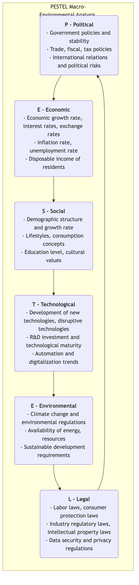
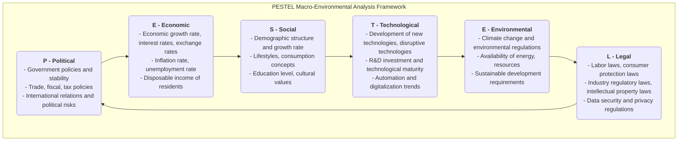

# PESTEL Analysis

When formulating any long-term strategy, if an organization focuses only on internal strengths and industry competition while neglecting the broader macro-environment, it is like sailing in a turbulent sea without checking the weather forecast, which is extremely dangerous. **PESTEL Analysis**, often referred to as PEST analysis, is a powerful framework for systematically scanning and monitoring the external macro-environment of an organization. It aims to help decision-makers identify key drivers and external risks that may have a profound impact on the organization now or in the future.

PESTEL is an acronym for six dimensions, providing a comprehensive checklist to ensure that we do not miss important aspects when conducting environmental scanning:

*   **P - Political**
*   **E - Economic**
*   **S - Social**
*   **T - Technological**
*   **E - Environmental**
*   **L - Legal**

By systematically analyzing these six dimensions, organizations can better predict opportunities, avoid threats, and formulate more adaptive and forward-looking strategies.

## Detailed Explanation of PESTEL's Six Dimensions

Each letter of PESTEL represents a series of external forces that need to be examined.

<!--

-->
-->

## How to Conduct a PESTEL Analysis

1.  **Brainstorm: Identify Key Factors**
    Convene a cross-functional team to brainstorm openly across the six dimensions of PESTEL. List as many external factors as possible under each dimension that may be relevant to your organization, industry, or market.
    *   For example, for an electric vehicle company, under the "Political" dimension, it might include "government new energy vehicle subsidy policies," "charging pile infrastructure construction plans," etc.

2.  **Gather Information and Evidence**
    For the initially identified key factors, conduct more in-depth information gathering and research. Data can come from government reports, industry analysis, news media, academic research, etc., to ensure that the analysis is based on facts rather than speculation.

3.  **Analyze Impact: Identify Opportunities and Threats**
    Evaluate whether the potential impact of each key factor on the organization is positive (opportunity) or negative (threat). Further analyze the **probability** and **severity** of this impact.
    *   For example, "government increasing subsidies" is a high-probability, high-impact **opportunity**.
    *   "Introduction of a new battery recycling regulation" might be a high-probability, medium-impact **threat**.

4.  **Formulate Strategic Responses**
    This is the ultimate purpose of PESTEL analysis. Develop specific strategic actions for the identified key opportunities and threats.
    *   **For Opportunities**: How should we adjust our strategy to maximize its utilization?
    *   **For Threats**: How should we take action to avoid or mitigate its negative impact?

5.  **Continuous Monitoring**
    The macro-environment is constantly changing, so PESTEL analysis is not a one-time task but should be a dynamic process of continuous monitoring and regular updating.

## Application Cases

**Case 1: A Multinational Fast Food Chain Entering the Indian Market**

*   **Political**: Needs to deal with India's complex food safety regulations and local government relations.
*   **Economic**: The rise of India's middle class and the growth of disposable income are huge opportunities, but also need to consider its high price sensitivity.
*   **Social**: India has a large number of vegetarians, and cows are sacred in Hinduism. This is a huge cultural challenge and opportunity. Therefore, the company specifically developed non-beef burgers (such as McAloo Tikki) and a rich vegetarian menu.
*   **Technological**: The popularity of mobile payments and food delivery platforms provides new channels to reach more consumers.
*   **Environmental**: Restrictions on plastic packaging are becoming increasingly strict, requiring environmentally friendly alternatives.
*   **Legal**: Needs to comply with strict labor laws and franchise-related regulations.

**Case 2: Challenges Faced by Traditional Print Media**

*   **Political**: Changes in news censorship and publishing regulations.
*   **Economic**: Economic recession leads to reduced corporate advertising budgets, severely impacting newspaper revenue.
*   **Social**: Readers' reading habits have fully shifted to online and mobile, and the younger generation no longer has the habit of reading newspapers.
*   **Technological**: The rise of the internet, social media, and news aggregation apps has completely revolutionized the way news is produced and disseminated, posing the most fatal threat.
*   **Environmental**: Increasing demands for paper consumption and environmentally friendly printing.
*   **Legal**: Increasing legal disputes regarding copyright and digital content reproduction.

**Case 3: Opportunities for an Online Education Technology Company**

*   **Political**: Government promotion of educational informatization and "suspending classes without suspending learning" policies are huge development opportunities.
*   **Economic**: Household spending on education continues to grow.
*   **Social**: Growing societal demand for lifelong learning and skill improvement, and the pandemic accelerated the popularization and acceptance of online learning.
*   **Technological**: The development of 5G, artificial intelligence, and big data technologies makes personalized, immersive online learning experiences possible.
*   **Environmental**: Online education reduces commuting and paper consumption, having natural environmental advantages.
*   **Legal**: Needs to closely monitor new regulations regarding online protection of minors and education data privacy.

## Advantages and Limitations of PESTEL Analysis

**Core Advantages**

*   **Comprehensiveness**: Provides a systematic and comprehensive framework, ensuring the breadth of macro-environmental analysis.
*   **Forward-looking**: Prompts organizations to look beyond immediate daily operations and consider long-term trends and changes.
*   **Promotes Strategic Thinking**: An important input for identifying opportunities and threats and formulating robust strategies.

**Potential Limitations**

*   **Information Overload**: May identify too many external factors, requiring further screening and focusing on the most critical few.
*   **Simplifies Complexity**: In the real world, factors in the six dimensions are often interconnected and mutually influential, and PESTEL itself does not fully reflect this complexity.
*   **Insufficient Dynamism**: The analysis results are just a snapshot at a point in time and need to be continuously updated to cope with rapid environmental changes.

## Extensions and Connections

*   **SWOT Analysis**: PESTEL analysis is an excellent starting point for SWOT analysis. The results of PESTEL analysis can directly serve as input for the **Opportunities** and **Threats** sections in SWOT.
*   **Porter's Five Forces Model**: PESTEL focuses on the broader macro-environment affecting the entire business ecosystem, while Porter's Five Forces Model focuses more on the "micro" competitive environment within the specific industry where the organization operates. Combining the two can form a complete view of the external environment.

---
*Source Reference: The PESTEL framework was first proposed by Harvard University Professor Francis Aguilar in 1967 in the form of ETPS. After decades of evolution and expansion, it gradually formed the widely known PEST or PESTEL model today. It is one of the most basic and core analytical tools in strategic management and marketing.*