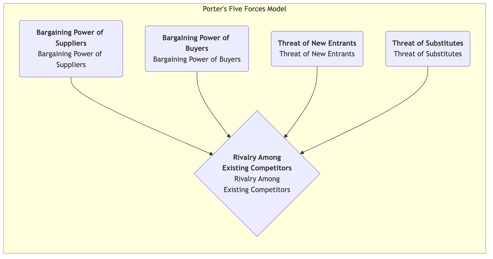
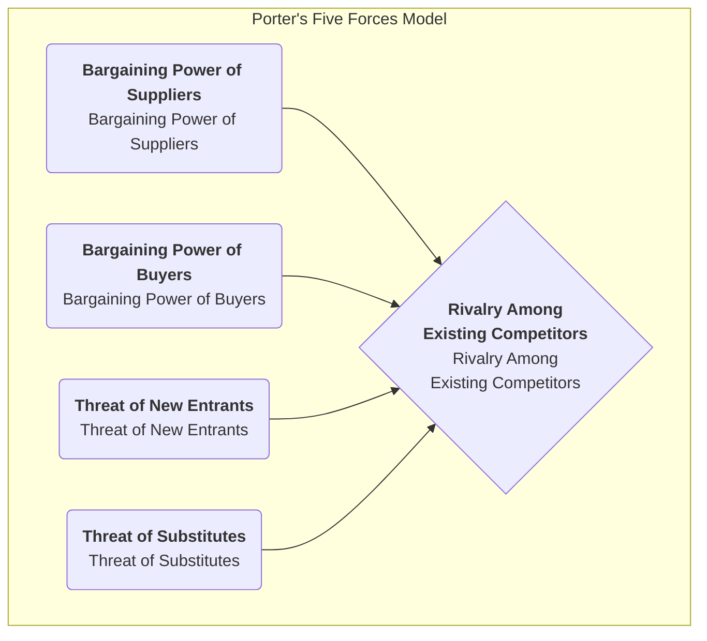

# Porter's Five Forces Model

In fierce business competition, the attractiveness and long-term profitability of an industry are not determined by a single competitor, but shaped by a broader competitive ecosystem. **Porter's Five Forces Model** is a revolutionary framework proposed by Michael E. Porter, a master of strategic management at Harvard Business School. It provides a powerful lens to help us systematically analyze the competitive structure of any industry and understand the five fundamental competitive forces that determine the average profit level of that industry.

The core idea of this model is that corporate strategists must look beyond immediate direct competitors and examine the broader competitive arena. These five forces interact to determine the intensity of competition within the industry and how value is created and distributed in the industry chain. By understanding the strength of each force, companies can find their optimal position in the industry and formulate strategies that can avoid risks, leverage advantages, and ultimately gain sustainable competitive advantage.

## Analyzing the Five Competitive Forces

Porter's Five Forces Model breaks down industry competition into five distinct dimensions, which together determine the "rules of the game" in the industry.

<!--

<!--

-->
-->

1.  **Rivalry Among Existing Competitors**
    This is the core of the Five Forces Model, referring to the direct confrontation and intensity of competition among existing companies within the industry. When competition within the industry is fierce, companies often fall into price wars, advertising wars, and product innovation races, thereby lowering the overall profit level of the industry.
    *   **Signs of fierce competition**: Many competitors of similar strength in the industry; slow industry growth, forming "zero-sum game"; severe product homogeneity, lack of differentiation; high exit barriers making it difficult for loss-making companies to leave.

2.  **Threat of New Entrants**
    Refers to the likelihood of new competitors entering an industry. If an industry is profitable and has low entry barriers, it will attract new players like a magnet, who will bring new capacity and eager to grab market share, thereby intensifying competition.
    *   The **height of entry barriers** determines the strength of this threat. Common entry barriers include: economies of scale, strong brand loyalty, high customer switching costs, huge capital investment, control over distribution channels, government policy and regulatory restrictions, and core technology patents.

3.  **Threat of Substitute Products or Services**
    Refers to the threat from substitute products or services from **different industries** that can satisfy the same customer needs. The existence of substitutes sets a "ceiling" for the overall pricing in the industry.
    *   **Important distinction**: For an airline, another airline is a **competitor**, while high-speed rail and video conferencing are **substitutes**. The higher the cost-effectiveness of the substitute, and the lower the cost for customers to switch to it, the greater the threat.

4.  **Bargaining Power of Suppliers**
    Refers to the ability of suppliers (e.g., providers of raw materials, components, labor, or services) to pass on their cost pressures to companies within the industry. Powerful suppliers can raise prices, lower quality, or limit supply, thereby eroding industry profits.
    *   **Signs of strong supplier bargaining power**: The supplier industry is highly concentrated, controlled by a few giants; supplier products are unique or differentiated and difficult to replace; switching costs for suppliers are extremely high; for suppliers, your industry is not their main customer.

5.  **Bargaining Power of Buyers**
    Refers to the ability of customers (buyers) to push down prices, demand higher quality, or more services. Powerful buyers can force companies within the industry to compete with each other, thereby transferring value from producers to themselves.
    *   **Signs of strong buyer bargaining power**: Buyers are concentrated large-volume purchasers; industry products are standardized, undifferentiated; buyers have low switching costs for suppliers; buyers can perform "backward integration" (i.e., produce the required products themselves).

## How to Apply the Five Forces Model

1.  **Clearly Define Industry Boundaries**
    First, clearly define what industry you are analyzing. The definition of the industry should not be too broad or too narrow.

2.  **Identify Key Players in the Five Forces**
    Specifically identify who the main players are in each force dimension. For example, what are the main suppliers, buyers, competitors, potential entrants, and substitutes respectively?

3.  **Assess the Potential Strength of Each Force**
    Analyze and determine the root causes that lead to the strengthening or weakening of each force. Finally, give a comprehensive assessment of the strength of each force (e.g., strong, medium, weak).

4.  **Comprehensive Analysis of Industry Structure**
    Synthesize the assessment results of the five forces to determine the overall competitive landscape and long-term profit potential of the industry. Which one or several forces are key to determining the industry's profitability?

5.  **Formulate Strategies to Improve Positioning**
    Based on the analysis, consider what strategic actions the company can take to "improve" its industry position. For example, can it reduce buyers' bargaining power by building a brand? Can it build entry barriers through technological innovation? Can it reduce suppliers' bargaining power by locking in suppliers?

## Application Cases

**Case 1: Global Soft Drink Industry (e.g., Coca-Cola and PepsiCo)**

*   **Rivalry Among Existing Competitors**: **Intense**. The two giants' competition is reflected in various aspects such as brand, distribution, and advertising, but they cleverly avoid destructive price wars.
*   **Threat of New Entrants**: **Weak**. Extremely high brand loyalty, vast global distribution networks, and huge advertising investments constitute insurmountable barriers for newcomers.
*   **Threat of Substitutes**: **Medium to Strong**. Water, juice, tea, coffee, etc., are all substitutes, and consumers have many choices.
*   **Bargaining Power of Suppliers**: **Weak**. Raw materials such as sugar, water, and packaging cans are commodities, and suppliers are dispersed and have no bargaining power.
*   **Bargaining Power of Buyers**: **Medium**. For individual end consumers, bargaining power is zero. But for large retailers (e.g., Walmart, Carrefour) and catering channels, they have strong bargaining power.
*   **Conclusion**: The industry structure is very attractive, and the two giants have effectively resisted the pressure from new entrants and suppliers by building strong brand and distribution barriers, thereby achieving sustained high profits.

**Case 2: Personal Computer (PC) Industry**

*   **Rivalry Among Existing Competitors**: **Extremely Intense**. Products of numerous brands (Lenovo, HP, Dell, etc.) are highly homogeneous, leading to continuous price wars.
*   **Threat of New Entrants**: **Medium**. Although brand and channels need accumulation, core components can be procured, and entry barriers are not insurmountable.
*   **Threat of Substitutes**: **Strong**. Smartphones and tablets are replacing many functions of PCs.
*   **Bargaining Power of Suppliers**: **Strong**. Core components (e.g., CPU and operating system) are highly concentrated in a few companies like Intel and Microsoft, which control most of the PC industry's profits.
*   **Bargaining Power of Buyers**: **Strong**. Both individual consumers and corporate customers have many choices due to standardized products and are price-sensitive.
*   **Conclusion**: Almost all five forces in the PC industry are unfavorable to manufacturers in the industry, leading to a long-term low-profit state in the industry.

**Case 3: China's High-End Restaurant Industry**

*   **Rivalry Among Existing Competitors**: **Intense**. Numerous restaurants, serious imitation and bandwagon effect.
*   **Threat of New Entrants**: **Strong**. Relatively low entry barriers; any individual with capital and chefs can open a restaurant.
*   **Threat of Substitutes**: **Strong**. Mid-range restaurants, takeout, private chefs, etc., are all alternative options.
*   **Bargaining Power of Suppliers**: **Medium**. For common ingredients, there are many suppliers. But for rare, high-quality specialty ingredients, a few suppliers may have strong bargaining power.
*   **Bargaining Power of Buyers**: **Strong**. Consumers have many choices, and switching costs are zero.
*   **Conclusion**: The competitive structure of the high-end restaurant industry is poor, and profitability is very difficult. The key to success lies in building unique brands, dishes, and experiences to reduce buyers' bargaining power and intra-industry competition.

## Value and Limitations of the Five Forces Model

**Core Value**

*   **Beyond Direct Competition**: Provides a broader perspective to understand competition, not just focusing on rivals.
*   **Reveals Profit Drivers**: Helps identify key structural factors that determine an industry's long-term profitability.
*   **Guides Strategic Positioning**: Provides a clear roadmap for companies to find favorable strategic positions and shape industry structures that benefit them.

**Potential Limitations**

*   **Static View**: The model itself is static and may not fully capture the dynamic evolution of industry structure (e.g., structural changes caused by technological disruption).
*   **Ignores the "Sixth Force"**: Some scholars argue that the model ignores the role of **Complements**. For example, software and hardware are complements; they create value together.
*   **Blurred Industry Boundaries**: In today's integrated business ecosystem, clearly defining industry boundaries is becoming increasingly difficult.

## Extensions and Connections

*   **PESTEL Analysis**: Can be used to analyze the broader macro-environmental factors that influence the five forces.
*   **Value Chain Analysis**: After the Five Forces Model analyzes how the industry "pie" is divided, value chain analysis helps companies think about how to create more "pie" within their own activities.
*   **Strategic Group Analysis**: When analyzing intra-industry competition, companies within the industry can be divided into different strategic groups based on strategic similarities for more refined analysis.

---
*Source Reference: Michael Porter systematically elaborated the Five Forces Model in his classic article "How Competitive Forces Shape Strategy," published in Harvard Business Review in 1979, and his subsequent book "Competitive Strategy." The model remains an unshakable cornerstone in the field of strategic management today.*