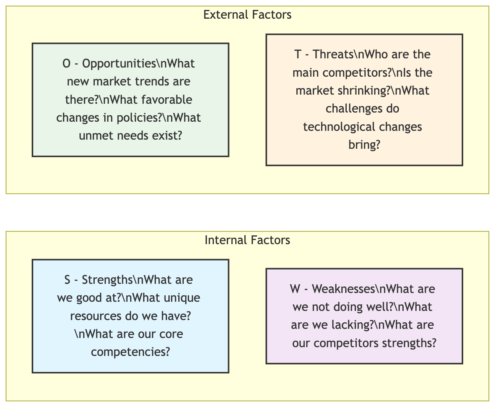

# SWOT Analysis

SWOT analysis is an extremely classic and powerful strategic planning framework designed to help an organization, project, or even an individual systematically examine their internal **Strengths (S)** and **Weaknesses (W)**, and evaluate external **Opportunities (O)** and **Threats (T)**. Its core value lies in providing a solid foundation for formulating precise and practical future strategies by clearly presenting these four dimensions, answering the fundamental questions of "Where are we now?" and "Where are we going in the future?"

## Understanding the Four Dimensions of SWOT

The essence of SWOT analysis lies in its concise yet profound four-dimensional matrix, which clearly divides all factors affecting the objective into two major categories: internal and external.

*   **Internal Factors**: These refer to resources and capabilities that the organization itself can control or change. They are a mirror for self-examination.
    *   **Strengths (S)**: Refer to unique capabilities or valuable resources that make the organization stand out in competition. This could be advanced technology patents, a loyal customer base, efficient operational processes, or a strong brand reputation. Identifying strengths is about thinking how to maximize their utilization.
    *   **Weaknesses (W)**: Refer to internal shortcomings or aspects that limit the organization's development. This could include funding shortages, outdated technology, unstable supply chains, or a lack of key talent. Acknowledging weaknesses is about thinking how to compensate for or avoid their negative impact.

*   **External Factors**: These refer to macro-environmental forces outside the organization that the organization usually cannot directly control, but must actively adapt to or leverage. They are a window to view the world.
    *   **Opportunities (O)**: Refer to favorable trends in the external environment that may bring growth and development to the organization. For example, the rise of an emerging market, a favorable new government policy, a positive shift in consumer behavior, or a competitor's strategic misstep.
    *   **Threats (T)**: Refer to unfavorable trends in the external environment that may cause harm or challenges to the organization. This could include the influx of new competitors, the emergence of disruptive technologies, stricter industry regulations, or a macroeconomic recession.

### SWOT Analysis Matrix Template

To facilitate a more intuitive analysis, we typically use a 2x2 matrix to organize these ideas.



<!--
```mermaid
graph TD
    subgraph SWOT Analysis Matrix
        direction LR
        subgraph Internal Factors (Internal)
            S["<b>S - Strengths</b><br/>- What are we good at?<br/>- What unique resources do we have?<br/>- What are our core competencies?"]
            W["<b>W - Weaknesses</b><br/>- What are we not doing well?<br/>- What are we lacking?<br/>- What are our competitors' strengths?"]
        end
        subgraph External Factors (External)
            O["<b>O - Opportunities</b><br/>- What new market trends are there?<br/>- What favorable changes are there in policies and regulations?<br/>- What unmet needs exist?"]
            T["<b>T - Threats</b><br/>- Who are the main competitors?<br/>- Is the market shrinking?<br/>- What challenges do technological changes bring?"]
        end
    end
```
-->

## How to Conduct a SWOT Analysis

An effective SWOT analysis is far more than just listing items; it is a complete process of discovering insights and ultimately guiding action.

1.  **Define the Analysis Objective**
    Before starting, the subject of the analysis must be clearly defined. Are we formulating a five-year strategy for the entire company, or are we evaluating a new product's market feasibility, or planning an individual's career development path? A clear objective is a prerequisite for ensuring the analysis stays on track.

2.  **Information Gathering and Brainstorming**
    Convene a cross-functional team to conduct open brainstorming around the four dimensions of SWOT. At this stage, the key is breadth rather than depth; encourage all participants to list as many relevant factors as possible from their own perspectives.

3.  **Evaluate and Identify Key Factors**
    Brainstorming will generate a large amount of information. The next step is for the team to collectively evaluate and filter all factors, identifying the few most critical ones that have the most profound impact on the objective. For example, among many strengths, which one is the true "core competence"?

4.  **Formulate Strategies Using the TOWS Matrix**
    This is the most valuable step in SWOT analysis, where insights are transformed into strategies through cross-analysis. This is often called **TOWS Matrix Analysis**, which provides four core strategic thinking paths:
    *   **SO - Growth Strategy (Maxi-Maxi)**: Think about how to leverage our core strengths to maximize key external opportunities. This is the most ideal offensive strategy.
    *   **WO - Turnaround Strategy (Mini-Maxi)**: Think about how to use external opportunities to compensate for or overcome our internal weaknesses. For example, by collaborating with a technologically leading company (opportunity) to compensate for insufficient R&D capabilities (weakness).
    *   **ST - Defensive Strategy (Maxi-Mini)**: Think about how to use our strengths to maximize avoidance or mitigation of external threats. For example, using strong brand loyalty (strength) to resist price wars from new competitors (threat).
    *   **WT - Retrenchment or Diversification Strategy (Mini-Mini)**: When internal weaknesses collide with external threats, defensive strategies aimed at minimizing losses need to be formulated. This may mean scaling back operations, seeking mergers, or a complete transformation.

## Application Cases

**Case 1: A Local Boutique Coffee Shop Looking to Expand**

*   **Background**: This coffee shop is locally well-known for its unique pour-over techniques and comfortable community atmosphere (strength), but its space is small, and online marketing is almost non-existent (weakness). Recently, the arrival of a large tech park nearby has brought a large number of potential customers (opportunity), but a well-known chain coffee brand is also about to open nearby (threat).
*   **SO Strategy**: Leverage its pour-over technique advantage to launch "boutique coffee delivery and monthly subscription" services for the tech park, capturing the new customer flow (opportunity).
*   **WO Strategy**: Actively cooperate with online food delivery platforms (opportunity) to compensate for its lack of online marketing and delivery capabilities (weakness).
*   **ST Strategy**: Deepen emotional connections with old customers by hosting more community cultural salons and member events (strength), building a "moat" to resist the impact of chain brands (threat).

**Case 2: A Traditional Software Company Facing Cloud Era Challenges**

*   **Background**: The company has a large and stable enterprise customer base (strength), but its core products are based on outdated desktop architecture, and the R&D team lacks proficiency in cloud computing technology (weakness). The market trend is that all services are migrating to the cloud (opportunity), and at the same time, several agile cloud-native SaaS startups are eroding its market share (threat).
*   **WT Strategy**: Due to insufficient R&D capabilities (weakness) and facing strong market disruption (threat), the company decided to divest non-core desktop software businesses, concentrate resources, and simultaneously launch an acquisition plan, seeking to acquire a startup with mature cloud technology, to achieve a complete transformation.

**Case 3: A Senior Marketing Manager's Career Transition Plan**

*   **Background**: This manager has rich experience in brand promotion and networking resources (strength), but is unfamiliar with emerging data analysis and algorithmic recommendation technologies (weakness). Currently, digital marketing field has a surge in demand for composite talent who understand both branding and data (opportunity), while many young job seekers, though technologically new, lack strategic vision (threat).
*   **WO Strategy**: Enroll in a systematic data science course (opportunity) to compensate for shortcomings in data analysis (weakness), thereby becoming a scarce, high-end composite talent in the market.

## Value and Limitations of SWOT Analysis

**Core Value**

*   **Structured Thinking**: It provides a simple yet powerful framework that forces us to organize and comprehensively think.
*   **Promotes Consensus**: As a team tool, it can effectively promote communication among members and build consensus around key issues.
*   **Flexible Application**: Its application scenarios are extremely wide-ranging; it can be used freely from national strategies to personal choices.

**Potential Limitations**

*   **Static Snapshot**: The results of SWOT analysis are essentially static; they reflect the situation at a specific point in time. In a rapidly changing environment, the analysis results may quickly become outdated.
*   **Simplification Tendency**: Sometimes, in order to fit complex problems into the matrix, there may be a risk of oversimplification, ignoring the dynamic relationships between factors.
*   **Lack of Action Guidance**: If it merely stops at listing S, W, O, T, without subsequent TOWS strategic analysis, then SWOT is just a checklist and cannot automatically generate solutions.

## Extensions and Connections

To conduct a more in-depth analysis, SWOT is often combined with other tools:
*   **PESTEL Analysis**: Can provide a more systematic and macro perspective for the "Opportunities" and "Threats" sections of SWOT, deeply analyzing external factors such as Political (P), Economic (E), Social (S), Technological (T), Environmental (E), and Legal (L).
*   **Porter's Five Forces Model**: When "threats" mainly come from industry competition, this model can provide a more refined analytical framework.
*   **Value Chain Analysis**: After the SWOT analysis, value chain analysis can help systematically examine the organization's activities to more accurately identify its core "strengths" and "weaknesses."

---
*Source Reference: Heinz Weihrich's classic paper "The TOWS Matrix—A Tool for Situational Analysis" (1982) first systematically combined the SWOT matrix with strategy formulation.*