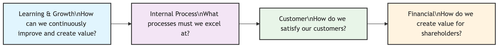

# Balanced Scorecard

In traditional business management, financial indicators (such as revenue, profit, return on investment) were often the sole measure of success. However, these indicators are essentially "lagging indicators"; they reflect past operational results but cannot effectively guide future actions. To address this issue, the **Balanced Scorecard (BSC)** emerged. It is not merely a performance measurement tool, but a powerful and comprehensive strategic management system, whose core lies in translating an organization's vision and strategy into a coherent, measurable set of performance indicators covering four key dimensions.

The core idea of the Balanced Scorecard is "balance." It achieves a delicate balance between financial and non-financial indicators, between lagging and leading indicators, between internal and external perspectives, and between short-term and long-term goals. In this way, it provides managers with a comprehensive view, much like an airplane cockpit dashboard, allowing them not only to see the current altitude and speed but also to understand the engine's condition and future direction, thereby ensuring that the entire organization can sail consistently towards strategic goals.

## The Four Perspectives of the Balanced Scorecard

The Balanced Scorecard systematically breaks down abstract strategies into concrete actions and measurable standards through four interconnected and causally linked perspectives.



<!--
```mermaid
graph TD
    subgraph The Four Perspectives of the Balanced Scorecard (Causal Relationship)
        direction LR
        A(<b>Learning & Growth</b><br/><i>How can we continuously improve and create value?</i>) --> B(<b>Internal Process</b><br/><i>What processes must we excel at?</i>);
        B --> C(<b>Customer</b><br/><i>How do we satisfy our customers?</i>);
        C --> D(<b>Financial</b><br/><i>How do we create value for shareholders?</i>);
    end
```
-->

1.  **Financial Perspective**
    *   **Core Question**: "To succeed financially, how should we appear to our shareholders?"
    *   This is the ultimate outcome of the strategy. It measures the company's profitability, growth, and shareholder value. Common indicators include: **revenue growth rate, net profit, return on investment (ROI), economic value added (EVA)**, etc.

2.  **Customer Perspective**
    *   **Core Question**: "To achieve our financial objectives, how should we appear to our customers?"
    *   It focuses on the company's performance within its target customer segments. Companies must identify their target markets and offer unique value propositions. Common indicators include: **market share, customer satisfaction, customer retention rate, customer acquisition cost, brand loyalty** etc.

3.  **Internal Business Process Perspective**
    *   **Core Question**: "To satisfy our customers and shareholders, what business processes must we excel at?"
    *   It focuses on the internal operational processes that have the greatest impact on delivering customer value propositions and achieving financial objectives. This typically includes **innovation processes** (e.g., new product development cycle), **operational processes** (e.g., production efficiency, quality control), and **after-sales service processes** (e.g., customer problem resolution time).

4.  **Learning and Growth Perspective**
    *   **Core Question**: "To achieve our vision, how will we sustain our ability to change and improve?"
    *   This is the foundation for the success of all other perspectives. It focuses on the organization's intangible assets, namely the human capital, information capital, and organizational capital required for future development. Common indicators include: **employee satisfaction and engagement, key talent retention rate, employee skill coverage, information system capabilities, organizational culture building** etc.

## How to Build and Implement a Balanced Scorecard

1.  **Step 1: Build Consensus and Clarify Strategy**
    The starting point of the Balanced Scorecard must be a clear, explicit organizational vision and strategy that has gained management consensus. For example, "To be the leader in customer experience in the industry."

2.  **Step 2: Build a Strategy Map**
    Before formally defining indicators, it is highly recommended to first draw a **Strategy Map**. This is a visual diagram that intuitively describes how strategic objectives form causal relationships across the four perspectives. It clearly tells the organization's "value creation story."

3.  **Step 3: Define Strategic Objectives, Measures, Targets, and Initiatives for Each Perspective**
    This is a systematic decomposition process:
    *   **Strategic Objectives**: Break down abstract strategies into specific objectives to be achieved within each perspective. For example, under the customer perspective, an objective is "to enhance customer loyalty."
    *   **Measures/KPIs**: Find one or more quantifiable measures for each objective. For example, the measure for "enhancing customer loyalty" is "customer repeat purchase rate."
    *   **Targets**: Set a specific, challenging, and time-bound target value for each measure. For example, "Increase customer repeat purchase rate from 60% to 70% by year-end."
    *   **Initiatives**: Plan the key projects or actions needed to achieve these target values. For example, "Launch a new VIP customer loyalty program."

## Application Cases

**Case 1: Southwest Airlines**

*   **Scenario**: Southwest Airlines is known for its low-cost, high-efficiency business model.
*   **BSC Application**:
    *   **Financial**: High profitability, low operating costs.
    *   **Customer**: On-time performance, friendly service, low fares.
    *   **Internal Process**: Fast turnaround times, efficient baggage handling, standardized aircraft fleet (Boeing 737 only).
    *   **Learning & Growth**: Employee training, high employee satisfaction, strong corporate culture.
    The success of Southwest Airlines is a classic example of how the four perspectives of the Balanced Scorecard are interconnected and mutually reinforcing.

**Case 2: A Hospital**

*   **Scenario**: A hospital aims to improve patient care quality and operational efficiency.
*   **BSC Application**:
    *   **Financial**: Increase revenue, control costs.
    *   **Customer (Patient)**: Improve patient satisfaction, reduce readmission rates.
    *   **Internal Process**: Shorten patient waiting times, reduce medical errors, optimize surgical procedures.
    *   **Learning & Growth**: Enhance medical staff skills, promote continuous learning, improve information systems.
    By implementing the Balanced Scorecard, the hospital can systematically track its progress in various aspects and ensure that improvements in one area do not come at the expense of others.

**Case 3: A Software Development Company**

*   **Scenario**: A software company wants to accelerate product development and improve customer satisfaction.
*   **BSC Application**:
    *   **Financial**: Increase subscription revenue, improve profit margins.
    *   **Customer**: Increase customer retention, improve product ratings.
    *   **Internal Process**: Shorten development cycles, reduce bugs, improve code quality.
    *   **Learning & Growth**: Enhance developer skills, foster innovation culture, improve development tools.
    The Balanced Scorecard helps the company align its development efforts with strategic goals, ensuring that technical improvements translate into business success.

## Advantages and Challenges of the Balanced Scorecard

**Core Advantages**

*   **Holistic View**: Provides a comprehensive view of organizational performance, avoiding over-reliance on single financial indicators.
*   **Strategic Alignment**: Clearly links daily operations to long-term strategic objectives, ensuring that everyone works towards the same goals.
*   **Improved Communication**: The strategy map and clear indicators facilitate communication and understanding of strategy across the organization.
*   **Promotes Learning and Growth**: Emphasizes the importance of intangible assets and continuous improvement for future success.

**Potential Challenges**

*   **Complexity of Implementation**: Requires significant time and effort to design, implement, and maintain, especially in large organizations.
*   **Difficulty in Defining Measures**: It can be challenging to find appropriate, measurable indicators for all strategic objectives, especially for intangible assets.
*   **Risk of Becoming a "Reporting Tool"**: If not properly integrated with strategic management, it can devolve into a mere reporting system without driving real change.
*   **Requires Top Management Commitment**: Sustained success depends heavily on the continuous support and commitment of senior leadership.

## Extensions and Connections

*   **Strategy Map**: An integral part of the Balanced Scorecard, visually depicting the cause-and-effect relationships between objectives across the four perspectives.
*   **Key Performance Indicators (KPIs)**: The Balanced Scorecard provides a framework for selecting and organizing KPIs that are aligned with strategic objectives.
*   **Management by Objectives (MBO)**: While MBO focuses on setting individual goals, the Balanced Scorecard provides a broader strategic context for these goals, ensuring they contribute to overall organizational success.

---
*Source Reference: The Balanced Scorecard was developed by Robert S. Kaplan and David P. Norton, first introduced in their 1992 Harvard Business Review article "The Balanced Scorecard—Measures That Drive Performance," and further elaborated in their subsequent books, including "The Balanced Scorecard: Translating Strategy into Action."*