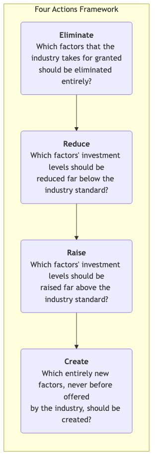

# Blue Ocean Strategy

In the business world, the vast majority of companies are fighting in a "**red ocean**." A red ocean represents all currently known market space, where industry boundaries are clear, rules of the game are defined, and companies try to grab more limited market share by beating competitors. As competitors increase, the market becomes extremely crowded, and the space for profit and growth shrinks, this ocean is "stained" red by fierce competition. **Blue Ocean Strategy** offers a completely different path; it does not advocate bloody head-on competition with rivals in the red ocean, but rather aims to **create new, uncontested "blue ocean" market space, thereby making competition irrelevant**.

The core of Blue Ocean Strategy is not technological innovation itself, but a strategic logic called **Value Innovation**. Value innovation is the intersection where companies achieve "having their cake and eating it too" by simultaneously pursuing the seemingly contradictory goals of **differentiation** and **low cost**. It is not about making trade-offs between existing value and cost, but rather breaking this trade-off to create a leap in value for both customers and the company itself. By reconstructing industry elements, Blue Ocean Strategy aims to provide customers with a new, distinctive value, thereby opening up an unprecedented vast market.

!!! abstract "Key takeaways"

    - **The core logic is value innovation**: pursue differentiation and low cost at the same time instead of choosing one.
    - **Two core tools**: the strategy canvas (what the industry competes on) and the Four Actions Framework (Eliminate, Reduce, Raise, Create).
    - **Where to look**: the Six Paths (across industries, strategic groups, buyer chains and more) and the three tiers of noncustomers.
    - **Three marks of a good strategy**: focus, divergence and a compelling tagline.
    - **Caveat**: blue oceans turn red as imitators arrive, so value innovation has to continue.

## Core Analytical Tools of Blue Ocean Strategy

Blue Ocean Strategy provides a set of systematic analytical tools to help companies systematically think about how to escape the red ocean and create a blue ocean.

1.  **Strategy Canvas**
    This is a powerful diagnostic and action framework. It visually depicts, through a single chart, on which competitive factors all competitors in a known market space are investing, and what customers are getting from it. The horizontal axis lists the key factors of competition and investment within the industry, while the vertical axis reflects the level of value companies provide to customers on each factor. By drawing the "value curves" of competitors and oneself, companies can clearly see the competitive landscape of the industry and their own strategic profile.

2.  **Four Actions Framework**
    This is the core thinking tool for breaking the "differentiation-cost" trade-off and reconstructing the value curve. It challenges the long-standing entrenched strategic logic and business model of an industry by asking four key questions:

    *   **Eliminate**: Which factors that the industry takes for granted should be eliminated?
    *   **Reduce**: Which factors should be reduced well below the industry standard?
    *   **Raise**: Which factors should be raised well above the industry standard?
    *   **Create**: Which factors should be created that the industry has never offered?

    "Eliminate" and "Reduce" lower the cost structure; "Raise" and "Create" increase buyer value and create new demand.

    

    <!-- mermaid 源文件：Blue-Ocean-Strategy-Tutorial-en-mermaid-src-1.mmd -->

3.  **Six Paths Framework**

    Blue oceans rarely appear from nowhere; they tend to lie just beyond the boundaries an industry takes for granted. The Six Paths are six systematic directions to look:

    *   **Look across alternative industries**: how do customers satisfy the same need elsewhere?
    *   **Look across strategic groups within the industry**: what makes customers pay for both the premium and the budget ends?
    *   **Look across the chain of buyers**: shift focus from the purchaser to the user or the influencer.
    *   **Look across complementary products and services**: what do customers need before, during and after using the product?
    *   **Look across functional and emotional appeal**: add emotional value to functional industries, or the reverse.
    *   **Look across time**: how will clear long-term trends change what customers value?

4.  **Three Tiers of Noncustomers**

    Red-ocean companies focus on existing customers; blue-ocean companies study noncustomers:

    *   **First tier – "soon-to-be" noncustomers**: on the edge of the market, using you minimally and ready to leave.
    *   **Second tier – "refusing" noncustomers**: they considered the industry and consciously chose not to use it.
    *   **Third tier – "unexplored" noncustomers**: never seen as potential customers by the industry at all.

    What these three tiers have in common often reveals demand far larger than the existing market.

## How to Create a Blue Ocean

1.  **Examine the Current Competitive Landscape**
    Draw the strategy canvas of your industry. Clearly list the main competitive elements of the current industry, and objectively evaluate the investment levels of major competitors and yourself on these elements, forming their respective value curves.

2.  **Use the Four Actions Framework to Challenge the Status Quo**
    Systematically apply the "Eliminate-Reduce-Raise-Create" framework to deconstruct and reconstruct existing competitive elements and customer value. In this step, the key is to dare to challenge industry's "taken-for-granted" rules and assumptions.

3.  **Build a New Value Curve**
    Based on the insights from the Four Actions Framework, build a new, distinctive value curve. An effective blue ocean strategy value curve typically has three distinct characteristics:
    *   **Focus**: The strategy clearly focuses on a few core elements.
    *   **Divergence**: The shape of the value curve is distinctly different from other competitors in the industry.
    *   **Compelling Tagline**: Able to communicate its unique value proposition to the market in simple, powerful language.

4.  **Commercialize the Blue Ocean Idea**
    Ensure that your blue ocean idea can be transformed into a viable, profitable business model. This includes considering pricing, cost structure, and partners to ensure the sustainability of the strategy.

## Classic Application Cases

**Case 1: Cirque du Soleil**

*   **Background**: The traditional circus industry (red ocean) was facing multiple pressures such as an aging audience, the rise of animal rights activism, and diversification of entertainment options, leading to its decline.
*   **Blue Ocean Strategy**: Cirque du Soleil did not compete within the framework of traditional circus but created a new market through value innovation.
    *   **Eliminate**: High-cost elements such as animal acts, star performers, and three-ring circus tents.
    *   **Reduce**: Concession stand hawking and some low-brow humor.
    *   **Raise**: The uniqueness of a single theme, the comfort and artistic sense of the venue.
    *   **Create**: A new narrative performance form that integrates theater, dance, music, and circus arts.
*   **Result**: Cirque du Soleil created a new market, attracting adult audiences who would typically attend operas or ballets, and its ticket prices were much higher than traditional circuses, thereby achieving both differentiation and low cost.

**Case 2: Nintendo Wii Console**

*   **Background**: In the early 21st century console market, Sony (PlayStation) and Microsoft (Xbox) were engaged in an intense "arms race" over graphics processing power, computing speed, and game complexity.
*   **Blue Ocean Strategy**: Nintendo did not join this red ocean competition but found a different path.
    *   **Eliminate/Reduce**: The pursuit of top-tier HD graphics and computing speed, and complex controller designs.
    *   **Increase/Create**: Created a new, intuitive way of gaming based on motion sensing and motion capture, and simple, easy-to-learn controllers. It emphasized the social fun of family entertainment and full-body movement.
*   **Result**: The Wii attracted a large number of users who had never played games before, including children, women, and the elderly, creating a major sales miracle in console history.

**Case 3: Yellow Tail Wine**

*   **Background**: The US wine market was divided into two camps: on one end, cheap table wines of low quality; on the other, expensive, complex fine wines, whose complex terminology and tasting rules intimidated ordinary consumers.
*   **Blue Ocean Strategy**: Yellow Tail aimed to create a fun, uncomplicated wine that ordinary people could easily enjoy.
    *   **Eliminate/Reduce**: Complex winemaking terminology, aging potential, oak barrel flavors, and other intimidating traditional wine marketing elements.
    *   **Increase/Create**: Created an easy-drinking fruity taste, easily recognizable packaging (kangaroo logo), and the convenience of being easily purchased in ordinary supermarkets.
*   **Result**: Yellow Tail quickly became the number one imported wine brand in the US, it attracted consumers who typically drank beer or cocktails, successfully converting "non-wine drinkers" into its customers.

**Case 4: Budget Hotel Chains**

- **Background**: Lodging used to be polarized: full-service hotels that were expensive, and cheap guesthouses where cleanliness and safety were unpredictable. Large numbers of business and leisure travelers sat in between.
- **Blue ocean strategy**:
  - **Eliminate**: Grand lobbies, leisure facilities, banquet halls and multiple restaurants.
  - **Reduce**: Room size, staffed services beyond the front desk, decorative luxury.
  - **Raise**: Standardized bed and bathroom quality, convenient locations, consistent quality across the chain.
  - **Create**: Membership programs and unified online booking, so guests can expect the same experience in any city.
- **Result**: Budget chains delivered what guests cared about most, a clean, safe room and a good night's sleep, at a fraction of full-service prices, and grew into a large new category. Many imitators followed, the ocean turned red, and the leading brands then moved to the mid-scale segment in search of a new value curve.

## Value and Challenges of Blue Ocean Strategy

**Core Value**

*   **Escaping Zero-Sum Game**: By creating new demand, companies can achieve rapid growth without direct competition for a period.
*   **Reshaping Industry Boundaries**: A successful blue ocean strategy can change the rules of competition in an industry, or even create an entirely new industry.
*   **Building Strong Brands**: As pioneers of new markets, it is easy to establish strong brand recognition and customer loyalty.

**Potential Challenges**

*   **High Difficulty of Execution**: Requires deep insight, extraordinary creativity, and the courage to challenge industry traditions.
*   **Organizational Resistance**: Implementing a blue ocean strategy often requires significant adjustments to the company's existing operations, culture, and mindset, which may encounter internal resistance.
*   **Blue Ocean May Turn Red**: Any successful blue ocean will eventually attract imitators and followers, causing the blue ocean to gradually turn red. Therefore, companies need the ability to continuously innovate value.

## Red Ocean vs. Blue Ocean Strategy

| Red Ocean Strategy | Blue Ocean Strategy |
| --- | --- |
| Compete in existing market space | Create uncontested market space |
| Beat the competition | Make the competition irrelevant |
| Exploit existing demand | Create and capture new demand |
| Make the value–cost trade-off | Break the value–cost trade-off |
| Align the whole company with differentiation **or** low cost | Align the whole company with differentiation **and** low cost |

## Blue Ocean Templates

**1. Strategy canvas data table**

List the key factors of competition, score yourself and your main competitors on each (1–5), then plot each row as a line: that line is the value curve.

| Factor of competition | Competitor A | Competitor B | Us (today) | Us (blue ocean plan) |
| --- | --- | --- | --- | --- |
| Price | | | | |
| Factor 2 | | | | |
| Factor 3 | | | | |
| … | | | | |
| Newly created factor | 0 | 0 | 0 | |

**2. ERRC grid (Eliminate–Reduce–Raise–Create)**

| Eliminate | Raise |
| --- | --- |
| Which factors don't customers really care about? | Which factors do customers care about that the industry under-delivers? |
| | |
| **Reduce** | **Create** |
| Which factors does the industry over-deliver? | What do customers need that the industry has never offered? |
| | |

When you're done, check: do the savings from Eliminate and Reduce pay for the investments in Raise and Create? If only the right-hand column is filled in, you have differentiation, not value innovation.

## Common Mistakes

1.  **Equating blue oceans with technology innovation.** Many blue oceans need no new technology, as Cirque du Soleil and Yellow Tail show. The key is redefining buyer value, not building a more advanced product.
2.  **Only adding things.** Thinking only about Raise and Create drives costs up and produces a pricier differentiated product, not value innovation. Real blue oceans involve bold Eliminate and Reduce decisions.
3.  **Mistaking a niche for a blue ocean.** Carving a narrower segment out of an existing market and competing there is still red-ocean thinking. Blue Ocean Strategy is about converting noncustomers and expanding the market.
4.  **Only researching current customers.** Existing customers tend to ask for "the same, but better and cheaper". New demand is more likely to be found among the three tiers of noncustomers.
5.  **Stopping at the canvas.** The strategy canvas and ERRC grid are thinking tools. Without testing buyer utility, price, cost and adoption, a blue-ocean idea stays on paper.
6.  **Assuming the ocean stays blue.** Success attracts imitators. Keep monitoring whether your value curve is converging with theirs.

## Frequently Asked Questions

??? question "How is Blue Ocean Strategy different from a differentiation strategy?"

    A differentiation strategy accepts that more value means more cost and charges a premium to cover it. Blue Ocean Strategy tries to break that trade-off: it removes or reduces factors the industry over-invests in to cut cost, while adding what buyers truly value, achieving differentiation and low cost together.

??? question "Is Blue Ocean Strategy suitable for small businesses?"

    Yes, and often more so. Small firms rarely win head-on resource battles with large ones, and redefining buyer value is one of the few ways to punch above your weight. The Four Actions Framework and noncustomer analysis cost almost nothing to apply.

??? question "Is Blue Ocean Strategy the same as disruptive innovation?"

    No. Disruptive innovation usually enters at the low end or in a new foothold with a simpler, cheaper offering and gradually displaces incumbents. Blue Ocean Strategy can happen at any price level; its focus is creating new demand through value innovation.

??? question "How can I tell whether I'm in a red ocean?"

    Draw a strategy canvas. If your value curve almost overlaps with your main competitors', everyone competes on the same factors, and price is the main weapon, you are in a red ocean.

??? question "Does Blue Ocean Strategy contradict Porter's Five Forces?"

    No, they take different perspectives. [Porter's Five Forces](../strategic_analysis/Porters-Five-Forces-Tutorial-en.md) helps you understand and position yourself within an existing industry structure; Blue Ocean Strategy tries to change the industry's boundaries. A common approach is to use the Five Forces to see the red ocean clearly, then blue-ocean tools to find a way out.

## Extensions and Connections

*   **[Business Model Canvas](../business_model/Business-Model-Canvas-Tutorial-en.md)**: An excellent tool for designing and planning how to transform a blue ocean strategy idea into a viable, profitable business model.
*   **Value Proposition Canvas**: Can help you deeply consider how your new product or service creates value for customers, solves their pain points, and brings gains.
*   **Disruptive Innovation**: Related to but different from Blue Ocean Strategy. Disruptive innovation usually refers to entering the market from the low end or a new foothold by providing simpler, cheaper solutions, and ultimately disrupting existing market leaders. Blue Ocean Strategy is not limited to this; it can occur at any market level.

---
*Source Reference: W. Chan Kim and Renée Mauborgne's groundbreaking work "Blue Ocean Strategy: How to Create Uncontested Market Space and Make the Competition Irrelevant" is the foundational work of this theory, containing numerous case studies and detailed analytical frameworks.*