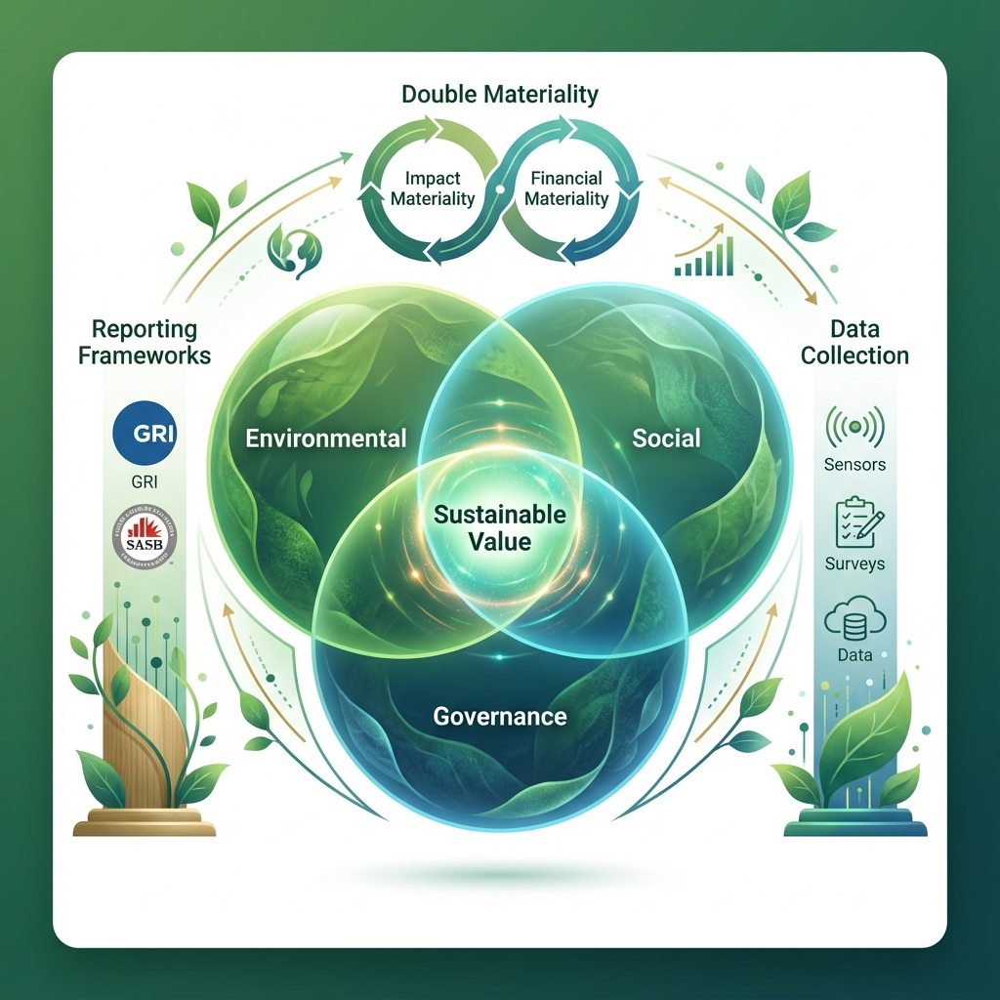

# Introduction to ESG Reporting

> **Concept**: Environmental, Social, and Governance (ESG).
> **Objective**: To evaluate the extent to which a corporation works on behalf of social goals that go beyond the role of a corporation to maximize profits.

## Why ESG Methodologies Matter?
In 2025, ESG is no longer optional. It is a compliance requirement (CSRD, SEC rules) and a core component of risk management.

### The Double Materiality Principle
*   **Impact Materiality**: How the company affects the world (e.g., carbon emissions).
*   **Financial Materiality**: How the world affects the company (e.g., climate change risks).

## Key Reporting Frameworks
*   **GRI** (Global Reporting Initiative)
*   **SASB** (Sustainability Accounting Standards Board)
*   **TCFD** (Task Force on Climate-related Financial Disclosures)

## Implementation Steps
1.  **Materiality Assessment**: Identify what matters.
2.  **Data Collection**: Carbon accounting (Scope 1, 2, 3).
3.  **Reporting**: Transparency and Assurance.
