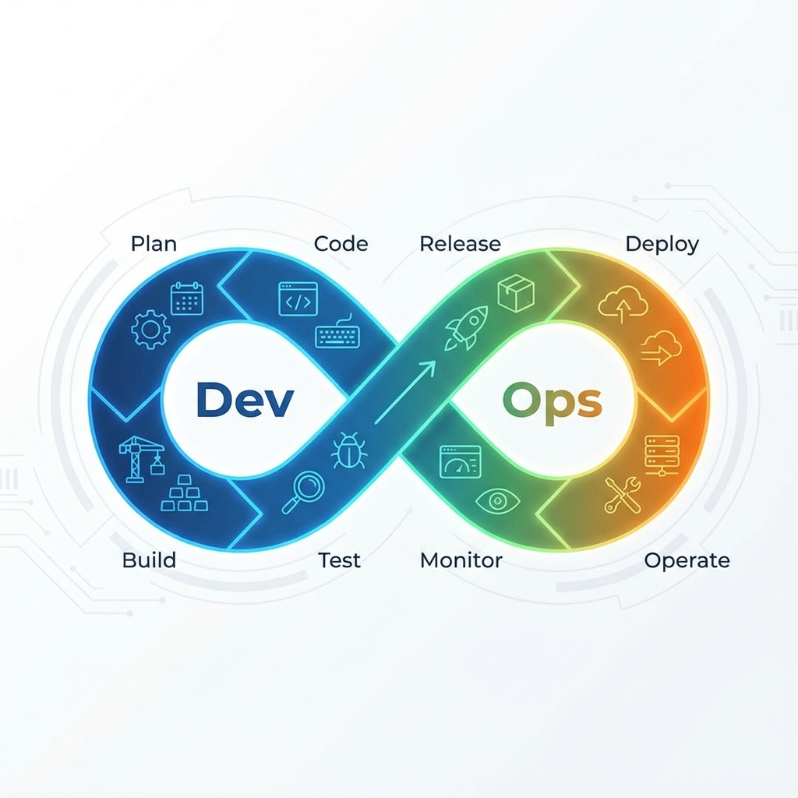

# Introduction to DevOps and DevSecOps

For a long time, software teams were split in two. Developers were rewarded for shipping change; operations teams were rewarded for keeping systems stable. Releases were large, rare and risky, and when something broke, each side blamed the other. **DevOps** is the cultural and technical movement that closes this gap: development and operations share responsibility for delivering software that is both fast-moving and reliable.

DevOps is not a tool or a job title. It combines a **culture** of shared ownership, **practices** such as continuous integration and delivery, and **automation** that makes small, frequent, low-risk changes possible. **DevSecOps** extends the same idea to security: instead of a security review at the end, security checks are built into every stage of the pipeline ("shifting left").

!!! abstract "Key takeaways"

    - **Goal**: deliver changes quickly, safely and sustainably, with short feedback loops from production back to development.
    - **CALMS**: Culture, Automation, Lean, Measurement, Sharing.
    - **Core practices**: CI/CD, infrastructure as code, automated testing, observability, blameless postmortems.
    - **Measure with DORA metrics**: deployment frequency, lead time for changes, change failure rate, time to restore service.
    - **DevSecOps** integrates security scanning and policies into the pipeline instead of a final gate.

## The CALMS Principles

| Principle | Meaning | In practice |
| --- | --- | --- |
| **Culture** | Shared responsibility for outcomes across dev, ops and security | "You build it, you run it"; blameless incident reviews |
| **Automation** | Remove manual, error-prone steps | Automated builds, tests, deployments and infrastructure |
| **Lean** | Small batches, fast flow, eliminate waste | Frequent small releases, limiting work in progress |
| **Measurement** | Decisions based on data | Pipeline metrics, service-level objectives, DORA metrics |
| **Sharing** | Knowledge and tools flow across teams | Shared runbooks, internal platforms, postmortems published widely |

## The DevOps Lifecycle

| Stage | What happens | Typical tools |
| --- | --- | --- |
| **Plan** | Define work as small, valuable increments | Issue trackers, backlogs |
| **Code** | Write code with version control and code review | Git, pull requests |
| **Build** | Compile and package automatically on every change | CI servers (e.g. GitHub Actions, GitLab CI, Jenkins) |
| **Test** | Automated unit, integration and security tests | Test frameworks, SAST/DAST, dependency scanning |
| **Release** | Approve and version an artifact for deployment | Artifact repositories, release automation |
| **Deploy** | Roll out automatically, often progressively | Kubernetes, cloud platforms, feature flags, canary releases |
| **Operate** | Run and scale the service | Infrastructure as code (e.g. Terraform, Ansible) |
| **Monitor** | Observe behavior and feed learning back into planning | Logging, metrics, tracing, alerting |

## Core Practices

1.  **Continuous Integration (CI)**: developers merge small changes into the main branch frequently; every change triggers an automated build and test run.
2.  **Continuous Delivery / Deployment (CD)**: every change that passes the pipeline is releasable (delivery) or automatically released (deployment).
3.  **Infrastructure as Code (IaC)**: servers, networks and configuration are defined in version-controlled code, making environments reproducible.
4.  **Automated testing**: a fast, reliable test suite is what makes frequent releases safe.
5.  **Observability**: logs, metrics and traces let teams understand what the system is doing and why.
6.  **Progressive delivery**: feature flags, canary and blue-green deployments limit the impact of a bad change.
7.  **Blameless postmortems**: incidents are treated as learning opportunities about the system, not as occasions to blame individuals.

## DevSecOps: Shifting Security Left

| Stage | Security practice |
| --- | --- |
| Plan | Threat modeling for new features |
| Code | Secure coding guidelines; secrets never committed |
| Build & test | Static analysis (SAST), dependency and container scanning |
| Deploy | Policy as code; signed artifacts |
| Operate | Dynamic testing (DAST), runtime protection, least-privilege access |
| Monitor | Security monitoring and incident response integrated with ops |

## Measuring DevOps Performance: The DORA Metrics

| Metric | What it measures |
| --- | --- |
| **Deployment frequency** | How often you deploy to production |
| **Lead time for changes** | Time from code committed to running in production |
| **Change failure rate** | Share of deployments causing a failure in production |
| **Time to restore service** | How long it takes to recover from a failure |

Research by the DORA program (popularized in the book *Accelerate*) found that high-performing teams excel at **both** speed and stability, rather than trading one for the other.

## Common Pitfalls

1.  **Renaming the ops team "DevOps".** Without changing responsibilities and incentives, nothing improves.
2.  **Tools before culture.** A new CI/CD platform won't help if releases still require weeks of manual approvals.
3.  **Automating a bad process.** Simplify and stabilize first; automation then makes it fast.
4.  **Flaky tests.** Unreliable tests train people to ignore failures, which defeats the pipeline.
5.  **Security as a final gate.** Late findings are expensive and delay releases; build checks into each stage.

## Frequently Asked Questions

??? question "Is DevOps a role or a culture?"

    Primarily a culture and set of practices. Many organizations have "DevOps engineer" or "platform engineer" roles, but the goal is shared ownership across development and operations, not a new silo.

??? question "What is the difference between DevOps and agile?"

    [Agile](../../Product & User/product_development/Agile-Tutorial-en.md) focuses on how teams plan and build in small increments with customer feedback. DevOps extends that flow through testing, deployment and operations so that increments actually reach users quickly and reliably.

??? question "What is the difference between CI and CD?"

    Continuous integration means merging and automatically testing changes frequently. Continuous delivery means every change that passes is ready to release; continuous deployment releases it automatically.

??? question "How does DevOps relate to lean?"

    DevOps applies lean ideas (small batches, flow, eliminating waste and continuous improvement) to software delivery. See [Lean Operations](../../Strategy & Business/quality_and_operations/Lean-Operations-Tutorial-en.md) and [Kanban](../../Product & User/product_development/Kanban-Tutorial-en.md).

## Extensions and Connections

*   **[Agile](../../Product & User/product_development/Agile-Tutorial-en.md)**: Agile delivers small increments; DevOps gets them to production safely.
*   **[Kanban](../../Product & User/product_development/Kanban-Tutorial-en.md)**: Widely used by operations and platform teams to visualize and limit work in progress.
*   **[Lean Operations](../../Strategy & Business/quality_and_operations/Lean-Operations-Tutorial-en.md)**: The source of DevOps ideas about flow and waste.
*   **[Six Sigma](../../Strategy & Business/quality_and_operations/Six-Sigma-Tutorial-en.md)**: Data-driven reduction of variation, relevant to improving change failure rates.

---

*Reference: Gene Kim, Jez Humble, Patrick Debois and John Willis's *The DevOps Handbook*, and Nicole Forsgren, Jez Humble and Gene Kim's *Accelerate*, are widely used sources on DevOps practices and metrics.*
