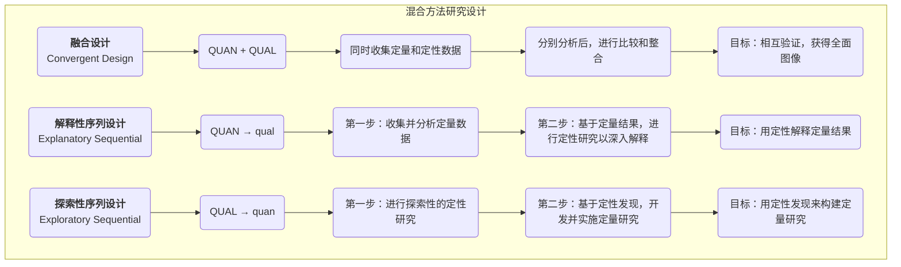

# 混合方法研究

在研究领域，长久以来存在着两种主流范式：以数字和统计为武器的**定量研究**，和以语言和情境为核心的**定性研究**。前者追求客观与普适，后者探寻深度与意义。然而，越来越多的研究者发现，任何单一的方法都像盲人摸象，只能触及现实的一部分。**混合方法研究（Mixed-Methods Research）** 应运而生，它并非简单地将两种方法进行相加，而是一种更为成熟和智慧的研究哲学。

其核心理念在于，通过在一个研究项目中，有策略地、系统性地整合定量和定性两种数据及其分析方法，以期获得比任何单一方法都更为全面、深入和多维度的理解。它相信，数字可以揭示模式的广度，而故事则能展现模式背后的深度。两者的结合，能够让研究结论更加坚实、更具洞察力。

## 为何要混合？研究的协同效应

混合方法研究的魅力在于其能实现“1+1>2”的协同效应。根据整合的目的不同，其核心价值主要体现在以下几个方面：

*   **三角互证（Triangulation）**：这是最常见的目的。即用一种方法的数据来验证或佐证另一种方法得出的结论。如果定量问卷的结果和定性访谈的发现相互印证，那么研究结论的可靠性将大大增强。
*   **互补（Complementarity）**：用一种方法的优势来弥补另一种方法的不足。例如，用定性访谈来深入解释定量调查中发现的某个意外的统计关系，让“知其然”也“知其所以然”。
*   **发展（Development）**：用一种方法的发现来指导另一种方法的实施。例如，先进行探索性的定性访谈，以识别出关键的主题和变量，再基于这些发现来设计一份更具针对性的大规模调查问卷。
*   **启发（Initiation）**：当定量和定性研究得出了相互矛盾或悖反的结果时，这本身就是一个极具价值的重大发现，它能挑战现有理论，激发全新的思考和更深入的研究。

### 核心混合设计类型

混合方法研究有多种设计模式，其中最核心的三种是：

## 如何进行一次混合方法研究

1.  **确定研究的必要性**
    首先要明确，为什么单一方法不足以回答你的研究问题？混合的目的是什么？是验证、互补、发展还是启发？清晰的 rationale 是成功的前提。

2.  **选择合适的混合设计**
    根据你的研究目的和问题，选择最合适的整合模式。是同时进行（融合设计），还是分步进行（序列设计）？哪种方法应该先行？

3.  **分阶段收集与分析数据**
    根据你选择的设计，系统地执行每个阶段的数据收集和分析。这需要研究者同时具备定量和定性研究的技能。

4.  **关键的整合环节**
    这是混合方法研究的核心和难点。你需要在“整合点”将两种不同类型的数据进行有意义的连接。这可能是在结果讨论部分将两者进行比较，也可能是用定性数据来解释定量数据中的特定群体，或是用定性发现来构建定量问卷的题项。

5.  **得出整合性结论**
    最终的结论不应是定量和定性发现的简单罗列，而应是两者碰撞、融合后产生的、更具高度和深度的整合性洞察。

## 应用案例

**案例一：评估一项新的员工福利计划**
*   **场景**：一家公司推出了一项新的弹性工作制福利，希望全面评估其效果。
*   **应用（解释性序列设计：QUAN → qual）**：
    1.  **定量阶段**：公司首先向全体员工分发了一份匿名问卷，收集关于新福利使用频率、工作满意度、工作压力等指标的量化数据。数据显示，整体满意度显著提升，但工程师群体的满意度提升不明显。
    2.  **定性阶段**：为了解释这个“意外”的发现，研究者对10名工程师进行了深度访谈。访谈发现，由于项目周期的特殊性，工程师们很难真正享受到弹性工作的好处，反而因为需要与非弹性时间的同事协作而增加了沟通成本。
    3.  **整合结论**：新福利整体上是成功的，但需要为特定岗位（如工程师）设计更具针对性的配套支持措施。

**案例二：开发一款面向Z世代的社交App**
*   **场景**：一个创业团队希望开发一款能真正吸引Z世代年轻人的社交产品。
*   **应用（探索性序列设计：QUAL → quan）**：
    1.  **定性阶段**：团队首先对20名Z世代用户进行了为期一个月的“数字民族志”研究，深入观察和访谈他们的线上社交行为、黑话体系和核心社交诉求。研究发现，“无压力社交”和“圈层认同”是两大核心需求。
    2.  **定量阶段**：基于这些定性洞察，团队设计了一份大规模调查问卷，来验证这些需求的普遍性，并测试了几个基于此开发出的产品概念（如“阅后即焚”、“兴趣圈匹配”）的吸引力。问卷结果显示，“兴趣圈匹配”功能获得了最高的期待值。
    3.  **整合结论**：产品的核心应围绕“兴趣圈匹配”来构建，并融入“无压力”的设计哲学。

**案例三：研究气候变化对农民生计的影响**
*   **场景**：一个国际发展组织希望了解气候变化对某地区小农户的具体影响。
*   **应用（融合设计：QUAN + QUAL）**：
    *   研究团队**同时**进行两项工作：一方面，他们收集并分析了该地区过去20年的气象数据和农作物产量数据（定量）；另一方面，他们深入村庄，与老农们进行深度访谈，听他们讲述自己感受到的天气变化、应对策略以及对未来的担忧（定性）。
    *   **整合**：在最终报告中，冰冷的产量下降曲线图（定量）与老农们充满情感和生活智慧的故事（定性）并置呈现，极具冲击力地揭示了气候变化的严峻性，为政策制定者提供了强有力的决策依据。

## 混合方法研究的优势与挑战

**核心优势**
*   **全面与深入**：能够同时看到问题的“全貌”和“特写”，结论更具说服力。
*   **增强信度**：不同方法间的相互验证（三角互证）可以大大提高研究结论的可靠性。
*   **回答更复杂的问题**：能够处理那些单一方法无法应对的、多层次的复杂研究问题。

**潜在挑战**
*   **设计复杂**：需要精心设计两种方法的整合点和时间线。
*   **耗时耗力**：通常比单一方法研究需要更多的时间、资源和预算。
*   **技能要求高**：要求研究者或研究团队同时精通定量和定性两种研究范式。
*   **结果可能矛盾**：当两种方法得出不一致的结论时，如何解释和整合将成为一个巨大的挑战（当然，也可能是重大发现的契机）。

## 延伸与关联

*   **定量研究**与**定性研究**：是混合方法研究的两个基本构成模块。理解这两者各自的哲学基础和技术细节，是进行混合方法研究的前提。

---
*来源参考：约翰·W·克雷斯维尔（John W. Creswell）是混合方法研究领域最重要和最多产的学者之一，他的著作，如《研究设计：定性、定量与混合方法路径》（Research Design: Qualitative, Quantitative, and Mixed Methods Approaches），是该领域的入门和进阶必读经典。*
