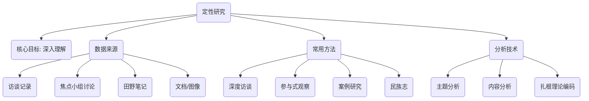

# 定性研究

与追求客观测量和统计规律的定量研究不同，**定性研究（Qualitative Research）** 是一条通往理解人类经验深层含义的探索之路。它不满足于“是什么”或“有多少”的答案，而是执着于追问“为什么”和“怎么样”。定性研究的核心在于深入、全面地探索个人或群体的行为、动机、信念和体验，旨在从非数值的、描述性的数据（如语言、文字、图像、行为）中，发现意义、构建理论。

当你想要理解用户为何对你的产品感到困惑，或者想要探索一种特定社会文化现象的内在逻辑时，定性研究便展现出其独特的魅力。它不是用数字去概括，而是用故事去揭示；不是在验证预设的假设，而是在丰富的现实情境中发现新的洞察。

## 定性研究的核心理念

定性研究建立在解释主义或建构主义的哲学基础之上，认为现实是主观的、多重的，并且是在社会互动中被建构出来的。

*   **情境性（Contextual）**：定性研究强调必须在被研究者所处的自然、真实的环境中去理解他们。脱离了情境，行为和语言就可能失去其本来的意义。
*   **解释性（Interpretive）**：研究者本身就是最重要的研究工具。研究过程涉及对收集到的资料进行深入的、主观的解读和诠释，以提炼出核心主题和模式。
*   **生成性（Emergent）**：研究设计通常是灵活和开放的，研究问题和焦点可能会随着研究的深入而调整和演变。它的目标往往是从数据中“生长”出理论，而非检验现有理论。
*   **整体性（Holistic）**：定性研究试图将被研究的对象作为一个复杂的整体来理解，关注各个部分之间的相互联系和动态互动。

### 定性研究方法导图

## 如何进行一次定性研究

1.  **确立探索性的研究问题**
    定性研究的问题通常是开放式的，以“如何”、“怎样”或“什么”开头。例如：“用户在首次使用我们的App时，会经历怎样的心路历程和操作障碍？”

2.  **选择研究参与者**
    定性研究不追求样本的统计代表性，而是采用**目的性抽样（Purposive Sampling）**，即有意选择那些能够为研究问题提供最丰富、最深入信息的个体或案例。

3.  **收集数据**
    采用合适的定性方法收集数据。这可能是一个漫长而深入的过程。
    *   **深度访谈**：进行一对一的、半结构化的对话，鼓励参与者分享他们的故事和感受。
    *   **焦点小组**：组织一小组（通常6-8人）参与者进行集体讨论，观察他们之间的互动和观点的碰撞。
    *   **观察法**：在不打扰或参与的情况下，观察人们在自然环境中的行为。

4.  **数据分析与编码**
    这是定性研究中最具挑战性的一步。研究者需要反复阅读、梳理大量的文本或图像资料，通过**编码（Coding）** 的方式，将数据打散、比较、再聚合，从中识别出反复出现的主题（Themes）、模式（Patterns）和类别（Categories）。

5.  **解释与理论构建**
    基于分析出的核心主题，研究者需要构建一个有逻辑、有深度的解释框架或故事线，来回答最初的研究问题，并可能从中提炼出新的理论洞察。

## 应用案例

**案例一：探索智能音箱在老年人家庭中的使用体验**
*   **场景**：一家科技公司希望了解其新开发的智能音箱是否适合老年用户。
*   **应用**：研究团队招募了10个老年人家庭，为他们免费安装了智能音箱。在接下来的一个月里，研究人员通过定期上门访谈和在客厅角落的非侵入式观察，记录下老人们与音箱的互动方式、遇到的困难（如口音识别问题）、创造性的用法（如用作天气预报和戏曲播放器），以及他们对这个“新家庭成员”的情感反应。最终的报告充满了生动的故事和细节，为产品的迭代提供了极其宝贵的、数据无法体现的洞察。

**案例二：理解企业创新文化为何难以落地**
*   **场景**：一家大公司的CEO发现，尽管公司层面反复强调“创新”，但基层员工的创新活力依然不足。
*   **应用**：一位组织发展顾问对公司的三个不同部门进行了为期两周的“民族志”研究。他作为一名“实习生”参与部门的日常工作和会议，与员工们一起午餐、闲聊。他发现，虽然口号响亮，但公司的绩效考核体系依然只奖励短期业绩，且对失败的容忍度极低。员工们私下普遍认为“创新是高风险、低回报的”，这种深层信念才是阻碍创新的根本原因。

**案例三：为一款新的旅行App寻找设计灵感**
*   **场景**：一个创业团队想开发一款与众不同的旅行App。
*   **应用**：团队组织了三场焦点小组讨论，分别邀请了背包客、家庭旅行者和商务旅行者。在讨论中，团队并非直接询问“你需要什么功能”，而是引导他们分享过去最难忘和最糟糕的旅行经历。通过分析这些故事，团队发现“意外的惊喜”和“与当地人的真实连接”是构成美好回忆的关键，而“信息过载”和“千篇一律的攻略”则是最大的痛点。这些洞察最终催生了一款主打“探索未知”和“本地人带玩”的App概念。

## 定性研究的优势与局限

**核心优势**
*   **深度与丰富性**：能够提供对现象的、有血有肉的深入理解。
*   **情境化**：在真实、自然的环境中理解行为和意义。
*   **灵活性**：能够根据研究过程中的新发现，灵活调整研究方向。
*   **发现新理论**：非常适合在未知领域进行探索，并从中构建新的理论框架。

**潜在局限**
*   **主观性强**：研究结果在很大程度上依赖于研究者的个人解读和分析能力。
*   **样本量小，无法概括**：研究结论通常不能直接推广到更大的群体。
*   **耗时耗力**：数据的收集和分析过程通常非常耗费时间和精力。
*   **难以复制**：由于其情境性和研究者的主观性，研究过程很难被精确复制。

## 延伸与关联

*   **定量研究**：定性研究的发现可以为后续的定量研究提供有价值的假设。例如，通过访谈发现了一个可能的影响因素，再通过大规模问卷来验证其普遍性。
*   **扎根理论、民族志、案例研究**：这些都是定性研究中更具体、更系统化的方法论。
*   **混合方法研究**：将定性研究与定量研究结合，是当前研究领域的主流趋势，旨在实现优势互补。

---
*来源参考：定性研究的根基可追溯至马克斯·韦伯（Max Weber）的“理解社会学”。诺曼·邓津（Norman K. Denzin）和伊冯娜·林肯（Yvonna S. Lincoln）主编的《The SAGE Handbook of Qualitative Research》是该领域最权威和全面的参考文献之一。*
