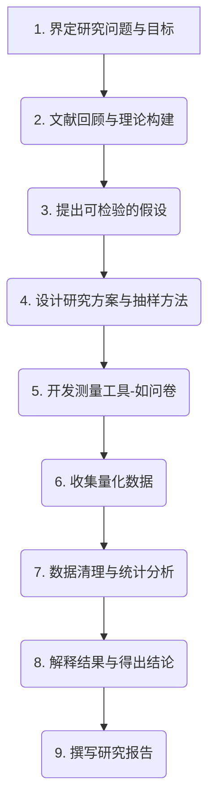

# 定量研究

在探究世界的众多方法中，**定量研究（Quantitative Research）** 是以数值和统计为语言，力求客观、系统地测量社会与自然现象的一种核心方法。它并非简单地与数字打交道，其本质是一种通过量化数据来验证假设、揭示规律、并预测未来趋势的实证主义范式。当你需要回答“有多少？”、“频率如何？”、“两者之间是否存在显著关系？”这类问题时，定量研究便成为了不可或缺的工具。

它试图将复杂的现象转化为可测量、可比较的变量，并通过严谨的统计分析，得出具有普遍性、可被重复验证的结论。从医学领域的药物疗效检验，到市场营销中的消费者偏好调查，再到社会学中的宏观趋势分析，定量研究为我们理解和改造世界提供了坚实的逻辑与数据支撑。

## 定量研究的核心逻辑

定量研究的整个过程，如同一场严谨的逻辑推理，其核心在于从理论假设出发，通过数据进行验证。

*   **变量（Variables）**：这是定量研究的基本单位。研究者通常关注两种核心变量：**自变量（Independent Variable）**，即被研究者操纵或改变的因素；以及**因变量（Dependent Variable）**，即随自变量变化而变化的、被测量的结果。
*   **假设（Hypothesis）**：在研究开始前，研究者会基于现有理论或观察，提出一个关于变量之间关系的、可被检验的预测。例如，“增加网站按钮的尺寸（自变量）将会提高其点击率（因变量）”。
*   **抽样（Sampling）**：由于无法研究整个目标群体（总体），定量研究会选取一部分有代表性的个体（样本）进行研究。为了确保结论的普适性，抽样过程必须科学，常见的有随机抽样、分层抽样等。
*   **数据分析（Data Analysis）**：收集到数据后，研究者会运用统计学工具（如描述性统计、推断性统计）来分析数据，检验最初的假设是否成立。

### 定量研究流程图

## 如何进行一次定量研究

1.  **明确研究问题**
    首先，你需要一个清晰、具体、可被测量的问题。例如，将“我想了解大学生的幸福感”这个模糊想法，具体化为“家庭收入水平与大学生的主观幸福感得分之间是否存在正相关关系？”

2.  **构建理论与假设**
    回顾相关的文献和理论，了解前人对这个问题的研究。基于此，提出你的假设，如：“H1: 家庭收入水平越高，大学生的主观幸福感得分也越高。”

3.  **设计研究与测量**
    确定你的研究设计（是调查、实验还是相关性研究？），并设计你的数据收集工具。例如，设计一份包含“家庭月收入区间”选项和国际通用的“主观幸福感量表”的调查问卷。

4.  **抽样与数据收集**
    确定你的目标研究群体（如“全国范围内的在校大学生”），并采用合适的抽样方法（如在多所大学中进行随机抽样）来分发问卷，收集数据。

5.  **分析与解释**
    将收集到的数据录入统计软件（如SPSS, R），进行描述性统计（如计算平均幸福感得分）和推断性统计（如进行相关性分析或回归分析），以检验你的假设是否被数据支持。

6.  **撰写报告**
    最后，将整个研究过程、数据分析结果、结论以及研究的局限性，系统地撰写成研究报告。

## 应用案例

**案例一：A/B测试在网页优化中的应用**
*   **场景**：一家电商公司希望提高其产品页面的“加入购物车”按钮的转化率。
*   **应用**：他们设计了两个版本的按钮：A版本是红色，B版本是绿色。通过将网站流量随机分配给两个版本，他们收集了数万名访客的数据。统计分析显示，绿色按钮的点击率（因变量）比红色按钮高出15%，且差异在统计上显著。公司因此决定全站采用绿色按钮。

**案例二：新药的临床试验**
*   **场景**：一家制药公司研发了一种新的降血压药物。
*   **应用**：研究人员招募了500名高血压患者，将他们随机分为两组。实验组服用新药，对照组服用无有效成分的安慰剂。在三个月后，测量所有患者的血压（因变量）变化。结果显示，实验组的平均血压下降幅度远大于对照组，证明了新药的有效性。

**案例三：公共政策的效果评估**
*   **场景**：一个城市为了缓解交通拥堵，实施了“单双号限行”政策。
*   **应用**：政府通过分析政策实施前后一年的交通流量监测数据、平均通勤时间数据以及空气质量指数（因变量），来量化评估该政策的实际效果。他们发现，政策实施后，工作日平均车流量下降了20%，但周末的交通拥堵状况有所加剧。

## 定量研究的优势与局限

**核心优势**
*   **客观性与可复制性**：由于依赖数值和标准化流程，研究结果相对客观，且其他研究者可以重复验证。
*   **概括能力强**：通过科学的抽样，研究结论可以从样本推广到更大的总体。
*   **便于统计分析**：可以进行复杂的统计建模，发现变量间的精确关系。

**潜在局限**
*   **简化现实**：将复杂的社会现象简化为有限的几个变量，可能会忽略其背后的丰富情境和深层原因。
*   **无法回答“为什么”**：它能很好地揭示“是什么”和“有多少”，但往往难以深入解释现象背后的动机和过程。
*   **测量误差**：问卷的设计、被试的回答都可能存在偏差，从而影响数据的准确性。

## 延伸与关联

*   **定性研究**：与定量研究形成完美互补。定量研究发现宏观规律后，可以用定性研究来深入探索其背后的原因。
*   **混合方法研究**：将定量和定性研究结合，以获得对问题最全面、最深入的理解。
*   **相关性研究**与**实验研究**：都是定量研究的具体类型，前者关注变量间的关联，后者则旨在建立因果关系。

---
*来源参考：定量研究的方法论根植于实证主义哲学，其统计学基础由卡尔·皮尔逊（Karl Pearson）等统计学家奠定。厄尔·巴比（Earl Babbie）的《社会研究方法》是该领域的经典教科书。*
