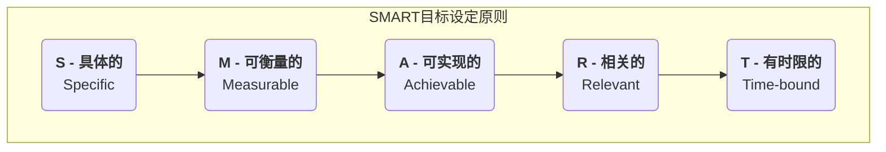

# SMART原则

在目标管理领域，一个常见的问题是，我们设定的目标往往过于模糊、不切实际，最终导致它们被束之高阁，无法被有效执行和衡量。例如，“我想要变得更健康”或“我们公司要提升品牌影响力”，这些愿望虽然美好，但因为缺乏清晰的定义和可行的路径，最终往往不了了之。**SMART原则** 正是为解决这一问题而生的一套被广泛应用、极其有效的**目标设定标准**。它提供了一个清晰的、由五个维度构成的清单，用于指导我们设定出高质量的、可执行、可跟踪的目标。

SMART是五个英文单词的首字母缩写，它要求一个有效的目标必须是：

*   **S - 具体的（Specific）**
*   **M - 可衡量的（Measurable）**
*   **A - 可实现的（Achievable）**
*   **R - 相关的（Relevant）**
*   **T - 有时限的（Time-bound）**

遵循SMART原则，就如同为我们的目标安装了一个精确的导航系统。它将一个模糊的“愿望”，转化为一个清晰的“目的地”和一条明确的“路线图”，从而极大地提高了目标达成的可能性。

## SMART原则的五个维度详解

让我们来逐一分解这五个维度，理解它们如何共同作用，塑造一个高质量的目标。

1.  **S - 具体的（Specific）**
    *   **核心要求**：目标必须是清晰、明确、不含糊的。它应该清楚地回答“What”（做什么）、“Why”（为什么做）、“Who”（谁来做）、“Where”（在哪里做）等问题。
    *   **反例**：“我想提升我的英语水平。”
    *   **正例**：“我（Who）希望通过提升商务英语沟通能力（What），来获得晋升机会（Why）。我将在本地的培训机构进行学习（Where）。”

2.  **M - 可衡量的（Measurable）**
    *   **核心要求**：目标必须是可以用数字来量化和追踪的。你需要有明确的指标来判断目标是否已经达成，以及当前的进展如何。
    *   **反例**：“我想多读点书。”
    *   **正例**：“我要在**今年**读完**12本**非虚构类书籍，平均**每月一本**。”

3.  **A - 可实现的（Achievable）**
    *   **核心要求**：目标应该是具有挑战性的，但同时又是在你的能力和资源范围内可以实现的。一个遥不可及的目标只会让人沮M丧和放弃。
    *   **反例**：一个从未跑过步的人，设定下个月跑完一个全程马拉松。
    *   **正例**：一个从未跑过步的人，设定“在**三个月**内，能够**连续跑5公里**”的目标。

4.  **R - 相关的（Relevant）**
    *   **核心要求**：设定的子目标，必须与你更宏观的、更长远的总体目标或愿景高度相关。这确保了你的努力都用在刀刃上，服务于一个更大的方向。
    *   **反例**：一个软件工程师的长期目标是成为技术架构师，但他却把“学习弹吉他”设为自己的年度首要目标。
    *   **正例**：该软件工程师设定了“在**本季度**，主导完成一个**核心模块的重构**，并为团队进行一次**技术分享**”的目标，这与他成为架构师的长期目标高度相关。

5.  **T - 有时限的（Time-bound）**
    *   **核心要求**：目标必须有一个明确的截止日期或时间框架。没有时间限制的目标，就如同没有终点的赛跑，容易导致无限期的拖延。
    *   **反例**：“我总有一天要学会Python编程。”
    *   **正例**：“我计划在**未来六个月内**，完成指定的Python在线课程，并独立完成**三个**小型项目。”

## 如何应用SMART原则

应用SMART原则，就是一个将模糊想法不断澄清和具体化的过程。让我们来看一个完整的转化案例：

*   **初始想法（模糊的愿望）**：
    > “我希望我的个人博客能更成功。”

*   **应用SMART原则进行转化**：
    1.  **S (具体化)**：我希望通过**发布更多高质量的内容**，来**提升我博客的流量和读者互动**。
    2.  **M (可衡量)**：我希望博客的**月独立访客数（UV）达到10,000人**，并且每篇文章的**平均评论数超过20条**。
    3.  **A (可实现)**：根据我目前的流量（月UV 2000），在三个月内达到10,000可能有些困难。我调整为**5,000人**，这是一个更有挑战性但可能实现的目标。
    4.  **R (相关性)**：提升博客影响力，与我希望建立个人品牌、未来成为一名自由职业者的长期目标高度相关。
    5.  **T (有时限)**：我希望在**未来三个月内**（从今天到X月X日）达成这个目标。

*   **最终的SMART目标**：
    > “为了建立我的个人品牌，我将在未来三个月内，通过每周发布两篇高质量的原创文章，将我的个人博客月独立访客数从2000人提升到5000人，并将文章的平均评论数提升到20条以上。”

## 应用案例

**案例一：销售团队的目标设定**
*   **不SMART的目标**：“我们要努力提高销售额。”
*   **SMART的目标**：“我们销售团队将在第三季度（T），通过对现有客户进行追加销售和交叉销售（S），将来自老客户的续约收入（M）提升15%（A），以支持公司的年度盈利目标（R）。”

**案例二：健身减脂计划**
*   **不SMART的目标**：“我要减肥。”
*   **SMART的目标**：“我将在未来12周内（T），通过每周进行3次力量训练和2次有氧运动，并遵循营养师的饮食计划（S），将我的体脂率（M）从25%降低到20%（A），以改善我的身体健康（R）。”

**案例三：提升客户服务质量**
*   **不SMART的目标**：“我们要让客户更满意。”
*   **SMART的目标**：“我们的客户服务团队将在本季度（T），通过优化工单处理流程和加强员工培训（S），将客户首次响应时间（M）缩短至2小时以内，并将客户满意度评分（M）从85分提升至90分（A），以提高客户忠诚度（R）。”

## SMART原则的优势与挑战

**核心优势**
*   **清晰与聚焦**：为行动提供了极其清晰的方向和焦点。
*   **易于追踪与评估**：量化的特性使得进展可以被轻松追踪，最终结果也易于评估。
*   **提升动机与承诺**：一个清晰、可实现的目标，能极大地提升个人的行动动机和自我承诺。

**潜在挑战**
*   **可能抑制创造性与灵活性**：对于一些探索性的、难以量化的创新项目，过度强调SMART可能会限制其灵活性和想象空间。在这种情况下，目标可能需要被设定得更具方向性而非具体性。
*   **忽略过程，只看结果**：有时，过于关注最终的量化指标，可能会让人为了达成数字而采取短视行为，忽略了过程的质量和可持续性。
*   **设定的难度**：将一个宏大的愿景，分解为一系列恰当的、相互关联的SMART目标，本身就需要技巧和经验。

## 延伸与关联

*   **OKR（目标与关键结果）**：SMART原则是设定一个高质量**关键结果（Key Result）**的黄金标准。每一个KR都应该是一个SMART目标。
*   **KPI（关键绩效指标）**：KPI本身就是一个可衡量的指标（M），将KPI与具体的目标值（Target）和时间限制（T）结合，就构成了一个SMART化的绩效目标。
*   **项目管理**：在项目管理的启动阶段，运用SMART原则来定义项目的最终交付成果和里程碑，是确保项目成功的基础。

---
*来源参考：SMART原则最早由乔治·T·多兰（George T. Doran）在1981年11月刊的《管理评论》（Management Review）上的一篇名为《有一种S.M.A.R.T.的方式来撰写管理层目标和目的》的论文中提出。此后，它被广泛传播和应用，并演变出一些变体（如SMARTER，增加了Evaluated和Reviewed）。*
