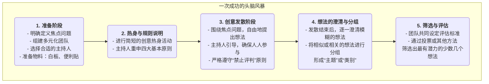

# 头脑风暴

在寻求创新和解决复杂问题时，我们最大的敌人往往是自己头脑中那些根深蒂固的、限制性的思维定势。**头脑风暴（Brainstorming）** 正是为打破这种思维枷锁而设计的一种经典、强大且广受欢迎的**团体创意生成技术**。它由广告人亚历克斯·奥斯本（Alex F. Osborn）在20世纪40年代提出，其核心目标在于，通过创造一个完全开放、自由、不受评判的讨论氛围，来鼓励参与者在短时间内，尽可能多地产生新奇、多样、甚至看似不切实际的想法。

头脑风暴的精髓在于**“先求数量，再求质量”**。它坚信，想法的质量，是可以通过数量的堆积而催生出来的。通过延迟评判、鼓励奇思妙想，头脑风暴能够有效地将团队的创造力从“批判模式”切换到“生成模式”，从而在一个安全的环境中，探索各种未知的可能性，并为后续的筛选和深化提供丰富、多元的原始素材。

## 头脑风暴的四大基本原则

为了确保头脑风暴能够达到预期的效果，必须严格遵守以下四条由奥斯本提出的基本原则。它们是创造安全、自由氛围的基石。

1.  **禁止评判（Defer Judgment）**：这是最核心、最不可动摇的原则。在头脑风暴期间，对任何提出的想法，无论其听起来多么荒谬或不切实际，都**绝对禁止**任何形式的批评、质疑或评判。评判会在后续的筛选阶段进行。

2.  **鼓励奇思妙想（Encourage Wild Ideas）**：鼓励参与者跳出常规思维的条条框框。那些看似疯狂、不合逻辑的想法，往往能够打破思维定势，并激发他人产生更具突破性的创意。

3.  **追求数量（Go for Quantity）**：设定一个明确的、有挑战性的数量目标（例如，“在20分钟内，产生100个想法”）。数量越多，出现高质量想法的概率就越大。

4.  **结合与改善（Build on the Ideas of Others）**：这也被称为“搭便车”或“滚雪球”。鼓励参与者仔细倾听他人的想法，并思考如何对其进行组合、改进、延伸，从而催生出新的、更完善的想法。这体现了“1+1>2”的协同效应。

### 头脑风暴的流程

## 如何组织一次有效的头脑风暴

1.  **精心准备**
    *   **定义一个清晰的焦点问题**：问题不宜过宽或过窄。例如，将“如何提升公司利润”这个过于宽泛的问题，细化为“我们如何能将现有客户的重复购买率提升20%？”
    *   **组建一个多元化的团队**：邀请来自不同背景、不同职能的5-10人参与，多样化的视角能带来更丰富的创意。
    *   **选择一位优秀的主持人**：主持人不直接贡献想法，其职责是引导流程、控制时间、鼓励参与、并坚决地制止任何评判行为。

2.  **创造合适的氛围**
    *   选择一个轻松、舒适的环境，准备好白板、便利贴、记号笔等工具。
    *   在正式开始前，可以通过一些简短的创意热身游戏（如“一个回形针的一百种用途”）来帮助参与者放松下来，进入创意思维模式。

3.  **发散与记录**
    *   主持人宣布开始，并设定一个明确的时间限制（通常为15-30分钟）。
    *   鼓励参与者将想到的任何点子，大声说出来，或者写在便利贴上并贴到墙上。主持人或指定的记录员需要快速地将所有想法都记录下来，不做任何修改或删减。

4.  **收敛与评估**
    *   发散阶段结束后，进入收敛阶段。首先，主持人带领大家快速地浏览所有想法，对一些不清晰的点子进行简单的澄清。
    *   然后，将内容相似的想法进行归类和合并，形成几个核心的主题方向。
    *   最后，团队共同设定几个评估标准（如“可行性”、“创新性”、“用户价值”），并通过投票（例如，每人发几个小圆点贴纸）的方式，选出2-3个最受认可、最有潜力的想法，作为下一步深入研究的对象。

## 应用案例

**案例一：为一款新的App命名**
*   **焦点问题**：“为我们这款主打‘美食分享’的社交App，想出一个朗朗上口、易于记忆的名字。”
*   **应用**：市场团队进行了一场30分钟的头脑风暴。他们产生了包括“食记”、“味友”、“咔嚓吃”等在内的80多个备选名称。在后续的筛选中，他们最终选择了一个既能体现产品特性又具有社交属性的名字。

**案例二：解决客户投诉问题**
*   **焦点问题**：“我们如何能将客户关于‘物流配送慢’的投诉率降低50%？”
*   **应用**：一个由客服、运营和物流部门员工组成的跨职能团队，共同进行头脑风暴。产生的想法包括：“与更快的快递公司合作”、“建立前置仓”、“优化打包流程”、“为延误订单提供优惠券补偿”等等。这些想法为后续制定具体的解决方案提供了丰富的起点。

**案例三：设计一次市场营销活动**
*   **焦点问题**：“在即将到来的夏季，我们如何为我们的果汁品牌策划一次有创意的线上营销活动？”
*   **应用**：团队成员天马行空，提出了“举办一场‘夏日特调’UGC大赛”、“与网红海岛博主合作直播”、“推出可以冷冻成冰棒的包装”、“发起一个关于夏天味道的社交媒体挑战”等多种创意。这些想法经过组合和深化，最终形成了一套完整的营销方案。

## 头脑风暴的优势与挑战

**核心优势**
*   **高效的创意生成**：能够在短时间内，快速地产生大量、多元化的想法。
*   **促进团队协作与融合**：创造了一个平等的、无压力的环境，有助于增强团队的凝聚力和集体创造力。
*   **打破思维定势**：通过鼓励奇思妙想和延迟评判，有效地帮助团队摆脱常规思维的束缚。

**潜在挑战**
*   **“群体思维”风险**：如果引导不当，可能会出现少数人的意见主导整个讨论，或者大家倾向于提出更“安全”的想法的现象。
*   **“搭便车”现象**：在团队中，总有一些人可能不那么积极主动，只是“搭便车”，贡献较少的想法。
*   **执行的困难**：要严格地执行“禁止评判”的原则，对主持人的技巧和团队的文化成熟度有较高要求。
*   **后续工作的缺失**：头脑风暴本身只负责产生想法。如果没有后续的、系统的筛选、评估和执行机制，那么再好的创意也只是空中楼阁。

## 延伸与关联

*   **逆向头脑风暴（Reverse Brainstorming）**：一种有趣的变体。它不是问“我们如何能成功？”，而是问“我们如何才能把这件事彻底搞砸？”。通过识别所有可能导致失败的因素，团队可以反向地思考出预防性的措施。
*   **书面头脑风暴（Brainwriting）**：为了避免善言者主导讨论，可以采用书面的形式。例如，6-3-5方法，即6个参与者，在5分钟内，每人写下3个想法，然后将写好的纸传给下一个人，进行启发和延伸。
*   **六顶思考帽**：可以作为头脑风暴后续“评估”阶段的一个结构化工具，引导团队从不同角度对筛选出的想法进行深入、全面的审视。
*   **思维导图**：是整理和组织头脑风暴成果的绝佳可视化工具。

---
*来源参考：亚历克斯·奥斯本（Alex F. Osborn）在其1953年的著作《应用想象力》（Applied Imagination）中，首次系统性地阐述了头脑风暴的原则和方法。它至今仍是全球范围内应用最广泛的创意生成技术之一。*
