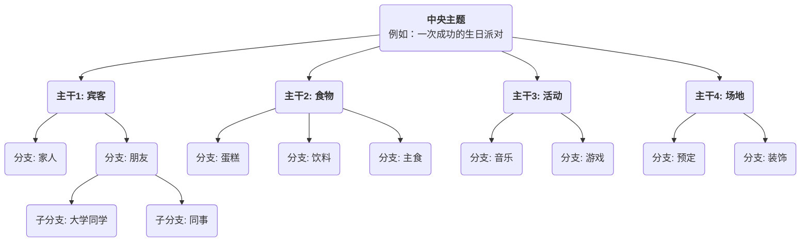

# 思维导图

我们的大脑在思考时，并非是线性的、一条道走到黑的，而是充满了跳跃、联想和发散。**思维导图（Mind Mapping）** 正是这样一种深刻契合我们大脑自然工作模式的、强大的**可视化思维工具**。它由英国学者东尼·博赞（Tony Buzan）在20世纪70年代发明，其核心在于，通过一个**中央主题**，以**放射状的、层层递进的结构**，将关键词、想法、图像和颜色等元素连接起来，从而将一个复杂的主题或一堆零散的信息，组织成一幅清晰、有序、易于记忆和理解的“大脑地图”。

思维导图的魅力在于其**非线性**的特征。它鼓励我们自由地联想，捕捉那些稍纵即逝的灵感，并将它们以一种有机的、相互关联的方式组织起来。它不仅是一个信息记录的工具，更是一个激发创意、梳理逻辑、促进记忆的强大思考伙伴。从制定计划、做读书笔记，到准备演讲、进行头脑风暴，思维导图都能极大地提升我们的思考效率和深度。

## 思维导图的核心构成要素

一幅标准的思维导图，遵循着几条简单而关键的绘制规则。

1.  **中央图像/主题（Central Image/Topic）**：在画布的正中央，用一个醒目的图像或关键词来代表你的核心主题。这是所有思考的起点。
2.  **主干（Main Branches）**：从中央主题直接放射出来的、粗壮的线条，代表了该主题最主要的一级分支或类别。每一条主干都应该有一个关键词。
3.  **分支（Sub-branches）**：从主干上延伸出来的、更细的线条，代表了对主干内容的进一步细化和阐述。分支可以无限地延伸下去，形成树状的层级结构。
4.  **关键词（Keywords）**：在每一条分支上，都只使用一个简洁的、能概括核心思想的关键词或短语，而不是完整的句子。这有助于激发更多的联想。
5.  **颜色（Colors）**：为不同的主干及其下的分支，使用不同的颜色。颜色可以帮助我们进行分类、组织，并能极大地刺激视觉记忆。
6.  **图像（Images）**：在导图的各个部分，尽可能多地使用小图标、符号和简笔画。俗话说“一图胜千言”，图像能极大地增强导图的趣味性和记忆效果。

### 思维导图的结构示例

## 如何绘制一张思维导图

1.  **第一步：从中心开始**
    拿一张白纸，横向放置。在正中央，画一个能代表你核心主题的图像，或者写下关键词。

2.  **第二步：画出主干**
    从中心主题向四周画出几条粗壮、弯曲的线条作为主干。每一条主干代表一个核心的类别。在主干的线上方写上对应的关键词。

3.  **第三步：添加分支和关键词**
    在每个主干上，继续画出更细的分支，并在线条上方写上更具体的关键词。让线条和文字的长度保持一致。这个过程就像一棵大树长出新的枝丫。

4.  **第四步：使用颜色和图像**
    为不同的主干体系分配不同的颜色。在任何你觉得合适的地方，随手画上一些简单的小图标或符号，来让你的导图“活”起来。

5.  **第五步：自由联想，持续扩展**
    不要拘泥于顺序，让你的思绪自由地在不同的分支间跳跃。当你想到一个新的点子时，就立即找到它所属的类别，并添加一个新的分支。整个过程应该是轻松、有趣的。

## 应用案例

**案例一：做读书笔记**
*   **场景**：读完一本关于“高效习惯”的书，希望梳理和记住核心内容。
*   **应用**：
    *   **中心主题**：书名《高效习惯》。
    *   **主干**：可以是书的每一个章节标题，例如“习惯的力量”、“习惯的回路”、“如何培养好习惯”、“如何戒除坏习惯”。
    *   **分支**：在每个主干下，用关键词记录该章节的核心论点、关键案例和具体方法。例如，在“习惯的回路”主干下，可以分出“暗示（Cue）”、“惯常行为（Routine）”和“奖赏（Reward）”三个分支。
    *   通过这种方式，整本书的逻辑框架和核心知识点，就被浓缩在一张清晰的图上，非常便于回顾和记忆。

**案例二：准备一场演讲或报告**
*   **场景**：需要就“公司年度营销计划”向管理层做一次20分钟的报告。
*   **应用**：
    *   **中心主题**：“年度营销计划”。
    *   **主干**：“市场分析”、“目标受众”、“核心策略”、“预算分配”、“预期KPI”。
    *   **分支**：在每个主干下，进一步细化要阐述的要点。例如，在“核心策略”下，可以分出“内容营销”、“社交媒体推广”、“线下活动”等分支。
    *   这张思维导图，就构成了你演讲的完整提纲。在演讲时，你可以看着导图，确保自己逻辑清晰、要点无遗漏。

**案例三：组织一次团队头脑风暴**
*   **场景**：一个团队需要为“如何提升产品用户体验”进行创意发散。
*   **应用**：
    *   **中心主题**：“提升用户体验”。
    *   **主干**：可以预设为用户体验的几个方面，如“性能”、“易用性”、“视觉设计”、“客户支持”。
    *   **过程**：团队成员围绕这几个主干，自由地提出想法，主持人将这些想法以关键词的形式，实时地添加到思维导图的相应分支上。思维导图的可视化和关联性，能极大地激发团队成员“搭便车”，产生更多的联想和创意。

## 思维导图的优势与挑战

**核心优势**
*   **契合大脑思维**：放射状的结构，模仿了大脑神经元的连接方式，使得思考和联想更加自然、流畅。
*   **激发创造力**：非线性的特点，鼓励自由联想，有助于打破线性思维的局限，产生更多创意。
*   **增强记忆**：通过将关键词、颜色、图像等多种元素结合，调动了左右脑的协同工作，极大地增强了记忆效果。
*   **一目了然**：能够将大量复杂的信息，以一种高度浓缩、结构清晰的方式呈现出来，便于快速掌握全局。

**潜在挑战**
*   **个人化较强**：由个人绘制的思维导图，其逻辑和关键词的选择可能带有很强的主观性，他人初看时可能需要一定的解释才能完全理解。
*   **不适合呈现最终的、正式的文档**：它是一个极佳的思考和构思工具，但其手绘、非线性的风格，通常不适合作为最终提交的、需要严谨格式的商业报告或学术论文。
*   **工具的限制**：虽然有大量的思维导图软件，但手绘通常被认为是最能激发创造力的方式。而手绘的修改和分享不如电子版方便。

## 延伸与关联

*   **头脑风暴（Brainstorming）**：思维导图是进行和组织头脑风暴成果的理想工具。可以将头脑风暴中产生的零散想法，实时地用思维导图进行归类和结构化。
*   **概念图（Concept Map）**：与思维导图类似，但更侧重于精确地表达不同概念之间的**具体关系**（例如，用连接线上的文字来说明“A导致B”或“B是C的一部分”），逻辑上更为严谨，而思维导图则更侧重于自由发散和联想。

---
*来源参考：东尼·博赞（Tony Buzan）被誉为“思维导图之父”，他的著作《思维导图》（The Mind Map Book）是该方法的权威圣经，详细介绍了其原理、规则和在各个领域的广泛应用。*
