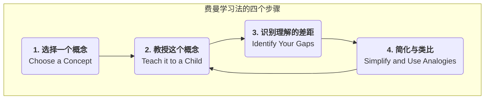

# 费曼学习法

我们常常会陷入一种“**知道的幻觉**”：我们能认出一个概念，能模糊地谈论它，甚至能在书中把它画出来，就误以为自己已经真正掌握了它。然而，当需要我们清晰地、用自己的话向他人解释这个概念时，我们才发现自己对它的理解是多么的支离破碎和漏洞百出。**费曼学习法（The Feynman Technique）**，是一种旨在打破这种学习幻觉、追求**真正深刻理解**的强大思维模型和学习策略。

该方法以诺贝尔物理学奖得主理查德·费曼（Richard Feynman）的名字命名，他以其能将极其复杂的物理学概念，用极其简单、直观的语言解释清楚的能力而闻名于世。费曼学习法的核心思想在于，**检验你是否真正理解一个知识的唯一标准，就是看你是否能用最简单、最清晰的语言，将它成功地传授给一个完全不懂该领域的人**。它不是一个被动的学习方法，而是一个主动的、以“教”为“学”的深度加工过程，它能强迫我们直面自己知识体系中的所有模糊地带和逻辑断层。

## 费曼学习法的四个核心步骤

费曼学习法的流程极其简单，但每一步都蕴含着深刻的认知科学原理。

1.  **第一步：选择一个你想要学习的概念（Choose a Concept）**
    *   拿一张白纸或打开一个空白文档，在最上方，用大号字体写下你想要深入理解的那个概念的名称。例如，“区块链”、“边际效应”或“贝叶斯定理”。

2.  **第二步：想象你在教一个孩子（Teach it to a Child）**
    *   这是费曼学习法的灵魂。在白纸上，假装你正在向一个完全没有相关背景知识的、聪明的12岁孩子解释这个概念。**用你自己的、最简单、最清晰的语言**，写下你对这个概念的理解。
    *   **关键**：在这个过程中，**绝对禁止**使用任何你从原始材料中抄来的、复杂的术语或行话。如果你发现自己不得不使用一个专业术语，那就意味着你对这个术语本身的理解还不够深刻，你需要先把它也解释清楚。

3.  **第三步：回顾与识别理解的差距（Identify Your Gaps）**
    *   当你完成了解释之后，仔细地、诚实地回顾你写下的内容。在这个过程中，你会不可避免地发现一些地方：
        *   你讲得结结巴巴，不够流畅。
        *   你发现自己只是在重复一些定义，而无法提供一个具体的例子。
        *   你发现自己无法清晰地解释清楚概念之间的逻辑联系。
        *   你发现自己不自觉地使用了大量的专业术语。
    *   所有这些你“卡壳”的地方，就是你知识体系中**真正的薄弱环节和理解的差距**。把它们都标记出来。

4.  **第四步：回到原始材料，简化与类比（Go Back, Simplify and Use Analogies）**
    *   针对你在上一步中识别出的所有理解差距，**重新回到**你的学习材料（如书籍、文章、课程）中去，进行更有针对性的、更深入的学习，直到你完全弄懂了那些卡壳的地方。
    *   然后，再次尝试用更简单的语言、更生动的**类比**或比喻，来重新组织和简化你的解释。一个好的类比，是连接抽象概念与已知世界的桥梁。
    *   **重复这个过程**，直到你最终能在一张纸上，用一套简单、流畅、逻辑自洽的语言，完美地解释清楚这个概念为止。

## 应用案例

**案例一：学习“什么是API（应用程序编程接口）？”**
*   **第一步**：在纸上写下“API”。
*   **第二步（初次尝试解释）**：“API是一个软件中介，它允许两个应用程序相互通信。它是一组用于构建应用软件的例程、协议和工具……”（发现自己只是在背诵维基百科的定义，非常生硬）。
*   **第三步（识别差距）**：我无法解释“中介”和“例程”到底是什么意思，这个解释对于一个孩子来说太抽象了。
*   **第四步（简化与类比）**：我需要一个好的类比。**餐厅的点餐过程！**
    *   **（再次尝试解释）**：“想象你去一家餐厅。你（一个应用程序）不能直接跑到厨房（另一个应用程序的后台系统）去告诉厨师你要吃什么。你需要一个**服务员（API）**。你看着**菜单（API文档）**，上面列出了所有你可以点的菜（API提供的功能）。你告诉服务员你要一份宫保鸡丁（你发出了一个API请求）。服务员将你的请求，用厨房能听懂的语言，传达给厨师。最后，服务员再把做好的菜（系统返回的数据）端给你。在这个过程中，你完全不需要知道厨房内部是如何运作的，服务员就是那个连接你和厨房的、标准化的沟通接口。”
    *   这个解释就清晰、简单且易于理解了。

**案例二：理解一个复杂的历史事件，如“安史之乱”**
*   **第一步**：写下“安史之乱”。
*   **第二步**：尝试向一个只知道唐朝很厉害的小学生解释这件事。
*   **第三步（识别差距）**：你可能会发现，你只知道是安禄山和史思明造反，但你说不清楚“为什么”他们要造反？“藩镇割据”到底是什么意思？为什么唐朝军队一开始会打不过？
*   **第四步**：你带着这些问题，重新去查阅资料，弄清楚了唐朝中后期的“府兵制瓦解”、“募兵制兴起”、“节度使权力过大”等深层原因。然后，你可以用一个更生动的类比来解释，例如，“这就像一个大公司的CEO（皇帝），把几个分公司（藩镇）的权（兵权、财权、人事权）放得太大了，结果这些分公司的总经理（节度使）自己当起了老板，不再听总部的号令了。”

**案例三：准备一场重要的产品演示**
*   **第一步**：选择你的核心产品功能。
*   **第二步**：假装向你的祖母解释，你的这个产品是做什么的，能解决她生活中的什么问题。
*   **第三步（识别差距）**：你会立刻发现，你平时挂在嘴边的那些“赋能”、“闭环”、“打通”等行业黑话，是多么的空洞和难以理解。
*   **第四步**：这个过程，会强迫你用最质朴、最关注用户价值的语言，来重新打磨你的产品介绍。最终，你的演示将会变得异常清晰、有说服力。

## 费曼学习法的优势与挑战

**核心优势**
*   **建立深刻、持久的理解**：通过主动的、输出式的学习，将浅层的“认识”转化为深刻的“理解”。
*   **精准地识别知识盲区**：“教给孩子”的过程，就像一个知识的“X光机”，能让你所有似懂非懂的地方都暴露无遗。
*   **提升清晰表达与沟通的能力**：它本身就是对一个人简化、类比和清晰沟通能力的终极训练。

**潜在挑战**
*   **耗时且费力**：与被动地划线、记笔记相比，费曼学习法需要投入更多的时间和脑力。
*   **需要高度的诚实**：你必须对自己足够诚实，勇敢地承认并面对自己知识体系中的漏洞，而不是自欺欺人。

## 延伸与关联

*   **输出式学习（Learning by Doing/Teaching）**：费曼学习法是输出式学习理念最经典、最有效的实践方法之一。
*   **第一性原理思维**：费曼学习法在某种程度上，也体现了第一性原理。它要求你不能满足于表面的、复杂的术语，而必须回归到概念最底层的、最简单的逻辑和事实上。

---
*来源参考：该学习方法虽然以理查德·费曼的名字命名，并深刻地体现了他的思维方式，但并非由他本人系统性地提出。它是由后来的学习者和教育者，在总结费曼独特的教学和思考风格后，所提炼出的一套学习策略。斯科特·杨（Scott H. Young）等学习领域的博主，对推广该方法起到了重要作用。*
