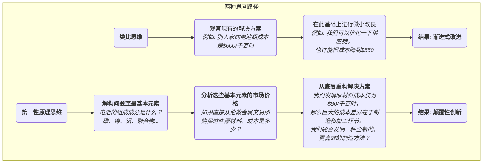

# 第一性原理

在面对复杂问题或寻求突破性创新时，我们大多数人的思考方式，是**类比思维（Thinking by Analogy）**。我们观察别人在做什么，或者我们过去是怎么做的，然后在此基础上进行微小的、渐进式的改良。这种方式在大多数时候是高效的，但它也像一个无形的牢笼，将我们的思维禁锢在现有的、已被验证的框架之内，难以产生真正的颠覆性创新。**第一性原理思维（First Principles Thinking）** 则提供了一种与之截然相反的、更具穿透力的思考路径。

第一性原理，这个源于物理学和哲学的概念，其核心在于**回归事物最基本的、不言自明的公理或事实，并以此为出发点，层层向上进行逻辑推导，直至找到一个全新的、根本性的解决方案**。它不是在现有的“食谱”上调整调料，而是像一位大厨一样，将一道菜解构为最基本的分子和元素（如蛋白质、脂肪、酸、甜），然后从这些最底层的元素出发，重新创造出一道前所未有的菜肴。埃隆·马斯克（Elon Musk）是第一性原理在现代商业领域最著名的倡导者和实践者，他正是运用这种思维方式，彻底颠覆了航天、汽车等传统行业。

## 第一性原理与类比思维的对比

理解第一性原理最好的方式，是将其与我们更习惯的类比思维进行对比。

*   **类比思维**：
    *   **逻辑**：“因为别人都是这么做的，或者我们以前就是这么做的，所以我们也应该这么做，并在此基础上做一些小的改进。”
    *   **特点**：快速、简单、低风险，但容易陷入思维定势，产生“路径依赖”，难以带来根本性突破。
    *   **例子**：在智能手机出现前，手机厂商的创新普遍是在现有键盘手机的基础上，增加摄像头像素、改变外壳颜色或增加一些软件功能。

*   **第一性原理思维**：
    *   **逻辑**：“我们暂时忽略别人是怎么做的。关于这个问题，我们能确信的、最基本的事实是什么？从这些事实出发，我们可以推导出什么？一个理想的、不受现有条件约束的解决方案应该是什么样的？”
    *   **特点**：耗时、费力，需要深刻的洞察力和强大的逻辑推理能力，但能够穿透表面的复杂性，直达问题本质，从而产生颠覆性的创新。
    *   **例子**：苹果公司在设计第一代iPhone时，没有去改良键盘，而是回归到“人机交互”的第一性原理——最直接、最符合直觉的交互方式是手指。基于此，他们创造了全新的、基于多点触控大屏幕的交互范式。

### 思考方式的差异

## 如何实践第一性原理思维

实践第一性原理，通常可以遵循一个三步的“苏格拉底式”提问过程：

1.  **第一步：识别并解构你当前的信念或问题**
    *   **提问**：“对于这个我们习以为常的信念（例如，‘电池就是很贵的’），它的底层假设是什么？我们为什么会这么认为？”
    *   **行动**：像剥洋葱一样，层层剥开问题的外衣，将一个复杂的问题，持续地分解下去，直到你触及那些无法再被分解的、最基础的元素或事实。这个过程需要你像一个充满好奇心但又刨根问底的孩子一样，不断地追问“为什么”。

2.  **第二步：挑战基本假设，寻找真相**
    *   **提问**：“这些被我们认为是‘事实’的基础元素，是真的吗？它们是基于物理定律的真理，还是仅仅是长久以来的行业惯例或他人观点？”
    *   **行动**：对你分解出的每一个基本元素，进行独立的、批判性的审视和验证。去寻找来自不同领域的第一手数据和证据，将事实与观点彻底分离。

3.  **第三步：从坚实的底层基础出发，重新构建**
    *   **提问**：“现在，我们已经有了一堆经过验证的、坚实的基本事实。如果我们忘记过去所有的方式，只从这些基本事实出发，我们可以构建出一个怎样全新的、更优的解决方案？”
    *   **行动**：这是一个创造性的、逻辑自洽的重构过程。你将从一个全新的、更简洁、更本质的起点出发，去设计你的产品、流程或策略。

## 应用案例

**案例一：埃隆·马斯克的SpaceX**
*   **传统信念（类比思维）**：制造火箭的成本极其高昂，因为历史上所有国家和公司的火箭都是如此。
*   **第一性原理分析**：
    1.  **解构**：马斯克问：“火箭是由什么材料制成的？”答案是：航空级铝合金、钛、铜、碳纤维等。
    2.  **挑战与真相**：他接着去分析这些原材料在商品市场上的价格，发现火箭的原材料成本，仅占其总成本的约2%。
    3.  **重构**：他得出一个惊人的结论：火箭之所以昂贵，绝大部分成本来自于中间的制造、加工和烦琐的供应链环节，以及“一次性使用”的模式。因此，SpaceX的核心创新，就聚焦于**自主研发和制造火箭的大部分零部件**，并最终实现了**火箭的回收和重复使用**，将发射成本降低了一个数量级。

**案例二：查理·芒格对投资的思考**
*   **场景**：作为沃伦·巴菲特的长期伙伴，查理·芒格是第一性原理的忠实践行者。
*   **应用**：在分析一家公司时，他不会去听信分析师的评级或市场的热点。他会回归到最基本的问题：“这家公司的商业模式，其本质是什么？它为客户创造的价值，是否可持续？它的护城河有多深？”他通过建立一个由不同学科（心理学、经济学、历史学等）的基本原理构成的“多元思维模型”，来对一个投资标的进行根本性的、跨学科的判断。

**案例三：重新思考“教育”**
*   **传统信念（类比思维）**：教育就是“老师在讲台上讲，学生在下面听”，然后通过考试来检验学习成果。
*   **第一性原理分析**：
    1.  **解构**：教育的本质目的是什么？是让学习者掌握知识、发展技能、并培养批判性思维。
    2.  **挑战与真相**：单向的灌输是最高效的学习方式吗？不一定。神经科学告诉我们，主动的、基于问题的、与实践相结合的学习，效率更高。标准化的考试，真的能衡量出真正的能力吗？也不一定。
    3.  **重构**：基于这些第一性原理，我们可以构想出全新的教育模式，例如：项目制学习（PBL）、翻转课堂、以及更注重过程性评估和能力认证的评价体系。

## 第一性原理的优势与挑战

**核心优势**
*   **产生颠覆性创新**：它是摆脱渐进式改良、实现根本性突破的最强大的思维工具。
*   **直达问题本质**：能够帮助你穿透事物的表象和传统的迷雾，看清问题的本质和核心驱动因素。
*   **建立真正的理解**：通过亲自推导，你会对一个领域建立起远比“记忆结论”深刻得多的、真正属于你自己的理解。

**潜在挑战**
*   **认知成本极高**：需要投入大量的时间和智力，去进行深入的研究和逻辑推理，非常“反直觉”。
*   **需要广博的知识**：要将一个问题分解到最基本的元素，往往需要跨学科的知识储备。
*   **挑战传统的阻力**：基于第一性原理得出的结论，往往会挑战现有的行业惯例和权威观点，可能会面临巨大的现实阻力。

## 延伸与关联

*   **5 Whys**：是一种简单但有效的第一性原理实践工具。通过连续追问“为什么”，可以帮助我们层层深入，逼近问题的根本原因。
*   **系统思维**：第一性原理关注的是将系统“解构”为最基本的元素；而系统思维则更关注这些元素之间是如何“相互连接和作用”的。两者结合，能形成更全面的认知。

---
*来源参考：第一性原理的概念最早源于古希腊哲学家亚里士多德，他将其定义为“认知事物的第一基础”。在现代，物理学家理查德·费曼（Richard Feynman）也极力推崇这种“诉诸基本原理，而非经验公式”的思考方式。而埃隆·马斯克（Elon Musk）在多次访谈中的精彩阐述，则极大地推动了这一思维方式在科技和商业领域的传播。*
