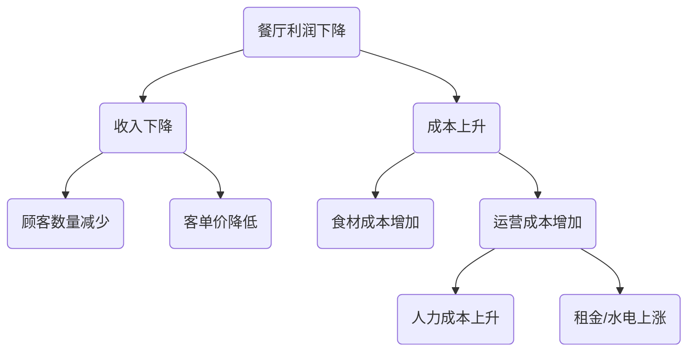
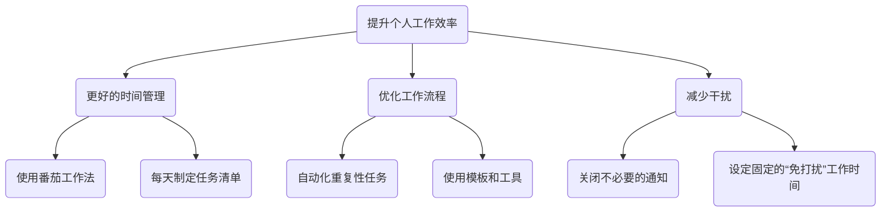

# 逻辑树（Logic Tree）分析法教程

## 1. 什么是逻辑树？

**逻辑树（Logic Tree）** 是一种强大的、可视化的分析工具，用于将一个复杂的问题或议题系统性地分解为更小、更易于管理的部分。它的核心原则是 **MECE（Mutually Exclusive, Collectively Exhaustive）**，即“相互独立，完全穷尽”，确保分解后的各个部分不重叠、不遗漏。

逻辑树帮助我们构建清晰的思维框架，确保分析的严谨性和全面性。

## 2. 逻辑树的主要类型

逻辑树主要分为两种类型，分别用于解决不同性质的问题：

### a. 问题树（Problem Tree / 诊断树）

- **目的**：用于诊断和探究“**为什么**”一个问题会发生。
- **结构**：从一个核心问题（树根）出发，不断向下分解，寻找导致该问题的潜在原因。每一层分支都是对上一层问题的更深层次解答。
- **应用场景**：根本原因分析、绩效下降诊断、故障排查等。

### b. “如何”树（'How' Tree / 解决方案树）

- **目的**：用于构思和规划“**如何**”实现一个目标或解决一个问题。
- **结构**：从一个总体目标（树根）出发，将其分解为具体的、可执行的策略或行动方案。
- **应用场景**：战略规划、目标设定、项目计划、寻找解决方案等。

## 3. 如何构建逻辑树？

### 步骤一：明确定义核心问题或目标

- **问题树**：清晰地陈述要分析的“问题”。例如：“为什么我们的网站用户流失率在上升？”
- **“如何”树**：清晰地定义要达成的“目标”。例如：“我们如何将网站的月活跃用户数提升20%？”
- 将这个问题或目标作为逻辑树的起点（树根）。

### 步骤二：进行第一层分解（应用MECE原则）

- **头脑风暴**：围绕核心问题/目标，思考可以将其分解为哪些主要组成部分。
- **应用MECE原则**：确保第一层的分支是相互独立的（没有重叠），并且完全穷尽了（没有遗漏任何重要方面）。
  - **例（问题树）**：用户流失率上升可以分解为：“新用户流失”和“老用户流失”。
  - **例（“如何”树）**：提升月活跃用户数可以分解为：“吸引新用户”、“提升现有用户活跃度”和“召回流失用户”。

### 步骤三：逐层向下分解

- **持续提问**：对每一个分支，继续提问“为什么会这样？”（问题树）或“具体如何做？”（“如何”树），进行更深层次的分解。
- **保持结构清晰**：继续在每一层应用MECE原则，直到将问题分解到足够具体、可以进行数据验证或可以直接采取行动的程度。

### 步骤四：验证假设并确定优先级

- **数据验证**：对于问题树，收集数据来验证哪些分支是真正的原因。
- **评估方案**：对于“如何”树，评估每个行动方案的可行性、成本和预期效果。
- **确定关键路径**：找出对解决问题或实现目标影响最大的关键原因或关键行动，并确定优先级。

## 4. 实践案例

### 案例一：问题树 - 分析“为什么餐厅利润下降？”

**分析**：通过这个树状图，管理者可以清晰地看到利润下降的几个主要驱动因素，并可以针对每个分支（如“顾客数量减少”）收集数据，进行更深入的分析。

### 案例二：“如何”树 - 规划“如何提升个人工作效率？”

**分析**：这个树状图将一个抽象的目标分解为一系列具体、可操作的行动，帮助个人制定清晰的改进计划。

逻辑树是咨询顾问、产品经理和战略规划者必备的核心技能之一，它能极大地提升思维的深度和广度。