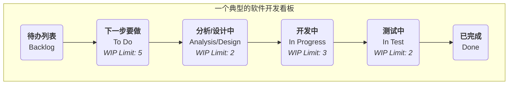

# 看板 (Kanban)

在追求高效、流畅的工作流时，我们常常遇到的问题是：工作任务堆积如山，我们不清楚每个人都在忙什么，不知道瓶颈在哪里，也无法准确地预测何时能完成。**看板（Kanban）**，这个源于日语“信号板”的词汇，正是为解决这些问题而生的一种强大、直观的**可视化工作流管理方法**。它并非一套像Scrum那样规定了角色和事件的严格框架，而是一种更灵活、更侧重于**优化价值流动效率**的敏捷实践和思维方式。

看板方法的核心在于，通过一张**看板（Kanban Board）**，将原本不可见的工作流程和工作任务，变得一目了然、完全透明。然后，通过**限制在制品（Work in Progress, WIP）**的数量，并建立一套明确的**拉动机制（Pull System）**，来系统性地识别和消除流程中的瓶颈，从而让价值能够更快速、更顺畅、更可预测地从“待办”流向“完成”。它旨在创造一个平稳、可持续的工作节奏，避免团队因任务过载而陷入混乱和低效。

## 看板方法的六大核心实践

看板方法的成功，依赖于对以下六大核心实践的持续应用。

1.  **可视化工作流（Visualize the Workflow）**：这是看板的起点。你需要和团队一起，将工作从开始到结束的所有步骤（例如，“待办”、“设计中”、“开发中”、“测试中”、“已完成”）都绘制在一块白板或电子看板上，并将每一个工作项（如一个用户故事、一个Bug）都以卡片的形式贴在看板上。

2.  **限制在制品（Limit Work in Progress, WIP）**：这是看板的灵魂。为流程中的每一个或某几个步骤，设定一个明确的、允许同时进行的任务数量的**上限**。例如，规定“开发中”这一列，最多只能有3张卡片。当这一列满了之后，任何人都不能再从前一个步骤“拉入”新的工作，除非当前有一项工作被完成并移出。限制WIP能从根本上**防止任务堆积、暴露流程瓶颈、并创造一个聚焦的工作环境**。

3.  **管理流动（Manage Flow）**：看板的目标是最大化价值的流动速度和顺畅度。你需要持续地监控工作项在看板上的流动情况，识别出它们在哪些环节停滞最久（即瓶颈），然后集中团队的力量去解决这些瓶颈，让整个系统顺畅起来。

4.  **使流程策略明确化（Make Process Policies Explicit）**：将团队的工作规则变得清晰、透明。例如，明确定义“完成”的标准是什么（Definition of Done）？每个泳道的WIP限制是多少？任务的优先级是如何决定的？明确的规则，是团队能够自主、协调工作的基础。

5.  **建立反馈循环（Implement Feedback Loops）**：看板鼓励建立多种节奏的反馈循环。例如，每日的团队站会（用于同步日常工作）、定期的看板复盘会（用于回顾和优化流程）、以及面向客户的交付评审会等。

6.  **协作式改进，实验性演进（Improve Collaboratively, Evolve Experimentally）**：看板是一种鼓励“从你现在的位置开始，持续演进”的方法。它不要求你进行颠覆性的组织变革。团队应该基于数据和共同的理解，持续地、协作地对自己的工作流程进行小的、实验性的改进。

### 看板（Kanban Board）的结构示例

*   **工作流程**：一张卡片（代表一个任务）从左到右，依次穿过各个阶段。只有当右边一列有空位时（即该列的WIP未满），团队成员才能从左边一列“拉取”一张新的卡片进来。

## 如何实施看板方法

1.  **第一步：可视化你当前的工作流程**
    不要试图设计一个“完美”的流程。就从你和团队**现在**的工作方式开始。在白板上画出你们实际的工作步骤，并将所有正在进行的工作都以卡片的形式贴上去。这一步的目标，是让现状变得透明。

2.  **第二步：设定初始的WIP限制**
    与团队一起，为流程中的关键步骤（通常是那些容易产生瓶颈的环节，如“开发中”、“测试中”）设定一个初始的WIP限制。一个好的起点，可以是“团队成员数量的一半”或“比当前正在进行的工作项稍少一点”。WIP限制不是一成不变的，后续可以根据实际情况进行调整。

3.  **第三步：开始“拉动”工作**
    建立一个简单的规则：当一个团队成员完成了手头的工作后，他应该去看板上“最右边”的、需要帮助的环节提供帮助。如果无事可做，他才能从“最左边”的、允许拉取的环节，拉取一个优先级最高的新任务。

4.  **第四步：建立日常站会和复盘会**
    *   每天在看板前开一个简短的站会。会议的焦点不是每个人做了什么，而是**卡片的流动**：“哪些卡片昨天移动了？”“哪些卡片被卡住了？我们如何帮助它流动起来？”
    *   定期（如每两周）举行一次复盘会，回顾看板上的数据（如“平均完成时间”），并讨论如何改进我们的流程和WIP限制。

## 应用案例

**案例一：IT运维团队**
*   **问题**：运维团队每天都疲于应付各种突发的、来自不同渠道的请求，工作混乱且响应不及时。
*   **看板应用**：他们建立了一个简单的看板，包含“待处理”、“处理中”、“等待外部反馈”、“已解决”几个泳道。通过限制“处理中”的WIP为团队人数，他们确保了团队能聚焦于快速解决当前问题，而不是同时开启大量任务。看板也让所有请求都变得透明，便于管理者了解团队的真实负载。

**案例二：个人任务管理（个人看板）**
*   **问题**：一个人同时在进行多个项目，感到压力巨大且分身乏术。
*   **看板应用**：他可以使用Trello或一个简单的笔记本，为自己创建一个个人看板，包含“本周目标”、“今天要做”、“正在做（WIP Limit: 1）”、“已完成”几个列表。通过严格遵守“正在做”的WIP限制为1，他强迫自己在一个时间内，只专注于一件最重要的事情，从而极大地提升了专注度和完成质量。

**案例三：内容创作团队（如一个杂志社）**
*   **流程**：“选题库” -> “写作中” -> “编辑中” -> “设计/排版” -> “已发布”。
*   **看板应用**：通过为每个环节设定WIP限制，可以确保编辑不会在有大量稿件积压的情况下，还持续地向作者约稿。它能让整个内容生产的流程变得更加平顺，并清晰地暴露瓶颈（例如，如果“编辑中”的稿件总是堆积如山，就说明编辑资源不足）。

## 看板方法的优势与挑战

**核心优势**
*   **灵活性与适应性**：它不要求对现有流程和角色进行颠覆性改变，可以“从你现在的位置开始”，逐步演进。
*   **提升效率与可预测性**：通过管理流动和限制WIP，能显著缩短交付周期，并使交付时间变得更可预测。
*   **减轻团队压力**：WIP限制避免了团队因多任务切换和过度承诺而产生的巨大压力，创造了可持续的工作节奏。
*   **暴露系统性问题**：能够非常直观地、不可辩驳地暴露流程中的瓶颈和障碍。

**潜在挑战**
*   **易于“形式化”**：如果团队只做了“可视化”这一步，而没有严格地执行“限制WIP”和“管理流动”，那么看板就只是一个漂亮的“任务墙”，无法发挥其真正的威力。
*   **需要团队的自律**：拉动系统和WIP限制，需要团队成员有高度的自律和协作精神。
*   **对“无时间盒”的误解**：虽然看板本身没有像Scrum那样的固定冲刺，但这不意味着没有计划和节奏。看板团队同样需要进行优先级排序、交付时间预测和定期的复盘。

## 延伸与关联

*   **Scrum**：看板和Scrum是敏捷世界里最主流的两种方法。Scrum是基于“时间盒”的迭代节奏，而看板是基于“连续流”的拉动节奏。两者各有优劣，适用于不同场景。**Scrumban**则是将两者的优点进行结合的一种混合方法。
*   **精益思想（Lean Thinking）**：看板方法是精益思想在知识工作领域最核心、最直接的应用。它完美地体现了精益中“可视化”、“拉动系统”、“消除浪费”和“持续改进”等核心原则。
*   **约束理论（Theory of Constraints, TOC）**：看板方法通过暴露瓶颈，与TOC中“识别并优化约束点”的思想高度契合。

---
*来源参考：看板方法在软件开发领域的应用，最早由大卫·安德森（David J. Anderson）在其在微软和Corbis的工作中进行实践和总结。他的著作《看板：技术变革的成功之道》（Kanban: Successful Evolutionary Change for Your Technology Business）是该方法的奠基之作。看板的思想，则深深植根于丰田生产系统（TPS）和精益制造之中。*
