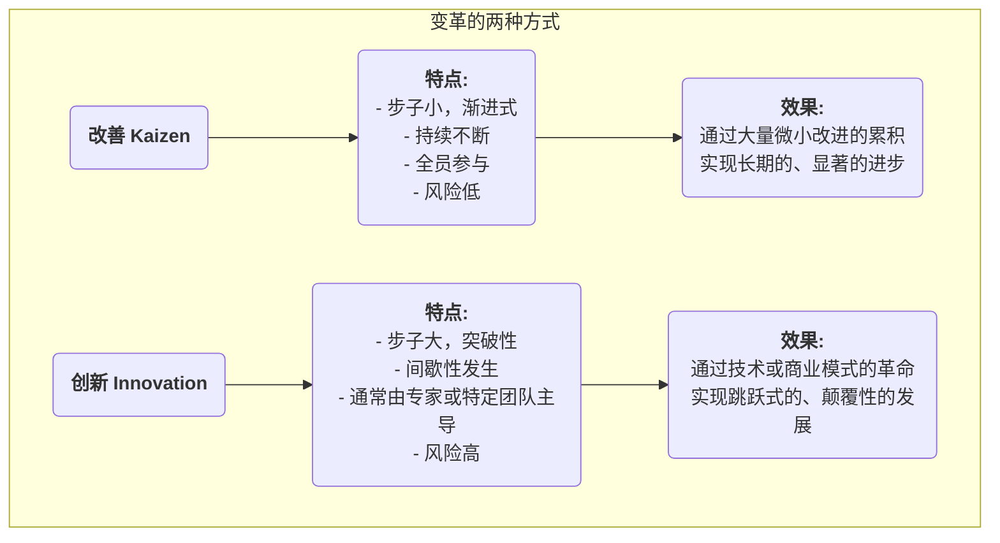

# 改善 (Kaizen)

在许多组织中，“改进”往往被视为一个需要巨大投入、由专家主导、自上而下的重大“项目”。然而，有一种管理哲学却认为，真正强大而持久的进步，源于每一天、每一位员工所做出的、看似微不足道的**微小而持续的改进**。这，就是**改善（Kaizen）** 的精髓。Kaizen是一个日语词，意为“向好的方向改变”，它既是一种追求尽善尽美的文化理念，也是一套鼓励全员参与、自下而上推动持续改进的实践方法。

改善（Kaizen）的核心思想在于，**不求一蹴而就的革命性突破，但求永无止境的渐进式优化**。它相信，一线员工是其所在岗位上最了解实际情况的专家，他们蕴藏着无穷的智慧和创造力。通过建立一种鼓励提出问题、奖励微小创新、宽容失败的文化，组织能够汇集起所有人的力量，形成一股不可阻挡的、持续向上的强大动力。它不是一个复杂的管理工具，而是一种简单、朴素但极其深刻的工作方式和思维习惯。

## 改善（Kaizen）的核心理念

*   **持续性（Continual）**：改善不是一次性的活动，而是一个永不间断、日积月累的过程。
*   **全员参与（Everybody）**：从CEO到一线清洁工，组织中的每一个人都被鼓励和期望参与到改进活动中来。
*   **低成本、高智慧（Low Cost, High Wisdom）**：改善不依赖于巨大的资本投入，而是强调运用员工的智慧和创造力，以低成本的方式解决问题、消除浪费。
*   **聚焦流程（Process-Focus）**：改善的焦点是优化工作流程，而非指责个人。
*   **可视化管理（Visual Management）**：强调将问题、标准和流程都“可视化”，让异常情况一目了然。
*   **“去现场”（Go to the Gemba）**：管理者必须亲临一线（现场），去观察真实情况、与员工交谈，而不是坐在办公室里凭空想象。

### 改善（Kaizen）与创新（Innovation）的对比

*   **关系**：改善和创新并非相互排斥，而是一个优秀组织必须同时具备的两种能力。改善负责不断地优化和巩固现有的系统，而创新则负责开创全新的系统。

## 如何在组织中实践改善（Kaizen）

实践改善的关键在于营造一种鼓励持续改进的文化和机制。

1.  **建立改善建议系统**
    设立一个简单、便捷的渠道（如建议箱、在线表单），让任何员工都可以随时提交他们发现的问题或改进建议。重要的是，对每一个建议都要有回应、有跟踪，并对被采纳的优秀建议给予及时的、公开的奖励（奖励不一定是物质的，公开表扬、一张证书等精神激励往往更有效）。

2.  **开展“改善活动周”或“改善闪电战（Kaizen Blitz）”**
    定期组织跨职能的团队，在一段集中的时间内（通常为3-5天），聚焦于一个特定的流程或工作区域，运用精益和质量工具（如价值流图、5S），进行一次快速、高强度的改进风暴，并立即实施解决方案。

3.  **推广PDCA循环作为思考工具**
    将**PDCA（计划-执行-检查-行动）循环**作为所有员工解决问题的标准思维框架。鼓励员工在进行任何一项小的改进时，都遵循这个科学的循环：
    *   **P**lan: 发现问题，分析原因，制定一个小的改进计划。
    *   **D**o: 尝试执行这个计划。
    *   **C**heck: 检查试验的结果是否达到了预期。
    *   **A**ct: 如果成功，就将其固化为新的标准；如果不成功，就从中学习，开始新一轮的PDCA循环。

4.  **管理者角色的转变**
    在改善文化中，管理者的角色不再是“命令者”和“监督者”，而转变为“**教练**”和“**支持者**”。他们的主要工作是：启发和鼓励员工发现问题，为员工的改进活动提供资源和支持，并帮助他们移除障碍。

## 应用案例

**案例一：丰田汽车的“一厘米改善”**
*   **场景**：在丰田的生产线上，改善是其DNA的一部分。
*   **应用**：一位产线工人发现，每次从零件盒里取一个螺丝时，手腕都需要做一个微小但不自然地扭转动作。他建议将零件盒倾斜15度。这个看似微不足道的改进，每天能为他节省几秒钟的时间，并降低了手腕受伤的风险。当这个“一厘米的改善”被推广到全公司成千上万的工位上时，其累积起来所节省的时间和提升的安全性是极其惊人的。

**案例二：一家医院的护士站**
*   **问题**：护士们抱怨，每天花费大量时间在寻找常用的医疗用品（如纱布、胶带）上。
*   **改善应用**：护士长组织了一次小型的改善活动。团队成员一起，运用**5S现场管理法**，对护士站的储物柜进行了彻底的**整理**（丢掉不必要的）、**整顿**（将常用物品放在最易取放的位置，并贴上清晰的标签）、**清扫**、**清洁**和**素养**。这次活动只花了一个下午，但显著减少了护士们的寻找时间，让她们能将更多精力投入到对病人的直接护理中。

**案例三：个人生活中的应用**
*   **问题**：一个人总是忘记在出门时带钥匙。
*   **改善应用**：他没有去责备自己“记性差”，而是思考如何**改进流程**。他决定，在前一天晚上，就把第二天要带的所有东西（钥匙、钱包、工卡）都放在门边的鞋柜上。这个微小的习惯改变，就是一个典型的个人改善（Kaizen），它通过优化流程，从根本上解决了问题。

## 改善（Kaizen）的优势与挑战

**核心优势**
*   **成本低，风险小**：绝大多数改进都源于一线员工的智慧，几乎不需要额外投资，且试错成本极低。
*   **提升员工敬业度与归属感**：当员工的建议被倾听、被采纳时，他们会感受到尊重，并从“被动的执行者”转变为“主动的思考者”。
*   **促进团队合作**：许多改善活动都需要跨岗位、跨部门的协作，有助于打破部门墙。
*   **形成强大的文化惯性**：一旦形成追求尽善尽美的文化，组织就拥有了自我进化、持续发展的强大内在动力。

**潜在挑战**
*   **见效慢，不易察觉**：与大刀阔斧的“创新”相比，改善的效果是渐进的、日积月累的，短期内可能不明显，需要管理者有足够的耐心和长远的眼光。
*   **需要真正的全员参与**：如果只停留在口号上，或者只有少数人参与，改善活动就无法持续。
*   **可能陷入“局部最优”**：过度专注于对现有流程的微小改进，有时可能会忽略掉进行颠覆性、革命性创新的更大机会。

## 延伸与关联

*   **精益运营（Lean Operations）**：改善（Kaizen）是精益思想的核心支柱之一，是实现“追求尽善尽美”这一原则的根本途径。
*   **全面质量管理（TQM）**：改善是TQM中“持续改进”原则最直接、最生动的体现。
*   **PDCA循环**：是实践改善（Kaizen）时，最常用、最基础的科学思考和行动框架。

---
*来源参考：改善（Kaizen）作为一种管理哲学，深深植根于日本的文化和管理实践中，尤其是在丰田生产系统（TPS）中被发扬光大。今井正明（Masaaki Imai）的著作《改善：日本企业成功的关键》（Kaizen: The Key to Japan's Competitive Success）首次将这一概念系统性地介绍给了西方世界，影响深远。*
