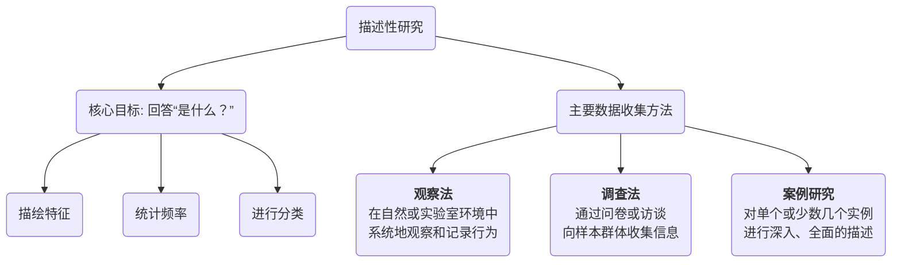

# 描述性研究

在科学探究的版图中，如果说实验研究旨在回答“为什么”，那么**描述性研究（Descriptive Research）** 则专注于回答一个更基础但同样重要的问题：“**是什么？**”。它是一种非侵入性的研究范式，其核心目标在于系统、准确地观察和描绘一个特定群体、现象或情境的特征，而不对其进行任何干预或操纵。它为我们提供了一幅关于世界某个侧面的“快照”或“画像”。

描述性研究是许多科学探索的起点。在能够解释一个现象之前，我们首先需要清晰地了解它是什么样子的。从人口普查中描绘一个国家的人口结构，到市场调研中了解目标客户的消费习惯，再到动物行为学中记录一个物种的社会行为，描述性研究为我们构建对世界的认知提供了基础性的事实和数据。

## 描述性研究的核心目的与方法

描述性研究的主要目的并非检验因果关系，而是围绕以下几点展开：

*   **特征描述**：描绘研究对象的各项特征。例如，一个班级学生的平均年龄、男女比例、平均绩点等。
*   **频率统计**：计算某一行为或事件发生的频率。例如，一个地区的犯罪率，或者选民对某位候选人的支持率。
*   **分类**：将研究对象按照特定标准进行分类。例如，将用户分为“新手用户”、“普通用户”和“专家用户”。
*   **趋势识别**：通过在不同时间点进行描述性研究，可以识别出变化的趋势。例如，追踪过去十年中智能手机使用率的变化。

为了实现这些目的，描述性研究主要采用以下三种数据收集方法：

## 如何进行一次描述性研究

1.  **清晰界定研究问题**
    首先，明确你想要描述的“是什么”。问题必须清晰、具体。例如，从“我想研究大学生的社交媒体使用情况”细化为“某大学在校本科生平均每天使用社交媒体的时长、最常使用的平台以及主要使用动机是什么？”

2.  **确定研究对象与抽样**
    定义你的研究总体（例如，“某大学所有在校本科生”）。由于研究整个总体往往不现实，你需要采用合适的抽样方法（如分层随机抽样，确保各年级、各专业都有代表）来选取一个样本。

3.  **选择并设计数据收集工具**
    根据你的研究问题选择最合适的方法。
    *   如果选择**调查法**，你需要设计一份结构清晰、问题无歧义的调查问卷。
    *   如果选择**观察法**，你需要制定一个详细的观察清单（Checklist），明确要记录哪些行为、如何记录。
    *   如果选择**案例研究**，你需要确定访谈提纲、需要收集的文档资料等。

4.  **收集数据**
    按照既定方案系统地收集数据。在过程中要确保一致性和准确性，尽量减少误差。

5.  **分析数据并呈现结果**
    对收集到的数据进行整理和分析。这通常涉及计算描述性统计量，如：
    *   **集中趋势**：平均数、中位数、众数。
    *   **离散程度**：标准差、方差、范围。
    *   **频率分布**：百分比、频数表。
    最后，使用图表（如条形图、饼图、折线图）和文字，清晰、直观地将研究发现呈现出来。

## 应用案例

**案例一：全国人口普查**
*   **场景**：一个国家需要全面了解其人口的基本状况，以便进行社会和经济规划。
*   **应用**：通过向全国每个家庭分发调查问卷，收集关于家庭成员的年龄、性别、教育水平、职业、收入等大量数据。最终发布的普查公报，就是一份关于该国人口状况的、最权威的描述性研究报告。它告诉我们国家“是什么样子的”，例如老龄化程度、城乡人口比例等。

**案例二：市场研究中的用户画像构建**
*   **场景**：一家运动品牌希望更深入地了解其核心消费群体。
*   **应用**：该公司向其会员数据库中的一万名用户发送了一份详细的线上问卷，内容涵盖他们的运动习惯、生活方式、消费偏好、媒体接触习惯等。通过对回收数据的分析，他们描绘出了几个核心的用户画像，例如“25岁的都市健身达人，每周去健身房3次，注重装备的专业性和外观”。这份描述性报告，为后续的产品设计和营销策略提供了清晰的目标。

**案例三：珍·古道尔对黑猩猩的研究**
*   **场景**：著名动物行为学家珍·古道尔希望了解野生黑猩猩的社会行为。
*   **应用**：她花费了数十年时间，在坦桑尼亚的贡贝溪国家公园进行持续的、系统的**自然观察**。她详细记录了黑猩猩的饮食、社交互动、工具使用等行为。她的研究，就是一项经典的描述性研究，它没有操纵任何变量，而是为我们描绘了一幅前所未有的、关于黑猩猩真实生活的画卷，彻底改变了我们对这一物种的认知。

## 描述性研究的优势与局限

**核心优势**
*   **提供基础性认知**：为进一步的研究（如相关性或实验研究）提供了必要的基础和背景信息。
*   **自然真实**：通常在自然环境中进行，能够捕捉到真实、未受干扰的现象。
*   **应用广泛**：在社会科学、市场研究、公共卫生等众多领域都有广泛应用，且方法相对容易实施。

**潜在局限**
*   **无法推断因果**：这是其最根本的局限。它只能告诉你“是什么”，但不能告诉你“为什么会这样”。例如，你可以描述出吸烟者中肺癌发病率更高，但不能仅凭此就断定是吸烟“导致”了肺癌。
*   **观察者偏差**：在观察法中，研究者的出现或其主观期望可能会影响被观察者的行为。
*   **样本代表性问题**：如果抽样不当，研究结果将无法准确地反映总体的真实情况。

## 延伸与关联

*   **相关性研究**：描述性研究是相关性研究的基础。在描述了两个变量（如“学习时间”和“考试成绩”）各自的状况后，相关性研究会进一步探究它们之间是否存在关联。
*   **定性研究中的案例研究**：案例研究既是一种描述性研究方法，也是一种重要的定性研究方法，它强调对单个案例的深入、整体性描述。

---
*来源参考：描述性研究作为一种基础的研究范式，其方法论遍布于各类社会科学和行为科学的研究方法教科书中。肯尼思·贝利（Kenneth D. Bailey）的《社会研究方法》（Methods of Social Research）对此有经典的论述。*
