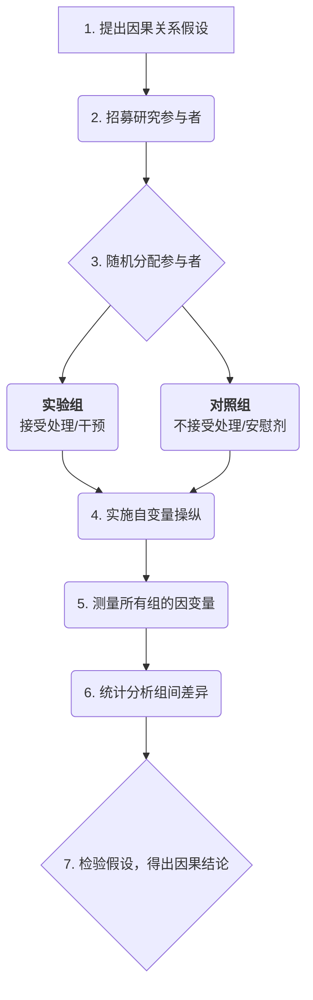

# 实验研究

在所有科学探究方法中，**实验研究（Experimental Research）** 是最接近于揭示事物**因果关系（Causality）**的黄金标准。它并非简单地观察世界，而是主动地、系统性地干预世界，以验证一个因素的变化是否会“导致”另一个因素的变化。当你想要确定无疑地回答“是不是因为A，才导致了B？”这类问题时，实验研究提供了最严谨、最强大的逻辑框架。

其核心思想在于**控制**。研究者在一个高度受控的环境中，精确地操纵一个或多个**自变量（Independent Variables）**，并观察这种操纵对**因变量（Dependent Variables）**所产生的可测量效应，同时严格控制或随机化所有其他可能产生影响的无关变量。正是这种对变量的精确控制和操纵，使得实验研究能够超越“相关”，得出“因果”的结论。

## 实验研究的核心要素

一个规范的实验研究必须包含以下几个核心组成部分，它们共同构成了其严谨的逻辑链条。

*   **假设（Hypothesis）**：一个关于自变量和因变量之间因果关系的可检验的陈述。例如，“服用咖啡因（自变量）能够提高参与者在记忆测试中的得分（因变量）。”
*   **操纵（Manipulation）**：研究者必须主动地改变自变量的水平。例如，给予一组参与者含有咖啡因的药丸，而给予另一组不含咖啡因的安慰剂。
*   **控制（Control）**：这是实验的精髓。研究者必须尽可能地消除或保持所有其他可能影响因变量的因素（即**混淆变量**，Confounding Variables）的一致性。最核心的控制手段是将参与者**随机分配（Random Assignment）**到不同的实验组中。
*   **实验组与对照组（Experimental vs. Control Group）**：
    *   **实验组**：接受自变量操纵（即“处理”或“干预”）的一组。
    *   **对照组**：不接受处理，或接受一个“零处理”（如安慰剂）的一组。对照组的存在为比较提供了基线，没有它，我们就无法确定观察到的变化是否真的是由自变量引起的。

### 真实验设计流程图

## 如何设计并实施一次实验

1.  **构建因果假设**
    基于理论或观察，明确你想要检验的因果关系。例如，“使用一款新的教学App（自变量）进行学习，是否能比传统教学方式更有效地提高学生考试成绩（因变量）？”

2.  **操作化变量**
    将抽象的变量转化为具体、可测量的操作。例如，“使用新教学App”具体操作为“每天使用该App进行30分钟的互动学习”；“考试成绩”则为“在期末统一标准化测试中的得分”。

3.  **招募并随机分配参与者**
    招募一批符合条件的参与者（如“某年级学生”），然后通过抛硬币、随机数表等方式，将他们完全随机地分配到实验组和对照组。

4.  **实施干预**
    实验组的学生按照规定使用新的教学App进行学习。对照组的学生则继续使用传统的学习方式（如阅读教科书）。确保两组在其他条件上（如总学习时间、教师等）尽可能保持一致。

5.  **测量结果**
    在实验期结束后（如一个学期），对所有参与者进行统一的标准化测试，并记录他们的分数。

6.  **分析数据**
    运用统计工具（如t检验或方差分析）来比较实验组和对照组的平均分是否存在统计上的显著差异。如果实验组的平均分显著高于对照组，你就可以在一定置信度上得出结论：是新的教学App“导致”了成绩的提高。

## 应用案例

**案例一：测试网页设计的用户体验**
*   **场景**：一个网站设计师相信，将注册按钮从页面顶部移到底部能减少用户分心，从而提高文章的阅读完成率。
*   **实验**：将10,000名新访客随机分为两组。A组看到的是按钮在顶部的旧版网页，B组看到的是按钮在底部的新版网页。通过分析后台数据，设计师发现B组用户的页面平均滚动深度和阅读完成率显著高于A组。这证实了他的因果假设。

**案例二：农业中的肥料效果检验**
*   **场景**：一位农学家研发了一种新型环保肥料，声称能提高小麦产量。
*   **实验**：他选择了一块同质的试验田，将其划分为20个小区格。随机选择其中10块施用新肥料（实验组），另外10块施用等量的传统肥料（对照组）。在收获季节，分别测量每个小区格的小麦产量。通过比较两组的平均产量，他可以科学地判断新肥料的效果。

**案例三：心理学中的“棉花糖实验”**
*   **场景**：心理学家沃尔特·米歇尔希望研究儿童的延迟满足能力（自变量）对其未来成功（因变量）的影响。
*   **实验**：他让孩子们选择是立即吃掉一颗棉花糖，还是等待15分钟后获得两颗。这是一个经典的准实验设计。他跟踪这些孩子数十年，发现那些能够等待更长时间的孩子，在未来的学业成绩、事业发展等方面普遍表现更优。这个实验揭示了自控力与长期成功之间的深刻因果关联。

## 实验研究的优势与局限

**核心优势**
*   **强大的因果推断能力**：是所有研究方法中，最能有效建立变量间因果关系的。
*   **可重复性高**：标准化的流程和对变量的精确控制，使得实验易于被其他研究者重复验证。
*   **精确性**：可以精确地测量自变量对因变量产生影响的大小。

**潜在局限**
*   **外部效度问题**：实验室中高度受控的环境，可能与复杂、多变的真实世界相去甚远，导致实验结论难以推广到现实场景中（即“生态效度”低）。
*   **伦理限制**：很多研究问题（如研究虐待对儿童成长的影响）出于伦理道德的考虑，是绝对禁止使用实验方法的。
*   **实施困难与成本高**：设计和执行严格的实验研究，通常需要大量的资源、时间和专业知识。
*   **霍桑效应**：被试可能会因为意识到自己正在被研究，而改变其自然的行为模式，从而影响实验结果。

## 延伸与关联

*   **准实验研究（Quasi-Experimental Research）**：当无法实现完全的随机分配时（例如，研究两个不同班级学生的差异），研究者会采用准实验设计。它依然有操纵和控制，但因果推断的强度弱于真实验。
*   **相关性研究**：在无法进行实验时，相关性研究可以作为替代方案，用于发现变量间的关联，但它不能得出因果结论。

---
*来源参考：实验方法的哲学基础由大卫·休谟（David Hume）和约翰·斯图尔特·密尔（John Stuart Mill）等哲学家奠定。唐纳德·坎贝尔（Donald T. Campbell）和朱利安·斯坦利（Julian C. Stanley）的著作《实验与准实验设计》（Experimental and Quasi-Experimental Designs for Research）是该领域的里程碑式作品。*
