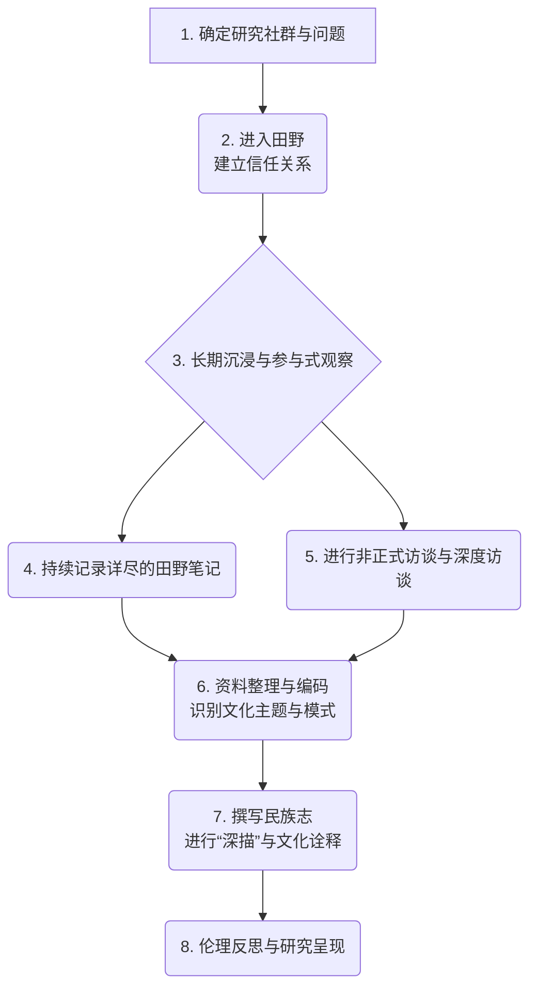

# 民族志

要真正理解一种文化，仅仅依靠问卷或访谈是远远不够的，你必须亲自“跳进那条河里游泳”。**民族志（Ethnography）** 正是这样一种要求研究者沉浸其中、感同身受的深度定性研究方法。它源于文化人类学，其核心在于通过在一段较长的时间内，深入到一个特定社群的日常生活中进行**参与式观察（Participant Observation）**，以求获得对该社群文化、社会结构和行为模式的**整体性（Holistic）**理解。

民族志研究者追求的是一种“深描（Thick Description）”，他们不仅记录人们“做了什么”，更致力于揭示这些行为在特定文化情境下“意味着什么”。它不是从外部去“研究”一群人，而是努力从内部去理解他们的世界观。当你想要探索一个亚文化群体的内部规则、一个组织的隐性文化，或者一个社区的真实生活时，民族志提供了无与伦比的深度和真实性。

## 民族志的核心理念与特征

*   **沉浸与参与**：研究者不再是遥远的观察者，而是作为一名“学习者”或“学徒”，在真实的、自然的环境中长期生活、工作，并参与到社群的日常活动中。
*   **整体观**：民族志试图将文化视为一个相互关联的复杂整体。它关注语言、习俗、信仰、人际关系、物质环境等所有方面如何交织在一起，共同塑造人们的生活。
*   **内部视角（Emic Perspective）**：研究的最终目标，是能够以“局内人”的视角来理解和阐释这个世界，而不是将外部的理论框架强加其上。
*   **田野笔记（Field Notes）**：这是民族志最主要的数据形式。研究者需要持续、细致、反思性地记录下他们所观察到的一切——从具体的事件描述，到个人的感受和理论思考。

### 民族志研究过程

## 如何进行一次民族志研究

1.  **确定研究场域与问题**
    选择一个你希望深入理解的特定社群或文化场景，并形成一个初步的、开放性的研究问题。例如，“一家大型互联网公司的‘加班文化’是如何形成并维持的？”

2.  **进入田野并建立信任**
    这是至关重要且极具挑战的一步。研究者需要找到进入该社群的途径（即“守门人”，Gatekeeper），并花费大量时间与社群成员建立融洽、互信的关系。你的坦诚、尊重和耐心是成功的关键。

3.  **进行参与式观察**
    在获得许可后，开始你的沉浸式体验。尽可能地参与到社群的各项活动中，同时保持敏锐的观察力。观察人们如何互动、如何说话、如何使用工具，以及那些“不言而喻”的规则。

4.  **记录田野笔记**
    每天都要留出专门的时间来撰写详细的田野笔记。笔记应包括：
    *   **客观描述**：具体的时间、地点、人物、事件、对话。
    *   **主观感受**：你个人的情绪、困惑、感受。
    *   **分析思考**：对观察到的现象的初步分析和理论联想。

5.  **持续分析与诠释**
    民族志的分析过程与数据收集是同步进行的。你需要不断地阅读你的笔记，寻找反复出现的模式、主题、关键词和矛盾之处，并逐步形成对该文化的更深层次的理解。

6.  **撰写民族志报告**
    最终的产出是一份叙事性的、充满丰富细节的民族志报告。它通常以讲故事的方式，将你的发现和文化诠释呈现给读者，让他们仿佛也亲身经历了一次田野调查。

## 应用案例

**案例一：威廉·怀特的《街角社会》**
*   **场景**：这是社会学最经典的民族志研究之一。为了理解一个意大利裔美国人贫民区的内部社会结构，社会学家怀特搬进了这个社区。
*   **应用**：他在那里生活了三年半，与当地的年轻人（尤其是街角帮派成员）厮混在一起，参与他们的日常活动。他通过长期的参与式观察，揭示了这个看似混乱的社区背后，其实存在着一套复杂的、非正式的社会等级、义务和互惠体系。这项研究彻底改变了人们对贫民区“失范”的刻板印象。

**案例二：英特尔公司的商业民族志**
*   **场景**：21世纪初，芯片巨头英特尔希望为其未来的产品寻找新的增长点。
*   **应用**：公司雇佣了一批人类学家，在全球范围内对不同家庭的日常生活进行民族志研究。研究人员进入普通人的家中，观察他们如何使用科技产品、如何娱乐、如何沟通。通过这些研究，他们发现“家”正在成为一个新的计算中心，人们对家庭内的连接、娱乐和健康管理有着潜在的巨大需求。这些洞察，直接推动了英特尔在智能家居、数字健康等领域的战略布局。

**案例三：医院的组织文化研究**
*   **场景**：一位研究者希望了解外科手术室中，医生和护士之间高度紧张的协作关系是如何建立和维持的。
*   **应用**：她在一家医院的手术室里进行了为期六个月的参与式观察。她穿上手术服，观摩了上百场手术，并与医护人员在休息室进行非正式访谈。她发现，在这个高压环境中，一套独特的、简洁高效的“行话”和非语言默契，以及严格的等级制度，是确保手术成功的关键文化机制。

## 民族志的优势与挑战

**核心优势**
*   **无与伦比的深度**：能够提供对文化的、情境化的、细致入微的理解。
*   **揭示“隐性知识”**：能够发现那些连社群成员自己都习以为常、无法用言语清晰表达的潜在规则和假设。
*   **高度的生态效度**：研究在完全真实、自然的环境中进行，结论非常贴近现实。

**潜在挑战**
*   **极其耗时耗力**：需要研究者投入数月甚至数年的时间。
*   **研究者主观性**：研究者的个人背景、偏见和解读能力，对研究结果有决定性影响。
*   **进入困难与伦理问题**：进入某些封闭的社群非常困难，且在研究过程中涉及大量的伦理困境（如隐私、知情同意、研究者角色冲突等）。
*   **难以概括**：研究结论通常只适用于所研究的特定社群，很难直接推广到其他群体。

## 延伸与关联

*   **定性研究**：民族志是定性研究中最具代表性、最强调沉浸式体验的方法之一。
*   **参与式设计（Participatory Design）**：在设计领域，民族志的洞察常常被用作邀请用户共同参与设计过程的基础。
*   **扎根理论**：民族志收集到的大量田野笔记，是运用扎根理论方法，从中系统性地生成新理论的绝佳土壤。

---
*来源参考：民族志的奠基人是文化人类学家布罗尼斯拉夫·马林诺夫斯基（Bronisław Malinowski）和弗朗茨·博厄斯（Franz Boas）。克利福德·格尔茨（Clifford Geertz）的《文化的解释》（The Interpretation of Cultures）一书，特别是其中关于“深描”的论述，是理解现代民族志思想的必读经典。*
