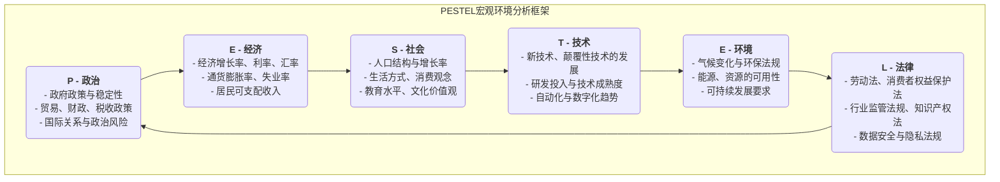

# PESTEL分析

在制定任何长期战略时，一个组织如果只关注内部优势和行业竞争，而忽略了更广阔的宏观环境，就如同在汹涌的大海中航行却不看天气预报，是极其危险的。**PESTEL分析**，也常被称为PEST分析，正是一个系统性地扫描和监测组织外部宏观环境的强大框架。它旨在帮助决策者识别出那些当前或未来可能对组织产生深远影响的关键驱动力和外部风险。

PESTEL是六个维度的首字母缩写，它提供了一个全面的清单，确保我们在进行环境扫描时不会遗漏重要的方面：

*   **P - 政治（Political）**
*   **E - 经济（Economic）**
*   **S - 社会（Social）**
*   **T - 技术（Technological）**
*   **E - 环境（Environmental）**
*   **L - 法律（Legal）**

通过对这六大维度的系统性分析，组织可以更好地预测机会、规避威胁，并制定出更具适应性和前瞻性的战略。

## PESTEL的六大维度详解

PESTEL的每一个字母都代表了一系列需要被审视的外部力量。

## 如何进行一次PESTEL分析

1.  **头脑风暴：识别关键因素**
    召集一个跨职能的团队，针对PESTEL的六个维度，进行开放式的头脑风暴。尽可能多地列出在每个维度下，可能与你的组织、行业或市场相关的外部因素。
    *   例如，对于一家电动汽车公司，在“政治”维度下，可能包括“政府的新能源汽车补贴政策”、“充电桩基础设施建设计划”等。

2.  **收集信息与证据**
    对于初步识别出的关键因素，进行更深入的信息收集和研究。数据可以来自政府报告、行业分析、新闻媒体、学术研究等，以确保分析是基于事实而非猜测。

3.  **分析影响：识别机会与威胁**
    评估每一个关键因素对组织的潜在影响是积极的（机会）还是消极的（威胁）。进一步分析这种影响的**可能性（Probability）**和**严重性（Severity）**。
    *   例如，“政府提高补贴”是一个高可能性、高影响的**机会**。
    *   “一项新的电池回收法规出台”可能是一个高可能性、中等影响的**威胁**。

4.  **制定战略性应对措施**
    这是PESTEL分析的最终目的。针对识别出的关键机会和威胁，制定具体的战略行动。
    *   **对于机会**：我们应如何调整战略来最大化地利用它？
    *   **对于威胁**：我们应如何采取行动来规避或减轻其负面冲击？

5.  **持续监测**
    宏观环境是不断变化的，因此PESTEL分析不是一次性的任务，而应成为一个持续监测和定期更新的动态过程。

## 应用案例

**案例一：一家跨国快餐连锁品牌进入印度市场**
*   **政治**：需要应对印度复杂的食品安全法规和地方政府关系。
*   **经济**：印度中产阶级的崛起和可支配收入的增长是巨大机会，但也要考虑其对价格的高度敏感性。
*   **社会**：印度有大量的素食主义者，且牛在印度教中地位神圣。这是一个巨大的文化挑战和机会。因此，该公司专门开发了无牛肉汉堡（如McAloo Tikki）和丰富的素食菜单。
*   **技术**：移动支付和外卖平台的普及，为触达更多消费者提供了新的渠道。
*   **环境**：对塑料包装的限制越来越严格，需要采用环保的替代方案。
*   **法律**：需要遵守严格的劳动法和特许经营相关法规。

**案例二：传统纸质媒体面临的挑战**
*   **政治**：新闻审查和出版法规的变化。
*   **经济**：经济衰退导致企业广告预算削减，严重影响报纸收入。
*   **社会**：读者的阅读习惯全面转向线上和移动端，年轻一代不再有阅读报纸的习惯。
*   **技术**：互联网、社交媒体和新闻聚合App的兴起，彻底颠覆了新闻的生产和传播方式，构成了最致命的威胁。
*   **环境**：对纸张消耗和环保印刷的要求日益提高。
*   **法律**：关于版权和数字内容转载的法律纠纷日益增多。

**案例三：一家在线教育科技公司的机遇**
*   **政治**：政府推动教育信息化和“停课不停学”政策，是巨大的发展机遇。
*   **经济**：家庭在教育上的支出持续增长。
*   **社会**：社会对终身学习和技能提升的需求日益增长，疫情加速了在线学习的普及和接受度。
*   **技术**：5G、人工智能和大数据技术的发展，使得个性化、沉浸式的在线学习体验成为可能。
*   **环境**：在线教育减少了通勤和纸张消耗，具有天然的环保优势。
*   **法律**：需要密切关注关于未成年人在线保护和教育数据隐私的新法规。

## PESTEL分析的优势与局限

**核心优势**
*   **全面性**：提供了一个系统、全面的框架，确保宏观环境分析的广度。
*   **前瞻性**：促使组织超越眼前的日常运营，思考长期的趋势和变化。
*   **促进战略思考**：是识别机会和威胁、制定稳健战略的重要输入。

**潜在局限**
*   **信息过载**：可能识别出过多的外部因素，需要进一步筛选和聚焦于最关键的少数几个。
*   **简化复杂性**：现实世界中，六个维度的因素常常是相互关联、相互影响的，PESTEL本身并未完全体现这种复杂性。
*   **动态性不足**：分析结果只是一个时间点的快照，需要持续更新才能应对环境的快速变化。

## 延伸与关联

*   **SWOT分析**：PESTEL分析是进行SWOT分析的绝佳起点。PESTEL的分析结果，可以直接作为SWOT中**机会（Opportunities）**和**威胁（Threats）**部分的输入。
*   **波特五力模型**：PESTEL关注的是更宏观的、影响整个商业生态的环境，而波特五力模型则更聚焦于组织所处的特定行业的“微观”竞争环境。两者结合，可以形成对外部环境的完整视图。

---
*来源参考：PESTEL框架由哈佛大学教授弗朗西斯·阿吉拉尔（Francis Aguilar）在1967年首次以ETPS的形式提出。经过数十年的演变和扩充，逐渐形成了今天广为人知的PEST或PESTEL模型。它是战略管理和市场营销领域最基础、最核心的分析工具之一。*
