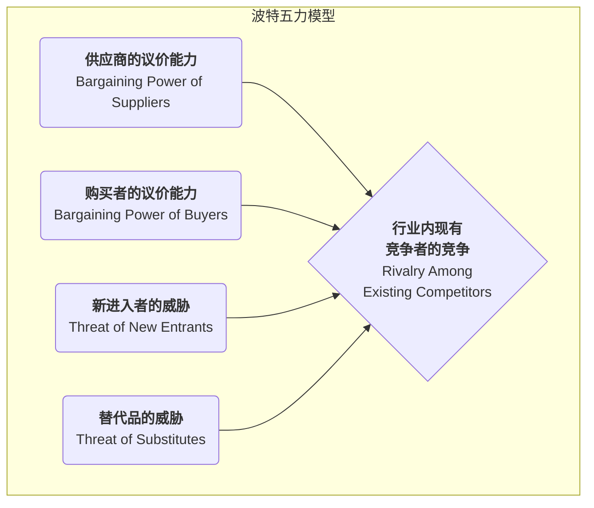

# 波特五力模型

在激烈的商业竞争中，一个行业的吸引力和长期盈利能力，并非由单一的竞争对手决定，而是由一个更广泛的竞争生态系统所塑造。**波特五力模型（Porter's Five Forces）** 是由哈佛商学院的战略管理大师迈克尔·波特（Michael E. Porter）提出的一个革命性框架。它提供了一个强有力的透镜，帮助我们系统性地分析任何一个行业的竞争结构，并理解决定该行业平均利润水平的五种基本竞争力量。

这个模型的核心思想是，企业的战略制定者必须超越眼前的直接竞争对手，去审视更广阔的竞争舞台。这五种力量共同作用，决定了行业内的竞争强度，以及价值在产业链中是如何被创造和分配的。通过理解每一种力量的强弱，企业可以找到自己在行业中的最佳定位，制定出能够规避风险、利用优势并最终获得可持续竞争优势的战略。

## 解析五种竞争力

波特五力模型将行业竞争分解为五个清晰的维度，它们共同决定了行业的“游戏规则”。

1.  **行业内现有竞争者的竞争（Rivalry Among Existing Competitors）**
    这是五力模型的核心，指行业内现有企业之间的直接对抗和竞争激烈程度。当行业内竞争激烈时，企业往往会陷入价格战、广告战和产品创新竞赛，从而拉低整个行业的利润水平。
    *   **竞争激烈的迹象**：行业内有众多实力相当的竞争者；行业增长缓慢，形成“零和博弈”；产品同质化严重，缺乏差异；高昂的退出壁垒导致亏损企业也难以离开。

2.  **新进入者的威胁（Threat of New Entrants）**
    指新的竞争者进入一个行业的可能性。如果一个行业利润丰厚且进入门槛低，就会像磁石一样吸引新的参与者，他们会带来新的产能，并渴望瓜分市场份额，从而加剧竞争。
    *   **进入壁垒（Barriers to Entry）** 的高低决定了这种威胁的强度。常见的进入壁垒包括：规模经济、强大的品牌忠诚度、高昂的客户转换成本、巨额的资本投入、对分销渠道的控制、政府的政策法规限制以及核心技术专利。

3.  **替代品的威胁（Threat of Substitute Products or Services）**
    指来自**不同行业**的、但能满足相同客户需求的替代产品或服务的威胁。替代品的存在，为行业的整体定价设定了一个“天花板”。
    *   **重要区分**：对于航空公司来说，另一家航空公司是**竞争对手**，而高铁、视频会议则是**替代品**。替代品的性价比越高，客户转向它的成本越低，其威胁就越大。

4.  **供应商的议价能力（Bargaining Power of Suppliers）**
    指供应商（如原材料、零部件、劳动力或服务的提供方）将其成本压力转移给行业内企业的能力。强大的供应商可以提高价格、降低质量或限制供应，从而侵蚀行业的利润。
    *   **供应商议价能力强的迹象**：供应商行业高度集中，由少数几家巨头控制；供应商的产品具有独特性或差异化，难以替代；更换供应商的转换成本极高；对于供应商来说，你所在的行业并非其主要客户。

5.  **购买者的议价能力（Bargaining Power of Buyers）**
    指客户（购买者）压低价格、要求更高质量或更多服务的能力。强大的购买者能迫使行业内的企业相互竞争，从而将价值从生产者手中转移到自己手中。
    *   **购买者议价能力强的迹象**：购买者是集中的大宗采购方；行业产品是标准化的，无差异；购买者更换供应商的成本很低；购买者可以进行“后向一体化”（即自己生产所需的产品）。

## 如何应用五力模型

1.  **明确定义行业边界**
    首先要清晰地界定你所要分析的行业是什么。行业的定义不宜过宽或过窄。

2.  **识别五种力量中的关键参与者**
    具体识别出在每个力量维度下，主要的参与者都是谁。例如，主要的供应商、购买者、竞争对手、潜在进入者和替代品分别是什么？

3.  **评估每种力量的潜在强度**
    分析并判断在每个维度下，导致力量增强或减弱的根本原因是什么。最终，对每一种力量的强度给出一个综合性的评估（如：强、中、弱）。

4.  **综合分析行业结构**
    综合五种力量的评估结果，判断该行业的整体竞争格局和长期盈利潜力。哪一种或哪几种力量是决定该行业盈利能力的关键？

5.  **制定战略以改善定位**
    基于分析，思考企业可以采取哪些战略行动来“改善”自己的行业地位。例如，是否可以通过建立品牌来降低购买者的议价能力？是否可以通过技术创新来构建进入壁垒？是否可以通过锁定供应商来降低其议价能力？

## 应用案例

**案例一：全球软饮料行业（以可口可乐和百事可乐为例）**
*   **行业内竞争**：**激烈**。两大巨头之间的竞争体现在品牌、分销和广告等多个方面，但它们巧妙地避免了毁灭性的价格战。
*   **新进入者威胁**：**弱**。极高的品牌忠诚度、庞大的全球分销网络和巨大的广告投入，构成了后来者难以逾越的壁垒。
*   **替代品威胁**：**中等偏强**。水、果汁、茶、咖啡等都是替代品，消费者选择众多。
*   **供应商议价能力**：**弱**。糖、水、包装罐等原材料都是大宗商品，供应商分散且无议价能力。
*   **购买者议价能力**：**中等**。对于最终消费者个体，议价能力为零。但对于大型零售商（如沃尔玛、家乐福）和餐饮渠道，它们拥有较强的议价能力。
*   **结论**：该行业的结构非常有吸引力，两大巨头通过构建强大的品牌和分销壁垒，有效地抵御了新进入者和供应商的压力，从而获得了持续的高额利润。

**案例二：个人电脑（PC）行业**
*   **行业内竞争**：**极其激烈**。众多品牌（联想、惠普、戴尔等）的产品高度同质化，导致持续的价格战。
*   **新进入者威胁**：**中等**。虽然品牌和渠道需要积累，但核心部件可以采购，进入门槛并非不可逾越。
*   **替代品威胁**：**强**。智能手机、平板电脑正在替代PC的许多功能。
*   **供应商议价能力**：**强**。核心部件（如CPU和操作系统）高度集中在英特尔和微软等少数几家公司手中，它们掌握了PC行业的大部分利润。
*   **购买者议价能力**：**强**。无论是个人消费者还是企业客户，都因为产品标准化而拥有众多选择，对价格敏感。
*   **结论**：PC行业的五种力量几乎都对行业内的制造商不利，导致该行业长期处于低利润状态。

**案例三：中国的高端餐饮行业**
*   **行业内竞争**：**激烈**。餐厅数量众多，模仿和跟风现象严重。
*   **新进入者威胁**：**强**。进入门槛相对较低，任何有资金和厨师的个人都可以开一家餐厅。
*   **替代品威胁**：**强**。中端餐饮、外卖、私厨等都是替代选择。
*   **供应商议价能力**：**中等**。对于普通食材，供应商众多。但对于稀有、高品质的特色食材，少数供应商可能拥有较强议价能力。
*   **购买者议价能力**：**强**。消费者选择极多，且转换成本为零。
*   **结论**：高端餐饮行业竞争结构恶劣，盈利非常困难。成功的关键在于通过打造独特的品牌、菜品和体验来降低购买者的议价能力和行业内竞争。

## 五力模型的价值与局限

**核心价值**
*   **超越直接竞争**：提供了一个更广阔的视角来理解竞争，而不仅仅是盯着对手。
*   **揭示盈利驱动因素**：帮助识别出决定一个行业长期盈利能力的关键结构性因素。
*   **指导战略定位**：为企业寻找有利的战略位置、塑造对自己有利的行业结构提供了清晰的路线图。

**潜在局限**
*   **静态视角**：模型本身是静态的，可能无法完全捕捉到行业结构的动态演变（例如，由技术颠覆引发的结构变化）。
*   **忽略了“第六种力量”**：一些学者认为，模型忽略了**互补品（Complements）**的作用。例如，软件和硬件就是互补品，它们共同创造价值。
*   **行业边界模糊**：在当今融合的商业生态中，清晰地定义一个行业的边界变得越来越困难。

## 延伸与关联

*   **PESTEL分析**：可以用来分析影响五种力量变化的更宏观的背景因素。
*   **价值链分析**：在五力模型分析了行业“蛋糕”如何被瓜分之后，价值链分析则帮助企业思考如何在自己的活动中创造出更多的“蛋糕”。
*   **战略集团分析（Strategic Group Analysis）**：在分析行业内竞争时，可以将行业内的企业按照战略的相似性划分为不同的战略集团，从而进行更精细的分析。

---
*来源参考：迈克尔·波特在其1979年发表于《哈佛商业评论》的经典文章《如何塑造竞争力量》（How Competitive Forces Shape Strategy）以及其后的著作《竞争战略》（Competitive Strategy）中，系统地阐述了五力模型。该模型至今仍是战略管理领域不可动摇的基石。*
