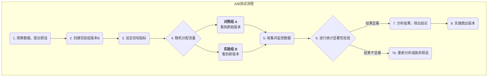

# A/B测试

在产品设计和市场营销中，我们经常会面临一些看似主观的选择：是红色的按钮更吸引人，还是绿色的？是“立即购买”的文案转化率更高，还是“加入购物车”？与其依赖直觉或在会议室里无休止地争论，不如让真实的用户用他们的数据来告诉我们答案。**A/B测试（A/B Testing）**，也称为**分割测试（Split Testing）**，正是一种严谨、强大、以数据驱动的**在线对照实验方法**。它的核心在于，通过将用户流量**随机**地分为两组或多组，并向他们展示同一页面的不同版本（A版本和B版本），来比较和确定哪个版本在实现特定目标（如点击率、转化率）上表现更优。

A/B测试的本质，是将科学实验的逻辑应用于产品和营销决策中。它通过引入“**随机**”这一关键要素，来消除其他所有潜在的干扰因素（如用户来源、访问时间等），从而确保我们观察到的效果差异，能够以很高的置信度归因于我们所做的唯一改变。它将“我猜这个设计更好”的主观臆断，转变为“数据显示B版本比A版本的转化率高出15%，且统计上显著”的客观结论，是现代数据驱动增长文化不可或缺的核心工具。

## A/B测试的核心构成要素

一次规范的A/B测试，包含以下几个关键部分：

*   **假设（Hypothesis）**：在测试开始前，你需要一个清晰的、可检验的假设。例如，“我相信，将注册按钮从蓝色改为橙色（改动），能够提高新用户的注册转化率（预期结果），因为橙色在页面上更醒目（理由）。”
*   **对照组（Control, A版本）**：即当前正在线上使用的、未做任何改动的原始版本。它是所有比较的基准。
*   **实验组（Variation, B版本）**：即你应用了单一改动的、希望能够带来更好效果的新版本。
*   **单一变量原则**：一次标准的A/B测试，应该只测试一个变量。如果你同时改变了按钮颜色和文案，那么最终即使B版本胜出，你也无法确定究竟是哪个改动起到了决定性作用。
*   **随机分配流量**：必须将用户流量完全随机地、均匀地分配给A版本和B版本。这是确保测试结果无偏、可信的科学前提。
*   **目标指标（Metric）**：你需要一个清晰的、可量化的指标来衡量测试的成功与否。这个指标必须与你的假设直接相关，例如“点击率”、“转化率”、“平均停留时长”等。

### A/B测试的工作流程

## 如何进行一次A/B测试

1.  **第一步：研究与假设**
    基于数据分析（如用户行为热力图）、用户反馈或启发式评估，找到当前产品或流程中可能存在问题的环节，并提出一个具体的、可检验的改进假设。

2.  **第二步：创建变体**
    基于你的假设，设计并开发实验组（B版本）。确保B版本与A版本的唯一区别，就是你想要测试的那个变量。

3.  **第三步：确定目标与样本量**
    *   明确你用来衡量成功的核心指标是什么。
    *   在测试开始前，你需要使用**样本量计算器**，来估算需要多少用户参与测试，才能让你的结果具有足够的**统计功效（Statistical Power）**。样本量太小，可能会导致你无法检测到真实存在的差异。

4.  **第四步：实施测试**
    使用专业的A/B测试工具（如Google Optimize, Optimizely等），配置你的测试。设定流量分配比例（通常是50/50），并启动测试。

5.  **第五步：监控与分析结果**
    让测试运行足够长的时间，直到达到预设的样本量或统计显著性水平。然后，分析测试结果。你需要关注两个核心的统计概念：
    *   **转化率差异**：B版本相对于A版本的提升百分比。
    *   **统计显著性（Statistical Significance）**：通常用**P值**来表示。P值代表了“我们观察到的差异，仅仅是由于随机巧合而产生的概率”。通常，当P值小于0.05（即95%的置信水平）时，我们才认为这个结果是统计显著的，可以采信。

6.  **第六步：得出结论并行动**
    *   如果B版本显著胜出，那么恭喜你，你的假设得到了验证。下一步就是将B版本全面部署给所有用户。
    *   如果A版本胜出，或者两者之间没有显著差异，那同样是一次有价值的学习。这说明你的初始假设是错误的，你需要重新分析，并提出新的假设进行下一轮测试。

## 应用案例

**案例一：奥巴马竞选团队的筹款页面优化**
*   **场景**：在2008年美国总统大选中，奥巴马的竞选团队希望优化其官方网站的捐款页面，以提升注册和捐款的转化率。
*   **A/B测试应用**：他们对页面的头图和按钮文案，进行了大量的A/B测试（严格来说是多变量测试）。在一个著名的测试中，他们发现，将头图从一张奥巴马的单人照片，换成一张奥巴马的全家福，并将按钮文案从“Sign Up”改为“Learn More”，最终使得页面的注册转化率提升了惊人的**40.6%**。这次测试为竞选团队带来了数千万美元的额外捐款。

**案例二：Booking.com的持续测试文化**
*   **场景**：全球最大的在线酒店预订平台Booking.com，以其极致的A/B测试文化而闻名。
*   **应用**：据报道，在任何一个时间点，Booking.com的网站上都同时运行着上千个A/B测试。从搜索结果的排序方式，到酒店图片的大小，再到“仅剩X间房！”这类微小的文案，每一个改动都必须经过严格的A/B测试的检验。正是这种对数据驱动决策的极致追求，使得他们能够持续地、微小地优化用户体验，并最终构筑起强大的竞争壁垒。

**案例三：一家新闻网站的付费墙测试**
*   **场景**：一家新闻网站希望尝试付费订阅模式，但不确定哪种付费墙策略对用户的付费转化和留存最有利。
*   **A/B测试应用**：
    *   **A版本（计量式）**：允许所有用户每月免费阅读5篇文章，超出后提示付费。
    *   **B版本（免费增值式）**：部分文章免费，但深度报道和独家评论等“精品内容”需要付费订阅才能阅读。
    *   通过长达数月的测试，他们可以比较两种模式下的付费转化率、用户流失率和总订阅收入，从而选择最适合自己的商业模式。

## A/B测试的优势与挑战

**核心优势**
*   **客观与数据驱动**：用真实的用户行为数据来代替主观猜测和争论，为决策提供了最硬的证据。
*   **低风险的创新**：允许你在将一个改动全面铺开之前，先用一小部分流量来测试其效果，极大地降低了因错误决策而导致负面影响的风险。
*   **持续优化的引擎**：为产品和营销的持续、迭代式优化，提供了一个科学、严谨的循环框架。

**潜在挑战**
*   **需要足够的流量**：对于流量较小的网站或App，要达到统计显著性可能需要非常长的时间，甚至是不可能的。
*   **单一变量的局限**：有时，多个改动的组合可能会产生意想不到的协同效应，而这在标准的A/B测试中是无法发现的（需要使用更复杂的多变量测试）。
*   **“局部最优”陷阱**：持续地对现有页面进行微小的A/B测试，可能会让你陷入“局部最优”的陷阱，而忽略了进行颠覆性、革命性重新设计的更大机会。
*   **忽略长期影响**：A/B测试通常衡量的是短期效果（如点击率）。某些改动可能在短期内提升了指标，但长期来看可能会损害用户信任或品牌形象。

## 延伸与关联

*   **多变量测试（Multivariate Testing, MVT）**：是A/B测试的延伸。当你希望同时测试一个页面上**多个**元素的**多种**组合（例如，同时测试3种标题、2种图片和2种按钮颜色）时，可以使用MVT。它能告诉你哪个元素的组合效果最佳，以及每个元素对最终结果的相对贡献度。
*   **可用性测试**：是一种定性研究方法。它不能告诉你“哪个版本更好”，但能告诉你“**为什么**”用户在某个版本上遇到了困难。通常，可以在进行A/B测试之前，先进行可用性测试，以获得关于“应该测试什么”的灵感。

---
*来源参考：A/B测试的理念根植于经典的统计学实验设计。在互联网领域，它最早被谷歌、亚马逊等科技巨头广泛应用于网页和产品的优化中，并逐渐成为数字营销和增长黑客（Growth Hacking）领域的核心技能。*
