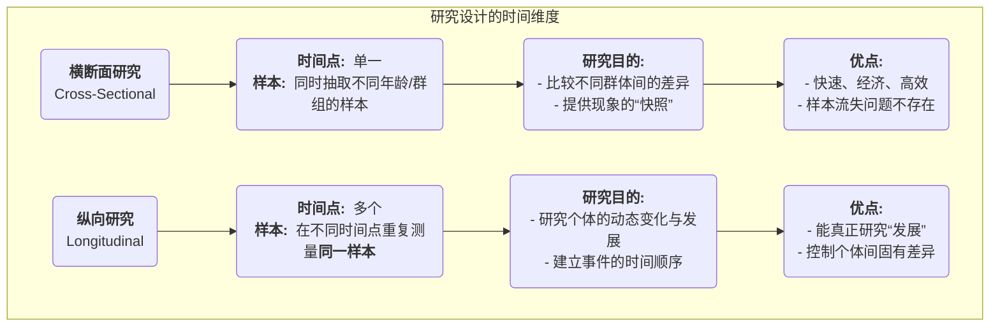

# 横断面研究

在快节奏的世界中，我们常常需要快速、高效地获取关于某个群体现状的“快照”。**横断面研究（Cross-Sectional Research）** 正是为此而生的一种研究设计。它的核心在于，在**某一个特定的时间点**，同时对来自**不同群体**（通常是不同年龄段）的样本进行观察和测量。它旨在描绘和比较这些不同群体在同一时刻的特征、观点或行为，从而为我们提供一幅关于社会某个横切面的全景图。

如果说纵向研究是一部追踪主角成长的“纪录片”，那么横断面研究就是一张汇集了老中青三代人合影的“全家福”。通过这张照片，我们可以清晰地看到不同年龄段的人在相貌、穿着、神态上的差异。当你想要快速了解“不同年龄段的消费者对新科技产品的接受度有何不同？”或“当前社会中，不同收入阶层的幸福感水平是怎样的？”这类问题时，横断面研究提供了一种极其高效的解决方案。

## 横断面研究的核心逻辑

横断面研究的本质是一种**比较**。它通过在同一时间点捕捉不同群体的状态，来推断某些特征可能随时间（通常是年龄）变化的规律。其基本逻辑和特征如下：

*   **单时间点**：所有数据都在一个相对集中的、较短的时期内完成收集。
*   **多群体比较**：研究的核心在于比较不同组别（如10-19岁组、20-29岁组、30-39岁组）在某个变量（如“社交媒体使用时长”）上的差异。
*   **描述性与相关性**：它本质上是一种描述性研究，旨在描绘各群体的特征。同时，它也可以用于相关性分析，探究在特定时间点上，不同变量之间的关系（如收入与幸福感的关系）。
*   **无干预**：研究者只进行观察和测量，不对研究对象施加任何干预或操纵。

### 横断面研究 vs. 纵向研究

## “年龄效应”与“队列效应”的混淆

这是理解横断面研究时最核心、最关键的局限性。当我们在横断面研究中发现不同年龄组存在差异时，我们很难判断这种差异究竟是由**年龄增长本身**（年龄效应）引起的，还是由于这些不同年龄的人成长于**不同的历史时代**（队列效应，Cohort Effect）所导致的。

**一个经典的例子**：一项横断面研究发现，60岁人群的电脑操作熟练度显著低于20岁人群。我们不能草率地得出结论说“人老了，学习电脑的能力就下降了”（年龄效应）。因为这两群人成长的时代完全不同：20岁的年轻人是与电脑一同成长的“数字原住民”，而60岁的人则是在成年后才接触到电脑。这种由于成长背景不同所造成的差异，就是“队列效应”。横断面研究的设计本身，无法将这两种效应清晰地分离开来。

## 如何进行一次横断面研究

1.  **定义研究问题和群体**
    明确你想要比较的群体是什么，以及你想要测量的变量是什么。例如，研究“不同学历水平（高中、本科、硕士）的成年人，其当前的环保意识得分是否存在差异？”

2.  **确定样本与抽样**
    为每个群体（高中、本科、硕士）分别定义清晰的抽样框，并采用合适的抽样方法（如分层抽样或配额抽样）来确保每个群体的样本都具有代表性。

3.  **开发测量工具**
    设计一份能够准确测量你所关心的变量的工具，最常见的是调查问卷。确保问卷对所有群体都是公平和适用的。

4.  **数据收集**
    在预定的、相对集中的时间内，完成对所有样本的数据收集工作。

5.  **数据分析**
    使用统计技术来比较不同群体在目标变量上的差异。常用的统计方法包括方差分析（ANOVA）、t检验或卡方检验。例如，使用ANOVA来比较三个学历组的平均环保意识得分是否存在显著差异。

## 应用案例

**案例一：政治学的投票行为研究**
*   **场景**：在一次大选前，一家民意调查机构希望了解不同年龄段选民的投票倾向。
*   **应用**：该机构在选举前一周，通过电话随机抽取了1000名选民样本，并询问他们的年龄和支持的候选人。通过分析，他们发现18-29岁选民更倾向于A候选人，而65岁以上选民则更倾向于B候选人。这份研究为选情分析提供了即时的“快照”。

**案例二：市场细分研究**
*   **场景**：一家汽车公司计划推出一款新的SUV，希望确定其核心目标市场。
*   **应用**：他们进行了一项大规模的横断面调查，收集了不同年龄、收入、家庭规模的消费者的购车偏好数据。分析结果显示，“30-40岁、有两个孩子、中高收入”的家庭群体对七座SUV的需求最为强烈。这个发现帮助公司精准地定位了其目标客户，并制定了相应的营销策略。

**案例三：发展心理学中的能力研究**
*   **场景**：一位心理学家想研究儿童的逻辑推理能力是如何随年龄发展的。
*   **应用**：他同时招募了100名5岁儿童、100名8岁儿童和100名11岁儿童，并让他们完成相同的逻辑推理任务。他发现，随着年龄组的增长，完成任务的平均得分也显著提高。这初步描绘了逻辑推理能力的发展曲线。但他仍需警惕，这种差异也可能部分源于不同年龄的儿童所接受的教育内容不同（队列效应）。

## 横断面研究的优势与局限

**核心优势**
*   **高效与经济**：相比于耗时数年的纵向研究，横断面研究可以在短时间内完成，成本效益极高。
*   **易于实施**：数据收集过程相对简单，且不存在样本流失的问题。
*   **提供即时快照**：能够快速地为政策制定、市场决策等提供当前状况的概览。

**潜在局限**
*   **无法研究个体变化**：它不能告诉我们任何关于个体如何随时间变化的信息。
*   **因果推断能力弱**：无法建立事件的时间顺序，因此不能用于推断因果关系。
*   **队列效应的混淆**：其最根本的缺陷在于无法区分年龄效应和队列效应，这可能导致对发展趋势的错误解读。

## 延伸与关联

*   **纵向研究**：是克服横断面研究局限性的最佳方法。许多研究项目会先进行一次探索性的横断面研究，如果发现了有趣的差异，再设计一项纵向研究来深入探究其发展过程。
*   **序列研究（Sequential Design）**：一种更复杂的混合设计，它结合了横断面和纵向研究的特点，通过在不同时间点追踪多个年龄队列，来试图将年龄效应和队列效应分离开来。

---
*来源参考：横断面研究是社会调查和流行病学中最常用、最基础的设计之一。其方法论在各大研究方法教科书中都有详细介绍。关于“队列效应”的经典论述，可以参考学者华纳·舍伊（K. Warner Schaie）在智力发展领域的研究。*
