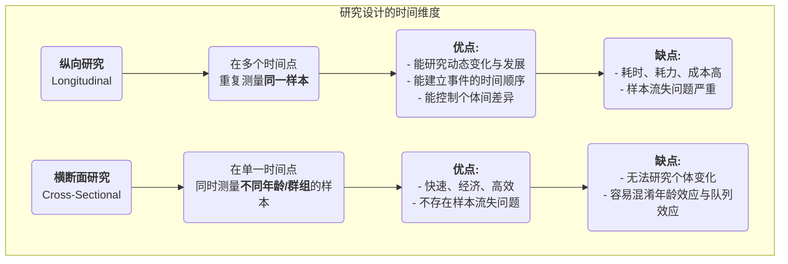

# 纵向研究

在探索人类发展、社会变迁和疾病演变的漫长画卷时，我们需要一种能够捕捉“时间”这一关键维度的研究方法。**纵向研究（Longitudinal Research）** 正是这样一台“摄像机”，它在一段较长的时间内，对**同一样本**进行反复的、持续的观察和测量。其核心目标在于揭示现象如何随着时间的推移而发生**变化、发展和演变**，并探究早期事件对后期结果的长期影响。

与只提供某一时间点“快照”的横断面研究不同，纵向研究为我们提供了一部“纪录片”。它让我们能够观察到个体成长的轨迹、观念转变的过程、疾病从萌芽到发展的全程，从而在探究因果关系时，能够更清晰地建立起时间上的先后顺序。当你想要回答“童年时期的阅读习惯如何影响成年后的收入水平？”或“一项政策改革在未来十年中产生了怎样的持续影响？”这类关于过程和发展的动态问题时，纵向研究便成为不可或缺的强大工具。

## 纵向研究的核心特征与类型

所有纵向研究的共同点在于其对“时间”的追踪，但根据追踪对象的不同，主要可以分为三种类型：

*   **队列研究（Cohort Study）**：这是最常见的一种。研究者选取一个具有共同特征或经历的特定人群（即一个“队列”，例如“所有在2000年出生的婴儿”或“某家公司的2010年入职员工”），并在未来几十年中对这个队列进行持续的跟踪调查。
*   **固定样本研究（Panel Study）**：与队列研究类似，但它追踪的是完全相同的**个体**样本。每一次调查都会访问同样的一群人，这使得研究者可以精确地分析每个个体的变化轨迹。
*   **趋势研究（Trend Study）**：这种研究关注的是某个“总体”的特征随时间的变化，但每次调查时抽取的样本个体是不同的。例如，为了研究公众对环保问题的态度变化，研究机构可以每五年都在全国范围内随机抽取一批新的样本进行调查。

### 纵向研究与横断面研究的对比

## 如何进行一次纵向研究

1.  **确立长期研究目标**
    明确你想要追踪的变化或发展是什么，以及你感兴趣的潜在影响因素。纵向研究是一项长期投资，必须有清晰、重大的研究目标作为支撑。

2.  **定义并选取你的队列或固定样本**
    精确定义你的研究群体，并采用合适的抽样方法选取初始样本。初始样本的质量和代表性至关重要。

3.  **进行基线调查**
    在研究开始时，进行第一次全面的数据收集（基线调查），测量所有你感兴趣的变量的初始状态。

4.  **设计并执行后续追踪调查**
    确定后续追踪调查的时间间隔（例如，每年一次、每五年一次），并设计保持一致性的测量工具。在漫长的研究周期中，保持与样本的联系、降低样本流失率是最大的挑战之一。

5.  **数据管理与分析**
    纵向数据结构复杂，需要专业的数据库进行管理。在分析时，研究者会使用一些高级的统计模型（如增长曲线模型、生存分析）来分析变量随时间的变化轨迹及其影响因素。

## 经典应用案例

**案例一：哈佛成人发展研究（The Harvard Study of Adult Development）**
*   **场景**：这是历史上最长的纵向研究之一，始于1938年，追踪了724名男性长达近80年的人生。
*   **应用**：研究人员定期通过问卷、访谈、医疗记录等方式，收集他们关于工作、家庭、健康等各方面的数据。这项研究最著名的结论是：良好、温暖的人际关系是预测长期幸福和健康的最重要因素，其作用甚至超过了财富、名声和基因。这个结论只有通过长达一生一世的追踪才可能得出。

**案例二：英国千禧队列研究（Millennium Cohort Study）**
*   **场景**：一项全国性的出生队列研究，追踪了约1.9万名在2000-2002年间出生的英国儿童。
*   **应用**：研究在孩子们9个月、3岁、5岁、7岁、11岁、14岁、17岁等多个年龄点进行了全面的数据收集，涵盖了从健康、认知、行为到家庭环境的方方面面。这项研究为政府制定儿童和家庭政策提供了海量的、极其宝贵的证据，例如，它揭示了贫困对儿童早期发展的长期负面影响。

**案例三：产品用户流失的队列分析**
*   **场景**：一家SaaS（软件即服务）公司希望了解新用户的留存情况。
*   **应用**：他们采用**队列分析**的方法。将“每个月注册的新用户”视为一个队列（例如，“一月队列”、“二月队列”）。然后，他们追踪每个队列在注册后第一个月、第二个月、第三个月……的留存率。通过比较不同队列的留存曲线，他们可以评估其产品改进、市场活动是否对新用户的长期留存产生了积极影响。

## 纵向研究的优势与挑战

**核心优势**
*   **能够研究动态过程**：是研究“发展”和“变化”本身的最有效方法。
*   **建立时间顺序**：能够清晰地确定事件发生的先后顺序，这是推断因果关系的重要前提（但仍需警惕混淆变量）。
*   **控制个体差异**：由于追踪的是同一个人，因此可以排除那些不随时间变化的个体固有差异（如智商、人格）对结果的干扰。

**潜在挑战**
*   **成本高昂**：需要长期的资金支持、稳定的研究团队和巨大的管理成本。
*   **耗时漫长**：研究结果的产出周期非常长，可能需要数年甚至数十年。
*   **样本流失（Attrition）**：这是纵向研究最大的“天敌”。随着时间推移，部分参与者可能会因为搬家、失联、死亡或失去兴趣而退出研究，这可能导致最终的样本产生偏误。
*   **重复测量的影响**：反复接受相同的测试或问卷，可能会影响参与者的行为或回答，即所谓的“实践效应”。

## 延伸与关联

*   **横断面研究**：常常作为纵向研究的一种低成本、快速的替代方案。但需要警惕其无法区分年龄效应和队列效应的问题。
*   **生存分析（Survival Analysis）**：一种在纵向研究中常用的统计方法，专门用于分析某个事件（如康复、流失、死亡）发生前的持续时间及其影响因素。

---
*来源参考：纵向研究的设计理念在流行病学和社会科学领域有着悠久的历史。格伦·埃尔德（Glen H. Elder Jr.）的生命历程理论（Life Course Theory）为现代纵向研究提供了重要的理论框架。*
