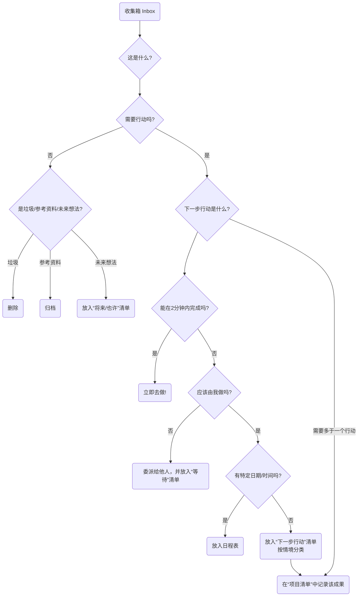

# GTD (搞定)

我们的大脑，天生是一个用于**产生想法**的、卓越的“CPU”，但它却是一个极其糟糕的、用于**存储信息**的“硬盘”。当我们试图用大脑去记住所有待办事项、预约、想法和承诺时，它就会被这些“未尽事宜”所占据，导致压力、焦虑和思维混乱，无法专注于眼前的工作。**GTD（Getting Things Done，通常译为“搞定”）**，是由生产力大师戴维·艾伦（David Allen）创建的一套享誉全球的**个人生产力系统和工作流管理方法**。

GTD的核心理念在于，通过将你头脑中所有悬而未决的“杂事（Stuff）”，都捕捉到一个**外部的、可信赖的系统中**，并遵循一套清晰、严谨的流程对其进行**组织和处理**，从而实现一种**“心如止水（Mind Like Water）”**的、无压力的、高度专注和高效的工作状态。它不是一个简单的时间管理技巧，而是一套完整的、旨在解放你的大脑、让你能从容应对复杂工作与生活的操作系统。

## GTD的五个核心步骤

GTD的整个工作流程，由五个逻辑清晰、环环相扣的步骤构成。熟练掌握这五个步骤，是成功实践GTD的关键。

```mermaid
graph TD
    subgraph GTD的五个核心步骤
        A(<b>1. 收集 (Capture/Collect)</b><br/><i>将所有“杂事”一网打尽</i>) --> B(<b>2. 处理 (Process/Clarify)</b><br/><i>逐一明确每件事的本质</i>);
        B --> C(<b>3. 组织 (Organize)</b><br/><i>将处理结果放入正确的“篮子”</i>);
        C --> D(<b>4. 回顾 (Reflect/Review)</b><br/><i>定期检视和更新你的系统</i>);
        D --> E(<b>5. 执行 (Engage/Do)</b><br/><i>基于情境，做出明智的行动选择</i>);
        E --> A;
    end
```

1.  **收集（Capture）**：将任何引起你注意的事情——无论是一个工作任务、一个生活琐事、一个突发的灵感，还是一个未来的约定——都**立即**从你的大脑中移出来，捕捉到你的“**收集箱（Inbox）**”里。收集箱可以是物理的（如一个文件托盘、一个笔记本），也可以是数字的（如一个邮件收件箱、一个待办事项App）。关键在于，要确保你的收集箱数量尽可能少，并能做到100%的信任和清空。

2.  **处理（Process）**：定期地（至少每天一次）对你的收集箱进行“**清空**”处理。严格地按照**一次一事**的原则，逐一拿起收集箱里的每一项“杂事”，并问自己一个核心问题：“**这是什么？它是否需要采取行动？**”
    *   如果**不需要行动**：它要么是**垃圾**（直接删除），要么是**将来可能需要**的资料（放入参考资料库），要么是**孵化中的想法**（放入“将来/也许”清单）。
    *   如果**需要行动**：进入下一步的组织环节。

3.  **组织（Organize）**：对于需要行动的事务，根据其性质，将其放入不同的“篮子”里。
    *   **“两分钟原则”**：如果这个行动能在**两分钟之内**完成，那么**立即就去做**，不要再进行任何组织。
    *   **委派他人**：如果这个任务应该由别人来做，那就立即**委派**出去，并将其放入一个“**等待清单**”中进行跟踪。
    *   **日程表（Calendar）**：对于有**特定日期或时间**的行动（如会议、预约），将其放入你的**日程表**中。
    *   **下一步行动清单（Next Actions List）**：对于那些需要你亲自去做的、一步以上的、没有特定日期的行动，将其分解为**第一个、具体的、可见的物理行动**，并按**情境（Context）**放入不同的“下一步行动清单”中。情境可以是“@电脑前”、“@办公室”、“@电话旁”、“@超市”等。
    *   **项目清单（Projects List）**：对于任何需要**一个以上**的行动才能完成的成果，都将其定义为一个“**项目**”，并放入“项目清单”中。这个清单只记录项目名称，其具体的下一步行动，则存放在相应的下一步行动清单里。

4.  **回顾（Review）**：为了维持系统的可信赖度，你必须进行**定期的回顾**。
    *   **每日回顾**：每天快速地浏览你的日程表和下一步行动清单，以规划当天的工作。
    *   **每周回顾（Weekly Review）**：这是**GTD中至关重要的一环**。每周（通常是周末）要留出1-2小时，对整个系统进行一次全面的、彻底的检视、更新和清理，确保所有项目都在掌控之中，所有清单都保持最新。

5.  **执行（Engage）**：在任何一个时刻，当你需要决定“现在该做什么？”时，你可以基于以下几个标准，从你的行动清单中，做出一个明智、从容的选择：
    *   **情境（Context）**：你现在在哪里？有什么工具？（例如，在办公室，就看“@办公室”清单）
    *   **可用时间（Time Available）**：你现在有多少空余时间？（例如，只有10分钟，就选一个能快速完成的任务）
    *   **可用精力（Energy Available）**：你现在的精力水平如何？（例如，精力充沛，就处理一个需要高度专注的任务）
    *   **优先级（Priority）**：在以上条件下，哪个任务是最重要的？

### GTD工作流处理图



## 应用案例

**案例一：一位忙碌的部门经理**
*   **收集**：他的收集箱可能包括：邮件收件箱、微信、会议上随手记的笔记、以及脑子里突然冒出的想法。
*   **处理与组织**：
    *   一封“关于下季度预算的通知”邮件 -> 不需要行动 -> **归档**到“公司财务”参考文件夹。
    *   一个“提醒下属小张提交周报”的想法 -> 能在2分钟内完成 -> **立即**发一条消息给小张。
    *   一个“筹备年度团队建设”的任务 -> 需要多个步骤 -> 在“**项目清单**”里增加“团队建设”；将第一个行动“与行政部门沟通，获取可选场地列表”放入“**@办公室**”的下一步行动清单。
    *   一个“下周三下午3点与客户开会”的约定 -> **放入日程表**。
*   **执行**：当他在办公室，并且有1小时的空闲时间，精力也很好时，他可以打开“@办公室”清单，选择处理“与行政部门沟通”这个任务。

**案例二：一位自由职业者的项目管理**
*   **项目清单**：可能包括“客户A的网站设计项目”、“个人博客重构”、“学习一门新的编程语言”等。
*   **下一步行动清单**：
    *   **@电话**：致电客户A，确认设计稿的反馈意见。
    *   **@电脑-设计**：根据反馈，修改网站的首页设计图。
    *   **@电脑-写作**：撰写一篇关于“响应式设计”的博客文章。
    *   **@阅读/学习**：观看编程课程的第三章节。
*   **每周回顾**：在周五下午，他会检查所有项目的进展，确保每个项目都有至少一个“下一步行动”，并规划下周的重点。

**案例三：一个学生管理自己的学业与生活**
*   **收集箱**：课程微信群的通知、老师布置的作业、脑子里关于社团活动的想法、需要购买的生活用品清单。
*   **项目清单**：“完成历史课论文”、“准备期末考试”、“策划迎新晚会”。
*   **下一步行动清单**：
    *   **@图书馆**：借阅关于论文主题的三本参考书。
    *   **@宿舍**：整理数学课的课堂笔记。
    *   **@超市**：购买牙膏和洗发水。
*   **GTD系统**帮助他清晰地分离了学业任务和生活琐事，并确保在正确的时间、正确的地点，处理正确的事情。

## GTD的优势与挑战

**核心优势**
*   **减轻心理压力，释放大脑带宽**：通过将所有“未尽事宜”外部化，极大地减轻了大脑的记忆负担和因“害怕遗忘”而产生的持续性焦虑。
*   **提升掌控感与从容度**：一个可信赖的系统，让你确信所有事情都已在掌控之中，从而能更从容、更专注地应对当前的任务。
*   **确保“要事”不被遗漏**：“每周回顾”这一关键环节，确保了对所有重要项目和长期目标的持续关注和推进。
*   **极具适应性和灵活性**：GTD本身不预设优先级，而是提供一个框架，让你能基于当下的情境，动态地、灵活地选择最合适的行动。

**潜在挑战**
*   **建立系统的初始成本高**：第一次进行“收集”，并建立起完整的清单系统，可能需要花费数小时甚至一整天的时间。
*   **需要严格的自律和习惯养成**：GTD的成功，高度依赖于你是否能养成**持续地收集**和**定期地回顾**这两个核心习惯。一旦系统不再被信任和更新，它就会迅速崩溃。
*   **工具的选择困境**：市面上有大量的GTD软件和工具，初学者很容易陷入对“完美工具”的过度追求中，而忽略了方法本身。

## 延伸与关联

*   **艾森豪威尔矩阵**：可以在GTD的“执行”环节，作为判断“优先级”的一个有效的思考模型。
*   **番茄工作法**：是执行GTD“下一步行动清单”中，那些需要高度专注的任务时，一个绝佳的具体战术。

---
*来源参考：戴维·艾伦（David Allen）的全球畅销书《搞定！无压工作的艺术》（Getting Things Done: The Art of Stress-Free Productivity）是GTD方法的唯一、最权威的来源。该书详细阐述了GTD的完整理念、流程和最佳实践。*
