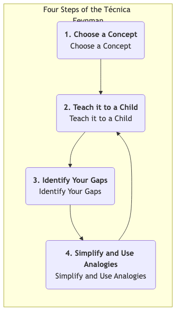

# La Técnica de Feynman

A menudo caemos en la ilusión del "conocimiento": podemos reconocer un concepto, hablar de él vagamente e incluso resaltarlo en un libro, creyendo erróneamente que realmente lo hemos dominado. Sin embargo, cuando necesitamos explicar claramente este concepto, con nuestras propias palabras, a otras personas, nos damos cuenta de lo fragmentado y defectuoso que es nuestro entendimiento. La **Técnica de Feynman** es un modelo mental poderoso y una estrategia de aprendizaje diseñada para romper esta ilusión de aprendizaje y perseguir una **comprensión realmente profunda**.

Este método lleva el nombre del físico ganador del Premio Nobel Richard Feynman, quien era famoso por su capacidad para explicar conceptos físicos extremadamente complejos en un lenguaje increíblemente simple e intuitivo. La idea central de la Técnica de Feynman es que **el único criterio para comprender realmente un conocimiento es si puedes enseñárselo exitosamente a alguien completamente ajeno al campo, utilizando el lenguaje más simple y claro posible**. No es un método de aprendizaje pasivo, sino un procesamiento profundo activo, un "aprendizaje mediante la enseñanza" que nos obliga a enfrentar todas las ambigüedades y lagunas lógicas en nuestro sistema de conocimiento.

## Cuatro Pasos Clave de la Técnica de Feynman

La Técnica de Feynman es extremadamente simple en su proceso, pero cada paso contiene profundos principios de la ciencia cognitiva.

1.  **Paso Uno: Elige un Concepto que Quieras Aprender (Elige un Concepto)**
    *   Toma una hoja en blanco o abre un documento vacío, y en la parte superior escribe en letras grandes el nombre del concepto que deseas comprender profundamente. Por ejemplo, "Blockchain", "Utilidad Marginal" o "Teorema de Bayes".

2.  **Paso Dos: Imagina que Estás Enseñándole a un Niño (Enséñalo a un Niño)**
    *   Este es el alma de la Técnica de Feynman. En el papel, finge que estás explicando este concepto a un niño inteligente de 12 años que no tiene conocimiento previo sobre el tema. **Usa tu propio lenguaje, el más simple y claro posible** para escribir tu comprensión del concepto.
    *   **Clave**: Durante este proceso, está **absolutamente prohibido** usar cualquier término complejo o jerga copiada del material original. Si te ves obligado a usar un término técnico, significa que tu comprensión de ese término no es lo suficientemente profunda, y necesitas explicarlo claramente primero.

3.  **Paso Tres: Revisa e Identifica Tus Lagunas (Identifica Tus Lagunas)**
    *   Una vez que hayas terminado tu explicación, revisa cuidadosa y honestamente lo que has escrito. En este proceso, inevitablemente encontrarás algunas áreas donde:
        *   Te trabaste y no fuiste fluido.
        *   Te diste cuenta de que solo repetías definiciones sin poder dar un ejemplo concreto.
        *   No pudiste explicar claramente las conexiones lógicas entre conceptos.
        *   Usaste inconscientemente muchos tecnicismos.
    *   Todos estos lugares donde "te trabaste" son las **verdaderas lagunas y puntos débiles en tu sistema de conocimiento y comprensión**. Márcalos todos.

4.  **Paso Cuatro: Vuelve al Material Original, Simplifica y Usa Analogías (Vuelve, Simplifica y Usa Analogías)**
    *   Para todas las lagunas de comprensión que identificaste en el paso anterior, **vuelve a** tus materiales de aprendizaje (por ejemplo, libros, artículos, cursos) y estudia de manera más enfocada e intensiva hasta comprender completamente esos puntos problemáticos.
    *   Luego, intenta reorganizar y simplificar tu explicación utilizando un lenguaje aún más sencillo, **analogías** o metáforas más vividas. Una buena analogía es un puente que conecta conceptos abstractos con el mundo conocido.
    *   **Repite este proceso** hasta que finalmente puedas explicar el concepto perfectamente en una sola hoja de papel, usando un lenguaje simple, fluido y lógicamente coherente.

## Casos de Aplicación

**Caso Uno: Aprender "¿Qué es una API (Interfaz de Programación de Aplicaciones)?"**

1. **Paso Uno**: Escribe "API" en el papel.
2. **Paso Dos (Primer intento de explicación)**: "Una API es un intermediario de software que permite que dos aplicaciones se comuniquen entre sí. Es un conjunto de rutinas, protocolos y herramientas utilizadas para construir software de aplicación..." (Me di cuenta de que solo estaba recitando una definición de Wikipedia, muy rígida).
3. **Paso Tres (Identifica lagunas)**: No pude explicar qué significaban realmente "intermediario" y "rutinas", y esta explicación era demasiado abstracta para un niño.
4. **Paso Cuatro (Simplifica y usa analogías)**: Necesito una buena analogía. **¡El proceso de pedir en un restaurante!**
    *   **(Segundo intento de explicación)**: "Imagina que vas a un restaurante. Tú (una aplicación) no puedes ir directamente a la cocina (el sistema backend de otra aplicación) a decirle al chef lo que quieres comer. Necesitas un **camarero (API)**. Miras el **menú (documentación de la API)**, que enumera todos los platos que puedes pedir (funciones que proporciona la API). Le dices al camarero que quieres pollo Kung Pao (haces una solicitud a la API). El camarero transmite tu solicitud al chef en un lenguaje que la cocina entiende. Finalmente, el camarero te trae el plato preparado (los datos devueltos por el sistema). En este proceso, no necesitas saber cómo funciona internamente la cocina; el camarero es la interfaz de comunicación estandarizada que te conecta con la cocina."
    *   Esta explicación es clara, simple y fácil de entender.

**Caso Dos: Comprender un Evento Histórico Complejo, como la "Rebelión de An Lushan"**

1. **Paso Uno**: Escribe "Rebelión de An Lushan".
2. **Paso Dos**: Intenta explicar este evento a un estudiante de primaria que solo sabe que la dinastía Tang era muy poderosa.
3. **Paso Tres (Identifica lagunas)**: Podrías darte cuenta de que solo sabes que An Lushan y Shi Siming se rebelaron, pero no puedes explicar "por qué" lo hicieron? ¿Qué significa exactamente "separatismo de fanzhen"? ¿Por qué el ejército Tang no pudo derrotarlos al principio?
4. **Paso Cuatro**: Con estas preguntas, vuelves a los materiales y aclaras las razones más profundas, como el "colapso del sistema Fubing", la "ascensión del sistema de reclutamiento" y el "excesivo poder de los jiedushi" en la dinastía Tang a mediados y finales de su historia. Luego, puedes usar una analogía más vívida, por ejemplo, "Esto es como si el CEO de una gran empresa (emperador) le diera demasiado poder (poder militar, financiero y de personal) a varias sucursales (fanzhen), y como resultado, los gerentes generales de estas sucursales (jiedushi) se convirtieran en sus propios jefes y ya no escucharan a la sede central".

**Caso Tres: Prepararte para una Demostración Importante del Producto**

1. **Paso Uno**: Elige las características clave de tu producto.
2. **Paso Dos**: Finge explicarle a tu abuela qué hace tu producto y qué problema resuelve en su vida.
3. **Paso Tres (Identifica lagunas)**: Inmediatamente te darás cuenta de lo vacías y difíciles de entender que son esas palabras de moda de la industria que normalmente usas, como "potenciar", "bucle cerrado" y "romper".
4. **Paso Cuatro**: Este proceso te obligará a refinar tu introducción al producto usando el lenguaje más sencillo y claro, centrándote en el valor para el usuario. Al final, tu demostración será excepcionalmente clara y persuasiva.

## Ventajas y Desafíos de la Técnica de Feynman

**Ventajas Clave**

1. **Construye una comprensión profunda y duradera**: A través de un aprendizaje activo basado en la producción, la "reconocimiento" superficial se transforma en una "comprensión" profunda.
2. **Identifica con precisión los puntos ciegos del conocimiento**: El proceso de "enseñar a un niño" actúa como una "máquina de rayos X" para el conocimiento, exponiendo todas tus áreas medio comprendidas.
3. **Mejora la expresión clara y las habilidades de comunicación**: Es el entrenamiento definitivo para la capacidad de simplificar, usar analogías y comunicarse claramente.

**Desafíos Potenciales**

1. **Es laborioso y consume tiempo**: Comparado con resaltar y tomar notas de forma pasiva, la Técnica de Feynman requiere más tiempo y esfuerzo mental.
2. **Requiere mucha honestidad**: Debes ser lo suficientemente honesto contigo mismo para admitir y enfrentar valientemente las lagunas en tu sistema de conocimiento, en lugar de engañarte a ti mismo.

## Extensión y Conexión

1. **Aprender Haciendo/Enseñando**: La Técnica de Feynman es uno de los métodos prácticos más clásicos y efectivos del concepto de "aprender haciendo/enseñando".
2. **Pensamiento de Primeros Principios**: La Técnica de Feynman, en cierta medida, también refleja el pensamiento de primeros principios. Requiere que no te conformes con términos superficiales y complejos, sino que regreses a la lógica y hechos más fundamentales y simples de un concepto.

---
*Fuente de Referencia: Aunque este método de aprendizaje lleva el nombre de Richard Feynman y encarna profundamente su forma de pensar, no fue propuesto sistemáticamente por él personalmente. Fue distilado por aprendices y educadores posteriores, resumiendo el estilo único de enseñanza y pensamiento de Feynman. Blogueros en el campo del aprendizaje, como Scott H. Young, desempeñaron un papel importante en la promoción de este método.*