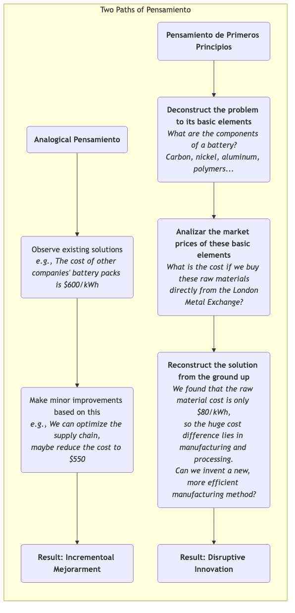

# Pensamiento de Primeros Principios

Cuando enfrentamos problemas complejos o buscamos innovaciones disruptivas, la mayoría de nosotros tendemos a pensar usando el **Pensamiento por Analogía**. Observamos lo que otros hacen o cómo lo hemos hecho en el pasado, y luego realizamos pequeñas mejoras incrementales basadas en eso. Aunque este enfoque suele ser eficiente, también puede actuar como una jaula invisible, limitando nuestro pensamiento dentro de marcos existentes y comprobados, dificultando así una innovación realmente disruptiva. El **Pensamiento de Primeros Principios** ofrece un camino contrastante y más profundo.

Los primeros principios, un concepto originado en la física y la filosofía, se centra en **regresar a los axiomas o hechos más básicos y evidentes de un asunto, y desde allí, deducir lógicamente hacia arriba, capa por capa, hasta encontrar una solución nueva y fundamental**. No se trata de ajustar los condimentos de una "receta" existente, sino, como haría un chef, descomponer un plato en sus moléculas y elementos más básicos (como proteína, grasa, ácido, dulzor), y luego, partiendo de estos elementos fundamentales, crear un plato completamente inédito. Elon Musk es el defensor y practicante más famoso de los primeros principios en el ámbito empresarial moderno, habiendo utilizado este pensamiento para transformar industrias tradicionales como la aeroespacial y la automotriz.

## Primeros Principios vs. Pensamiento por Analogía

La mejor manera de entender los primeros principios es compararlos con el pensamiento por analogía, al que estamos más acostumbrados.

*   **Pensamiento por Analogía**:
    *   **Lógica**: "Como todos los demás lo hacen así, o siempre lo hemos hecho así, también deberíamos hacerlo con algunos pequeños ajustes."
    *   **Características**: Rápido, sencillo, de bajo riesgo, pero propenso a rigidez mental, lo que lleva a la "dependencia de la trayectoria" y dificulta los avances fundamentales.
    *   **Ejemplo**: Antes de la llegada de los teléfonos inteligentes, los fabricantes de móviles generalmente innovaban añadiendo más megapíxeles a las cámaras, cambiando los colores de las carcasas o agregando algunas funciones de software a los teléfonos con teclado existentes.

*   **Pensamiento de Primeros Principios**:
    *   **Lógica**: "Olvídate temporalmente de cómo lo hacen otros. ¿Cuáles son los hechos más básicos que podemos afirmar con certeza sobre este problema? ¿Qué podemos deducir a partir de estos hechos? ¿Cómo se vería una solución ideal sin las limitaciones actuales?"
    *   **Características**: Requiere más tiempo, es laborioso, necesita una comprensión profunda y una sólida capacidad de razonamiento lógico, pero permite atravesar la complejidad superficial para llegar a la esencia del problema, conduciendo a innovaciones disruptivas.
    *   **Ejemplo**: Cuando Apple diseñó el primer iPhone, no intentó mejorar el teclado. En su lugar, regresó al primer principio de la "interacción humano-computadora": el método más directo e intuitivo es el uso del dedo. A partir de esto, crearon un nuevo paradigma de interacción basado en una pantalla táctil grande y multitáctil.

### Diferencias en los estilos de pensamiento

## Cómo Practicar el Pensamiento de Primeros Principios

La práctica del pensamiento de primeros principios generalmente puede seguir un proceso de cuestionamiento "socrático" de tres pasos:

1.  **Paso Uno: Identificar y Descomponer Tus Creencias Actuales o Problemas**
    *   **Pregunta**: "Para esta creencia que damos por sentado (por ejemplo, 'las baterías son caras'), ¿cuáles son sus suposiciones subyacentes? ¿Por qué pensamos así?"
    *   **Acción**: Como si pelaras una cebolla, descompón las capas del problema, rompiendo continuamente un problema complejo hasta llegar a los elementos o hechos más básicos que ya no se pueden descomponer. Este proceso requiere que te preguntes constantemente "por qué", como un niño curioso pero persistente.

2.  **Paso Dos: Cuestionar las Suposiciones Básicas, Buscar la Verdad**
    *   **Pregunta**: "¿Estos elementos básicos, que consideramos 'hechos', son realmente hechos? ¿Son verdades basadas en leyes físicas, o simplemente prácticas industriales arraigadas o opiniones de otros?"
    *   **Acción**: Examina y verifica de forma independiente y crítica cada uno de los elementos básicos que has descompuesto. Busca datos y evidencia directa de distintos campos, separando completamente los hechos de las opiniones.

3.  **Paso Tres: Reconstruir desde una Base Sólida**
    *   **Pregunta**: "Ahora que tenemos un conjunto de hechos básicos verificados y sólidos, si olvidáramos todos los métodos anteriores y comenzáramos únicamente desde estos hechos básicos, ¿qué tipo de solución nueva y mejor podríamos construir?"
    *   **Acción**: Este es un proceso creativo y lógicamente coherente de reconstrucción. Diseñarás tu producto, proceso o estrategia desde un punto de partida nuevo, más simple y más fundamental.

## Casos de Aplicación

**Caso Uno: SpaceX de Elon Musk**

*   **Creencia Tradicional (Pensamiento por Analogía)**: El costo de fabricar cohetes es extremadamente alto, porque históricamente así han sido los cohetes de todos los países y empresas.
*   **Análisis de Primeros Principios**:
    1.  **Descomposición**: Musk preguntó: "¿De qué materiales están hechos los cohetes?" La respuesta: aleaciones de aluminio de grado aeroespacial, titanio, cobre, fibra de carbono, etc.
    2.  **Cuestionamiento y Búsqueda de la Verdad**: Luego analizó los precios de mercado de estas materias primas y descubrió que el costo de los materiales en un cohete representaba solo alrededor del 2% de su costo total.
    3.  **Reconstrucción**: Llegó a una conclusión sorprendente: la mayor parte del costo de un cohete proviene de la fabricación, el procesamiento y los engorrosos eslabones de la cadena de suministro, así como del modelo de "uso único". Por lo tanto, la innovación central de SpaceX se centró en **investigar e fabricar de forma independiente la mayoría de los componentes del cohete** y logró finalmente **recuperar y reutilizar los cohetes**, reduciendo los costos de lanzamiento en un orden de magnitud.

**Caso Dos: El Pensamiento de Inversión de Charlie Munger**

*   **Contexto**: Como socio de largo plazo de Warren Buffett, Charlie Munger es un fiel practicante del pensamiento de primeros principios.
*   **Aplicación**: Al analizar una empresa, no escucha las calificaciones de analistas ni sigue las modas del mercado. Regresa a las preguntas más básicas: "¿Cuál es la esencia del modelo de negocio de esta empresa? ¿Es sostenible el valor que crea para sus clientes? ¿Qué tan profundo es su ventaja competitiva?" Construye un "modelo mental multidisciplinario" compuesto por principios básicos de distintas disciplinas (psicología, economía, historia, etc.) para emitir juicios fundamentales e interdisciplinarios sobre una oportunidad de inversión.

**Caso Tres: Replantear la "Educación"**

*   **Creencia Tradicional (Pensamiento por Analogía)**: La educación simplemente es "profesores dando clases al frente, estudiantes escuchando abajo", y luego se evalúa el aprendizaje mediante exámenes.
*   **Análisis de Primeros Principios**:
    1.  **Descomposición**: ¿Cuál es el propósito esencial de la educación? Es permitir que los estudiantes adquieran conocimientos, desarrollen habilidades y cultiven el pensamiento crítico.
    2.  **Cuestionamiento y Búsqueda de la Verdad**: ¿Es la enseñanza unidireccional la forma más eficiente de aprender? No necesariamente. La neurociencia nos dice que el aprendizaje activo, basado en problemas e integrado con la práctica, es más eficiente. ¿Pueden los exámenes estandarizados medir realmente la capacidad? No necesariamente.
    3.  **Reconstrucción**: Basándonos en estos primeros principios, podemos concebir nuevos modelos educativos, como: Aprendizaje Basado en Proyectos (PBL), aulas invertidas y sistemas de evaluación que se enfoquen más en la evaluación del proceso y la certificación de competencias.

## Ventajas y Desafíos del Pensamiento de Primeros Principios

**Ventajas Principales**

*   **Genera Innovación Disruptiva**: Es la herramienta de pensamiento más poderosa para salir de las mejoras incrementales y lograr avances fundamentales.
*   **Llega a la Esencia del Problema**: Te ayuda a atravesar la superficialidad y la niebla tradicional de las cosas, viendo la esencia del problema y sus factores clave.
*   **Construye una Comprensión Verdadera**: A través de tu propia deducción, construirás una comprensión mucho más profunda y genuinamente tuya de un campo, en lugar de simplemente "memorizar conclusiones".

**Desafíos Potenciales**

*   **Costo Cognitivo Muy Alto**: Requiere una inversión significativa de tiempo e inteligencia para investigaciones profundas y razonamiento lógico, lo cual es muy "contraintuitivo".
*   **Requiere Conocimiento Amplio**: Descomponer un problema en sus elementos más básicos a menudo requiere conocimientos interdisciplinarios.
*   **Resistencia al Cuestionamiento de la Tradición**: Las conclusiones derivadas de primeros principios suelen desafiar las prácticas actuales de la industria y las opiniones autoritarias, lo que puede enfrentar una resistencia significativa en el mundo real.

## Extensión y Conexión

*   **5 Porqués**: Una herramienta simple pero efectiva para practicar los primeros principios. Al preguntar continuamente "por qué", puede ayudarnos a profundizar y acercarnos a la causa raíz de un problema.
*   **Pensamiento Sistémico**: Los primeros principios se enfocan en "descomponer" un sistema en sus elementos más básicos; el pensamiento sistémico, por otro lado, se enfoca más en cómo estos elementos "se interconectan e interactúan". Combinar ambos puede llevar a una comprensión más completa.

---
*Fuente: El concepto de primeros principios se originó con el filósofo griego antiguo Aristóteles, quien lo definió como "la primera base desde la cual se conoce una cosa". En la actualidad, el físico Richard Feynman también defendió fuertemente este tipo de pensamiento, que "apela a principios básicos en lugar de fórmulas empíricas". Y las brillantes explicaciones de Elon Musk en numerosas entrevistas han impulsado enormemente la difusión de este pensamiento en los campos de la tecnología y los negocios.*